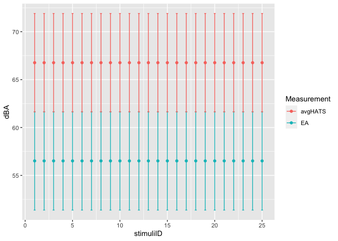

Replication code for: Anti-noise window: subjective perception of active
noise reduction and effect of informational masking
================

## Data loading

Load research data from dataverse data repository
(<https://doi.org/10.21979/N9/SEGEFM>) into dataframes then consolidate
them into a list data.l 1. data.subj: subjective response data from 44
participants 2. data.demo: demographic and pre-test assessment responses
from 44 particiapnts 3. data.spla: A-weighted equivalent sound pressure
level
()
vs time of all stimuli at 6 measurement microphone positions and
binaural channels from the HATS 4. data.splc:

vs time of all stimuli at 6 measurement microphone positions and
binaural channels from the HATS 5. data.ffta: Frequency domain plots in

of of all stimuli at 6 measurement microphone positions and binaural
channels from the HATS 6. data.fftc: Frequency domain plots in

of of all stimuli at 6 measurement microphone positions and binaural
channels from the HATS 7. data,sv: Single value psychoacoustic and
acoustic parameter data (see Table 1 in the paper) at 6 measurement
microphone positions and binaural channels from the HATS

``` r
#Set dataverse server
Sys.setenv("DATAVERSE_SERVER" = "https://researchdata.ntu.edu.sg")

#Retrieve research data from dataverse dataset
dv.dataset = "10.21979/N9/SEGEFM" #dataset linked to this paper
#define a list of data frame names and associated dataset file names
data.names <- data.frame(
        df.name=c(
                "data.subj","data.demo","data.spla","data.splc",
                "data.ffta","data.fftc","data.sv","trackInfo"),
        filename=c("SPANR_subj_clean.tab","SPANR_demo_clean.tab",
                   "SPANR_SPLdBA_clean.tab","SPANR_SPLdBC_clean.tab",
                   "SPANR_FFTdBA_clean.tab","SPANR_FFTdBC_clean.tab",
                   "SPANR_sv_clean.tab",
                   "SPANR_soundtrack_information.tab"))

# Empty list to store the data frames
data.l <- list()

#iteratively retrieve research data from dataverse
for (name in data.names$df.name) {
        
        #get dataset from dataverse
        df<-get_dataframe_by_name(filename = data.names[data.names$df.name==name,
                                            "filename"],
                      dataset = dv.dataset, orginal = TRUE,
                      .f = function(x) read.table(x, header = TRUE, 
                                                  sep = "\t", fill = TRUE))
        #assign the data frame to pre-defined name
        assign(name, df)
        #add data frame to list
        data.l[[name]] <- df
}
```

## Reliability check

Examine the within-subject test-retest reliability of the subjective
response data between stimuli \#1 and \#26

``` r
#no of participants from subjective response data
noPart<-length(unique(data.l[["data.subj"]]$ID))
        
#extract test tracks #1 and #26
data.trRel<-data.l[["data.subj"]] %>% 
        dplyr::filter(NoiseType=="Traffic" & SPL=="60dB") %>%
        #create time column, stimuli #1 & #3 correspond to 1st and 2nd assessments
        dplyr::mutate(time=ifelse(row_number()<(noPart+1),1,2))

#test-retest reliability between test tracks
trRel<-psych::testRetest(
        as.data.frame(data.trRel),
        select = c("annoyscale","loudness","pleasant","annoying",
                   "eventful","uneventful","vibrant","chaotic",
                   "monotonous","calm"))

#within person reliability
wPRel<-trRel$scores$rqq 

#ID of unreliable
IDunRel<-data.l[["data.subj"]]$ID[which(wPRel<0.7)][]

cat("ID number of unreliable responses: ",paste(as.character(IDunRel),collapse = ", "))
```

    ## ID number of unreliable responses:  8, 16, 19, 42

``` r
#Remove data with poor reliability <0.7
data.subj.rel <- data.l[["data.subj"]] %>% 
        dplyr::filter(!ID %in% IDunRel) %>%
        dplyr::mutate_at(.vars=c("NoiseType","Masker","SPL","ANC","annoycat"),
                         .funs = as.factor)

#Update demographic
data.demo.rel <- data.l[["data.demo"]] %>% 
        dplyr::filter(!ID %in% IDunRel) %>% 
        dplyr::filter(!ID==1)
```

## Circumplexity analysis

The circumplexity of the PAQ attributes are evaluated via the randomized
test of hypothesized order relations (RTHOR) and sinusoidality. The
correspondence index (CI) indicates an 86% circumplexity fit (p\<0.001).

``` r
#Check for circumplexity using RTHORR

#Pearson's correlation
cor.PAQ <- cor(data.subj.rel %>% dplyr::select(eventful:chaotic),method = "pearson")

#RTHOR
randmf_output <- RTHORR::randmf_from_df(
  df_list = list(cor.PAQ,cor.PAQ),
  ord = "circular8")
paste0("Circumplexity fit: ",round(randmf_output$RTHOR$CI[1]*100,2),"%")
```

    ## [1] "Circumplexity fit: 86.11%"

``` r
#PCA
pca.PAQ<-principal(data.subj.rel %>% 
                           dplyr::select(eventful:chaotic),
                   nfactors = 2,rotate = "none")

#as.data.frame.matrix(pca.PAQ$loadings)

#Generate latex table
cor.PAQ %>%
        cbind(.,as.data.frame.matrix(pca.PAQ$loadings)) %>%
        mutate(across(1:10, round, 2)) %>%
        as.data.frame(.) %>%
        mutate(vibrant=replace(vibrant, eventful==1.00, "$P_1$"),
               pleasant=replace(pleasant,vibrant==1.00, "$P_1$"),
               pleasant=replace(pleasant,eventful==1.00, "$P_2$"),
               calm=replace(calm,eventful==1.00, "$P_3$"),
               calm=replace(calm,vibrant==1.00, "$P_2$"),
               calm=replace(calm,pleasant==1.00, "$P_1$"),
               uneventful=replace(uneventful,eventful==1.00, "$P_4$"),
               uneventful=replace(uneventful,vibrant==1.00, "$P_3$"),
               uneventful=replace(uneventful,pleasant==1.00, "$P_2$"),
               uneventful=replace(uneventful,calm==1.00, "$P_1$"),
               monotonous=replace(monotonous,eventful==1.00, "$P_3$"),
               monotonous=replace(monotonous,vibrant==1.00, "$P_4$"),
               monotonous=replace(monotonous,pleasant==1.00, "$P_3$"),
               monotonous=replace(monotonous,calm==1.00, "$P_2$"),
               monotonous=replace(monotonous,uneventful==1.00, "$P_1$"),
               annoying=replace(annoying,eventful==1.00, "$P_2$"),
               annoying=replace(annoying,vibrant==1.00, "$P_3$"),
               annoying=replace(annoying,pleasant==1.00, "$P_4$"),
               annoying=replace(annoying,calm==1.00, "$P_3$"),
               annoying=replace(annoying,uneventful==1.00, "$P_2$"),
               annoying=replace(annoying,monotonous==1.00, "$P_1$"),
               chaotic=replace(chaotic,eventful==1.00, "$P_1$"),
               chaotic=replace(chaotic,vibrant==1.00, "$P_2$"),
               chaotic=replace(chaotic,pleasant==1.00, "$P_3$"),
               chaotic=replace(chaotic,calm==1.00, "$P_4$"),
               chaotic=replace(chaotic,uneventful==1.00, "$P_3$"),
               chaotic=replace(chaotic,monotonous==1.00, "$P_2$"),
               chaotic=replace(chaotic,annoying==1.00, "$P_1$"))%>%
        kableExtra::kbl(booktabs = T, linesep = "",
                        format = "html",
                        label = "corPCA",
                        caption = "Pearson's correlation and principal component
                        analysis loadings of PAQ attributes") %>%
        #kable_styling(latex_table_env = "tabularx") %>%
        kable_paper(full_width = T) %>%
        add_header_above(c(" ", "Pearson's Correlation" = 8, 
                           "Loadings" = 2), bold = T) #%>%
```

<table class=" lightable-paper" style="font-family: &quot;Arial Narrow&quot;, arial, helvetica, sans-serif; margin-left: auto; margin-right: auto;">
<caption>
Pearson’s correlation and principal component analysis loadings of PAQ
attributes
</caption>
<thead>
<tr>
<th style="empty-cells: hide;" colspan="1">
</th>
<th style="padding-bottom:0; padding-left:3px;padding-right:3px;text-align: center; font-weight: bold; " colspan="8">

<div style="border-bottom: 1px solid #00000020; padding-bottom: 5px; ">

Pearson’s Correlation

</div>

</th>
<th style="padding-bottom:0; padding-left:3px;padding-right:3px;text-align: center; font-weight: bold; " colspan="2">

<div style="border-bottom: 1px solid #00000020; padding-bottom: 5px; ">

Loadings

</div>

</th>
</tr>
<tr>
<th style="text-align:left;">
</th>
<th style="text-align:right;">
eventful
</th>
<th style="text-align:left;">
vibrant
</th>
<th style="text-align:left;">
pleasant
</th>
<th style="text-align:left;">
calm
</th>
<th style="text-align:left;">
uneventful
</th>
<th style="text-align:left;">
monotonous
</th>
<th style="text-align:left;">
annoying
</th>
<th style="text-align:left;">
chaotic
</th>
<th style="text-align:right;">
PC1
</th>
<th style="text-align:right;">
PC2
</th>
</tr>
</thead>
<tbody>
<tr>
<td style="text-align:left;">
eventful
</td>
<td style="text-align:right;">
1.0000000
</td>
<td style="text-align:left;">

</td>
<td style="text-align:left;">
0.156314727339637
</td>
<td style="text-align:left;">

</td>
<td style="text-align:left;">

</td>
<td style="text-align:left;">

</td>
<td style="text-align:left;">

</td>
<td style="text-align:left;">

</td>
<td style="text-align:right;">
0.5425037
</td>
<td style="text-align:right;">
0.7057026
</td>
</tr>
<tr>
<td style="text-align:left;">
vibrant
</td>
<td style="text-align:right;">
0.5895103
</td>
<td style="text-align:left;">
1
</td>
<td style="text-align:left;">

</td>
<td style="text-align:left;">
0.30979037560585
</td>
<td style="text-align:left;">
-0.448198547790164
</td>
<td style="text-align:left;">
-0.309964822072159
</td>
<td style="text-align:left;">
-0.0289768580836982
</td>
<td style="text-align:left;">
0.170437504037042
</td>
<td style="text-align:right;">
0.7105046
</td>
<td style="text-align:right;">
0.3784708
</td>
</tr>
<tr>
<td style="text-align:left;">
pleasant
</td>
<td style="text-align:right;">
0.1563147
</td>
<td style="text-align:left;">
0.476138453486901
</td>
<td style="text-align:left;">
1
</td>
<td style="text-align:left;">
0.757904955707142
</td>
<td style="text-align:left;">
-0.116557198708988
</td>
<td style="text-align:left;">
-0.226410734131175
</td>
<td style="text-align:left;">
-0.533291639417191
</td>
<td style="text-align:left;">
-0.326758413432117
</td>
<td style="text-align:right;">
0.8050728
</td>
<td style="text-align:right;">
-0.3628911
</td>
</tr>
<tr>
<td style="text-align:left;">
calm
</td>
<td style="text-align:right;">
0.0444170
</td>
<td style="text-align:left;">
0.30979037560585
</td>
<td style="text-align:left;">
0.757904955707142
</td>
<td style="text-align:left;">
1
</td>
<td style="text-align:left;">
0.0127055485384934
</td>
<td style="text-align:left;">
-0.0734311148654106
</td>
<td style="text-align:left;">
-0.516335910285899
</td>
<td style="text-align:left;">
-0.333895977142151
</td>
<td style="text-align:right;">
0.6732410
</td>
<td style="text-align:right;">
-0.4774882
</td>
</tr>
<tr>
<td style="text-align:left;">
uneventful
</td>
<td style="text-align:right;">
-0.6893559
</td>
<td style="text-align:left;">
-0.448198547790164
</td>
<td style="text-align:left;">
-0.116557198708988
</td>
<td style="text-align:left;">
0.0127055485384934
</td>
<td style="text-align:left;">
1
</td>
<td style="text-align:left;">
0.487462070366791
</td>
<td style="text-align:left;">
-0.00241108144272109
</td>
<td style="text-align:left;">
-0.196110421559794
</td>
<td style="text-align:right;">
-0.5459057
</td>
<td style="text-align:right;">
-0.6077783
</td>
</tr>
<tr>
<td style="text-align:left;">
monotonous
</td>
<td style="text-align:right;">
-0.3908201
</td>
<td style="text-align:left;">
-0.309964822072159
</td>
<td style="text-align:left;">
-0.226410734131175
</td>
<td style="text-align:left;">
-0.0734311148654106
</td>
<td style="text-align:left;">
0.487462070366791
</td>
<td style="text-align:left;">
1
</td>
<td style="text-align:left;">
0.171173527777184
</td>
<td style="text-align:left;">
0.0171601937600029
</td>
<td style="text-align:right;">
-0.5574583
</td>
<td style="text-align:right;">
-0.2940480
</td>
</tr>
<tr>
<td style="text-align:left;">
annoying
</td>
<td style="text-align:right;">
0.1770221
</td>
<td style="text-align:left;">
-0.0289768580836982
</td>
<td style="text-align:left;">
-0.533291639417191
</td>
<td style="text-align:left;">
-0.516335910285899
</td>
<td style="text-align:left;">
-0.00241108144272109
</td>
<td style="text-align:left;">
0.171173527777184
</td>
<td style="text-align:left;">
1
</td>
<td style="text-align:left;">
0.673182109959926
</td>
<td style="text-align:right;">
-0.5200162
</td>
<td style="text-align:right;">
0.6784500
</td>
</tr>
<tr>
<td style="text-align:left;">
chaotic
</td>
<td style="text-align:right;">
0.3435587
</td>
<td style="text-align:left;">
0.170437504037042
</td>
<td style="text-align:left;">
-0.326758413432117
</td>
<td style="text-align:left;">
-0.333895977142151
</td>
<td style="text-align:left;">
-0.196110421559794
</td>
<td style="text-align:left;">
0.0171601937600029
</td>
<td style="text-align:left;">
0.673182109959926
</td>
<td style="text-align:left;">
1
</td>
<td style="text-align:right;">
-0.2358951
</td>
<td style="text-align:right;">
0.7674481
</td>
</tr>
</tbody>
</table>

``` r
        #save_kable(paste0(getwd(),"/corPCA.tex"))
```

## Three way anova analysis

### Loudness (traffic, aircraft, MRT)

- normality test
- non-normal -\> ART ANOVA

``` r
#mean scores for ANC
meanLoudnessANC <- data.subj.rel %>%
        filter(Masker=="None") %>%
        group_by(NoiseType, SPL, ANC) %>%
        summarize(mean_loud=mean(loudness),
                  logmean=10^mean(log10(loudness)))

#normality test
loudness.air.65dB <- data.subj.rel %>% 
        dplyr::filter(SPL=="65dB" & NoiseType=="Aircraft") %>% 
        dplyr::select(loudness)
loudness.mrt.65dB <- data.subj.rel %>% 
        dplyr::filter(SPL=="65dB" & NoiseType=="Train") %>% 
        dplyr::select(loudness)
loudness.tra.65dB <- data.subj.rel %>% 
        dplyr::filter(SPL=="65dB" & NoiseType=="Traffic") %>% 
        dplyr::select(loudness)

shapiro.test(x = loudness.air.65dB$loudness)
```

    ## 
    ##  Shapiro-Wilk normality test
    ## 
    ## data:  loudness.air.65dB$loudness
    ## W = 0.89443, p-value = 6.386e-12

``` r
shapiro.test(x = loudness.mrt.65dB$loudness)
```

    ## 
    ##  Shapiro-Wilk normality test
    ## 
    ## data:  loudness.mrt.65dB$loudness
    ## W = 0.88878, p-value = 2.742e-12

``` r
shapiro.test(x = loudness.tra.65dB$loudness)
```

    ## 
    ##  Shapiro-Wilk normality test
    ## 
    ## data:  loudness.tra.65dB$loudness
    ## W = 0.923, p-value = 7.771e-10

``` r
#Aligned Rank Transformed ANOVA

data.air<-data.subj.rel %>% dplyr::filter(SPL=="65dB" & NoiseType=="Aircraft")
m.art.air = ARTool::art(loudness ~ Masker * ANC + (1|ID),
                        data=data.air) 
# linear mixed model syntax; see lme4::lmer
anova(m.art.air)
```

    ## Analysis of Variance of Aligned Rank Transformed Data
    ## 
    ## Table Type: Analysis of Deviance Table (Type III Wald F tests with Kenward-Roger df) 
    ## Model: Mixed Effects (lmer)
    ## Response: art(loudness)
    ## 
    ##                     F Df Df.res     Pr(>F)    
    ## 1 Masker      7.28310  2    195 0.00089033 ***
    ## 2 ANC        17.63442  1    195 4.0685e-05 ***
    ## 3 Masker:ANC  0.57406  2    195 0.56418250    
    ## ---
    ## Signif. codes:   0 '***' 0.001 '**' 0.01 '*' 0.05 '.' 0.1 ' ' 1

``` r
data.mrt<-data.subj.rel %>% dplyr::filter(SPL=="65dB" & NoiseType=="Train")
m.art.mrt = ARTool::art(loudness ~ Masker * ANC + (1|ID),
                        data=data.mrt) 
# linear mixed model syntax; see lme4::lmer
anova(m.art.mrt)
```

    ## Analysis of Variance of Aligned Rank Transformed Data
    ## 
    ## Table Type: Analysis of Deviance Table (Type III Wald F tests with Kenward-Roger df) 
    ## Model: Mixed Effects (lmer)
    ## Response: art(loudness)
    ## 
    ##                     F Df Df.res     Pr(>F)    
    ## 1 Masker     21.54349  2    195 3.5209e-09 ***
    ## 2 ANC         7.53504  1    195  0.0066165  **
    ## 3 Masker:ANC  0.52236  2    195  0.5939491    
    ## ---
    ## Signif. codes:   0 '***' 0.001 '**' 0.01 '*' 0.05 '.' 0.1 ' ' 1

``` r
data.tra<-data.subj.rel %>% dplyr::filter(SPL=="65dB" & NoiseType=="Traffic")
m.art.tra = ARTool::art(loudness ~ Masker * ANC + (1|ID),
                        data=data.tra) 
# linear mixed model syntax; see lme4::lmer
anova(m.art.tra)
```

    ## Analysis of Variance of Aligned Rank Transformed Data
    ## 
    ## Table Type: Analysis of Deviance Table (Type III Wald F tests with Kenward-Roger df) 
    ## Model: Mixed Effects (lmer)
    ## Response: art(loudness)
    ## 
    ##                    F Df Df.res     Pr(>F)    
    ## 1 Masker     36.3353  2    195 3.8665e-14 ***
    ## 2 ANC        65.2026  1    195 6.8552e-14 ***
    ## 3 Masker:ANC  2.1631  2    195    0.11771    
    ## ---
    ## Signif. codes:   0 '***' 0.001 '**' 0.01 '*' 0.05 '.' 0.1 ' ' 1

``` r
#ART Effects sizes using Cohen's d
#https://cran.r-project.org/web/packages/ARTool/vignettes/art-effect-size.html#cohens-d
m.linear.air <- lm(loudness ~ Masker * ANC, data=data.air)
#PC with ANC conditions
ANC.contrasts.air <- summary(art.con(m.art.air, "ANC",adjust = "bonferroni"))
```

    ## NOTE: Results may be misleading due to involvement in interactions

``` r
ANC.contrasts.air$d = ANC.contrasts.air$estimate / car::sigmaHat(m.linear.air)
ANC.contrasts.air
```

    ##  contrast estimate   SE  df t.ratio p.value d
    ##  No - Yes     32.5 7.74 195   4.199  <.0001 1
    ## 
    ## Results are averaged over the levels of: Masker 
    ## Degrees-of-freedom method: kenward-roger

``` r
#PC with Maskers
Masker.contrasts.air <- summary(art.con(m.art.air, "Masker",adjust = "bonferroni"))
```

    ## NOTE: Results may be misleading due to involvement in interactions

``` r
Masker.contrasts.air$d <- Masker.contrasts.air$estimate / car::sigmaHat(m.linear.air)
Masker.contrasts.air
```

    ##  contrast     estimate   SE  df t.ratio p.value      d
    ##  Bird - None     -4.46 9.48 195  -0.471  1.0000 -0.138
    ##  Bird - Water   -33.34 9.48 195  -3.515  0.0016 -1.029
    ##  None - Water   -28.88 9.48 195  -3.045  0.0080 -0.891
    ## 
    ## Results are averaged over the levels of: ANC 
    ## Degrees-of-freedom method: kenward-roger 
    ## P value adjustment: bonferroni method for 3 tests

``` r
m.linear.mrt <- lm(loudness ~ Masker * ANC, data=data.mrt)
#PC with ANC conditions
ANC.contrasts.mrt <- summary(art.con(m.art.mrt, "ANC",adjust = "bonferroni"))
```

    ## NOTE: Results may be misleading due to involvement in interactions

``` r
ANC.contrasts.mrt$d = ANC.contrasts.mrt$estimate / car::sigmaHat(m.linear.mrt)
ANC.contrasts.mrt
```

    ##  contrast estimate   SE  df t.ratio p.value     d
    ##  No - Yes     21.3 7.77 195   2.745  0.0066 0.697
    ## 
    ## Results are averaged over the levels of: Masker 
    ## Degrees-of-freedom method: kenward-roger

``` r
#PC with Maskers
Masker.contrasts.mrt <- summary(art.con(m.art.mrt, "Masker",adjust = "bonferroni"))
```

    ## NOTE: Results may be misleading due to involvement in interactions

``` r
Masker.contrasts.mrt$d <- Masker.contrasts.mrt$estimate / car::sigmaHat(m.linear.mrt)
Masker.contrasts.mrt
```

    ##  contrast     estimate   SE  df t.ratio p.value      d
    ##  Bird - None      23.5 8.99 195   2.619  0.0286  0.769
    ##  Bird - Water    -35.1 8.99 195  -3.903  0.0004 -1.147
    ##  None - Water    -58.6 8.99 195  -6.522  <.0001 -1.916
    ## 
    ## Results are averaged over the levels of: ANC 
    ## Degrees-of-freedom method: kenward-roger 
    ## P value adjustment: bonferroni method for 3 tests

``` r
m.linear.tra <- lm(loudness ~ Masker * ANC, data=data.tra)
#PC with ANC conditions
ANC.contrasts.tra <- summary(art.con(m.art.tra, "ANC",adjust = "bonferroni"))
```

    ## NOTE: Results may be misleading due to involvement in interactions

``` r
ANC.contrasts.tra$d = ANC.contrasts.tra$estimate / car::sigmaHat(m.linear.tra)
ANC.contrasts.tra
```

    ##  contrast estimate  SE  df t.ratio p.value    d
    ##  No - Yes     62.2 7.7 195   8.075  <.0001 2.24
    ## 
    ## Results are averaged over the levels of: Masker 
    ## Degrees-of-freedom method: kenward-roger

``` r
#PC with Maskers
Masker.contrasts.tra <- summary(art.con(m.art.tra, "Masker",adjust = "bonferroni"))
```

    ## NOTE: Results may be misleading due to involvement in interactions

``` r
Masker.contrasts.tra$d <- Masker.contrasts.tra$estimate / car::sigmaHat(m.linear.tra)
Masker.contrasts.tra
```

    ##  contrast     estimate   SE  df t.ratio p.value     d
    ##  Bird - None      2.23 9.15 195   0.243  1.0000  0.08
    ##  Bird - Water   -66.39 9.15 195  -7.258  <.0001 -2.39
    ##  None - Water   -68.61 9.15 195  -7.501  <.0001 -2.47
    ## 
    ## Results are averaged over the levels of: ANC 
    ## Degrees-of-freedom method: kenward-roger 
    ## P value adjustment: bonferroni method for 3 tests

``` r
#Generate table of ART ANOVA statistics for loudness
#art anova main effect
loudness.art.anova.stats <- 
        rbind(as.data.frame(anova(m.art.air)) %>% 
                      mutate(`Variable`="AIR",d="",Test="2W-ART ANOVA"),
              as.data.frame(anova(m.art.mrt)) %>% 
                      mutate(`Variable`="MRT",d="",Test="2W-ART ANOVA"),
              as.data.frame(anova(m.art.tra)) %>% 
                      mutate(`Variable`="TRA",d="",Test="2W-ART ANOVA")) %>%
        dplyr::select(-`F`,-Df,-Df.res) %>%
        `colnames<-`(c("Term","p-value","Variable","d","Test"))
#contrast tests for masker
loudness.art.anova.contrast.masker <- 
        rbind(as.data.frame(Masker.contrasts.air) %>% 
                      mutate(Variable="AIR",Test="ART Contrast"),
              as.data.frame(Masker.contrasts.mrt) %>% 
                      mutate(Variable="MRT",Test="ART Contrast"),
              as.data.frame(Masker.contrasts.tra) %>% 
                      mutate(Variable="TRA",Test="ART Contrast")) %>%
                dplyr::select(-estimate, -SE, -df, -t.ratio) %>%
                `colnames<-`(c("Term","p-value","d","Variable","Test"))

#contrast tests for masker
loudness.art.anova.contrast.anc <- 
        rbind(as.data.frame(ANC.contrasts.air) %>% 
                      mutate(Variable="AIR",Test="ART Contrast"),
              as.data.frame(ANC.contrasts.mrt) %>% 
                      mutate(Variable="MRT",Test="ART Contrast"),
              as.data.frame(ANC.contrasts.tra) %>% 
                      mutate(Variable="TRA",Test="ART Contrast")) %>%
                dplyr::select(-estimate, -SE, -df, -t.ratio) %>%
                `colnames<-`(c("Term","p-value","d","Variable","Test"))
        
loudness.art.anova.stats.tbl <- 
        rbind(loudness.art.anova.stats[1,],
              loudness.art.anova.contrast.masker %>% filter(Variable=="AIR"),
              loudness.art.anova.stats[2,],
              loudness.art.anova.contrast.anc %>% filter(Variable=="AIR"),
              loudness.art.anova.stats[3:4,],
              loudness.art.anova.contrast.masker %>% filter(Variable=="MRT"),
              loudness.art.anova.stats[5,],
              loudness.art.anova.contrast.anc %>% filter(Variable=="MRT"),
              loudness.art.anova.stats[6:7,],
              loudness.art.anova.contrast.masker %>% filter(Variable=="TRA"),
              loudness.art.anova.stats[8,],
              loudness.art.anova.contrast.anc %>% filter(Variable=="TRA"),
              loudness.art.anova.stats[9,]) %>%
        #rounding
        mutate(d=as.numeric(d)) %>%
        mutate(across(c("p-value","d"),round,4)) %>%
        mutate(`p-value`=format(`p-value`),
               `p-value`=ifelse(as.numeric(`p-value`)<0.0001,
                                paste0(`p-value`,"****"),
                        ifelse(as.numeric(`p-value`)<0.001,
                               paste0(`p-value`,"***"),
                               ifelse(as.numeric(`p-value`)<0.01,
                                      paste0(`p-value`,"**"),
                                      ifelse(as.numeric(`p-value`)<0.05,
                                             paste0(`p-value`,"*"),`p-value`)))),
               d=ifelse(is.na(d),"",d)) %>%
        relocate(c("Variable","Term","Test")) %>%
        `rownames<-`(NULL) %>%
        kableExtra::kbl(booktabs = T, linesep = "",
                        #row.names = NULL,
                        #format = "latex",
                        format = "html",
                        label = "PLNANOVAstats",
                        caption = "Summary of 2W-ART ANOVA, and relevant post-hoc 
                        ART constrast tests for PLN.") %>%
        #kable_styling(latex_table_env = "tabularx") %>%
        kable_paper(full_width = T) %>%
        collapse_rows(columns = 2, valign = "top") %>%
        footnote(general = "*:p<0.05, **:p<0.01, ***:p<0.001, ****:p<0.0001") #%>%
        #save_kable(paste0(getwd(),"/PLNANOVAstats.tex"))
loudness.art.anova.stats.tbl        
```

<table class=" lightable-paper" style="font-family: &quot;Arial Narrow&quot;, arial, helvetica, sans-serif; margin-left: auto; margin-right: auto;border-bottom: 0;">
<caption>
Summary of 2W-ART ANOVA, and relevant post-hoc ART constrast tests for
PLN.
</caption>
<thead>
<tr>
<th style="text-align:left;">
Variable
</th>
<th style="text-align:left;">
Term
</th>
<th style="text-align:left;">
Test
</th>
<th style="text-align:left;">
p-value
</th>
<th style="text-align:left;">
d
</th>
</tr>
</thead>
<tbody>
<tr>
<td style="text-align:left;">
AIR
</td>
<td style="text-align:left;">
Masker
</td>
<td style="text-align:left;">
2W-ART ANOVA
</td>
<td style="text-align:left;">
8.903328e-04
</td>
<td style="text-align:left;">
</td>
</tr>
<tr>
<td style="text-align:left;">
AIR
</td>
<td style="text-align:left;">
Bird - None
</td>
<td style="text-align:left;">
ART Contrast
</td>
<td style="text-align:left;">
1.000000e+00
</td>
<td style="text-align:left;">
-0.13771922210199
</td>
</tr>
<tr>
<td style="text-align:left;">
AIR
</td>
<td style="text-align:left;">
Bird - Water
</td>
<td style="text-align:left;">
ART Contrast
</td>
<td style="text-align:left;">
1.638463e-03
</td>
<td style="text-align:left;">
-1.02884360040898
</td>
</tr>
<tr>
<td style="text-align:left;">
AIR
</td>
<td style="text-align:left;">
None - Water
</td>
<td style="text-align:left;">
ART Contrast
</td>
<td style="text-align:left;">
7.951011e-03
</td>
<td style="text-align:left;">
-0.891124378306995
</td>
</tr>
<tr>
<td style="text-align:left;">
AIR
</td>
<td style="text-align:left;">
ANC
</td>
<td style="text-align:left;">
2W-ART ANOVA
</td>
<td style="text-align:left;">
4.068491e-05
</td>
<td style="text-align:left;">
</td>
</tr>
<tr>
<td style="text-align:left;">
AIR
</td>
<td style="text-align:left;">
No - Yes
</td>
<td style="text-align:left;">
ART Contrast
</td>
<td style="text-align:left;">
4.068491e-05
</td>
<td style="text-align:left;">
1.00351149326231
</td>
</tr>
<tr>
<td style="text-align:left;">
AIR
</td>
<td style="text-align:left;">
Masker:ANC
</td>
<td style="text-align:left;">
2W-ART ANOVA
</td>
<td style="text-align:left;">
5.641825e-01
</td>
<td style="text-align:left;">
</td>
</tr>
<tr>
<td style="text-align:left;">
MRT
</td>
<td style="text-align:left;">
Masker
</td>
<td style="text-align:left;">
2W-ART ANOVA
</td>
<td style="text-align:left;">
3.520860e-09
</td>
<td style="text-align:left;">
</td>
</tr>
<tr>
<td style="text-align:left;">
MRT
</td>
<td style="text-align:left;">
Bird - None
</td>
<td style="text-align:left;">
ART Contrast
</td>
<td style="text-align:left;">
2.857339e-02
</td>
<td style="text-align:left;">
0.76927955839443
</td>
</tr>
<tr>
<td style="text-align:left;">
MRT
</td>
<td style="text-align:left;">
Bird - Water
</td>
<td style="text-align:left;">
ART Contrast
</td>
<td style="text-align:left;">
3.916647e-04
</td>
<td style="text-align:left;">
-1.1467698993166
</td>
</tr>
<tr>
<td style="text-align:left;">
MRT
</td>
<td style="text-align:left;">
None - Water
</td>
<td style="text-align:left;">
ART Contrast
</td>
<td style="text-align:left;">
1.745947e-09
</td>
<td style="text-align:left;">
-1.91604945771103
</td>
</tr>
<tr>
<td style="text-align:left;">
MRT
</td>
<td style="text-align:left;">
ANC
</td>
<td style="text-align:left;">
2W-ART ANOVA
</td>
<td style="text-align:left;">
6.616518e-03
</td>
<td style="text-align:left;">
</td>
</tr>
<tr>
<td style="text-align:left;">
MRT
</td>
<td style="text-align:left;">
No - Yes
</td>
<td style="text-align:left;">
ART Contrast
</td>
<td style="text-align:left;">
6.616518e-03
</td>
<td style="text-align:left;">
0.697240456537348
</td>
</tr>
<tr>
<td style="text-align:left;">
MRT
</td>
<td style="text-align:left;">
Masker:ANC
</td>
<td style="text-align:left;">
2W-ART ANOVA
</td>
<td style="text-align:left;">
5.939491e-01
</td>
<td style="text-align:left;">
</td>
</tr>
<tr>
<td style="text-align:left;">
TRA
</td>
<td style="text-align:left;">
Masker
</td>
<td style="text-align:left;">
2W-ART ANOVA
</td>
<td style="text-align:left;">
3.866529e-14
</td>
<td style="text-align:left;">
</td>
</tr>
<tr>
<td style="text-align:left;">
TRA
</td>
<td style="text-align:left;">
Bird - None
</td>
<td style="text-align:left;">
ART Contrast
</td>
<td style="text-align:left;">
1.000000e+00
</td>
<td style="text-align:left;">
0.0799952330059594
</td>
</tr>
<tr>
<td style="text-align:left;">
TRA
</td>
<td style="text-align:left;">
Bird - Water
</td>
<td style="text-align:left;">
ART Contrast
</td>
<td style="text-align:left;">
2.729735e-11
</td>
<td style="text-align:left;">
-2.3868240589587
</td>
</tr>
<tr>
<td style="text-align:left;">
TRA
</td>
<td style="text-align:left;">
None - Water
</td>
<td style="text-align:left;">
ART Contrast
</td>
<td style="text-align:left;">
6.546651e-12
</td>
<td style="text-align:left;">
-2.46681929196466
</td>
</tr>
<tr>
<td style="text-align:left;">
TRA
</td>
<td style="text-align:left;">
ANC
</td>
<td style="text-align:left;">
2W-ART ANOVA
</td>
<td style="text-align:left;">
6.855197e-14
</td>
<td style="text-align:left;">
</td>
</tr>
<tr>
<td style="text-align:left;">
TRA
</td>
<td style="text-align:left;">
No - Yes
</td>
<td style="text-align:left;">
ART Contrast
</td>
<td style="text-align:left;">
6.855197e-14
</td>
<td style="text-align:left;">
2.2362712327958
</td>
</tr>
<tr>
<td style="text-align:left;">
TRA
</td>
<td style="text-align:left;">
Masker:ANC
</td>
<td style="text-align:left;">
2W-ART ANOVA
</td>
<td style="text-align:left;">
1.177145e-01
</td>
<td style="text-align:left;">
</td>
</tr>
</tbody>
<tfoot>
<tr>
<td style="padding: 0; " colspan="100%">
<span style="font-style: italic;">Note: </span>
</td>
</tr>
<tr>
<td style="padding: 0; " colspan="100%">
<sup></sup> *:p\<0.05, **:p\<0.01, ***:p\<0.001, \*\*\*\*:p\<0.0001
</td>
</tr>
</tfoot>
</table>

### PAQ 3WMANOVA

``` r
#ISO pleasant, ISO eventful

data.subj.rel <- data.subj.rel %>%
        #ISO 12913-3 normalise by (100+sqrt(20000))
        mutate(ISOPL=((pleasant-annoying)+cospi(0.25)*(calm-chaotic)+cospi(0.25)*(vibrant-monotonous))/(100+sqrt(20000))) %>%
        mutate(ISOEV=((eventful-uneventful)+cospi(0.25)*(chaotic-calm)+cospi(0.25)*(vibrant-monotonous))/(100+sqrt(20000)))

##three-way anova

ISOPLModel <- aov(ISOPL ~ NoiseType * Masker * ANC, 
                  data=data.subj.rel %>% filter(SPL=="65dB"))
summary(ISOPLModel)
```

    ##                       Df Sum Sq Mean Sq F value   Pr(>F)    
    ## NoiseType              2   0.32  0.1576   1.972  0.13998    
    ## Masker                 2   4.96  2.4794  31.029 1.22e-13 ***
    ## ANC                    1   1.27  1.2720  15.919 7.31e-05 ***
    ## NoiseType:Masker       4   1.11  0.2764   3.459  0.00824 ** 
    ## NoiseType:ANC          2   0.26  0.1319   1.651  0.19261    
    ## Masker:ANC             2   0.27  0.1336   1.672  0.18871    
    ## NoiseType:Masker:ANC   4   0.15  0.0376   0.470  0.75763    
    ## Residuals            702  56.09  0.0799                     
    ## ---
    ## Signif. codes:  0 '***' 0.001 '**' 0.01 '*' 0.05 '.' 0.1 ' ' 1

``` r
ISOPLModel1<-update(ISOPLModel, . ~ . -NoiseType:Masker:ANC)
summary(ISOPLModel1)
```

    ##                   Df Sum Sq Mean Sq F value   Pr(>F)    
    ## NoiseType          2   0.32  0.1576   1.978  0.13915    
    ## Masker             2   4.96  2.4794  31.122 1.11e-13 ***
    ## ANC                1   1.27  1.2720  15.967 7.12e-05 ***
    ## NoiseType:Masker   4   1.11  0.2764   3.470  0.00809 ** 
    ## NoiseType:ANC      2   0.26  0.1319   1.656  0.19166    
    ## Masker:ANC         2   0.27  0.1336   1.677  0.18776    
    ## Residuals        706  56.24  0.0797                     
    ## ---
    ## Signif. codes:  0 '***' 0.001 '**' 0.01 '*' 0.05 '.' 0.1 ' ' 1

``` r
etaSquared(ISOPLModel)
```

    ##                           eta.sq eta.sq.part
    ## NoiseType            0.004891046 0.005586237
    ## Masker               0.076968036 0.081221626
    ## ANC                  0.019743300 0.022173391
    ## NoiseType:Masker     0.017161585 0.019329954
    ## NoiseType:ANC        0.004095231 0.004681564
    ## Masker:ANC           0.004146250 0.004739611
    ## NoiseType:Masker:ANC 0.002332750 0.002672124

``` r
pcISOPL<-TukeyHSD(ISOPLModel)

#check for and remove non-complete cases
dataRelComp <- data.subj.rel %>% filter(complete.cases(.))

#annoycatModel <- aov(annoycat ~ NoiseType * Masker * ANC, 
#                     data=dataRelComp %>% filter(SPL=="65dB"))
#summary(annoycatModel)

#mean scores
mean65dB <- data.subj.rel %>%
        filter(SPL=="65dB") %>%
        group_by(NoiseType, Masker, ANC) %>%
        summarize(mu.ISOPL=mean(ISOPL),
                  mu.ISOEV=mean(ISOEV))
```

### ISOPL & ISOEV 3WMANOVA

``` r
#test for normality
MVN::mvn(data = data.subj.rel %>% 
                 dplyr::select(c(ISOPL,ISOEV)),
         mvnTest = "mardia",multivariatePlot = "qq",desc = T)
```

<!-- -->

    ## $multivariateNormality
    ##              Test        Statistic              p value Result
    ## 1 Mardia Skewness 39.8707544195288 4.60316426927978e-08     NO
    ## 2 Mardia Kurtosis 1.75559408685919    0.079157742618855    YES
    ## 3             MVN             <NA>                 <NA>     NO
    ## 
    ## $univariateNormality
    ##               Test  Variable Statistic   p value Normality
    ## 1 Anderson-Darling   ISOPL      1.2549  0.0029      NO    
    ## 2 Anderson-Darling   ISOEV      2.5746  <0.001      NO    
    ## 
    ## $Descriptives
    ##          n       Mean   Std.Dev      Median        Min       Max       25th
    ## ISOPL 1040 -0.1332016 0.3078006 -0.14121320 -0.9765685 0.9841421 -0.3334709
    ## ISOEV 1040  0.0369281 0.3014263  0.06226136 -0.8934315 0.8312132 -0.1612110
    ##             75th       Skew    Kurtosis
    ## ISOPL 0.03997845  0.2347544  0.23093028
    ## ISOEV 0.22428562 -0.2546361 -0.03910393

``` r
#three way manova
ISOPLEV.res.man<-manova(cbind(ISOPL,ISOEV) ~ NoiseType * Masker * ANC, 
                        data=data.subj.rel %>% filter(SPL=="65dB"))

#convert to manova object to dataframe with broom
ISOPLEV.man.stat<-tidy(ISOPLEV.res.man) %>%
        filter(term!="Residuals") %>%
        dplyr::select(!c("df","pillai","statistic","num.df","den.df"))

#effect size
ISOPLEV.man.stat.eff<-as.data.frame(effectsize::eta_squared(ISOPLEV.res.man)) %>% 
                          dplyr::select(c("Parameter","Eta2_partial")) %>% 
                          `colnames<-`(c("term","Eta2_partial"))

#homogenity of variance assumption
grouped.data <- data.subj.rel %>% 
        filter(SPL=="65dB") %>%
        gather(key = "variable", value = "value", ISOPL, ISOEV) %>%
  group_by(variable)
grouped.data %>% rstatix::levene_test(value ~ NoiseType * Masker * ANC)
```

    ## # A tibble: 2 × 5
    ##   variable   df1   df2 statistic     p
    ##   <chr>    <int> <int>     <dbl> <dbl>
    ## 1 ISOEV       17   702     1.41  0.123
    ## 2 ISOPL       17   702     0.309 0.997

``` r
# #univariate anova
# ISOPLEV.3Wanova.stat<-as.data.frame(grouped.data %>% rstatix::anova_test(value ~ NoiseType*Masker*ANC,
#                                      effect.size = "pes")) %>%
#         dplyr::select(-DFn,-DFd,-`F`) %>%
#         mutate(across(c("p","pes"),round,4)) %>%
#         mutate(p=format(p)) %>% #convert to string keeping decimals
#         unite(`p-value`,c("p","p<.05"),sep = "") %>% #concat
#         `colnames<-`(c("Variable","Term","p-value","pes"))
# 
# #pairwise comparisons with Tukey HSD
# ISOEV.tukeyHSD.stat<-dataRel %>% filter(SPL=="65dB") %>%
#          dplyr::select(c(NoiseType,Masker,ISOEV)) %>% #only noise type and masker
#         rstatix::tukey_hsd(ISOEV ~ NoiseType+Masker) %>%
#         mutate(p.adj=round(p.adj,4),
#                Variable="ISOEV") %>%
#         unite(Term,c("group1","group2"),sep = "--") %>%
#         mutate(p.adj.signif=ifelse(p.adj.signif=="ns","",p.adj.signif)) %>% #remove ns
#         mutate(p.adj=format(p.adj)) %>% #convert to string keeping decimals
#         unite(`p-value`,c("p.adj","p.adj.signif"),sep = "") %>%
#         dplyr::select(-null.value,-estimate,-conf.low,-conf.high)
# 
# ISOPL.tukeyHSD.stat<-dataRel %>% filter(SPL=="65dB") %>%
#          dplyr::select(c(NoiseType,Masker,ANC,ISOEV)) %>%
#         rstatix::tukey_hsd(ISOEV ~ NoiseType*Masker+ANC) %>%
#         mutate(p.adj=round(p.adj,4),
#                Variable="ISOPL") %>%
#         filter(term!="NoiseType") %>%
#         unite(Term,c("group1","group2"),sep = "--") %>%
#         mutate(p.adj.signif=ifelse(p.adj.signif=="ns","",p.adj.signif)) %>% #remove ns
#         mutate(p.adj=format(p.adj)) %>% #convert to string keeping decimals
#         unite(`p-value`,c("p.adj","p.adj.signif"),sep = "") %>%
#         dplyr::select(-null.value,-estimate,-conf.low,-conf.high)

#Compute ANOVA with pEta2 eff; and posthoc tukey HSD (emmeans+tukey) with cohen's d eff
ISOPL.anovaPH.stat<-data.subj.rel %>% filter(SPL=="65dB") %>%
         dplyr::select(c(NoiseType,Masker,ANC,ISOPL)) %>%
        jmv::ANOVA(formula = ISOPL ~ NoiseType*Masker*ANC,
                data = ., effectSize = "partEta",
                #only main eff significant variables
                postHoc = ~ Masker+ANC+NoiseType:Masker, 
                   postHocCorr = list("tukey"),
                postHocES = "d")
```

    ## NOTE: Results may be misleading due to involvement in interactions
    ## NOTE: Results may be misleading due to involvement in interactions
    ## NOTE: Results may be misleading due to involvement in interactions

``` r
ISOEV.anovaPH.stat<-data.subj.rel %>% filter(SPL=="65dB") %>%
         dplyr::select(c(NoiseType,Masker,ANC,ISOEV)) %>%
        jmv::ANOVA(formula = ISOEV ~ NoiseType*Masker*ANC,
                data = ., effectSize = "partEta",
                #only main eff significant variables
                postHoc = ~ Masker+NoiseType, 
                   postHocCorr = list("tukey"),
                postHocES = "d")
```

    ## NOTE: Results may be misleading due to involvement in interactions
    ## NOTE: Results may be misleading due to involvement in interactions

``` r
# 3WANOVA main effect statistics
ISOPLEV.anovaMain.stat<-rbind(as.data.frame(ISOPL.anovaPH.stat$main) %>%
                                      mutate(Variable="ISOPL"),
                              as.data.frame(ISOEV.anovaPH.stat$main) %>%
                                      mutate(Variable="ISOEV")) %>%
        filter(!name %in% c("Residuals")) %>% #remove not needed
        dplyr::select(-ss,-df,-ms,-`F`) %>%
        mutate(across(c("p","etaSqP"),round,4),
               p=format(p),
               p=ifelse(as.numeric(p)<0.0001,paste0(p,"****"),
                        ifelse(as.numeric(p)<0.001,paste0(p,"***"),
                               ifelse(as.numeric(p)<0.01,paste0(p,"**"),
                                      ifelse(as.numeric(p)<0.05,
                                             paste0(p,"*"),p))))) %>%
        `colnames<-`(c("Term","p-value","Effect","Variable")) %>%
        `rownames<-`(NULL) %>%
        mutate(Test="3WANOVA")

#postHoc paired comparisons; Masker, ANC, NoiseType:Masker
ISOPLEV.anovaPH.stat.pc<-rbind(
        #ISOPL masker
        as.data.frame(ISOPL.anovaPH.stat$postHoc[[1]]) %>% 
        mutate(Term=paste0(Masker1,"--",Masker2),
               preTerm="Masker",Variable="ISOPL") %>%
        dplyr::select(!c("Masker1","sep","Masker2")),
        #ISOPL ANC
        as.data.frame(ISOPL.anovaPH.stat$postHoc[[2]]) %>% 
        mutate(Term=paste0(ANC1,"--",ANC2),
               preTerm="ANC",Variable="ISOPL") %>%
        dplyr::select(!c("ANC1","sep","ANC2")),
        #ISOPL NoiseType:Masker
        as.data.frame(ISOPL.anovaPH.stat$postHoc[[3]]) %>% 
        mutate(Term=paste0(NoiseType1,",",Masker1,"--"
                           ,NoiseType2,",",Masker2),
               preTerm="Noise Type:Masker",Variable="ISOPL") %>%
        dplyr::select(!c("NoiseType1","NoiseType2","sep","Masker1","Masker2")),
        #ISOEV NoiseType
        as.data.frame(ISOEV.anovaPH.stat$postHoc[[2]]) %>% 
        mutate(Term=paste0(NoiseType1,"--",NoiseType2),
               preTerm="Noise Type",Variable="ISOEV") %>%
        dplyr::select(!c("NoiseType1","NoiseType2","sep")),
        #ISOEV Masker
        as.data.frame(ISOEV.anovaPH.stat$postHoc[[1]]) %>% 
        mutate(Term=paste0(Masker1,"--",Masker2),
               preTerm="Masker",Variable="ISOEV") %>%
        dplyr::select(!c("Masker1","Masker2","sep"))) %>%
        dplyr::select(-df,-t) %>%
        mutate(across(c("ptukey","d","md","se"),round,4),
               ptukey=format(ptukey),
               ptukey=ifelse(as.numeric(ptukey)<0.0001,paste0(ptukey,"****"),
                        ifelse(as.numeric(ptukey)<0.001,paste0(ptukey,"***"),
                               ifelse(as.numeric(ptukey)<0.01,paste0(ptukey,"**"),
                                      ifelse(as.numeric(ptukey)<0.05,paste0(ptukey,"*"),ptukey))))) %>%
        mutate(Test="Tukey HSD") %>%
        `colnames<-`(c("md","se","p-value","Effect","Term","preTerm","Variable","Test"))
        
# #Effect size (Cohen's d) for pairwise comparisons
# ISOEV.tukeyHSD.stat.eff <- dataRel %>% filter(SPL=="65dB") %>%
#          dplyr::select(c(NoiseType,Masker,ISOEV)) %>% #only noise type and masker
#         rstatix::cohens_d(ISOEV ~ NoiseType,paired = T)
#         effectsize::cohens_d(ISOEV ~ NoiseType|Masker,data=.,paired = T)

#generate table of 3wmanova
ISOPLEV.man.stat.tbl<-ISOPLEV.man.stat %>% 
        left_join(.,ISOPLEV.man.stat.eff) %>%
        mutate(Test="3WMANOVA", Variable="ISOPL:ISOEV") %>%
        `colnames<-`(c("Term","p-value","Effect","Test","Variable")) %>%
        mutate(across(c("p-value","Effect"),round,4)) %>%
        mutate(`p-value`=format(`p-value`),
                `p-value`=ifelse(as.numeric(`p-value`)<0.0001,
                                 paste0(`p-value`,"****"),
                                 ifelse(as.numeric(`p-value`)<0.001,
                                        paste0(`p-value`,"***"),
                               ifelse(as.numeric(`p-value`)<0.01,
                                      paste0(`p-value`,"**"),
                                      ifelse(as.numeric(`p-value`)<0.05,
                                             paste0(`p-value`,"*"),`p-value`)))))
```

    ## Joining with `by = join_by(term)`

``` r
#generate combined table with 3WMANOVA, 3WANOVA, Tukey HSD
ISOPLEV.comb.stat <- rbind(ISOPLEV.man.stat.tbl, 
                               #ISOPL NoiseType
                               ISOPLEV.anovaMain.stat[1,],
                               #ISOPL Masker
                               ISOPLEV.anovaMain.stat[2,],
                               #ISOPL Masker PH
                               ISOPLEV.anovaPH.stat.pc %>%
                                       filter(Variable=="ISOPL" &
                                                      preTerm=="Masker") %>%
                                       dplyr::select(-md,-se,-preTerm),
                               #ISOPL ANC
                               ISOPLEV.anovaMain.stat[3,],
                               #ISOPL Masker PH
                               ISOPLEV.anovaPH.stat.pc %>%
                                       filter(Variable=="ISOPL" & preTerm=="ANC") %>%
                                       dplyr::select(-md,-se,-preTerm),
                               #ISOPL NoiseType:Masker
                               ISOPLEV.anovaMain.stat[4,],
                               #ISOPL NoiseType:Masker PH
                               ISOPLEV.anovaPH.stat.pc %>%
                                       filter(Variable=="ISOPL" & preTerm=="Noise Type:Masker") %>%
                                       dplyr::select(-md,-se,-preTerm),
                               #ISOPL rest of interaction effects 3WANOVA
                               #ISOEV Noise Type
                               ISOPLEV.anovaMain.stat[5:8,],
                               #ISOEV Noise Type PH
                               ISOPLEV.anovaPH.stat.pc %>%
                                       filter(Variable=="ISOEV" & preTerm=="Noise Type") %>%
                                       dplyr::select(-md,-se,-preTerm),
                               #ISOEV Masker
                               ISOPLEV.anovaMain.stat[9,],
                               #ISOEV Masker PH
                               ISOPLEV.anovaPH.stat.pc %>%
                                       filter(Variable=="ISOEV" & preTerm=="Masker") %>%
                                       dplyr::select(-md,-se,-preTerm),
                               ISOPLEV.anovaMain.stat[10:14,]) %>%
        relocate(c("Variable","Term","Test"))
        

ISOPLEV.comb.stat.tbl <- ISOPLEV.comb.stat %>%
        `rownames<-`(NULL) %>%
        kableExtra::kbl(booktabs = T, linesep = "",
                        #row.names = NULL,
                        #format = "latex",
                        format = "html",
                        label = "PAQANOVAstats",
                        caption = "Summary of 3WMANOVA, post-hoc univariate 3WANOVA, and relevant post-hoc 
                        Tukey HSD tests for ISOPL and ISOEV. ") %>%
        #kable_styling(latex_table_env = "tabularx") %>%
        kable_paper(full_width = T) %>%
        collapse_rows(columns = 1, valign = "top") %>%
        footnote(general = "*:p<0.05, **:p<0.01, ***:p<0.001, ****:p<0.0001") #%>%
        #save_kable(paste0(getwd(),"/PAQANOVAstats.tex"))

ISOPLEV.comb.stat.tbl
```

<table class=" lightable-paper" style="font-family: &quot;Arial Narrow&quot;, arial, helvetica, sans-serif; margin-left: auto; margin-right: auto;border-bottom: 0;">
<caption>
Summary of 3WMANOVA, post-hoc univariate 3WANOVA, and relevant post-hoc
Tukey HSD tests for ISOPL and ISOEV.
</caption>
<thead>
<tr>
<th style="text-align:left;">
Variable
</th>
<th style="text-align:left;">
Term
</th>
<th style="text-align:left;">
Test
</th>
<th style="text-align:left;">
p-value
</th>
<th style="text-align:right;">
Effect
</th>
</tr>
</thead>
<tbody>
<tr>
<td style="text-align:left;">
ISOPL:ISOEV
</td>
<td style="text-align:left;">
NoiseType
</td>
<td style="text-align:left;">
3WMANOVA
</td>
<td style="text-align:left;">
1.110440e-21
</td>
<td style="text-align:right;">
0.0716446
</td>
</tr>
<tr>
<td style="text-align:left;">
ISOPL:ISOEV
</td>
<td style="text-align:left;">
Masker
</td>
<td style="text-align:left;">
3WMANOVA
</td>
<td style="text-align:left;">
4.465937e-18
</td>
<td style="text-align:right;">
0.0603798
</td>
</tr>
<tr>
<td style="text-align:left;">
ISOPL:ISOEV
</td>
<td style="text-align:left;">
ANC
</td>
<td style="text-align:left;">
3WMANOVA
</td>
<td style="text-align:left;">
6.757110e-05
</td>
<td style="text-align:right;">
0.0270242
</td>
</tr>
<tr>
<td style="text-align:left;">
ISOPL:ISOEV
</td>
<td style="text-align:left;">
NoiseType:Masker
</td>
<td style="text-align:left;">
3WMANOVA
</td>
<td style="text-align:left;">
8.918961e-03
</td>
<td style="text-align:right;">
0.0143955
</td>
</tr>
<tr>
<td style="text-align:left;">
ISOPL:ISOEV
</td>
<td style="text-align:left;">
NoiseType:ANC
</td>
<td style="text-align:left;">
3WMANOVA
</td>
<td style="text-align:left;">
4.764052e-01
</td>
<td style="text-align:right;">
0.0024949
</td>
</tr>
<tr>
<td style="text-align:left;">
ISOPL:ISOEV
</td>
<td style="text-align:left;">
Masker:ANC
</td>
<td style="text-align:left;">
3WMANOVA
</td>
<td style="text-align:left;">
4.470562e-01
</td>
<td style="text-align:right;">
0.0026352
</td>
</tr>
<tr>
<td style="text-align:left;">
ISOPL:ISOEV
</td>
<td style="text-align:left;">
NoiseType:Masker:ANC
</td>
<td style="text-align:left;">
3WMANOVA
</td>
<td style="text-align:left;">
9.809769e-01
</td>
<td style="text-align:right;">
0.0014213
</td>
</tr>
<tr>
<td style="text-align:left;">
ISOPL
</td>
<td style="text-align:left;">
NoiseType
</td>
<td style="text-align:left;">
3WANOVA
</td>
<td style="text-align:left;">
1.399785e-01
</td>
<td style="text-align:right;">
0.0055862
</td>
</tr>
<tr>
<td style="text-align:left;">
ISOPL
</td>
<td style="text-align:left;">
Masker
</td>
<td style="text-align:left;">
3WANOVA
</td>
<td style="text-align:left;">
1.221739e-13
</td>
<td style="text-align:right;">
0.0812216
</td>
</tr>
<tr>
<td style="text-align:left;">
ISOPL
</td>
<td style="text-align:left;">
Bird–None
</td>
<td style="text-align:left;">
Tukey HSD
</td>
<td style="text-align:left;">
1.945471e-08
</td>
<td style="text-align:right;">
0.5342963
</td>
</tr>
<tr>
<td style="text-align:left;">
ISOPL
</td>
<td style="text-align:left;">
Bird–Water
</td>
<td style="text-align:left;">
Tukey HSD
</td>
<td style="text-align:left;">
2.296206e-01
</td>
<td style="text-align:right;">
-0.1496951
</td>
</tr>
<tr>
<td style="text-align:left;">
ISOPL
</td>
<td style="text-align:left;">
None–Water
</td>
<td style="text-align:left;">
Tukey HSD
</td>
<td style="text-align:left;">
0.000000e+00
</td>
<td style="text-align:right;">
-0.6839914
</td>
</tr>
<tr>
<td style="text-align:left;">
ISOPL
</td>
<td style="text-align:left;">
ANC
</td>
<td style="text-align:left;">
3WANOVA
</td>
<td style="text-align:left;">
7.306784e-05
</td>
<td style="text-align:right;">
0.0221734
</td>
</tr>
<tr>
<td style="text-align:left;">
ISOPL
</td>
<td style="text-align:left;">
No–Yes
</td>
<td style="text-align:left;">
Tukey HSD
</td>
<td style="text-align:left;">
7.306784e-05
</td>
<td style="text-align:right;">
-0.2973839
</td>
</tr>
<tr>
<td style="text-align:left;">
ISOPL
</td>
<td style="text-align:left;">
NoiseType:Masker
</td>
<td style="text-align:left;">
3WANOVA
</td>
<td style="text-align:left;">
8.237392e-03
</td>
<td style="text-align:right;">
0.0193300
</td>
</tr>
<tr>
<td style="text-align:left;">
ISOPL
</td>
<td style="text-align:left;">
Aircraft,Bird–Aircraft,None
</td>
<td style="text-align:left;">
Tukey HSD
</td>
<td style="text-align:left;">
1.202170e-01
</td>
<td style="text-align:right;">
0.4410759
</td>
</tr>
<tr>
<td style="text-align:left;">
ISOPL
</td>
<td style="text-align:left;">
Aircraft,Bird–Aircraft,Water
</td>
<td style="text-align:left;">
Tukey HSD
</td>
<td style="text-align:left;">
4.007861e-01
</td>
<td style="text-align:right;">
-0.3492880
</td>
</tr>
<tr>
<td style="text-align:left;">
ISOPL
</td>
<td style="text-align:left;">
Aircraft,Bird–Traffic,Bird
</td>
<td style="text-align:left;">
Tukey HSD
</td>
<td style="text-align:left;">
6.233713e-01
</td>
<td style="text-align:right;">
-0.2982799
</td>
</tr>
<tr>
<td style="text-align:left;">
ISOPL
</td>
<td style="text-align:left;">
Aircraft,Bird–Traffic,None
</td>
<td style="text-align:left;">
Tukey HSD
</td>
<td style="text-align:left;">
6.063184e-03
</td>
<td style="text-align:right;">
0.5920750
</td>
</tr>
<tr>
<td style="text-align:left;">
ISOPL
</td>
<td style="text-align:left;">
Aircraft,Bird–Traffic,Water
</td>
<td style="text-align:left;">
Tukey HSD
</td>
<td style="text-align:left;">
2.775311e-01
</td>
<td style="text-align:right;">
-0.3817710
</td>
</tr>
<tr>
<td style="text-align:left;">
ISOPL
</td>
<td style="text-align:left;">
Aircraft,Bird–Train,Bird
</td>
<td style="text-align:left;">
Tukey HSD
</td>
<td style="text-align:left;">
8.687250e-01
</td>
<td style="text-align:right;">
-0.2325854
</td>
</tr>
<tr>
<td style="text-align:left;">
ISOPL
</td>
<td style="text-align:left;">
Aircraft,Bird–Train,None
</td>
<td style="text-align:left;">
Tukey HSD
</td>
<td style="text-align:left;">
9.999996e-01
</td>
<td style="text-align:right;">
0.0388727
</td>
</tr>
<tr>
<td style="text-align:left;">
ISOPL
</td>
<td style="text-align:left;">
Aircraft,Bird–Train,Water
</td>
<td style="text-align:left;">
Tukey HSD
</td>
<td style="text-align:left;">
8.187343e-01
</td>
<td style="text-align:right;">
-0.2488916
</td>
</tr>
<tr>
<td style="text-align:left;">
ISOPL
</td>
<td style="text-align:left;">
Aircraft,None–Aircraft,Water
</td>
<td style="text-align:left;">
Tukey HSD
</td>
<td style="text-align:left;">
2.566813e-05
</td>
<td style="text-align:right;">
-0.7903639
</td>
</tr>
<tr>
<td style="text-align:left;">
ISOPL
</td>
<td style="text-align:left;">
Aircraft,None–Traffic,Bird
</td>
<td style="text-align:left;">
Tukey HSD
</td>
<td style="text-align:left;">
1.214748e-04
</td>
<td style="text-align:right;">
0.7393558
</td>
</tr>
<tr>
<td style="text-align:left;">
ISOPL
</td>
<td style="text-align:left;">
Aircraft,None–Traffic,None
</td>
<td style="text-align:left;">
Tukey HSD
</td>
<td style="text-align:left;">
9.895385e-01
</td>
<td style="text-align:right;">
0.1509991
</td>
</tr>
<tr>
<td style="text-align:left;">
ISOPL
</td>
<td style="text-align:left;">
Aircraft,None–Traffic,Water
</td>
<td style="text-align:left;">
Tukey HSD
</td>
<td style="text-align:left;">
9.069867e-06
</td>
<td style="text-align:right;">
-0.8228469
</td>
</tr>
<tr>
<td style="text-align:left;">
ISOPL
</td>
<td style="text-align:left;">
Aircraft,None–Train,Bird
</td>
<td style="text-align:left;">
Tukey HSD
</td>
<td style="text-align:left;">
7.758373e-04
</td>
<td style="text-align:right;">
0.6736613
</td>
</tr>
<tr>
<td style="text-align:left;">
ISOPL
</td>
<td style="text-align:left;">
Aircraft,None–Train,None
</td>
<td style="text-align:left;">
Tukey HSD
</td>
<td style="text-align:left;">
2.130037e-01
</td>
<td style="text-align:right;">
-0.4022032
</td>
</tr>
<tr>
<td style="text-align:left;">
ISOPL
</td>
<td style="text-align:left;">
Aircraft,None–Train,Water
</td>
<td style="text-align:left;">
Tukey HSD
</td>
<td style="text-align:left;">
4.975408e-04
</td>
<td style="text-align:right;">
-0.6899675
</td>
</tr>
<tr>
<td style="text-align:left;">
ISOPL
</td>
<td style="text-align:left;">
Aircraft,Water–Traffic,Bird
</td>
<td style="text-align:left;">
Tukey HSD
</td>
<td style="text-align:left;">
9.999966e-01
</td>
<td style="text-align:right;">
-0.0510081
</td>
</tr>
<tr>
<td style="text-align:left;">
ISOPL
</td>
<td style="text-align:left;">
Aircraft,Water–Traffic,None
</td>
<td style="text-align:left;">
Tukey HSD
</td>
<td style="text-align:left;">
1.456844e-07
</td>
<td style="text-align:right;">
-0.9413630
</td>
</tr>
<tr>
<td style="text-align:left;">
ISOPL
</td>
<td style="text-align:left;">
Aircraft,Water–Traffic,Water
</td>
<td style="text-align:left;">
Tukey HSD
</td>
<td style="text-align:left;">
9.999999e-01
</td>
<td style="text-align:right;">
-0.0324830
</td>
</tr>
<tr>
<td style="text-align:left;">
ISOPL
</td>
<td style="text-align:left;">
Aircraft,Water–Train,Bird
</td>
<td style="text-align:left;">
Tukey HSD
</td>
<td style="text-align:left;">
9.982241e-01
</td>
<td style="text-align:right;">
-0.1167026
</td>
</tr>
<tr>
<td style="text-align:left;">
ISOPL
</td>
<td style="text-align:left;">
Aircraft,Water–Train,None
</td>
<td style="text-align:left;">
Tukey HSD
</td>
<td style="text-align:left;">
2.561884e-01
</td>
<td style="text-align:right;">
-0.3881607
</td>
</tr>
<tr>
<td style="text-align:left;">
ISOPL
</td>
<td style="text-align:left;">
Aircraft,Water–Train,Water
</td>
<td style="text-align:left;">
Tukey HSD
</td>
<td style="text-align:left;">
9.994035e-01
</td>
<td style="text-align:right;">
0.1003964
</td>
</tr>
<tr>
<td style="text-align:left;">
ISOPL
</td>
<td style="text-align:left;">
Traffic,Bird–Traffic,None
</td>
<td style="text-align:left;">
Tukey HSD
</td>
<td style="text-align:left;">
9.228025e-07
</td>
<td style="text-align:right;">
0.8903549
</td>
</tr>
<tr>
<td style="text-align:left;">
ISOPL
</td>
<td style="text-align:left;">
Traffic,Bird–Traffic,Water
</td>
<td style="text-align:left;">
Tukey HSD
</td>
<td style="text-align:left;">
9.998492e-01
</td>
<td style="text-align:right;">
-0.0834911
</td>
</tr>
<tr>
<td style="text-align:left;">
ISOPL
</td>
<td style="text-align:left;">
Traffic,Bird–Train,Bird
</td>
<td style="text-align:left;">
Tukey HSD
</td>
<td style="text-align:left;">
9.999758e-01
</td>
<td style="text-align:right;">
0.0656945
</td>
</tr>
<tr>
<td style="text-align:left;">
ISOPL
</td>
<td style="text-align:left;">
Traffic,Bird–Train,None
</td>
<td style="text-align:left;">
Tukey HSD
</td>
<td style="text-align:left;">
4.519641e-01
</td>
<td style="text-align:right;">
0.3371526
</td>
</tr>
<tr>
<td style="text-align:left;">
ISOPL
</td>
<td style="text-align:left;">
Traffic,Bird–Train,Water
</td>
<td style="text-align:left;">
Tukey HSD
</td>
<td style="text-align:left;">
9.999974e-01
</td>
<td style="text-align:right;">
0.0493883
</td>
</tr>
<tr>
<td style="text-align:left;">
ISOPL
</td>
<td style="text-align:left;">
Traffic,None–Traffic,Water
</td>
<td style="text-align:left;">
Tukey HSD
</td>
<td style="text-align:left;">
4.142759e-08
</td>
<td style="text-align:right;">
-0.9738460
</td>
</tr>
<tr>
<td style="text-align:left;">
ISOPL
</td>
<td style="text-align:left;">
Traffic,None–Train,Bird
</td>
<td style="text-align:left;">
Tukey HSD
</td>
<td style="text-align:left;">
8.548386e-06
</td>
<td style="text-align:right;">
0.8246604
</td>
</tr>
<tr>
<td style="text-align:left;">
ISOPL
</td>
<td style="text-align:left;">
Traffic,None–Train,None
</td>
<td style="text-align:left;">
Tukey HSD
</td>
<td style="text-align:left;">
1.456409e-02
</td>
<td style="text-align:right;">
-0.5532022
</td>
</tr>
<tr>
<td style="text-align:left;">
ISOPL
</td>
<td style="text-align:left;">
Traffic,None–Train,Water
</td>
<td style="text-align:left;">
Tukey HSD
</td>
<td style="text-align:left;">
4.992434e-06
</td>
<td style="text-align:right;">
-0.8409666
</td>
</tr>
<tr>
<td style="text-align:left;">
ISOPL
</td>
<td style="text-align:left;">
Traffic,Water–Train,Bird
</td>
<td style="text-align:left;">
Tukey HSD
</td>
<td style="text-align:left;">
9.903409e-01
</td>
<td style="text-align:right;">
-0.1491856
</td>
</tr>
<tr>
<td style="text-align:left;">
ISOPL
</td>
<td style="text-align:left;">
Traffic,Water–Train,None
</td>
<td style="text-align:left;">
Tukey HSD
</td>
<td style="text-align:left;">
1.641778e-01
</td>
<td style="text-align:right;">
-0.4206437
</td>
</tr>
<tr>
<td style="text-align:left;">
ISOPL
</td>
<td style="text-align:left;">
Traffic,Water–Train,Water
</td>
<td style="text-align:left;">
Tukey HSD
</td>
<td style="text-align:left;">
9.955834e-01
</td>
<td style="text-align:right;">
0.1328794
</td>
</tr>
<tr>
<td style="text-align:left;">
ISOPL
</td>
<td style="text-align:left;">
Train,Bird–Train,None
</td>
<td style="text-align:left;">
Tukey HSD
</td>
<td style="text-align:left;">
7.360974e-01
</td>
<td style="text-align:right;">
0.2714582
</td>
</tr>
<tr>
<td style="text-align:left;">
ISOPL
</td>
<td style="text-align:left;">
Train,Bird–Train,Water
</td>
<td style="text-align:left;">
Tukey HSD
</td>
<td style="text-align:left;">
1.000000e+00
</td>
<td style="text-align:right;">
-0.0163062
</td>
</tr>
<tr>
<td style="text-align:left;">
ISOPL
</td>
<td style="text-align:left;">
Train,None–Train,Water
</td>
<td style="text-align:left;">
Tukey HSD
</td>
<td style="text-align:left;">
6.688907e-01
</td>
<td style="text-align:right;">
-0.2877644
</td>
</tr>
<tr>
<td style="text-align:left;">
ISOPL
</td>
<td style="text-align:left;">
NoiseType:ANC
</td>
<td style="text-align:left;">
3WANOVA
</td>
<td style="text-align:left;">
1.926101e-01
</td>
<td style="text-align:right;">
0.0046816
</td>
</tr>
<tr>
<td style="text-align:left;">
ISOPL
</td>
<td style="text-align:left;">
Masker:ANC
</td>
<td style="text-align:left;">
3WANOVA
</td>
<td style="text-align:left;">
1.887072e-01
</td>
<td style="text-align:right;">
0.0047396
</td>
</tr>
<tr>
<td style="text-align:left;">
ISOPL
</td>
<td style="text-align:left;">
NoiseType:Masker:ANC
</td>
<td style="text-align:left;">
3WANOVA
</td>
<td style="text-align:left;">
7.576316e-01
</td>
<td style="text-align:right;">
0.0026721
</td>
</tr>
<tr>
<td style="text-align:left;">
ISOEV
</td>
<td style="text-align:left;">
NoiseType
</td>
<td style="text-align:left;">
3WANOVA
</td>
<td style="text-align:left;">
2.627048e-23
</td>
<td style="text-align:right;">
0.1376809
</td>
</tr>
<tr>
<td style="text-align:left;">
ISOEV
</td>
<td style="text-align:left;">
Aircraft–Traffic
</td>
<td style="text-align:left;">
Tukey HSD
</td>
<td style="text-align:left;">
0.000000e+00
</td>
<td style="text-align:right;">
0.8167895
</td>
</tr>
<tr>
<td style="text-align:left;">
ISOEV
</td>
<td style="text-align:left;">
Aircraft–Train
</td>
<td style="text-align:left;">
Tukey HSD
</td>
<td style="text-align:left;">
9.043019e-01
</td>
<td style="text-align:right;">
-0.0390032
</td>
</tr>
<tr>
<td style="text-align:left;">
ISOEV
</td>
<td style="text-align:left;">
Traffic–Train
</td>
<td style="text-align:left;">
Tukey HSD
</td>
<td style="text-align:left;">
0.000000e+00
</td>
<td style="text-align:right;">
-0.8557927
</td>
</tr>
<tr>
<td style="text-align:left;">
ISOEV
</td>
<td style="text-align:left;">
Masker
</td>
<td style="text-align:left;">
3WANOVA
</td>
<td style="text-align:left;">
1.261125e-07
</td>
<td style="text-align:right;">
0.0442506
</td>
</tr>
<tr>
<td style="text-align:left;">
ISOEV
</td>
<td style="text-align:left;">
Bird–None
</td>
<td style="text-align:left;">
Tukey HSD
</td>
<td style="text-align:left;">
1.842713e-07
</td>
<td style="text-align:right;">
0.4993934
</td>
</tr>
<tr>
<td style="text-align:left;">
ISOEV
</td>
<td style="text-align:left;">
Bird–Water
</td>
<td style="text-align:left;">
Tukey HSD
</td>
<td style="text-align:left;">
3.704070e-01
</td>
<td style="text-align:right;">
0.1228380
</td>
</tr>
<tr>
<td style="text-align:left;">
ISOEV
</td>
<td style="text-align:left;">
None–Water
</td>
<td style="text-align:left;">
Tukey HSD
</td>
<td style="text-align:left;">
1.228344e-04
</td>
<td style="text-align:right;">
-0.3765554
</td>
</tr>
<tr>
<td style="text-align:left;">
ISOEV
</td>
<td style="text-align:left;">
ANC
</td>
<td style="text-align:left;">
3WANOVA
</td>
<td style="text-align:left;">
5.448781e-02
</td>
<td style="text-align:right;">
0.0052573
</td>
</tr>
<tr>
<td style="text-align:left;">
ISOEV
</td>
<td style="text-align:left;">
NoiseType:Masker
</td>
<td style="text-align:left;">
3WANOVA
</td>
<td style="text-align:left;">
1.498120e-01
</td>
<td style="text-align:right;">
0.0095532
</td>
</tr>
<tr>
<td style="text-align:left;">
ISOEV
</td>
<td style="text-align:left;">
NoiseType:ANC
</td>
<td style="text-align:left;">
3WANOVA
</td>
<td style="text-align:left;">
9.027404e-01
</td>
<td style="text-align:right;">
0.0002915
</td>
</tr>
<tr>
<td style="text-align:left;">
ISOEV
</td>
<td style="text-align:left;">
Masker:ANC
</td>
<td style="text-align:left;">
3WANOVA
</td>
<td style="text-align:left;">
8.344146e-01
</td>
<td style="text-align:right;">
0.0005156
</td>
</tr>
<tr>
<td style="text-align:left;">
ISOEV
</td>
<td style="text-align:left;">
NoiseType:Masker:ANC
</td>
<td style="text-align:left;">
3WANOVA
</td>
<td style="text-align:left;">
9.983633e-01
</td>
<td style="text-align:right;">
0.0001659
</td>
</tr>
</tbody>
<tfoot>
<tr>
<td style="padding: 0; " colspan="100%">
<span style="font-style: italic;">Note: </span>
</td>
</tr>
<tr>
<td style="padding: 0; " colspan="100%">
<sup></sup> *:p\<0.05, **:p\<0.01, ***:p\<0.001, \*\*\*\*:p\<0.0001
</td>
</tr>
</tfoot>
</table>

### dBA

``` r
#scatter plots of SPL

#summarise data for dBA plot
summary.spla.df <- data.l[["data.spla"]] %>%
        group_by(stimuliID,run) %>%
        dplyr::summarise(across(-c(time),meandB)) %>% #compute Leq 30s
        #mutate() %>% #loudest ear
        rowwise() %>%
        mutate(#maxHATS=pmax(HATS.L,HATS.R),
               avgHATS=meandB(HATS.L,HATS.R), #energy ave HATS
               EA=meandB(c(mic5,mic13,mic14,
                           mic15,mic17,mic18))) %>% #energy ave mic 
        dplyr::select(!c(mic18:mic15)) %>%
        pivot_longer(cols=c("avgHATS","EA"),names_to = "Measurement",values_to = "dBA") %>%
        group_by(stimuliID,Measurement) %>%
        mutate(sd=sd(dBA)) %>%
        group_by(stimuliID,Measurement) %>%
        dplyr::summarise(across(-c(run),meandB))
```

    ## Warning in if (level == "IL") {: the condition has length > 1 and only the first
    ## element will be used

``` r
#noise floor
print(paste("Noise Floor:",round(summary.spla.df [2,"dBA"],2),"±",
            round(summary.spla.df [2,"sd"],2)))
```

    ## [1] "Noise Floor: 66.77 ± 5.14"

``` r
summary.spla.df <- summary.spla.df %>% filter(!stimuliID==0)

stimuli.trackInfo <- trackInfo[2:nrow(trackInfo),]

#plot SPL dBA as a function of stimuli
ggplot(summary.spla.df, aes(x = stimuliID, 
                           y = dBA, group=stimuliID, 
                           color=Measurement)) +
        geom_point() +
        geom_errorbar(aes(ymin=dBA-sd, ymax=dBA+sd), width=.2,
                 position=position_dodge(0.05))
```

<!-- --> \### Single
value objective indicators

``` r
#stimuli names for plotting
stimuli.trackInfo.names <- trackInfo[2:nrow(trackInfo),] %>%
        dplyr::select(!c("No.")) %>%
        dplyr::mutate(NoiseType=ifelse(NoiseType=="Train","MRT",
                                ifelse(NoiseType=="Aircraft","AIR",
                                       ifelse(NoiseType=="Traffic","TRA",NoiseType))),
               Masker=ifelse(Masker=="Bird","B",
                             ifelse(Masker=="Water","W",Masker))) %>%
        dplyr::mutate(stimuliID=row_number()) %>%
        dplyr::mutate(stimuli.name.short=case_when(
                Masker=="None" & ANC == "No" ~ paste0(NoiseType,"@",SPL),
                Masker=="None" & ANC == "Yes" ~ paste0(NoiseType,"*@",SPL),
                Masker!="None" & ANC == "No" ~ paste0(NoiseType,"@",SPL,
                                                      "+",Masker),
                Masker!="None" & ANC == "Yes" ~ paste0(NoiseType,"*@",SPL,
                                                       "+",Masker))) %>%
        dplyr::mutate(stimuli.name=case_when(
                Masker=="None" & ANC == "No" ~ paste0(NoiseType,"['",
                                                      SPL,"(A)']"),
                Masker=="None" & ANC == "Yes" ~ paste0(NoiseType,"['",
                                                       SPL, "(A)']^'*'"),
                Masker!="None" & ANC == "No" ~ paste0(NoiseType,"['",
                                                      SPL,"(A)']+",Masker),
                Masker!="None" & ANC == "Yes" ~ paste0(NoiseType,"['",SPL,
                                                     "(A)']^'*'+",Masker)))

mean.SV <- data.l[["data.sv"]] %>%
        dplyr::select(!Channel) %>%
        dplyr::filter(!stimuliID==0) %>% #remove noise floor
        group_by(stimuliID,measurement) %>%
        dplyr::summarise(across(everything(),list(mean))) %>%
        ungroup %>%
        `colnames<-`(gsub("_1","",colnames(.))) %>%
        `colnames<-`(gsub("\\.$",")",colnames(.))) %>%
        `colnames<-`(gsub("\\.","(",colnames(.))) %>%
        pivot_longer(cols = !c("stimuliID","measurement"), 
                     names_to = "Indicator",values_to = "Value") %>%
        #add stimuli details by merging
        left_join(.,stimuli.trackInfo.names, by="stimuliID") %>%
        dplyr::select(!c("NoiseType","Masker","ANC","SPL",
                         "stimuliID","stimuli.name.short")) %>%
        pivot_wider(names_from = stimuli.name, values_from = Value) %>%
        `colnames<-`(cbind(c("measurement","indicator",
                             stimuli.trackInfo.names$stimuli.name.short)))
```

    ## `summarise()` has grouped output by 'stimuliID'. You can override using the
    ## `.groups` argument.

### dB Attenuation

``` r
#compute difference before and after intervention only for dBA and dBC
mean.SV.att <- mean.SV %>%
        dplyr::filter(grepl("(C)|(A)", indicator)) %>%
        #compute attenuation
        dplyr::mutate(`AIR@65dB`=`AIR@65dB`-`AIR*@65dB`,
                      `MRT@65dB`=`MRT@65dB`-`MRT*@65dB`,
                      `TRA@65dB`=`TRA@65dB`-`TRA*@65dB`,
                      `AIR@70dB`=`AIR@70dB`-`AIR*@70dB`,
                      `MRT@70dB`=`MRT@70dB`-`MRT*@70dB`,
                      `TRA@70dB`=`TRA@70dB`-`TRA*@70dB`,
                      `AIR@65dB+B`=`AIR@65dB+B`-`AIR*@65dB+B`,
                      `MRT@65dB+B`=`MRT@65dB+B`-`MRT*@65dB+B`,
                      `TRA@65dB+B`=`TRA@65dB+B`-`TRA*@65dB+B`,
                      `AIR@65dB+W`=`AIR@65dB+W`-`AIR*@65dB+W`,
                      `MRT@65dB+W`=`MRT@65dB+W`-`MRT*@65dB+W`,
                      `TRA@65dB+W`=`TRA@65dB+W`-`TRA*@65dB+W`) %>%
        dplyr::select(!matches("\\*|60")) %>%
        dplyr::mutate(weight=ifelse(grepl("(C)",indicator),"C","A")) %>%
        group_by(measurement,weight) %>%
        dplyr::summarise_all(list(mean=mean,sd=sd))
```

    ## Warning: There were 8 warnings in `summarise()`.
    ## The first warning was:
    ## ℹ In argument: `indicator_mean = (new("standardGeneric", .Data = function (x,
    ##   ...) ...`.
    ## ℹ In group 1: `measurement = "EA"`, `weight = "A"`.
    ## Caused by warning in `mean.default()`:
    ## ! argument is not numeric or logical: returning NA
    ## ℹ Run `dplyr::last_dplyr_warnings()` to see the 7 remaining warnings.

``` r
#generate table of attenuation scores
table.sv.att<- mean.SV %>%
        `colnames<-`(cbind(c("measurement","indicator",
                             stimuli.trackInfo.names$stimuli.name))) %>%
        pivot_longer(names_to = "stimuli.name",values_to = "value",
                     cols = -c(1,2)) %>%
        pivot_wider(names_from = indicator, values_from = value) %>%
        dplyr::mutate(
                PA=ifelse(S>1.75,
                          N5*(1+sqrt(((S-1.75)*0.25*log10(N5+10))^2+
                                             ((2.18/N5^0.4)*(0.4*Fluc95+0.6*R))^2)),
                         N5*(1+sqrt(((2.18/N5^0.4)*(0.4*Fluc95+0.6*R))^2))),
               `L10(A)-L90(A)`=`L10(A)`-`L90(A)`,
               `L(C)-L(A)`=`L10(C)`-`L(A)`) %>%
        #dplyr::select(!c(1,3:6)) %>%
        pivot_longer(cols = !c(1,2),
                     names_to = "Parameters", values_to = "Value") %>%
        pivot_wider(names_from = c("measurement","stimuli.name"),
                    values_from = Value) %>%
        dplyr::mutate(HATS_AIR65dBA.B0=`HATS_AIR['65dB(A)']`-`HATS_AIR['65dB(A)']+B`,
               HATS_AIR65dBA.W0=`HATS_AIR['65dB(A)']`-`HATS_AIR['65dB(A)']+W`,
               HATS_AIR65dBA=`HATS_AIR['65dB(A)']`-`HATS_AIR['65dB(A)']^'*'`,
               HATS_AIR65dBA.B=`HATS_AIR['65dB(A)']`-`HATS_AIR['65dB(A)']^'*'+B`,
               HATS_AIR65dBA.W=`HATS_AIR['65dB(A)']`-`HATS_AIR['65dB(A)']^'*'+W`,
               HATS_AIR70dBA=`HATS_AIR['70dB(A)']`-`HATS_AIR['70dB(A)']^'*'`,
               
               HATS_MRT65dBA.B0=`HATS_MRT['65dB(A)']`-`HATS_MRT['65dB(A)']+B`,
               HATS_MRT65dBA.W0=`HATS_MRT['65dB(A)']`-`HATS_MRT['65dB(A)']+W`,
               HATS_MRT65dBA=`HATS_MRT['65dB(A)']`-`HATS_MRT['65dB(A)']^'*'`,
               HATS_MRT65dBA.B=`HATS_MRT['65dB(A)']`-`HATS_MRT['65dB(A)']^'*'+B`,
               HATS_MRT65dBA.W=`HATS_MRT['65dB(A)']`-`HATS_MRT['65dB(A)']^'*'+W`,
               HATS_MRT70dBA=`HATS_MRT['70dB(A)']`-`HATS_MRT['70dB(A)']^'*'`,
               
               HATS_TRA65dBA.B0=`HATS_TRA['65dB(A)']`-`HATS_TRA['65dB(A)']+B`,
               HATS_TRA65dBA.W0=`HATS_TRA['65dB(A)']`-`HATS_TRA['65dB(A)']+W`,
               HATS_TRA65dBA=`HATS_TRA['65dB(A)']`-`HATS_TRA['65dB(A)']^'*'`,
               HATS_TRA65dBA.B=`HATS_TRA['65dB(A)']`-`HATS_TRA['65dB(A)']^'*'+B`,
               HATS_TRA65dBA.W=`HATS_TRA['65dB(A)']`-`HATS_TRA['65dB(A)']^'*'+W`,
               HATS_TRA70dBA=`HATS_TRA['70dB(A)']`-`HATS_TRA['70dB(A)']^'*'`,
               
               EA_AIR65dBA.B0=`EA_AIR['65dB(A)']`-`EA_AIR['65dB(A)']+B`,
               EA_AIR65dBA.W0=`EA_AIR['65dB(A)']`-`EA_AIR['65dB(A)']+W`,
               EA_AIR65dBA=`EA_AIR['65dB(A)']`-`EA_AIR['65dB(A)']^'*'`,
               EA_AIR65dBA.B=`EA_AIR['65dB(A)']`-`EA_AIR['65dB(A)']^'*'+B`,
               EA_AIR65dBA.W=`EA_AIR['65dB(A)']`-`EA_AIR['65dB(A)']^'*'+W`,
               EA_AIR70dBA=`EA_AIR['70dB(A)']`-`EA_AIR['70dB(A)']^'*'`,
               
               EA_MRT65dBA.B0=`EA_MRT['65dB(A)']`-`EA_MRT['65dB(A)']+B`,
               EA_MRT65dBA.W0=`EA_MRT['65dB(A)']`-`EA_MRT['65dB(A)']+W`,
               EA_MRT65dBA=`EA_MRT['65dB(A)']`-`EA_MRT['65dB(A)']^'*'`,
               EA_MRT65dBA.B=`EA_MRT['65dB(A)']`-`EA_MRT['65dB(A)']^'*'+B`,
               EA_MRT65dBA.W=`EA_MRT['65dB(A)']`-`EA_MRT['65dB(A)']^'*'+W`,
               EA_MRT70dBA=`EA_MRT['70dB(A)']`-`EA_MRT['70dB(A)']^'*'`,
               
               EA_TRA65dBA.B0=`EA_TRA['65dB(A)']`-`EA_TRA['65dB(A)']+B`,
               EA_TRA65dBA.W0=`EA_TRA['65dB(A)']`-`EA_TRA['65dB(A)']+W`,
               EA_TRA65dBA=`EA_TRA['65dB(A)']`-`EA_TRA['65dB(A)']^'*'`,
               EA_TRA65dBA.B=`EA_TRA['65dB(A)']`-`EA_TRA['65dB(A)']^'*'+B`,
               EA_TRA65dBA.W=`EA_TRA['65dB(A)']`-`EA_TRA['65dB(A)']^'*'+W`,
               EA_TRA70dBA=`EA_TRA['70dB(A)']`-`EA_TRA['70dB(A)']^'*'`) %>%
        dplyr::select(!c(2:51)) %>%
        dplyr::mutate(across(!1, round, 2)) %>%
        kableExtra::kbl(booktabs = T, linesep = "",
                        #format = "latex",
                        format = "html",
                        label = "attHATSEA_SV",
                        caption = "Difference between mean acoustic and 
                        psychoacoustic indices before and after intervention, 
                        across both KEMAR HATS and energetic average measurements") %>%
        #kable_styling(latex_table_env = "tabularx") %>%
        kable_paper(full_width = T) %>%
        add_header_above(c(" ", "65dB(A)" = 5, "70dB(A)" = 1, 
                           "65dB(A)" = 5, "70dB(A)" = 1, 
                           "65dB(A)" = 5, "70dB(A)" = 1, 
                           "65dB(A)" = 5, "70dB(A)" = 1, 
                           "65dB(A)" = 5, "70dB(A)" = 1, 
                           "65dB(A)" = 5, "70dB(A)" = 1), bold = T) %>%
        add_header_above(c(" ", "ANC:NO" = 2, "ANC:YES" = 4, 
                           "ANC:NO" = 2, "ANC:YES" = 4, 
                           "ANC:NO" = 2, "ANC:YES" = 4, 
                           "ANC:NO" = 2, "ANC:YES" = 4, 
                           "ANC:NO" = 2, "ANC:YES" = 4, 
                           "ANC:NO" = 2, "ANC:YES" = 4), bold = T) %>%
        add_header_above(c(" ", "Aircraft" = 6, "MRT" = 6, "Traffic" = 6, 
                           "Aircraft" = 6, "MRT" = 6, "Traffic" = 6),
                         bold = T) %>%
        add_header_above(c(" ", "HATS" = 18, 
                           "Energetic Average" = 18), bold = T) #%>%
```

    ## Warning: There was 1 warning in `dplyr::mutate()`.
    ## ℹ In argument: `across(!1, round, 2)`.
    ## Caused by warning:
    ## ! The `...` argument of `across()` is deprecated as of dplyr 1.1.0.
    ## Supply arguments directly to `.fns` through an anonymous function instead.
    ## 
    ##   # Previously
    ##   across(a:b, mean, na.rm = TRUE)
    ## 
    ##   # Now
    ##   across(a:b, \(x) mean(x, na.rm = TRUE))

``` r
        #save_kable(paste0(getwd(),"/diffHATSEV_SV.tex"))

table.sv.att
```

<table class=" lightable-paper" style="font-family: &quot;Arial Narrow&quot;, arial, helvetica, sans-serif; margin-left: auto; margin-right: auto;">
<caption>
Difference between mean acoustic and psychoacoustic indices before and
after intervention, across both KEMAR HATS and energetic average
measurements
</caption>
<thead>
<tr>
<th style="empty-cells: hide;" colspan="1">
</th>
<th style="padding-bottom:0; padding-left:3px;padding-right:3px;text-align: center; font-weight: bold; " colspan="18">

<div style="border-bottom: 1px solid #00000020; padding-bottom: 5px; ">

HATS

</div>

</th>
<th style="padding-bottom:0; padding-left:3px;padding-right:3px;text-align: center; font-weight: bold; " colspan="18">

<div style="border-bottom: 1px solid #00000020; padding-bottom: 5px; ">

Energetic Average

</div>

</th>
</tr>
<tr>
<th style="empty-cells: hide;" colspan="1">
</th>
<th style="padding-bottom:0; padding-left:3px;padding-right:3px;text-align: center; font-weight: bold; " colspan="6">

<div style="border-bottom: 1px solid #00000020; padding-bottom: 5px; ">

Aircraft

</div>

</th>
<th style="padding-bottom:0; padding-left:3px;padding-right:3px;text-align: center; font-weight: bold; " colspan="6">

<div style="border-bottom: 1px solid #00000020; padding-bottom: 5px; ">

MRT

</div>

</th>
<th style="padding-bottom:0; padding-left:3px;padding-right:3px;text-align: center; font-weight: bold; " colspan="6">

<div style="border-bottom: 1px solid #00000020; padding-bottom: 5px; ">

Traffic

</div>

</th>
<th style="padding-bottom:0; padding-left:3px;padding-right:3px;text-align: center; font-weight: bold; " colspan="6">

<div style="border-bottom: 1px solid #00000020; padding-bottom: 5px; ">

Aircraft

</div>

</th>
<th style="padding-bottom:0; padding-left:3px;padding-right:3px;text-align: center; font-weight: bold; " colspan="6">

<div style="border-bottom: 1px solid #00000020; padding-bottom: 5px; ">

MRT

</div>

</th>
<th style="padding-bottom:0; padding-left:3px;padding-right:3px;text-align: center; font-weight: bold; " colspan="6">

<div style="border-bottom: 1px solid #00000020; padding-bottom: 5px; ">

Traffic

</div>

</th>
</tr>
<tr>
<th style="empty-cells: hide;" colspan="1">
</th>
<th style="padding-bottom:0; padding-left:3px;padding-right:3px;text-align: center; font-weight: bold; " colspan="2">

<div style="border-bottom: 1px solid #00000020; padding-bottom: 5px; ">

ANC:NO

</div>

</th>
<th style="padding-bottom:0; padding-left:3px;padding-right:3px;text-align: center; font-weight: bold; " colspan="4">

<div style="border-bottom: 1px solid #00000020; padding-bottom: 5px; ">

ANC:YES

</div>

</th>
<th style="padding-bottom:0; padding-left:3px;padding-right:3px;text-align: center; font-weight: bold; " colspan="2">

<div style="border-bottom: 1px solid #00000020; padding-bottom: 5px; ">

ANC:NO

</div>

</th>
<th style="padding-bottom:0; padding-left:3px;padding-right:3px;text-align: center; font-weight: bold; " colspan="4">

<div style="border-bottom: 1px solid #00000020; padding-bottom: 5px; ">

ANC:YES

</div>

</th>
<th style="padding-bottom:0; padding-left:3px;padding-right:3px;text-align: center; font-weight: bold; " colspan="2">

<div style="border-bottom: 1px solid #00000020; padding-bottom: 5px; ">

ANC:NO

</div>

</th>
<th style="padding-bottom:0; padding-left:3px;padding-right:3px;text-align: center; font-weight: bold; " colspan="4">

<div style="border-bottom: 1px solid #00000020; padding-bottom: 5px; ">

ANC:YES

</div>

</th>
<th style="padding-bottom:0; padding-left:3px;padding-right:3px;text-align: center; font-weight: bold; " colspan="2">

<div style="border-bottom: 1px solid #00000020; padding-bottom: 5px; ">

ANC:NO

</div>

</th>
<th style="padding-bottom:0; padding-left:3px;padding-right:3px;text-align: center; font-weight: bold; " colspan="4">

<div style="border-bottom: 1px solid #00000020; padding-bottom: 5px; ">

ANC:YES

</div>

</th>
<th style="padding-bottom:0; padding-left:3px;padding-right:3px;text-align: center; font-weight: bold; " colspan="2">

<div style="border-bottom: 1px solid #00000020; padding-bottom: 5px; ">

ANC:NO

</div>

</th>
<th style="padding-bottom:0; padding-left:3px;padding-right:3px;text-align: center; font-weight: bold; " colspan="4">

<div style="border-bottom: 1px solid #00000020; padding-bottom: 5px; ">

ANC:YES

</div>

</th>
<th style="padding-bottom:0; padding-left:3px;padding-right:3px;text-align: center; font-weight: bold; " colspan="2">

<div style="border-bottom: 1px solid #00000020; padding-bottom: 5px; ">

ANC:NO

</div>

</th>
<th style="padding-bottom:0; padding-left:3px;padding-right:3px;text-align: center; font-weight: bold; " colspan="4">

<div style="border-bottom: 1px solid #00000020; padding-bottom: 5px; ">

ANC:YES

</div>

</th>
</tr>
<tr>
<th style="empty-cells: hide;" colspan="1">
</th>
<th style="padding-bottom:0; padding-left:3px;padding-right:3px;text-align: center; font-weight: bold; " colspan="5">

<div style="border-bottom: 1px solid #00000020; padding-bottom: 5px; ">

65dB(A)

</div>

</th>
<th style="padding-bottom:0; padding-left:3px;padding-right:3px;text-align: center; font-weight: bold; " colspan="1">

<div style="border-bottom: 1px solid #00000020; padding-bottom: 5px; ">

70dB(A)

</div>

</th>
<th style="padding-bottom:0; padding-left:3px;padding-right:3px;text-align: center; font-weight: bold; " colspan="5">

<div style="border-bottom: 1px solid #00000020; padding-bottom: 5px; ">

65dB(A)

</div>

</th>
<th style="padding-bottom:0; padding-left:3px;padding-right:3px;text-align: center; font-weight: bold; " colspan="1">

<div style="border-bottom: 1px solid #00000020; padding-bottom: 5px; ">

70dB(A)

</div>

</th>
<th style="padding-bottom:0; padding-left:3px;padding-right:3px;text-align: center; font-weight: bold; " colspan="5">

<div style="border-bottom: 1px solid #00000020; padding-bottom: 5px; ">

65dB(A)

</div>

</th>
<th style="padding-bottom:0; padding-left:3px;padding-right:3px;text-align: center; font-weight: bold; " colspan="1">

<div style="border-bottom: 1px solid #00000020; padding-bottom: 5px; ">

70dB(A)

</div>

</th>
<th style="padding-bottom:0; padding-left:3px;padding-right:3px;text-align: center; font-weight: bold; " colspan="5">

<div style="border-bottom: 1px solid #00000020; padding-bottom: 5px; ">

65dB(A)

</div>

</th>
<th style="padding-bottom:0; padding-left:3px;padding-right:3px;text-align: center; font-weight: bold; " colspan="1">

<div style="border-bottom: 1px solid #00000020; padding-bottom: 5px; ">

70dB(A)

</div>

</th>
<th style="padding-bottom:0; padding-left:3px;padding-right:3px;text-align: center; font-weight: bold; " colspan="5">

<div style="border-bottom: 1px solid #00000020; padding-bottom: 5px; ">

65dB(A)

</div>

</th>
<th style="padding-bottom:0; padding-left:3px;padding-right:3px;text-align: center; font-weight: bold; " colspan="1">

<div style="border-bottom: 1px solid #00000020; padding-bottom: 5px; ">

70dB(A)

</div>

</th>
<th style="padding-bottom:0; padding-left:3px;padding-right:3px;text-align: center; font-weight: bold; " colspan="5">

<div style="border-bottom: 1px solid #00000020; padding-bottom: 5px; ">

65dB(A)

</div>

</th>
<th style="padding-bottom:0; padding-left:3px;padding-right:3px;text-align: center; font-weight: bold; " colspan="1">

<div style="border-bottom: 1px solid #00000020; padding-bottom: 5px; ">

70dB(A)

</div>

</th>
</tr>
<tr>
<th style="text-align:left;">
Parameters
</th>
<th style="text-align:right;">
HATS_AIR65dBA.B0
</th>
<th style="text-align:right;">
HATS_AIR65dBA.W0
</th>
<th style="text-align:right;">
HATS_AIR65dBA
</th>
<th style="text-align:right;">
HATS_AIR65dBA.B
</th>
<th style="text-align:right;">
HATS_AIR65dBA.W
</th>
<th style="text-align:right;">
HATS_AIR70dBA
</th>
<th style="text-align:right;">
HATS_MRT65dBA.B0
</th>
<th style="text-align:right;">
HATS_MRT65dBA.W0
</th>
<th style="text-align:right;">
HATS_MRT65dBA
</th>
<th style="text-align:right;">
HATS_MRT65dBA.B
</th>
<th style="text-align:right;">
HATS_MRT65dBA.W
</th>
<th style="text-align:right;">
HATS_MRT70dBA
</th>
<th style="text-align:right;">
HATS_TRA65dBA.B0
</th>
<th style="text-align:right;">
HATS_TRA65dBA.W0
</th>
<th style="text-align:right;">
HATS_TRA65dBA
</th>
<th style="text-align:right;">
HATS_TRA65dBA.B
</th>
<th style="text-align:right;">
HATS_TRA65dBA.W
</th>
<th style="text-align:right;">
HATS_TRA70dBA
</th>
<th style="text-align:right;">
EA_AIR65dBA.B0
</th>
<th style="text-align:right;">
EA_AIR65dBA.W0
</th>
<th style="text-align:right;">
EA_AIR65dBA
</th>
<th style="text-align:right;">
EA_AIR65dBA.B
</th>
<th style="text-align:right;">
EA_AIR65dBA.W
</th>
<th style="text-align:right;">
EA_AIR70dBA
</th>
<th style="text-align:right;">
EA_MRT65dBA.B0
</th>
<th style="text-align:right;">
EA_MRT65dBA.W0
</th>
<th style="text-align:right;">
EA_MRT65dBA
</th>
<th style="text-align:right;">
EA_MRT65dBA.B
</th>
<th style="text-align:right;">
EA_MRT65dBA.W
</th>
<th style="text-align:right;">
EA_MRT70dBA
</th>
<th style="text-align:right;">
EA_TRA65dBA.B0
</th>
<th style="text-align:right;">
EA_TRA65dBA.W0
</th>
<th style="text-align:right;">
EA_TRA65dBA
</th>
<th style="text-align:right;">
EA_TRA65dBA.B
</th>
<th style="text-align:right;">
EA_TRA65dBA.W
</th>
<th style="text-align:right;">
EA_TRA70dBA
</th>
</tr>
</thead>
<tbody>
<tr>
<td style="text-align:left;">
L(C)
</td>
<td style="text-align:right;">
-1.21
</td>
<td style="text-align:right;">
-1.40
</td>
<td style="text-align:right;">
0.72
</td>
<td style="text-align:right;">
-0.05
</td>
<td style="text-align:right;">
-0.59
</td>
<td style="text-align:right;">
1.23
</td>
<td style="text-align:right;">
-1.16
</td>
<td style="text-align:right;">
-1.39
</td>
<td style="text-align:right;">
1.66
</td>
<td style="text-align:right;">
0.14
</td>
<td style="text-align:right;">
-0.20
</td>
<td style="text-align:right;">
1.81
</td>
<td style="text-align:right;">
-1.01
</td>
<td style="text-align:right;">
-1.24
</td>
<td style="text-align:right;">
1.21
</td>
<td style="text-align:right;">
-0.08
</td>
<td style="text-align:right;">
-0.35
</td>
<td style="text-align:right;">
1.26
</td>
<td style="text-align:right;">
0.01
</td>
<td style="text-align:right;">
-0.45
</td>
<td style="text-align:right;">
1.66
</td>
<td style="text-align:right;">
1.88
</td>
<td style="text-align:right;">
1.19
</td>
<td style="text-align:right;">
2.34
</td>
<td style="text-align:right;">
0.01
</td>
<td style="text-align:right;">
-0.46
</td>
<td style="text-align:right;">
1.95
</td>
<td style="text-align:right;">
2.02
</td>
<td style="text-align:right;">
1.20
</td>
<td style="text-align:right;">
2.48
</td>
<td style="text-align:right;">
-0.06
</td>
<td style="text-align:right;">
-0.36
</td>
<td style="text-align:right;">
1.37
</td>
<td style="text-align:right;">
1.28
</td>
<td style="text-align:right;">
0.87
</td>
<td style="text-align:right;">
1.65
</td>
</tr>
<tr>
<td style="text-align:left;">
Max(C)
</td>
<td style="text-align:right;">
-0.75
</td>
<td style="text-align:right;">
-0.44
</td>
<td style="text-align:right;">
0.39
</td>
<td style="text-align:right;">
-0.39
</td>
<td style="text-align:right;">
-0.06
</td>
<td style="text-align:right;">
0.44
</td>
<td style="text-align:right;">
-2.81
</td>
<td style="text-align:right;">
-0.11
</td>
<td style="text-align:right;">
2.47
</td>
<td style="text-align:right;">
-2.26
</td>
<td style="text-align:right;">
1.30
</td>
<td style="text-align:right;">
1.87
</td>
<td style="text-align:right;">
-3.77
</td>
<td style="text-align:right;">
-0.10
</td>
<td style="text-align:right;">
0.38
</td>
<td style="text-align:right;">
-3.62
</td>
<td style="text-align:right;">
-0.11
</td>
<td style="text-align:right;">
1.50
</td>
<td style="text-align:right;">
0.06
</td>
<td style="text-align:right;">
-0.61
</td>
<td style="text-align:right;">
2.19
</td>
<td style="text-align:right;">
3.22
</td>
<td style="text-align:right;">
3.52
</td>
<td style="text-align:right;">
3.79
</td>
<td style="text-align:right;">
0.30
</td>
<td style="text-align:right;">
1.15
</td>
<td style="text-align:right;">
2.74
</td>
<td style="text-align:right;">
2.66
</td>
<td style="text-align:right;">
2.08
</td>
<td style="text-align:right;">
2.42
</td>
<td style="text-align:right;">
-0.61
</td>
<td style="text-align:right;">
0.84
</td>
<td style="text-align:right;">
-0.68
</td>
<td style="text-align:right;">
-0.50
</td>
<td style="text-align:right;">
0.42
</td>
<td style="text-align:right;">
1.54
</td>
</tr>
<tr>
<td style="text-align:left;">
L5(C)
</td>
<td style="text-align:right;">
-1.01
</td>
<td style="text-align:right;">
-0.44
</td>
<td style="text-align:right;">
1.06
</td>
<td style="text-align:right;">
-0.16
</td>
<td style="text-align:right;">
0.56
</td>
<td style="text-align:right;">
1.16
</td>
<td style="text-align:right;">
-1.62
</td>
<td style="text-align:right;">
-0.93
</td>
<td style="text-align:right;">
1.69
</td>
<td style="text-align:right;">
-0.82
</td>
<td style="text-align:right;">
0.38
</td>
<td style="text-align:right;">
1.76
</td>
<td style="text-align:right;">
-2.34
</td>
<td style="text-align:right;">
-1.17
</td>
<td style="text-align:right;">
1.35
</td>
<td style="text-align:right;">
-1.83
</td>
<td style="text-align:right;">
-0.30
</td>
<td style="text-align:right;">
1.44
</td>
<td style="text-align:right;">
0.02
</td>
<td style="text-align:right;">
-0.17
</td>
<td style="text-align:right;">
2.26
</td>
<td style="text-align:right;">
2.41
</td>
<td style="text-align:right;">
2.12
</td>
<td style="text-align:right;">
2.78
</td>
<td style="text-align:right;">
-0.01
</td>
<td style="text-align:right;">
-0.27
</td>
<td style="text-align:right;">
2.02
</td>
<td style="text-align:right;">
2.07
</td>
<td style="text-align:right;">
1.53
</td>
<td style="text-align:right;">
2.56
</td>
<td style="text-align:right;">
-0.12
</td>
<td style="text-align:right;">
-0.30
</td>
<td style="text-align:right;">
1.21
</td>
<td style="text-align:right;">
1.11
</td>
<td style="text-align:right;">
0.84
</td>
<td style="text-align:right;">
1.53
</td>
</tr>
<tr>
<td style="text-align:left;">
L10(C)
</td>
<td style="text-align:right;">
-0.75
</td>
<td style="text-align:right;">
-0.49
</td>
<td style="text-align:right;">
0.98
</td>
<td style="text-align:right;">
0.43
</td>
<td style="text-align:right;">
0.45
</td>
<td style="text-align:right;">
1.07
</td>
<td style="text-align:right;">
-1.30
</td>
<td style="text-align:right;">
-0.97
</td>
<td style="text-align:right;">
1.70
</td>
<td style="text-align:right;">
-0.37
</td>
<td style="text-align:right;">
0.38
</td>
<td style="text-align:right;">
1.73
</td>
<td style="text-align:right;">
-1.97
</td>
<td style="text-align:right;">
-1.20
</td>
<td style="text-align:right;">
1.32
</td>
<td style="text-align:right;">
-1.36
</td>
<td style="text-align:right;">
-0.32
</td>
<td style="text-align:right;">
1.39
</td>
<td style="text-align:right;">
-0.04
</td>
<td style="text-align:right;">
-0.19
</td>
<td style="text-align:right;">
2.13
</td>
<td style="text-align:right;">
2.29
</td>
<td style="text-align:right;">
1.90
</td>
<td style="text-align:right;">
2.69
</td>
<td style="text-align:right;">
0.00
</td>
<td style="text-align:right;">
-0.35
</td>
<td style="text-align:right;">
2.02
</td>
<td style="text-align:right;">
2.07
</td>
<td style="text-align:right;">
1.48
</td>
<td style="text-align:right;">
2.55
</td>
<td style="text-align:right;">
-0.10
</td>
<td style="text-align:right;">
-0.31
</td>
<td style="text-align:right;">
1.27
</td>
<td style="text-align:right;">
1.16
</td>
<td style="text-align:right;">
0.84
</td>
<td style="text-align:right;">
1.56
</td>
</tr>
<tr>
<td style="text-align:left;">
L50(C)
</td>
<td style="text-align:right;">
-2.83
</td>
<td style="text-align:right;">
-3.30
</td>
<td style="text-align:right;">
0.62
</td>
<td style="text-align:right;">
-1.20
</td>
<td style="text-align:right;">
-2.67
</td>
<td style="text-align:right;">
1.66
</td>
<td style="text-align:right;">
-0.80
</td>
<td style="text-align:right;">
-1.26
</td>
<td style="text-align:right;">
1.80
</td>
<td style="text-align:right;">
0.78
</td>
<td style="text-align:right;">
0.08
</td>
<td style="text-align:right;">
1.95
</td>
<td style="text-align:right;">
-0.51
</td>
<td style="text-align:right;">
-1.27
</td>
<td style="text-align:right;">
1.19
</td>
<td style="text-align:right;">
0.68
</td>
<td style="text-align:right;">
-0.39
</td>
<td style="text-align:right;">
1.22
</td>
<td style="text-align:right;">
0.08
</td>
<td style="text-align:right;">
-0.60
</td>
<td style="text-align:right;">
1.26
</td>
<td style="text-align:right;">
1.45
</td>
<td style="text-align:right;">
0.55
</td>
<td style="text-align:right;">
1.84
</td>
<td style="text-align:right;">
0.01
</td>
<td style="text-align:right;">
-0.49
</td>
<td style="text-align:right;">
2.04
</td>
<td style="text-align:right;">
2.10
</td>
<td style="text-align:right;">
1.27
</td>
<td style="text-align:right;">
2.52
</td>
<td style="text-align:right;">
-0.03
</td>
<td style="text-align:right;">
-0.39
</td>
<td style="text-align:right;">
1.42
</td>
<td style="text-align:right;">
1.34
</td>
<td style="text-align:right;">
0.87
</td>
<td style="text-align:right;">
1.65
</td>
</tr>
<tr>
<td style="text-align:left;">
L90(C)
</td>
<td style="text-align:right;">
-0.25
</td>
<td style="text-align:right;">
-4.62
</td>
<td style="text-align:right;">
0.50
</td>
<td style="text-align:right;">
0.36
</td>
<td style="text-align:right;">
-4.19
</td>
<td style="text-align:right;">
1.61
</td>
<td style="text-align:right;">
-1.98
</td>
<td style="text-align:right;">
-3.92
</td>
<td style="text-align:right;">
0.97
</td>
<td style="text-align:right;">
-0.40
</td>
<td style="text-align:right;">
-3.50
</td>
<td style="text-align:right;">
1.56
</td>
<td style="text-align:right;">
-0.33
</td>
<td style="text-align:right;">
-1.29
</td>
<td style="text-align:right;">
1.12
</td>
<td style="text-align:right;">
0.88
</td>
<td style="text-align:right;">
-0.34
</td>
<td style="text-align:right;">
1.20
</td>
<td style="text-align:right;">
0.22
</td>
<td style="text-align:right;">
-1.02
</td>
<td style="text-align:right;">
0.78
</td>
<td style="text-align:right;">
1.08
</td>
<td style="text-align:right;">
-0.17
</td>
<td style="text-align:right;">
1.36
</td>
<td style="text-align:right;">
-0.08
</td>
<td style="text-align:right;">
-0.92
</td>
<td style="text-align:right;">
1.23
</td>
<td style="text-align:right;">
1.33
</td>
<td style="text-align:right;">
0.07
</td>
<td style="text-align:right;">
1.85
</td>
<td style="text-align:right;">
-0.06
</td>
<td style="text-align:right;">
-0.47
</td>
<td style="text-align:right;">
1.57
</td>
<td style="text-align:right;">
1.48
</td>
<td style="text-align:right;">
0.93
</td>
<td style="text-align:right;">
1.80
</td>
</tr>
<tr>
<td style="text-align:left;">
L95(C)
</td>
<td style="text-align:right;">
-0.11
</td>
<td style="text-align:right;">
-4.94
</td>
<td style="text-align:right;">
0.67
</td>
<td style="text-align:right;">
0.73
</td>
<td style="text-align:right;">
-4.51
</td>
<td style="text-align:right;">
1.66
</td>
<td style="text-align:right;">
-0.61
</td>
<td style="text-align:right;">
-4.30
</td>
<td style="text-align:right;">
0.91
</td>
<td style="text-align:right;">
0.69
</td>
<td style="text-align:right;">
-3.84
</td>
<td style="text-align:right;">
1.27
</td>
<td style="text-align:right;">
-0.32
</td>
<td style="text-align:right;">
-1.28
</td>
<td style="text-align:right;">
1.16
</td>
<td style="text-align:right;">
0.92
</td>
<td style="text-align:right;">
-0.25
</td>
<td style="text-align:right;">
1.27
</td>
<td style="text-align:right;">
0.19
</td>
<td style="text-align:right;">
-1.14
</td>
<td style="text-align:right;">
0.77
</td>
<td style="text-align:right;">
1.11
</td>
<td style="text-align:right;">
-0.29
</td>
<td style="text-align:right;">
1.68
</td>
<td style="text-align:right;">
-0.07
</td>
<td style="text-align:right;">
-0.95
</td>
<td style="text-align:right;">
1.20
</td>
<td style="text-align:right;">
1.32
</td>
<td style="text-align:right;">
-0.07
</td>
<td style="text-align:right;">
1.71
</td>
<td style="text-align:right;">
-0.05
</td>
<td style="text-align:right;">
-0.45
</td>
<td style="text-align:right;">
1.66
</td>
<td style="text-align:right;">
1.54
</td>
<td style="text-align:right;">
0.97
</td>
<td style="text-align:right;">
1.87
</td>
</tr>
<tr>
<td style="text-align:left;">
L(A)
</td>
<td style="text-align:right;">
-1.62
</td>
<td style="text-align:right;">
-1.73
</td>
<td style="text-align:right;">
0.16
</td>
<td style="text-align:right;">
-0.86
</td>
<td style="text-align:right;">
-1.36
</td>
<td style="text-align:right;">
0.65
</td>
<td style="text-align:right;">
-1.69
</td>
<td style="text-align:right;">
-1.87
</td>
<td style="text-align:right;">
1.02
</td>
<td style="text-align:right;">
-0.92
</td>
<td style="text-align:right;">
-1.16
</td>
<td style="text-align:right;">
1.09
</td>
<td style="text-align:right;">
-1.46
</td>
<td style="text-align:right;">
-1.68
</td>
<td style="text-align:right;">
0.82
</td>
<td style="text-align:right;">
-0.89
</td>
<td style="text-align:right;">
-1.13
</td>
<td style="text-align:right;">
0.80
</td>
<td style="text-align:right;">
-0.45
</td>
<td style="text-align:right;">
-1.29
</td>
<td style="text-align:right;">
2.29
</td>
<td style="text-align:right;">
2.41
</td>
<td style="text-align:right;">
0.60
</td>
<td style="text-align:right;">
2.68
</td>
<td style="text-align:right;">
-0.26
</td>
<td style="text-align:right;">
-1.62
</td>
<td style="text-align:right;">
4.13
</td>
<td style="text-align:right;">
3.74
</td>
<td style="text-align:right;">
1.20
</td>
<td style="text-align:right;">
4.32
</td>
<td style="text-align:right;">
-0.18
</td>
<td style="text-align:right;">
-1.11
</td>
<td style="text-align:right;">
2.75
</td>
<td style="text-align:right;">
2.44
</td>
<td style="text-align:right;">
0.92
</td>
<td style="text-align:right;">
2.74
</td>
</tr>
<tr>
<td style="text-align:left;">
Max(A)
</td>
<td style="text-align:right;">
-0.93
</td>
<td style="text-align:right;">
-0.49
</td>
<td style="text-align:right;">
0.15
</td>
<td style="text-align:right;">
-0.77
</td>
<td style="text-align:right;">
-0.34
</td>
<td style="text-align:right;">
0.19
</td>
<td style="text-align:right;">
-5.08
</td>
<td style="text-align:right;">
-1.51
</td>
<td style="text-align:right;">
0.84
</td>
<td style="text-align:right;">
-4.81
</td>
<td style="text-align:right;">
-0.72
</td>
<td style="text-align:right;">
0.84
</td>
<td style="text-align:right;">
-6.74
</td>
<td style="text-align:right;">
-1.98
</td>
<td style="text-align:right;">
0.83
</td>
<td style="text-align:right;">
-6.58
</td>
<td style="text-align:right;">
-1.42
</td>
<td style="text-align:right;">
0.90
</td>
<td style="text-align:right;">
-0.07
</td>
<td style="text-align:right;">
-0.14
</td>
<td style="text-align:right;">
2.95
</td>
<td style="text-align:right;">
2.88
</td>
<td style="text-align:right;">
2.66
</td>
<td style="text-align:right;">
2.98
</td>
<td style="text-align:right;">
-0.31
</td>
<td style="text-align:right;">
-0.97
</td>
<td style="text-align:right;">
4.97
</td>
<td style="text-align:right;">
3.38
</td>
<td style="text-align:right;">
2.32
</td>
<td style="text-align:right;">
5.16
</td>
<td style="text-align:right;">
-0.59
</td>
<td style="text-align:right;">
-1.46
</td>
<td style="text-align:right;">
2.95
</td>
<td style="text-align:right;">
1.25
</td>
<td style="text-align:right;">
0.44
</td>
<td style="text-align:right;">
2.86
</td>
</tr>
<tr>
<td style="text-align:left;">
L5(A)
</td>
<td style="text-align:right;">
-1.47
</td>
<td style="text-align:right;">
-0.52
</td>
<td style="text-align:right;">
0.40
</td>
<td style="text-align:right;">
-0.98
</td>
<td style="text-align:right;">
-0.13
</td>
<td style="text-align:right;">
0.47
</td>
<td style="text-align:right;">
-2.38
</td>
<td style="text-align:right;">
-1.20
</td>
<td style="text-align:right;">
1.00
</td>
<td style="text-align:right;">
-1.96
</td>
<td style="text-align:right;">
-0.47
</td>
<td style="text-align:right;">
0.97
</td>
<td style="text-align:right;">
-3.50
</td>
<td style="text-align:right;">
-1.74
</td>
<td style="text-align:right;">
0.86
</td>
<td style="text-align:right;">
-3.21
</td>
<td style="text-align:right;">
-1.22
</td>
<td style="text-align:right;">
0.83
</td>
<td style="text-align:right;">
-0.17
</td>
<td style="text-align:right;">
-0.35
</td>
<td style="text-align:right;">
2.31
</td>
<td style="text-align:right;">
2.29
</td>
<td style="text-align:right;">
1.79
</td>
<td style="text-align:right;">
2.39
</td>
<td style="text-align:right;">
-0.20
</td>
<td style="text-align:right;">
-1.20
</td>
<td style="text-align:right;">
4.22
</td>
<td style="text-align:right;">
3.82
</td>
<td style="text-align:right;">
1.96
</td>
<td style="text-align:right;">
4.34
</td>
<td style="text-align:right;">
-0.20
</td>
<td style="text-align:right;">
-1.03
</td>
<td style="text-align:right;">
2.89
</td>
<td style="text-align:right;">
2.34
</td>
<td style="text-align:right;">
0.98
</td>
<td style="text-align:right;">
2.85
</td>
</tr>
<tr>
<td style="text-align:left;">
L10(A)
</td>
<td style="text-align:right;">
-0.77
</td>
<td style="text-align:right;">
-0.54
</td>
<td style="text-align:right;">
0.41
</td>
<td style="text-align:right;">
-0.23
</td>
<td style="text-align:right;">
-0.13
</td>
<td style="text-align:right;">
0.47
</td>
<td style="text-align:right;">
-1.93
</td>
<td style="text-align:right;">
-1.21
</td>
<td style="text-align:right;">
1.04
</td>
<td style="text-align:right;">
-1.42
</td>
<td style="text-align:right;">
-0.43
</td>
<td style="text-align:right;">
1.03
</td>
<td style="text-align:right;">
-2.95
</td>
<td style="text-align:right;">
-1.70
</td>
<td style="text-align:right;">
0.85
</td>
<td style="text-align:right;">
-2.59
</td>
<td style="text-align:right;">
-1.18
</td>
<td style="text-align:right;">
0.82
</td>
<td style="text-align:right;">
-0.17
</td>
<td style="text-align:right;">
-0.44
</td>
<td style="text-align:right;">
2.41
</td>
<td style="text-align:right;">
2.43
</td>
<td style="text-align:right;">
1.75
</td>
<td style="text-align:right;">
2.49
</td>
<td style="text-align:right;">
-0.16
</td>
<td style="text-align:right;">
-1.26
</td>
<td style="text-align:right;">
4.12
</td>
<td style="text-align:right;">
3.82
</td>
<td style="text-align:right;">
1.83
</td>
<td style="text-align:right;">
4.24
</td>
<td style="text-align:right;">
-0.16
</td>
<td style="text-align:right;">
-1.00
</td>
<td style="text-align:right;">
2.86
</td>
<td style="text-align:right;">
2.45
</td>
<td style="text-align:right;">
1.01
</td>
<td style="text-align:right;">
2.82
</td>
</tr>
<tr>
<td style="text-align:left;">
L50(A)
</td>
<td style="text-align:right;">
-4.04
</td>
<td style="text-align:right;">
-4.53
</td>
<td style="text-align:right;">
0.48
</td>
<td style="text-align:right;">
-2.37
</td>
<td style="text-align:right;">
-4.27
</td>
<td style="text-align:right;">
0.93
</td>
<td style="text-align:right;">
-1.07
</td>
<td style="text-align:right;">
-1.62
</td>
<td style="text-align:right;">
1.24
</td>
<td style="text-align:right;">
-0.13
</td>
<td style="text-align:right;">
-0.80
</td>
<td style="text-align:right;">
1.27
</td>
<td style="text-align:right;">
-0.49
</td>
<td style="text-align:right;">
-1.65
</td>
<td style="text-align:right;">
0.78
</td>
<td style="text-align:right;">
0.30
</td>
<td style="text-align:right;">
-1.09
</td>
<td style="text-align:right;">
0.76
</td>
<td style="text-align:right;">
-1.52
</td>
<td style="text-align:right;">
-3.80
</td>
<td style="text-align:right;">
1.95
</td>
<td style="text-align:right;">
1.47
</td>
<td style="text-align:right;">
-2.78
</td>
<td style="text-align:right;">
3.06
</td>
<td style="text-align:right;">
-0.23
</td>
<td style="text-align:right;">
-1.51
</td>
<td style="text-align:right;">
4.15
</td>
<td style="text-align:right;">
3.85
</td>
<td style="text-align:right;">
1.43
</td>
<td style="text-align:right;">
4.29
</td>
<td style="text-align:right;">
-0.18
</td>
<td style="text-align:right;">
-1.13
</td>
<td style="text-align:right;">
2.68
</td>
<td style="text-align:right;">
2.43
</td>
<td style="text-align:right;">
0.88
</td>
<td style="text-align:right;">
2.68
</td>
</tr>
<tr>
<td style="text-align:left;">
L90(A)
</td>
<td style="text-align:right;">
-1.03
</td>
<td style="text-align:right;">
-10.31
</td>
<td style="text-align:right;">
0.89
</td>
<td style="text-align:right;">
0.50
</td>
<td style="text-align:right;">
-10.14
</td>
<td style="text-align:right;">
2.04
</td>
<td style="text-align:right;">
-3.27
</td>
<td style="text-align:right;">
-6.30
</td>
<td style="text-align:right;">
0.61
</td>
<td style="text-align:right;">
-1.90
</td>
<td style="text-align:right;">
-5.99
</td>
<td style="text-align:right;">
1.11
</td>
<td style="text-align:right;">
-0.34
</td>
<td style="text-align:right;">
-1.67
</td>
<td style="text-align:right;">
0.84
</td>
<td style="text-align:right;">
0.53
</td>
<td style="text-align:right;">
-1.08
</td>
<td style="text-align:right;">
0.81
</td>
<td style="text-align:right;">
-0.31
</td>
<td style="text-align:right;">
-5.08
</td>
<td style="text-align:right;">
2.93
</td>
<td style="text-align:right;">
3.06
</td>
<td style="text-align:right;">
-4.24
</td>
<td style="text-align:right;">
3.59
</td>
<td style="text-align:right;">
-0.62
</td>
<td style="text-align:right;">
-4.13
</td>
<td style="text-align:right;">
3.73
</td>
<td style="text-align:right;">
2.86
</td>
<td style="text-align:right;">
-2.71
</td>
<td style="text-align:right;">
4.18
</td>
<td style="text-align:right;">
-0.15
</td>
<td style="text-align:right;">
-1.19
</td>
<td style="text-align:right;">
2.75
</td>
<td style="text-align:right;">
2.58
</td>
<td style="text-align:right;">
0.92
</td>
<td style="text-align:right;">
2.74
</td>
</tr>
<tr>
<td style="text-align:left;">
L95(A)
</td>
<td style="text-align:right;">
-0.12
</td>
<td style="text-align:right;">
-11.32
</td>
<td style="text-align:right;">
1.17
</td>
<td style="text-align:right;">
1.41
</td>
<td style="text-align:right;">
-11.16
</td>
<td style="text-align:right;">
1.98
</td>
<td style="text-align:right;">
-1.45
</td>
<td style="text-align:right;">
-7.38
</td>
<td style="text-align:right;">
0.80
</td>
<td style="text-align:right;">
-0.49
</td>
<td style="text-align:right;">
-7.06
</td>
<td style="text-align:right;">
1.23
</td>
<td style="text-align:right;">
-0.28
</td>
<td style="text-align:right;">
-1.62
</td>
<td style="text-align:right;">
0.85
</td>
<td style="text-align:right;">
0.59
</td>
<td style="text-align:right;">
-0.97
</td>
<td style="text-align:right;">
0.82
</td>
<td style="text-align:right;">
-0.05
</td>
<td style="text-align:right;">
-5.33
</td>
<td style="text-align:right;">
3.07
</td>
<td style="text-align:right;">
3.27
</td>
<td style="text-align:right;">
-4.54
</td>
<td style="text-align:right;">
3.58
</td>
<td style="text-align:right;">
-0.17
</td>
<td style="text-align:right;">
-4.48
</td>
<td style="text-align:right;">
3.68
</td>
<td style="text-align:right;">
3.47
</td>
<td style="text-align:right;">
-3.25
</td>
<td style="text-align:right;">
3.93
</td>
<td style="text-align:right;">
-0.10
</td>
<td style="text-align:right;">
-1.14
</td>
<td style="text-align:right;">
2.78
</td>
<td style="text-align:right;">
2.64
</td>
<td style="text-align:right;">
1.01
</td>
<td style="text-align:right;">
2.77
</td>
</tr>
<tr>
<td style="text-align:left;">
Max(N)
</td>
<td style="text-align:right;">
-1.60
</td>
<td style="text-align:right;">
-1.12
</td>
<td style="text-align:right;">
2.38
</td>
<td style="text-align:right;">
0.65
</td>
<td style="text-align:right;">
1.16
</td>
<td style="text-align:right;">
3.15
</td>
<td style="text-align:right;">
-5.00
</td>
<td style="text-align:right;">
-3.29
</td>
<td style="text-align:right;">
2.35
</td>
<td style="text-align:right;">
-2.48
</td>
<td style="text-align:right;">
-0.76
</td>
<td style="text-align:right;">
3.00
</td>
<td style="text-align:right;">
-5.81
</td>
<td style="text-align:right;">
-3.43
</td>
<td style="text-align:right;">
2.71
</td>
<td style="text-align:right;">
-3.85
</td>
<td style="text-align:right;">
-1.87
</td>
<td style="text-align:right;">
3.65
</td>
<td style="text-align:right;">
-0.50
</td>
<td style="text-align:right;">
-0.84
</td>
<td style="text-align:right;">
1.93
</td>
<td style="text-align:right;">
1.47
</td>
<td style="text-align:right;">
1.28
</td>
<td style="text-align:right;">
2.62
</td>
<td style="text-align:right;">
-0.93
</td>
<td style="text-align:right;">
-1.32
</td>
<td style="text-align:right;">
1.79
</td>
<td style="text-align:right;">
0.55
</td>
<td style="text-align:right;">
-0.11
</td>
<td style="text-align:right;">
2.47
</td>
<td style="text-align:right;">
-1.06
</td>
<td style="text-align:right;">
-1.48
</td>
<td style="text-align:right;">
1.54
</td>
<td style="text-align:right;">
0.22
</td>
<td style="text-align:right;">
-0.36
</td>
<td style="text-align:right;">
2.20
</td>
</tr>
<tr>
<td style="text-align:left;">
N5
</td>
<td style="text-align:right;">
-1.79
</td>
<td style="text-align:right;">
-1.49
</td>
<td style="text-align:right;">
2.45
</td>
<td style="text-align:right;">
1.12
</td>
<td style="text-align:right;">
0.84
</td>
<td style="text-align:right;">
3.37
</td>
<td style="text-align:right;">
-1.73
</td>
<td style="text-align:right;">
-2.12
</td>
<td style="text-align:right;">
2.68
</td>
<td style="text-align:right;">
0.91
</td>
<td style="text-align:right;">
-0.06
</td>
<td style="text-align:right;">
3.57
</td>
<td style="text-align:right;">
-2.73
</td>
<td style="text-align:right;">
-2.31
</td>
<td style="text-align:right;">
2.09
</td>
<td style="text-align:right;">
-0.72
</td>
<td style="text-align:right;">
-0.72
</td>
<td style="text-align:right;">
2.72
</td>
<td style="text-align:right;">
-0.47
</td>
<td style="text-align:right;">
-0.83
</td>
<td style="text-align:right;">
1.62
</td>
<td style="text-align:right;">
1.36
</td>
<td style="text-align:right;">
0.67
</td>
<td style="text-align:right;">
2.18
</td>
<td style="text-align:right;">
-0.27
</td>
<td style="text-align:right;">
-1.30
</td>
<td style="text-align:right;">
1.55
</td>
<td style="text-align:right;">
1.35
</td>
<td style="text-align:right;">
0.01
</td>
<td style="text-align:right;">
2.07
</td>
<td style="text-align:right;">
-0.47
</td>
<td style="text-align:right;">
-1.25
</td>
<td style="text-align:right;">
1.36
</td>
<td style="text-align:right;">
0.87
</td>
<td style="text-align:right;">
-0.18
</td>
<td style="text-align:right;">
1.84
</td>
</tr>
<tr>
<td style="text-align:left;">
N10
</td>
<td style="text-align:right;">
-1.21
</td>
<td style="text-align:right;">
-1.52
</td>
<td style="text-align:right;">
2.29
</td>
<td style="text-align:right;">
1.55
</td>
<td style="text-align:right;">
0.62
</td>
<td style="text-align:right;">
3.21
</td>
<td style="text-align:right;">
-1.11
</td>
<td style="text-align:right;">
-2.08
</td>
<td style="text-align:right;">
2.63
</td>
<td style="text-align:right;">
1.56
</td>
<td style="text-align:right;">
-0.03
</td>
<td style="text-align:right;">
3.54
</td>
<td style="text-align:right;">
-1.79
</td>
<td style="text-align:right;">
-2.27
</td>
<td style="text-align:right;">
2.03
</td>
<td style="text-align:right;">
0.18
</td>
<td style="text-align:right;">
-0.68
</td>
<td style="text-align:right;">
2.64
</td>
<td style="text-align:right;">
-0.36
</td>
<td style="text-align:right;">
-0.89
</td>
<td style="text-align:right;">
1.54
</td>
<td style="text-align:right;">
1.40
</td>
<td style="text-align:right;">
0.55
</td>
<td style="text-align:right;">
2.11
</td>
<td style="text-align:right;">
-0.24
</td>
<td style="text-align:right;">
-1.30
</td>
<td style="text-align:right;">
1.49
</td>
<td style="text-align:right;">
1.33
</td>
<td style="text-align:right;">
-0.04
</td>
<td style="text-align:right;">
2.01
</td>
<td style="text-align:right;">
-0.33
</td>
<td style="text-align:right;">
-1.20
</td>
<td style="text-align:right;">
1.35
</td>
<td style="text-align:right;">
1.01
</td>
<td style="text-align:right;">
-0.13
</td>
<td style="text-align:right;">
1.81
</td>
</tr>
<tr>
<td style="text-align:left;">
N50
</td>
<td style="text-align:right;">
-1.33
</td>
<td style="text-align:right;">
-4.38
</td>
<td style="text-align:right;">
1.02
</td>
<td style="text-align:right;">
0.60
</td>
<td style="text-align:right;">
-3.56
</td>
<td style="text-align:right;">
1.91
</td>
<td style="text-align:right;">
-0.75
</td>
<td style="text-align:right;">
-2.47
</td>
<td style="text-align:right;">
2.43
</td>
<td style="text-align:right;">
1.71
</td>
<td style="text-align:right;">
-0.66
</td>
<td style="text-align:right;">
3.29
</td>
<td style="text-align:right;">
-0.43
</td>
<td style="text-align:right;">
-2.09
</td>
<td style="text-align:right;">
1.93
</td>
<td style="text-align:right;">
1.49
</td>
<td style="text-align:right;">
-0.55
</td>
<td style="text-align:right;">
2.47
</td>
<td style="text-align:right;">
-0.57
</td>
<td style="text-align:right;">
-2.36
</td>
<td style="text-align:right;">
0.79
</td>
<td style="text-align:right;">
0.64
</td>
<td style="text-align:right;">
-1.71
</td>
<td style="text-align:right;">
1.36
</td>
<td style="text-align:right;">
-0.21
</td>
<td style="text-align:right;">
-1.40
</td>
<td style="text-align:right;">
1.34
</td>
<td style="text-align:right;">
1.21
</td>
<td style="text-align:right;">
-0.32
</td>
<td style="text-align:right;">
1.83
</td>
<td style="text-align:right;">
-0.15
</td>
<td style="text-align:right;">
-1.15
</td>
<td style="text-align:right;">
1.28
</td>
<td style="text-align:right;">
1.13
</td>
<td style="text-align:right;">
-0.09
</td>
<td style="text-align:right;">
1.73
</td>
</tr>
<tr>
<td style="text-align:left;">
N90
</td>
<td style="text-align:right;">
-0.08
</td>
<td style="text-align:right;">
-5.79
</td>
<td style="text-align:right;">
0.76
</td>
<td style="text-align:right;">
0.83
</td>
<td style="text-align:right;">
-5.19
</td>
<td style="text-align:right;">
1.38
</td>
<td style="text-align:right;">
-0.72
</td>
<td style="text-align:right;">
-4.64
</td>
<td style="text-align:right;">
1.27
</td>
<td style="text-align:right;">
0.68
</td>
<td style="text-align:right;">
-3.80
</td>
<td style="text-align:right;">
2.02
</td>
<td style="text-align:right;">
-0.25
</td>
<td style="text-align:right;">
-1.99
</td>
<td style="text-align:right;">
1.80
</td>
<td style="text-align:right;">
1.61
</td>
<td style="text-align:right;">
-0.47
</td>
<td style="text-align:right;">
2.36
</td>
<td style="text-align:right;">
-0.03
</td>
<td style="text-align:right;">
-2.48
</td>
<td style="text-align:right;">
0.67
</td>
<td style="text-align:right;">
0.70
</td>
<td style="text-align:right;">
-2.00
</td>
<td style="text-align:right;">
1.05
</td>
<td style="text-align:right;">
-0.18
</td>
<td style="text-align:right;">
-2.30
</td>
<td style="text-align:right;">
0.89
</td>
<td style="text-align:right;">
0.78
</td>
<td style="text-align:right;">
-1.67
</td>
<td style="text-align:right;">
1.35
</td>
<td style="text-align:right;">
-0.07
</td>
<td style="text-align:right;">
-1.09
</td>
<td style="text-align:right;">
1.22
</td>
<td style="text-align:right;">
1.15
</td>
<td style="text-align:right;">
-0.04
</td>
<td style="text-align:right;">
1.66
</td>
</tr>
<tr>
<td style="text-align:left;">
N95
</td>
<td style="text-align:right;">
0.00
</td>
<td style="text-align:right;">
-5.93
</td>
<td style="text-align:right;">
0.72
</td>
<td style="text-align:right;">
0.81
</td>
<td style="text-align:right;">
-5.33
</td>
<td style="text-align:right;">
1.22
</td>
<td style="text-align:right;">
-0.26
</td>
<td style="text-align:right;">
-4.80
</td>
<td style="text-align:right;">
1.22
</td>
<td style="text-align:right;">
1.00
</td>
<td style="text-align:right;">
-4.07
</td>
<td style="text-align:right;">
1.87
</td>
<td style="text-align:right;">
-0.21
</td>
<td style="text-align:right;">
-1.98
</td>
<td style="text-align:right;">
1.78
</td>
<td style="text-align:right;">
1.59
</td>
<td style="text-align:right;">
-0.41
</td>
<td style="text-align:right;">
2.30
</td>
<td style="text-align:right;">
0.01
</td>
<td style="text-align:right;">
-2.50
</td>
<td style="text-align:right;">
0.64
</td>
<td style="text-align:right;">
0.69
</td>
<td style="text-align:right;">
-2.02
</td>
<td style="text-align:right;">
0.97
</td>
<td style="text-align:right;">
-0.07
</td>
<td style="text-align:right;">
-2.35
</td>
<td style="text-align:right;">
0.83
</td>
<td style="text-align:right;">
0.80
</td>
<td style="text-align:right;">
-1.79
</td>
<td style="text-align:right;">
1.24
</td>
<td style="text-align:right;">
-0.06
</td>
<td style="text-align:right;">
-1.06
</td>
<td style="text-align:right;">
1.20
</td>
<td style="text-align:right;">
1.15
</td>
<td style="text-align:right;">
-0.02
</td>
<td style="text-align:right;">
1.64
</td>
</tr>
<tr>
<td style="text-align:left;">
Max(S)
</td>
<td style="text-align:right;">
-0.11
</td>
<td style="text-align:right;">
-0.08
</td>
<td style="text-align:right;">
-0.12
</td>
<td style="text-align:right;">
-0.22
</td>
<td style="text-align:right;">
-0.14
</td>
<td style="text-align:right;">
-0.12
</td>
<td style="text-align:right;">
-0.09
</td>
<td style="text-align:right;">
-0.03
</td>
<td style="text-align:right;">
-0.14
</td>
<td style="text-align:right;">
-0.25
</td>
<td style="text-align:right;">
-0.07
</td>
<td style="text-align:right;">
-0.14
</td>
<td style="text-align:right;">
-0.14
</td>
<td style="text-align:right;">
-0.03
</td>
<td style="text-align:right;">
-0.09
</td>
<td style="text-align:right;">
-0.27
</td>
<td style="text-align:right;">
-0.12
</td>
<td style="text-align:right;">
-0.06
</td>
<td style="text-align:right;">
-0.11
</td>
<td style="text-align:right;">
-0.31
</td>
<td style="text-align:right;">
-0.22
</td>
<td style="text-align:right;">
-0.24
</td>
<td style="text-align:right;">
-0.41
</td>
<td style="text-align:right;">
-0.14
</td>
<td style="text-align:right;">
-0.09
</td>
<td style="text-align:right;">
-0.22
</td>
<td style="text-align:right;">
-0.15
</td>
<td style="text-align:right;">
-0.26
</td>
<td style="text-align:right;">
-0.28
</td>
<td style="text-align:right;">
-0.13
</td>
<td style="text-align:right;">
-0.17
</td>
<td style="text-align:right;">
-0.18
</td>
<td style="text-align:right;">
-0.09
</td>
<td style="text-align:right;">
-0.29
</td>
<td style="text-align:right;">
-0.28
</td>
<td style="text-align:right;">
-0.10
</td>
</tr>
<tr>
<td style="text-align:left;">
S
</td>
<td style="text-align:right;">
-0.03
</td>
<td style="text-align:right;">
-0.16
</td>
<td style="text-align:right;">
-0.14
</td>
<td style="text-align:right;">
-0.18
</td>
<td style="text-align:right;">
-0.23
</td>
<td style="text-align:right;">
-0.13
</td>
<td style="text-align:right;">
-0.03
</td>
<td style="text-align:right;">
-0.12
</td>
<td style="text-align:right;">
-0.18
</td>
<td style="text-align:right;">
-0.20
</td>
<td style="text-align:right;">
-0.23
</td>
<td style="text-align:right;">
-0.16
</td>
<td style="text-align:right;">
-0.03
</td>
<td style="text-align:right;">
-0.13
</td>
<td style="text-align:right;">
-0.12
</td>
<td style="text-align:right;">
-0.15
</td>
<td style="text-align:right;">
-0.22
</td>
<td style="text-align:right;">
-0.11
</td>
<td style="text-align:right;">
-0.03
</td>
<td style="text-align:right;">
-0.25
</td>
<td style="text-align:right;">
-0.14
</td>
<td style="text-align:right;">
-0.16
</td>
<td style="text-align:right;">
-0.33
</td>
<td style="text-align:right;">
-0.11
</td>
<td style="text-align:right;">
-0.03
</td>
<td style="text-align:right;">
-0.21
</td>
<td style="text-align:right;">
-0.14
</td>
<td style="text-align:right;">
-0.17
</td>
<td style="text-align:right;">
-0.30
</td>
<td style="text-align:right;">
-0.11
</td>
<td style="text-align:right;">
-0.03
</td>
<td style="text-align:right;">
-0.19
</td>
<td style="text-align:right;">
-0.10
</td>
<td style="text-align:right;">
-0.13
</td>
<td style="text-align:right;">
-0.28
</td>
<td style="text-align:right;">
-0.09
</td>
</tr>
<tr>
<td style="text-align:left;">
S5
</td>
<td style="text-align:right;">
-0.07
</td>
<td style="text-align:right;">
-0.18
</td>
<td style="text-align:right;">
-0.19
</td>
<td style="text-align:right;">
-0.23
</td>
<td style="text-align:right;">
-0.25
</td>
<td style="text-align:right;">
-0.13
</td>
<td style="text-align:right;">
-0.08
</td>
<td style="text-align:right;">
-0.15
</td>
<td style="text-align:right;">
-0.17
</td>
<td style="text-align:right;">
-0.24
</td>
<td style="text-align:right;">
-0.22
</td>
<td style="text-align:right;">
-0.16
</td>
<td style="text-align:right;">
-0.14
</td>
<td style="text-align:right;">
-0.15
</td>
<td style="text-align:right;">
-0.13
</td>
<td style="text-align:right;">
-0.25
</td>
<td style="text-align:right;">
-0.25
</td>
<td style="text-align:right;">
-0.12
</td>
<td style="text-align:right;">
-0.05
</td>
<td style="text-align:right;">
-0.29
</td>
<td style="text-align:right;">
-0.17
</td>
<td style="text-align:right;">
-0.20
</td>
<td style="text-align:right;">
-0.36
</td>
<td style="text-align:right;">
-0.12
</td>
<td style="text-align:right;">
-0.07
</td>
<td style="text-align:right;">
-0.23
</td>
<td style="text-align:right;">
-0.16
</td>
<td style="text-align:right;">
-0.22
</td>
<td style="text-align:right;">
-0.31
</td>
<td style="text-align:right;">
-0.13
</td>
<td style="text-align:right;">
-0.09
</td>
<td style="text-align:right;">
-0.21
</td>
<td style="text-align:right;">
-0.11
</td>
<td style="text-align:right;">
-0.20
</td>
<td style="text-align:right;">
-0.31
</td>
<td style="text-align:right;">
-0.10
</td>
</tr>
<tr>
<td style="text-align:left;">
S10
</td>
<td style="text-align:right;">
-0.04
</td>
<td style="text-align:right;">
-0.18
</td>
<td style="text-align:right;">
-0.17
</td>
<td style="text-align:right;">
-0.20
</td>
<td style="text-align:right;">
-0.24
</td>
<td style="text-align:right;">
-0.13
</td>
<td style="text-align:right;">
-0.06
</td>
<td style="text-align:right;">
-0.15
</td>
<td style="text-align:right;">
-0.17
</td>
<td style="text-align:right;">
-0.21
</td>
<td style="text-align:right;">
-0.22
</td>
<td style="text-align:right;">
-0.15
</td>
<td style="text-align:right;">
-0.07
</td>
<td style="text-align:right;">
-0.14
</td>
<td style="text-align:right;">
-0.13
</td>
<td style="text-align:right;">
-0.18
</td>
<td style="text-align:right;">
-0.24
</td>
<td style="text-align:right;">
-0.12
</td>
<td style="text-align:right;">
-0.03
</td>
<td style="text-align:right;">
-0.28
</td>
<td style="text-align:right;">
-0.16
</td>
<td style="text-align:right;">
-0.18
</td>
<td style="text-align:right;">
-0.35
</td>
<td style="text-align:right;">
-0.12
</td>
<td style="text-align:right;">
-0.05
</td>
<td style="text-align:right;">
-0.22
</td>
<td style="text-align:right;">
-0.15
</td>
<td style="text-align:right;">
-0.21
</td>
<td style="text-align:right;">
-0.31
</td>
<td style="text-align:right;">
-0.13
</td>
<td style="text-align:right;">
-0.06
</td>
<td style="text-align:right;">
-0.21
</td>
<td style="text-align:right;">
-0.11
</td>
<td style="text-align:right;">
-0.16
</td>
<td style="text-align:right;">
-0.30
</td>
<td style="text-align:right;">
-0.10
</td>
</tr>
<tr>
<td style="text-align:left;">
S50
</td>
<td style="text-align:right;">
-0.04
</td>
<td style="text-align:right;">
-0.17
</td>
<td style="text-align:right;">
-0.13
</td>
<td style="text-align:right;">
-0.19
</td>
<td style="text-align:right;">
-0.24
</td>
<td style="text-align:right;">
-0.12
</td>
<td style="text-align:right;">
-0.03
</td>
<td style="text-align:right;">
-0.13
</td>
<td style="text-align:right;">
-0.18
</td>
<td style="text-align:right;">
-0.19
</td>
<td style="text-align:right;">
-0.24
</td>
<td style="text-align:right;">
-0.16
</td>
<td style="text-align:right;">
-0.01
</td>
<td style="text-align:right;">
-0.13
</td>
<td style="text-align:right;">
-0.13
</td>
<td style="text-align:right;">
-0.14
</td>
<td style="text-align:right;">
-0.23
</td>
<td style="text-align:right;">
-0.11
</td>
<td style="text-align:right;">
-0.04
</td>
<td style="text-align:right;">
-0.24
</td>
<td style="text-align:right;">
-0.13
</td>
<td style="text-align:right;">
-0.16
</td>
<td style="text-align:right;">
-0.32
</td>
<td style="text-align:right;">
-0.10
</td>
<td style="text-align:right;">
-0.02
</td>
<td style="text-align:right;">
-0.21
</td>
<td style="text-align:right;">
-0.13
</td>
<td style="text-align:right;">
-0.16
</td>
<td style="text-align:right;">
-0.31
</td>
<td style="text-align:right;">
-0.11
</td>
<td style="text-align:right;">
-0.02
</td>
<td style="text-align:right;">
-0.19
</td>
<td style="text-align:right;">
-0.10
</td>
<td style="text-align:right;">
-0.12
</td>
<td style="text-align:right;">
-0.28
</td>
<td style="text-align:right;">
-0.09
</td>
</tr>
<tr>
<td style="text-align:left;">
S90
</td>
<td style="text-align:right;">
-0.01
</td>
<td style="text-align:right;">
-0.12
</td>
<td style="text-align:right;">
-0.13
</td>
<td style="text-align:right;">
-0.15
</td>
<td style="text-align:right;">
-0.23
</td>
<td style="text-align:right;">
-0.13
</td>
<td style="text-align:right;">
-0.01
</td>
<td style="text-align:right;">
-0.11
</td>
<td style="text-align:right;">
-0.18
</td>
<td style="text-align:right;">
-0.18
</td>
<td style="text-align:right;">
-0.24
</td>
<td style="text-align:right;">
-0.16
</td>
<td style="text-align:right;">
-0.01
</td>
<td style="text-align:right;">
-0.12
</td>
<td style="text-align:right;">
-0.12
</td>
<td style="text-align:right;">
-0.14
</td>
<td style="text-align:right;">
-0.22
</td>
<td style="text-align:right;">
-0.11
</td>
<td style="text-align:right;">
-0.03
</td>
<td style="text-align:right;">
-0.23
</td>
<td style="text-align:right;">
-0.12
</td>
<td style="text-align:right;">
-0.15
</td>
<td style="text-align:right;">
-0.32
</td>
<td style="text-align:right;">
-0.10
</td>
<td style="text-align:right;">
-0.01
</td>
<td style="text-align:right;">
-0.18
</td>
<td style="text-align:right;">
-0.12
</td>
<td style="text-align:right;">
-0.13
</td>
<td style="text-align:right;">
-0.28
</td>
<td style="text-align:right;">
-0.10
</td>
<td style="text-align:right;">
-0.01
</td>
<td style="text-align:right;">
-0.17
</td>
<td style="text-align:right;">
-0.10
</td>
<td style="text-align:right;">
-0.11
</td>
<td style="text-align:right;">
-0.26
</td>
<td style="text-align:right;">
-0.09
</td>
</tr>
<tr>
<td style="text-align:left;">
S95
</td>
<td style="text-align:right;">
-0.02
</td>
<td style="text-align:right;">
-0.13
</td>
<td style="text-align:right;">
-0.14
</td>
<td style="text-align:right;">
-0.16
</td>
<td style="text-align:right;">
-0.24
</td>
<td style="text-align:right;">
-0.14
</td>
<td style="text-align:right;">
-0.01
</td>
<td style="text-align:right;">
-0.11
</td>
<td style="text-align:right;">
-0.18
</td>
<td style="text-align:right;">
-0.18
</td>
<td style="text-align:right;">
-0.24
</td>
<td style="text-align:right;">
-0.16
</td>
<td style="text-align:right;">
-0.01
</td>
<td style="text-align:right;">
-0.11
</td>
<td style="text-align:right;">
-0.12
</td>
<td style="text-align:right;">
-0.13
</td>
<td style="text-align:right;">
-0.21
</td>
<td style="text-align:right;">
-0.11
</td>
<td style="text-align:right;">
-0.03
</td>
<td style="text-align:right;">
-0.22
</td>
<td style="text-align:right;">
-0.12
</td>
<td style="text-align:right;">
-0.15
</td>
<td style="text-align:right;">
-0.32
</td>
<td style="text-align:right;">
-0.10
</td>
<td style="text-align:right;">
-0.01
</td>
<td style="text-align:right;">
-0.17
</td>
<td style="text-align:right;">
-0.12
</td>
<td style="text-align:right;">
-0.13
</td>
<td style="text-align:right;">
-0.27
</td>
<td style="text-align:right;">
-0.10
</td>
<td style="text-align:right;">
-0.01
</td>
<td style="text-align:right;">
-0.16
</td>
<td style="text-align:right;">
-0.09
</td>
<td style="text-align:right;">
-0.10
</td>
<td style="text-align:right;">
-0.25
</td>
<td style="text-align:right;">
-0.08
</td>
</tr>
<tr>
<td style="text-align:left;">
Max(R)
</td>
<td style="text-align:right;">
0.00
</td>
<td style="text-align:right;">
0.00
</td>
<td style="text-align:right;">
0.02
</td>
<td style="text-align:right;">
0.00
</td>
<td style="text-align:right;">
0.02
</td>
<td style="text-align:right;">
0.02
</td>
<td style="text-align:right;">
-0.01
</td>
<td style="text-align:right;">
-0.01
</td>
<td style="text-align:right;">
0.01
</td>
<td style="text-align:right;">
0.00
</td>
<td style="text-align:right;">
0.00
</td>
<td style="text-align:right;">
0.01
</td>
<td style="text-align:right;">
0.00
</td>
<td style="text-align:right;">
0.00
</td>
<td style="text-align:right;">
0.02
</td>
<td style="text-align:right;">
0.01
</td>
<td style="text-align:right;">
0.02
</td>
<td style="text-align:right;">
0.01
</td>
<td style="text-align:right;">
0.00
</td>
<td style="text-align:right;">
0.00
</td>
<td style="text-align:right;">
0.00
</td>
<td style="text-align:right;">
0.01
</td>
<td style="text-align:right;">
0.01
</td>
<td style="text-align:right;">
0.01
</td>
<td style="text-align:right;">
0.00
</td>
<td style="text-align:right;">
0.00
</td>
<td style="text-align:right;">
0.02
</td>
<td style="text-align:right;">
0.02
</td>
<td style="text-align:right;">
0.02
</td>
<td style="text-align:right;">
0.02
</td>
<td style="text-align:right;">
0.00
</td>
<td style="text-align:right;">
0.00
</td>
<td style="text-align:right;">
0.02
</td>
<td style="text-align:right;">
0.01
</td>
<td style="text-align:right;">
0.01
</td>
<td style="text-align:right;">
0.02
</td>
</tr>
<tr>
<td style="text-align:left;">
R
</td>
<td style="text-align:right;">
0.00
</td>
<td style="text-align:right;">
0.00
</td>
<td style="text-align:right;">
0.00
</td>
<td style="text-align:right;">
0.00
</td>
<td style="text-align:right;">
0.00
</td>
<td style="text-align:right;">
0.01
</td>
<td style="text-align:right;">
0.00
</td>
<td style="text-align:right;">
0.00
</td>
<td style="text-align:right;">
0.01
</td>
<td style="text-align:right;">
0.01
</td>
<td style="text-align:right;">
0.00
</td>
<td style="text-align:right;">
0.01
</td>
<td style="text-align:right;">
0.00
</td>
<td style="text-align:right;">
0.00
</td>
<td style="text-align:right;">
0.01
</td>
<td style="text-align:right;">
0.01
</td>
<td style="text-align:right;">
0.01
</td>
<td style="text-align:right;">
0.01
</td>
<td style="text-align:right;">
0.00
</td>
<td style="text-align:right;">
0.00
</td>
<td style="text-align:right;">
0.00
</td>
<td style="text-align:right;">
0.00
</td>
<td style="text-align:right;">
0.00
</td>
<td style="text-align:right;">
0.00
</td>
<td style="text-align:right;">
0.00
</td>
<td style="text-align:right;">
0.00
</td>
<td style="text-align:right;">
0.01
</td>
<td style="text-align:right;">
0.01
</td>
<td style="text-align:right;">
0.00
</td>
<td style="text-align:right;">
0.01
</td>
<td style="text-align:right;">
0.00
</td>
<td style="text-align:right;">
0.00
</td>
<td style="text-align:right;">
0.01
</td>
<td style="text-align:right;">
0.01
</td>
<td style="text-align:right;">
0.00
</td>
<td style="text-align:right;">
0.01
</td>
</tr>
<tr>
<td style="text-align:left;">
R5
</td>
<td style="text-align:right;">
0.00
</td>
<td style="text-align:right;">
0.00
</td>
<td style="text-align:right;">
0.01
</td>
<td style="text-align:right;">
0.01
</td>
<td style="text-align:right;">
0.01
</td>
<td style="text-align:right;">
0.01
</td>
<td style="text-align:right;">
0.00
</td>
<td style="text-align:right;">
0.00
</td>
<td style="text-align:right;">
0.01
</td>
<td style="text-align:right;">
0.01
</td>
<td style="text-align:right;">
0.00
</td>
<td style="text-align:right;">
0.01
</td>
<td style="text-align:right;">
0.00
</td>
<td style="text-align:right;">
0.00
</td>
<td style="text-align:right;">
0.01
</td>
<td style="text-align:right;">
0.01
</td>
<td style="text-align:right;">
0.01
</td>
<td style="text-align:right;">
0.01
</td>
<td style="text-align:right;">
0.00
</td>
<td style="text-align:right;">
0.00
</td>
<td style="text-align:right;">
0.01
</td>
<td style="text-align:right;">
0.01
</td>
<td style="text-align:right;">
0.01
</td>
<td style="text-align:right;">
0.01
</td>
<td style="text-align:right;">
0.00
</td>
<td style="text-align:right;">
0.00
</td>
<td style="text-align:right;">
0.01
</td>
<td style="text-align:right;">
0.02
</td>
<td style="text-align:right;">
0.01
</td>
<td style="text-align:right;">
0.02
</td>
<td style="text-align:right;">
0.00
</td>
<td style="text-align:right;">
0.00
</td>
<td style="text-align:right;">
0.01
</td>
<td style="text-align:right;">
0.01
</td>
<td style="text-align:right;">
0.01
</td>
<td style="text-align:right;">
0.01
</td>
</tr>
<tr>
<td style="text-align:left;">
R10
</td>
<td style="text-align:right;">
0.00
</td>
<td style="text-align:right;">
0.00
</td>
<td style="text-align:right;">
0.01
</td>
<td style="text-align:right;">
0.01
</td>
<td style="text-align:right;">
0.00
</td>
<td style="text-align:right;">
0.01
</td>
<td style="text-align:right;">
0.00
</td>
<td style="text-align:right;">
0.00
</td>
<td style="text-align:right;">
0.01
</td>
<td style="text-align:right;">
0.01
</td>
<td style="text-align:right;">
0.00
</td>
<td style="text-align:right;">
0.01
</td>
<td style="text-align:right;">
0.00
</td>
<td style="text-align:right;">
0.00
</td>
<td style="text-align:right;">
0.01
</td>
<td style="text-align:right;">
0.01
</td>
<td style="text-align:right;">
0.01
</td>
<td style="text-align:right;">
0.01
</td>
<td style="text-align:right;">
0.00
</td>
<td style="text-align:right;">
0.00
</td>
<td style="text-align:right;">
0.01
</td>
<td style="text-align:right;">
0.01
</td>
<td style="text-align:right;">
0.00
</td>
<td style="text-align:right;">
0.01
</td>
<td style="text-align:right;">
0.00
</td>
<td style="text-align:right;">
0.00
</td>
<td style="text-align:right;">
0.01
</td>
<td style="text-align:right;">
0.01
</td>
<td style="text-align:right;">
0.01
</td>
<td style="text-align:right;">
0.01
</td>
<td style="text-align:right;">
0.00
</td>
<td style="text-align:right;">
0.00
</td>
<td style="text-align:right;">
0.01
</td>
<td style="text-align:right;">
0.01
</td>
<td style="text-align:right;">
0.01
</td>
<td style="text-align:right;">
0.01
</td>
</tr>
<tr>
<td style="text-align:left;">
R50
</td>
<td style="text-align:right;">
0.00
</td>
<td style="text-align:right;">
0.00
</td>
<td style="text-align:right;">
0.00
</td>
<td style="text-align:right;">
0.00
</td>
<td style="text-align:right;">
0.00
</td>
<td style="text-align:right;">
0.01
</td>
<td style="text-align:right;">
0.00
</td>
<td style="text-align:right;">
0.00
</td>
<td style="text-align:right;">
0.01
</td>
<td style="text-align:right;">
0.01
</td>
<td style="text-align:right;">
0.00
</td>
<td style="text-align:right;">
0.01
</td>
<td style="text-align:right;">
0.00
</td>
<td style="text-align:right;">
0.00
</td>
<td style="text-align:right;">
0.01
</td>
<td style="text-align:right;">
0.01
</td>
<td style="text-align:right;">
0.01
</td>
<td style="text-align:right;">
0.01
</td>
<td style="text-align:right;">
0.00
</td>
<td style="text-align:right;">
0.00
</td>
<td style="text-align:right;">
0.00
</td>
<td style="text-align:right;">
0.00
</td>
<td style="text-align:right;">
0.00
</td>
<td style="text-align:right;">
0.00
</td>
<td style="text-align:right;">
0.00
</td>
<td style="text-align:right;">
0.00
</td>
<td style="text-align:right;">
0.01
</td>
<td style="text-align:right;">
0.01
</td>
<td style="text-align:right;">
0.00
</td>
<td style="text-align:right;">
0.01
</td>
<td style="text-align:right;">
0.00
</td>
<td style="text-align:right;">
0.00
</td>
<td style="text-align:right;">
0.01
</td>
<td style="text-align:right;">
0.01
</td>
<td style="text-align:right;">
0.00
</td>
<td style="text-align:right;">
0.01
</td>
</tr>
<tr>
<td style="text-align:left;">
R90
</td>
<td style="text-align:right;">
0.00
</td>
<td style="text-align:right;">
0.00
</td>
<td style="text-align:right;">
0.00
</td>
<td style="text-align:right;">
0.00
</td>
<td style="text-align:right;">
0.00
</td>
<td style="text-align:right;">
0.00
</td>
<td style="text-align:right;">
0.00
</td>
<td style="text-align:right;">
0.00
</td>
<td style="text-align:right;">
0.00
</td>
<td style="text-align:right;">
0.00
</td>
<td style="text-align:right;">
0.00
</td>
<td style="text-align:right;">
0.01
</td>
<td style="text-align:right;">
0.00
</td>
<td style="text-align:right;">
0.00
</td>
<td style="text-align:right;">
0.01
</td>
<td style="text-align:right;">
0.01
</td>
<td style="text-align:right;">
0.00
</td>
<td style="text-align:right;">
0.01
</td>
<td style="text-align:right;">
0.00
</td>
<td style="text-align:right;">
0.00
</td>
<td style="text-align:right;">
0.00
</td>
<td style="text-align:right;">
0.00
</td>
<td style="text-align:right;">
0.00
</td>
<td style="text-align:right;">
0.00
</td>
<td style="text-align:right;">
0.00
</td>
<td style="text-align:right;">
0.00
</td>
<td style="text-align:right;">
0.00
</td>
<td style="text-align:right;">
0.00
</td>
<td style="text-align:right;">
0.00
</td>
<td style="text-align:right;">
0.01
</td>
<td style="text-align:right;">
0.00
</td>
<td style="text-align:right;">
0.00
</td>
<td style="text-align:right;">
0.00
</td>
<td style="text-align:right;">
0.00
</td>
<td style="text-align:right;">
0.00
</td>
<td style="text-align:right;">
0.00
</td>
</tr>
<tr>
<td style="text-align:left;">
R95
</td>
<td style="text-align:right;">
0.00
</td>
<td style="text-align:right;">
0.00
</td>
<td style="text-align:right;">
0.00
</td>
<td style="text-align:right;">
0.00
</td>
<td style="text-align:right;">
0.00
</td>
<td style="text-align:right;">
0.00
</td>
<td style="text-align:right;">
0.00
</td>
<td style="text-align:right;">
0.00
</td>
<td style="text-align:right;">
0.00
</td>
<td style="text-align:right;">
0.00
</td>
<td style="text-align:right;">
0.00
</td>
<td style="text-align:right;">
0.01
</td>
<td style="text-align:right;">
0.00
</td>
<td style="text-align:right;">
0.00
</td>
<td style="text-align:right;">
0.01
</td>
<td style="text-align:right;">
0.01
</td>
<td style="text-align:right;">
0.00
</td>
<td style="text-align:right;">
0.01
</td>
<td style="text-align:right;">
0.00
</td>
<td style="text-align:right;">
0.00
</td>
<td style="text-align:right;">
0.00
</td>
<td style="text-align:right;">
0.00
</td>
<td style="text-align:right;">
0.00
</td>
<td style="text-align:right;">
0.00
</td>
<td style="text-align:right;">
0.00
</td>
<td style="text-align:right;">
0.00
</td>
<td style="text-align:right;">
0.00
</td>
<td style="text-align:right;">
0.00
</td>
<td style="text-align:right;">
0.00
</td>
<td style="text-align:right;">
0.01
</td>
<td style="text-align:right;">
0.00
</td>
<td style="text-align:right;">
0.00
</td>
<td style="text-align:right;">
0.00
</td>
<td style="text-align:right;">
0.00
</td>
<td style="text-align:right;">
0.00
</td>
<td style="text-align:right;">
0.00
</td>
</tr>
<tr>
<td style="text-align:left;">
Max(Tone)
</td>
<td style="text-align:right;">
-1.09
</td>
<td style="text-align:right;">
0.14
</td>
<td style="text-align:right;">
0.25
</td>
<td style="text-align:right;">
-1.17
</td>
<td style="text-align:right;">
0.31
</td>
<td style="text-align:right;">
0.36
</td>
<td style="text-align:right;">
-0.98
</td>
<td style="text-align:right;">
0.15
</td>
<td style="text-align:right;">
-0.07
</td>
<td style="text-align:right;">
-1.05
</td>
<td style="text-align:right;">
0.06
</td>
<td style="text-align:right;">
-0.07
</td>
<td style="text-align:right;">
-1.38
</td>
<td style="text-align:right;">
-0.02
</td>
<td style="text-align:right;">
0.01
</td>
<td style="text-align:right;">
-1.47
</td>
<td style="text-align:right;">
0.03
</td>
<td style="text-align:right;">
0.00
</td>
<td style="text-align:right;">
-0.14
</td>
<td style="text-align:right;">
0.05
</td>
<td style="text-align:right;">
0.16
</td>
<td style="text-align:right;">
-0.11
</td>
<td style="text-align:right;">
0.27
</td>
<td style="text-align:right;">
0.20
</td>
<td style="text-align:right;">
-0.14
</td>
<td style="text-align:right;">
0.14
</td>
<td style="text-align:right;">
0.08
</td>
<td style="text-align:right;">
-0.10
</td>
<td style="text-align:right;">
0.29
</td>
<td style="text-align:right;">
0.14
</td>
<td style="text-align:right;">
-0.28
</td>
<td style="text-align:right;">
0.00
</td>
<td style="text-align:right;">
0.02
</td>
<td style="text-align:right;">
-0.34
</td>
<td style="text-align:right;">
0.05
</td>
<td style="text-align:right;">
0.01
</td>
</tr>
<tr>
<td style="text-align:left;">
Tone5
</td>
<td style="text-align:right;">
-0.53
</td>
<td style="text-align:right;">
0.04
</td>
<td style="text-align:right;">
-0.04
</td>
<td style="text-align:right;">
-0.53
</td>
<td style="text-align:right;">
0.03
</td>
<td style="text-align:right;">
-0.02
</td>
<td style="text-align:right;">
-0.17
</td>
<td style="text-align:right;">
0.15
</td>
<td style="text-align:right;">
-0.08
</td>
<td style="text-align:right;">
-0.23
</td>
<td style="text-align:right;">
0.09
</td>
<td style="text-align:right;">
-0.09
</td>
<td style="text-align:right;">
-0.50
</td>
<td style="text-align:right;">
0.02
</td>
<td style="text-align:right;">
0.01
</td>
<td style="text-align:right;">
-0.55
</td>
<td style="text-align:right;">
0.06
</td>
<td style="text-align:right;">
0.01
</td>
<td style="text-align:right;">
-0.10
</td>
<td style="text-align:right;">
0.04
</td>
<td style="text-align:right;">
0.00
</td>
<td style="text-align:right;">
-0.07
</td>
<td style="text-align:right;">
0.07
</td>
<td style="text-align:right;">
0.00
</td>
<td style="text-align:right;">
-0.03
</td>
<td style="text-align:right;">
0.12
</td>
<td style="text-align:right;">
0.02
</td>
<td style="text-align:right;">
0.01
</td>
<td style="text-align:right;">
0.19
</td>
<td style="text-align:right;">
0.06
</td>
<td style="text-align:right;">
-0.08
</td>
<td style="text-align:right;">
0.03
</td>
<td style="text-align:right;">
0.03
</td>
<td style="text-align:right;">
-0.07
</td>
<td style="text-align:right;">
0.07
</td>
<td style="text-align:right;">
0.02
</td>
</tr>
<tr>
<td style="text-align:left;">
Tone10
</td>
<td style="text-align:right;">
-0.32
</td>
<td style="text-align:right;">
0.03
</td>
<td style="text-align:right;">
-0.03
</td>
<td style="text-align:right;">
-0.32
</td>
<td style="text-align:right;">
0.04
</td>
<td style="text-align:right;">
0.00
</td>
<td style="text-align:right;">
-0.09
</td>
<td style="text-align:right;">
0.14
</td>
<td style="text-align:right;">
-0.09
</td>
<td style="text-align:right;">
-0.16
</td>
<td style="text-align:right;">
0.09
</td>
<td style="text-align:right;">
-0.09
</td>
<td style="text-align:right;">
-0.26
</td>
<td style="text-align:right;">
0.01
</td>
<td style="text-align:right;">
-0.01
</td>
<td style="text-align:right;">
-0.29
</td>
<td style="text-align:right;">
0.04
</td>
<td style="text-align:right;">
-0.01
</td>
<td style="text-align:right;">
-0.08
</td>
<td style="text-align:right;">
0.04
</td>
<td style="text-align:right;">
0.00
</td>
<td style="text-align:right;">
-0.06
</td>
<td style="text-align:right;">
0.06
</td>
<td style="text-align:right;">
0.00
</td>
<td style="text-align:right;">
-0.03
</td>
<td style="text-align:right;">
0.11
</td>
<td style="text-align:right;">
0.00
</td>
<td style="text-align:right;">
0.00
</td>
<td style="text-align:right;">
0.17
</td>
<td style="text-align:right;">
0.04
</td>
<td style="text-align:right;">
-0.05
</td>
<td style="text-align:right;">
0.03
</td>
<td style="text-align:right;">
0.04
</td>
<td style="text-align:right;">
-0.03
</td>
<td style="text-align:right;">
0.08
</td>
<td style="text-align:right;">
0.03
</td>
</tr>
<tr>
<td style="text-align:left;">
Tone50
</td>
<td style="text-align:right;">
-0.05
</td>
<td style="text-align:right;">
0.02
</td>
<td style="text-align:right;">
-0.02
</td>
<td style="text-align:right;">
-0.05
</td>
<td style="text-align:right;">
0.02
</td>
<td style="text-align:right;">
-0.02
</td>
<td style="text-align:right;">
-0.02
</td>
<td style="text-align:right;">
0.11
</td>
<td style="text-align:right;">
-0.05
</td>
<td style="text-align:right;">
-0.07
</td>
<td style="text-align:right;">
0.08
</td>
<td style="text-align:right;">
-0.05
</td>
<td style="text-align:right;">
-0.03
</td>
<td style="text-align:right;">
0.01
</td>
<td style="text-align:right;">
-0.01
</td>
<td style="text-align:right;">
-0.04
</td>
<td style="text-align:right;">
0.02
</td>
<td style="text-align:right;">
-0.02
</td>
<td style="text-align:right;">
-0.02
</td>
<td style="text-align:right;">
0.03
</td>
<td style="text-align:right;">
0.00
</td>
<td style="text-align:right;">
-0.01
</td>
<td style="text-align:right;">
0.03
</td>
<td style="text-align:right;">
0.00
</td>
<td style="text-align:right;">
-0.01
</td>
<td style="text-align:right;">
0.07
</td>
<td style="text-align:right;">
-0.02
</td>
<td style="text-align:right;">
-0.01
</td>
<td style="text-align:right;">
0.09
</td>
<td style="text-align:right;">
-0.01
</td>
<td style="text-align:right;">
-0.02
</td>
<td style="text-align:right;">
0.02
</td>
<td style="text-align:right;">
0.00
</td>
<td style="text-align:right;">
-0.01
</td>
<td style="text-align:right;">
0.03
</td>
<td style="text-align:right;">
0.00
</td>
</tr>
<tr>
<td style="text-align:left;">
Tone90
</td>
<td style="text-align:right;">
-0.01
</td>
<td style="text-align:right;">
0.01
</td>
<td style="text-align:right;">
-0.01
</td>
<td style="text-align:right;">
-0.01
</td>
<td style="text-align:right;">
0.01
</td>
<td style="text-align:right;">
-0.01
</td>
<td style="text-align:right;">
-0.02
</td>
<td style="text-align:right;">
0.10
</td>
<td style="text-align:right;">
-0.03
</td>
<td style="text-align:right;">
-0.04
</td>
<td style="text-align:right;">
0.09
</td>
<td style="text-align:right;">
-0.03
</td>
<td style="text-align:right;">
-0.01
</td>
<td style="text-align:right;">
0.01
</td>
<td style="text-align:right;">
-0.01
</td>
<td style="text-align:right;">
-0.02
</td>
<td style="text-align:right;">
0.01
</td>
<td style="text-align:right;">
-0.01
</td>
<td style="text-align:right;">
-0.01
</td>
<td style="text-align:right;">
0.01
</td>
<td style="text-align:right;">
0.00
</td>
<td style="text-align:right;">
0.00
</td>
<td style="text-align:right;">
0.01
</td>
<td style="text-align:right;">
0.00
</td>
<td style="text-align:right;">
-0.02
</td>
<td style="text-align:right;">
0.03
</td>
<td style="text-align:right;">
-0.01
</td>
<td style="text-align:right;">
-0.02
</td>
<td style="text-align:right;">
0.03
</td>
<td style="text-align:right;">
-0.01
</td>
<td style="text-align:right;">
-0.01
</td>
<td style="text-align:right;">
0.01
</td>
<td style="text-align:right;">
0.00
</td>
<td style="text-align:right;">
-0.01
</td>
<td style="text-align:right;">
0.01
</td>
<td style="text-align:right;">
-0.01
</td>
</tr>
<tr>
<td style="text-align:left;">
Tone95
</td>
<td style="text-align:right;">
0.00
</td>
<td style="text-align:right;">
0.01
</td>
<td style="text-align:right;">
-0.01
</td>
<td style="text-align:right;">
-0.01
</td>
<td style="text-align:right;">
0.01
</td>
<td style="text-align:right;">
-0.01
</td>
<td style="text-align:right;">
-0.01
</td>
<td style="text-align:right;">
0.10
</td>
<td style="text-align:right;">
-0.03
</td>
<td style="text-align:right;">
-0.04
</td>
<td style="text-align:right;">
0.09
</td>
<td style="text-align:right;">
-0.03
</td>
<td style="text-align:right;">
-0.01
</td>
<td style="text-align:right;">
0.01
</td>
<td style="text-align:right;">
-0.01
</td>
<td style="text-align:right;">
-0.02
</td>
<td style="text-align:right;">
0.01
</td>
<td style="text-align:right;">
-0.01
</td>
<td style="text-align:right;">
-0.01
</td>
<td style="text-align:right;">
0.01
</td>
<td style="text-align:right;">
0.00
</td>
<td style="text-align:right;">
0.00
</td>
<td style="text-align:right;">
0.01
</td>
<td style="text-align:right;">
0.00
</td>
<td style="text-align:right;">
-0.01
</td>
<td style="text-align:right;">
0.02
</td>
<td style="text-align:right;">
-0.01
</td>
<td style="text-align:right;">
-0.01
</td>
<td style="text-align:right;">
0.02
</td>
<td style="text-align:right;">
0.00
</td>
<td style="text-align:right;">
0.00
</td>
<td style="text-align:right;">
0.01
</td>
<td style="text-align:right;">
0.00
</td>
<td style="text-align:right;">
-0.01
</td>
<td style="text-align:right;">
0.01
</td>
<td style="text-align:right;">
0.00
</td>
</tr>
<tr>
<td style="text-align:left;">
Max(Fluc)
</td>
<td style="text-align:right;">
-0.02
</td>
<td style="text-align:right;">
0.01
</td>
<td style="text-align:right;">
0.01
</td>
<td style="text-align:right;">
-0.02
</td>
<td style="text-align:right;">
0.01
</td>
<td style="text-align:right;">
0.00
</td>
<td style="text-align:right;">
-0.01
</td>
<td style="text-align:right;">
0.00
</td>
<td style="text-align:right;">
0.01
</td>
<td style="text-align:right;">
-0.01
</td>
<td style="text-align:right;">
0.00
</td>
<td style="text-align:right;">
0.01
</td>
<td style="text-align:right;">
0.00
</td>
<td style="text-align:right;">
-0.01
</td>
<td style="text-align:right;">
0.00
</td>
<td style="text-align:right;">
0.00
</td>
<td style="text-align:right;">
0.00
</td>
<td style="text-align:right;">
0.01
</td>
<td style="text-align:right;">
0.01
</td>
<td style="text-align:right;">
0.00
</td>
<td style="text-align:right;">
-0.01
</td>
<td style="text-align:right;">
0.00
</td>
<td style="text-align:right;">
0.00
</td>
<td style="text-align:right;">
0.00
</td>
<td style="text-align:right;">
0.00
</td>
<td style="text-align:right;">
0.00
</td>
<td style="text-align:right;">
0.00
</td>
<td style="text-align:right;">
0.01
</td>
<td style="text-align:right;">
0.00
</td>
<td style="text-align:right;">
0.00
</td>
<td style="text-align:right;">
0.00
</td>
<td style="text-align:right;">
-0.01
</td>
<td style="text-align:right;">
-0.01
</td>
<td style="text-align:right;">
-0.01
</td>
<td style="text-align:right;">
-0.01
</td>
<td style="text-align:right;">
0.01
</td>
</tr>
<tr>
<td style="text-align:left;">
Fluc5
</td>
<td style="text-align:right;">
-0.03
</td>
<td style="text-align:right;">
0.00
</td>
<td style="text-align:right;">
0.00
</td>
<td style="text-align:right;">
-0.04
</td>
<td style="text-align:right;">
0.01
</td>
<td style="text-align:right;">
0.01
</td>
<td style="text-align:right;">
-0.03
</td>
<td style="text-align:right;">
0.00
</td>
<td style="text-align:right;">
0.01
</td>
<td style="text-align:right;">
-0.03
</td>
<td style="text-align:right;">
0.00
</td>
<td style="text-align:right;">
0.01
</td>
<td style="text-align:right;">
-0.02
</td>
<td style="text-align:right;">
0.00
</td>
<td style="text-align:right;">
0.00
</td>
<td style="text-align:right;">
-0.02
</td>
<td style="text-align:right;">
0.00
</td>
<td style="text-align:right;">
0.01
</td>
<td style="text-align:right;">
0.00
</td>
<td style="text-align:right;">
0.00
</td>
<td style="text-align:right;">
-0.01
</td>
<td style="text-align:right;">
0.00
</td>
<td style="text-align:right;">
0.00
</td>
<td style="text-align:right;">
0.01
</td>
<td style="text-align:right;">
0.00
</td>
<td style="text-align:right;">
0.00
</td>
<td style="text-align:right;">
0.00
</td>
<td style="text-align:right;">
0.00
</td>
<td style="text-align:right;">
0.00
</td>
<td style="text-align:right;">
0.00
</td>
<td style="text-align:right;">
0.00
</td>
<td style="text-align:right;">
0.00
</td>
<td style="text-align:right;">
0.00
</td>
<td style="text-align:right;">
0.00
</td>
<td style="text-align:right;">
0.00
</td>
<td style="text-align:right;">
0.00
</td>
</tr>
<tr>
<td style="text-align:left;">
Fluc10
</td>
<td style="text-align:right;">
-0.03
</td>
<td style="text-align:right;">
0.01
</td>
<td style="text-align:right;">
0.01
</td>
<td style="text-align:right;">
-0.04
</td>
<td style="text-align:right;">
0.02
</td>
<td style="text-align:right;">
0.02
</td>
<td style="text-align:right;">
-0.04
</td>
<td style="text-align:right;">
0.01
</td>
<td style="text-align:right;">
0.00
</td>
<td style="text-align:right;">
-0.04
</td>
<td style="text-align:right;">
0.00
</td>
<td style="text-align:right;">
0.00
</td>
<td style="text-align:right;">
-0.04
</td>
<td style="text-align:right;">
0.00
</td>
<td style="text-align:right;">
0.00
</td>
<td style="text-align:right;">
-0.04
</td>
<td style="text-align:right;">
0.00
</td>
<td style="text-align:right;">
0.00
</td>
<td style="text-align:right;">
0.00
</td>
<td style="text-align:right;">
0.00
</td>
<td style="text-align:right;">
0.00
</td>
<td style="text-align:right;">
0.00
</td>
<td style="text-align:right;">
0.01
</td>
<td style="text-align:right;">
0.00
</td>
<td style="text-align:right;">
-0.01
</td>
<td style="text-align:right;">
0.00
</td>
<td style="text-align:right;">
-0.01
</td>
<td style="text-align:right;">
-0.01
</td>
<td style="text-align:right;">
0.00
</td>
<td style="text-align:right;">
0.00
</td>
<td style="text-align:right;">
-0.01
</td>
<td style="text-align:right;">
0.00
</td>
<td style="text-align:right;">
-0.01
</td>
<td style="text-align:right;">
-0.01
</td>
<td style="text-align:right;">
0.00
</td>
<td style="text-align:right;">
0.00
</td>
</tr>
<tr>
<td style="text-align:left;">
Fluc50
</td>
<td style="text-align:right;">
-0.02
</td>
<td style="text-align:right;">
0.00
</td>
<td style="text-align:right;">
0.00
</td>
<td style="text-align:right;">
-0.02
</td>
<td style="text-align:right;">
0.00
</td>
<td style="text-align:right;">
0.00
</td>
<td style="text-align:right;">
-0.02
</td>
<td style="text-align:right;">
0.00
</td>
<td style="text-align:right;">
0.00
</td>
<td style="text-align:right;">
-0.02
</td>
<td style="text-align:right;">
0.00
</td>
<td style="text-align:right;">
0.00
</td>
<td style="text-align:right;">
-0.01
</td>
<td style="text-align:right;">
0.00
</td>
<td style="text-align:right;">
0.00
</td>
<td style="text-align:right;">
-0.01
</td>
<td style="text-align:right;">
0.00
</td>
<td style="text-align:right;">
0.00
</td>
<td style="text-align:right;">
0.00
</td>
<td style="text-align:right;">
0.00
</td>
<td style="text-align:right;">
0.00
</td>
<td style="text-align:right;">
-0.01
</td>
<td style="text-align:right;">
0.00
</td>
<td style="text-align:right;">
0.00
</td>
<td style="text-align:right;">
-0.01
</td>
<td style="text-align:right;">
0.00
</td>
<td style="text-align:right;">
0.00
</td>
<td style="text-align:right;">
0.00
</td>
<td style="text-align:right;">
0.00
</td>
<td style="text-align:right;">
0.00
</td>
<td style="text-align:right;">
0.00
</td>
<td style="text-align:right;">
0.00
</td>
<td style="text-align:right;">
0.00
</td>
<td style="text-align:right;">
-0.01
</td>
<td style="text-align:right;">
0.00
</td>
<td style="text-align:right;">
0.00
</td>
</tr>
<tr>
<td style="text-align:left;">
Fluc90
</td>
<td style="text-align:right;">
0.00
</td>
<td style="text-align:right;">
0.00
</td>
<td style="text-align:right;">
0.00
</td>
<td style="text-align:right;">
0.00
</td>
<td style="text-align:right;">
0.00
</td>
<td style="text-align:right;">
0.00
</td>
<td style="text-align:right;">
0.00
</td>
<td style="text-align:right;">
0.00
</td>
<td style="text-align:right;">
0.00
</td>
<td style="text-align:right;">
0.00
</td>
<td style="text-align:right;">
0.00
</td>
<td style="text-align:right;">
0.00
</td>
<td style="text-align:right;">
0.00
</td>
<td style="text-align:right;">
0.00
</td>
<td style="text-align:right;">
0.00
</td>
<td style="text-align:right;">
0.00
</td>
<td style="text-align:right;">
0.00
</td>
<td style="text-align:right;">
0.00
</td>
<td style="text-align:right;">
0.00
</td>
<td style="text-align:right;">
0.00
</td>
<td style="text-align:right;">
0.00
</td>
<td style="text-align:right;">
0.00
</td>
<td style="text-align:right;">
0.00
</td>
<td style="text-align:right;">
0.00
</td>
<td style="text-align:right;">
0.00
</td>
<td style="text-align:right;">
0.00
</td>
<td style="text-align:right;">
0.00
</td>
<td style="text-align:right;">
0.00
</td>
<td style="text-align:right;">
0.00
</td>
<td style="text-align:right;">
0.00
</td>
<td style="text-align:right;">
0.00
</td>
<td style="text-align:right;">
0.00
</td>
<td style="text-align:right;">
0.00
</td>
<td style="text-align:right;">
0.00
</td>
<td style="text-align:right;">
0.00
</td>
<td style="text-align:right;">
0.00
</td>
</tr>
<tr>
<td style="text-align:left;">
Fluc95
</td>
<td style="text-align:right;">
0.00
</td>
<td style="text-align:right;">
0.00
</td>
<td style="text-align:right;">
0.00
</td>
<td style="text-align:right;">
0.00
</td>
<td style="text-align:right;">
0.00
</td>
<td style="text-align:right;">
0.00
</td>
<td style="text-align:right;">
0.00
</td>
<td style="text-align:right;">
0.00
</td>
<td style="text-align:right;">
0.00
</td>
<td style="text-align:right;">
0.00
</td>
<td style="text-align:right;">
0.00
</td>
<td style="text-align:right;">
0.00
</td>
<td style="text-align:right;">
0.00
</td>
<td style="text-align:right;">
0.00
</td>
<td style="text-align:right;">
0.00
</td>
<td style="text-align:right;">
0.00
</td>
<td style="text-align:right;">
0.00
</td>
<td style="text-align:right;">
0.00
</td>
<td style="text-align:right;">
0.00
</td>
<td style="text-align:right;">
0.00
</td>
<td style="text-align:right;">
0.00
</td>
<td style="text-align:right;">
0.00
</td>
<td style="text-align:right;">
0.00
</td>
<td style="text-align:right;">
0.00
</td>
<td style="text-align:right;">
0.00
</td>
<td style="text-align:right;">
0.00
</td>
<td style="text-align:right;">
0.00
</td>
<td style="text-align:right;">
0.00
</td>
<td style="text-align:right;">
0.00
</td>
<td style="text-align:right;">
0.00
</td>
<td style="text-align:right;">
0.00
</td>
<td style="text-align:right;">
0.00
</td>
<td style="text-align:right;">
0.00
</td>
<td style="text-align:right;">
0.00
</td>
<td style="text-align:right;">
0.00
</td>
<td style="text-align:right;">
0.00
</td>
</tr>
<tr>
<td style="text-align:left;">
PA
</td>
<td style="text-align:right;">
-1.83
</td>
<td style="text-align:right;">
-1.72
</td>
<td style="text-align:right;">
2.43
</td>
<td style="text-align:right;">
0.83
</td>
<td style="text-align:right;">
0.09
</td>
<td style="text-align:right;">
3.45
</td>
<td style="text-align:right;">
-1.75
</td>
<td style="text-align:right;">
-2.31
</td>
<td style="text-align:right;">
2.35
</td>
<td style="text-align:right;">
0.38
</td>
<td style="text-align:right;">
-0.88
</td>
<td style="text-align:right;">
3.61
</td>
<td style="text-align:right;">
-2.75
</td>
<td style="text-align:right;">
-2.32
</td>
<td style="text-align:right;">
2.15
</td>
<td style="text-align:right;">
-0.67
</td>
<td style="text-align:right;">
-1.00
</td>
<td style="text-align:right;">
2.81
</td>
<td style="text-align:right;">
-0.48
</td>
<td style="text-align:right;">
-0.86
</td>
<td style="text-align:right;">
1.64
</td>
<td style="text-align:right;">
1.38
</td>
<td style="text-align:right;">
0.66
</td>
<td style="text-align:right;">
2.22
</td>
<td style="text-align:right;">
-0.28
</td>
<td style="text-align:right;">
-1.31
</td>
<td style="text-align:right;">
1.60
</td>
<td style="text-align:right;">
1.40
</td>
<td style="text-align:right;">
0.03
</td>
<td style="text-align:right;">
2.15
</td>
<td style="text-align:right;">
-0.48
</td>
<td style="text-align:right;">
-1.26
</td>
<td style="text-align:right;">
1.40
</td>
<td style="text-align:right;">
0.90
</td>
<td style="text-align:right;">
-0.16
</td>
<td style="text-align:right;">
1.89
</td>
</tr>
<tr>
<td style="text-align:left;">
L10(A)-L90(A)
</td>
<td style="text-align:right;">
0.25
</td>
<td style="text-align:right;">
9.78
</td>
<td style="text-align:right;">
-0.47
</td>
<td style="text-align:right;">
-0.73
</td>
<td style="text-align:right;">
10.01
</td>
<td style="text-align:right;">
-1.57
</td>
<td style="text-align:right;">
1.35
</td>
<td style="text-align:right;">
5.09
</td>
<td style="text-align:right;">
0.43
</td>
<td style="text-align:right;">
0.48
</td>
<td style="text-align:right;">
5.56
</td>
<td style="text-align:right;">
-0.08
</td>
<td style="text-align:right;">
-2.60
</td>
<td style="text-align:right;">
-0.03
</td>
<td style="text-align:right;">
0.01
</td>
<td style="text-align:right;">
-3.13
</td>
<td style="text-align:right;">
-0.11
</td>
<td style="text-align:right;">
0.01
</td>
<td style="text-align:right;">
0.14
</td>
<td style="text-align:right;">
4.63
</td>
<td style="text-align:right;">
-0.52
</td>
<td style="text-align:right;">
-0.63
</td>
<td style="text-align:right;">
5.99
</td>
<td style="text-align:right;">
-1.10
</td>
<td style="text-align:right;">
0.46
</td>
<td style="text-align:right;">
2.88
</td>
<td style="text-align:right;">
0.39
</td>
<td style="text-align:right;">
0.96
</td>
<td style="text-align:right;">
4.54
</td>
<td style="text-align:right;">
0.06
</td>
<td style="text-align:right;">
-0.02
</td>
<td style="text-align:right;">
0.19
</td>
<td style="text-align:right;">
0.11
</td>
<td style="text-align:right;">
-0.13
</td>
<td style="text-align:right;">
0.10
</td>
<td style="text-align:right;">
0.08
</td>
</tr>
<tr>
<td style="text-align:left;">
L(C)-L(A)
</td>
<td style="text-align:right;">
0.86
</td>
<td style="text-align:right;">
1.24
</td>
<td style="text-align:right;">
0.82
</td>
<td style="text-align:right;">
1.29
</td>
<td style="text-align:right;">
1.81
</td>
<td style="text-align:right;">
0.42
</td>
<td style="text-align:right;">
0.39
</td>
<td style="text-align:right;">
0.90
</td>
<td style="text-align:right;">
0.68
</td>
<td style="text-align:right;">
0.55
</td>
<td style="text-align:right;">
1.55
</td>
<td style="text-align:right;">
0.64
</td>
<td style="text-align:right;">
-0.50
</td>
<td style="text-align:right;">
0.47
</td>
<td style="text-align:right;">
0.49
</td>
<td style="text-align:right;">
-0.47
</td>
<td style="text-align:right;">
0.80
</td>
<td style="text-align:right;">
0.59
</td>
<td style="text-align:right;">
0.41
</td>
<td style="text-align:right;">
1.11
</td>
<td style="text-align:right;">
-0.17
</td>
<td style="text-align:right;">
-0.12
</td>
<td style="text-align:right;">
1.30
</td>
<td style="text-align:right;">
0.01
</td>
<td style="text-align:right;">
0.26
</td>
<td style="text-align:right;">
1.27
</td>
<td style="text-align:right;">
-2.11
</td>
<td style="text-align:right;">
-1.67
</td>
<td style="text-align:right;">
0.28
</td>
<td style="text-align:right;">
-1.77
</td>
<td style="text-align:right;">
0.08
</td>
<td style="text-align:right;">
0.81
</td>
<td style="text-align:right;">
-1.47
</td>
<td style="text-align:right;">
-1.28
</td>
<td style="text-align:right;">
-0.08
</td>
<td style="text-align:right;">
-1.18
</td>
</tr>
</tbody>
</table>

### FFT (dBA)

``` r
#color
set1clr<-brewer.pal(n = 9,"Set1")

#mean across runs and EA/HATS channels
summary.FFT.dBA.df <- data.l[["data.ffta"]] %>%
        #mean across runs
        group_by(freq,stimuliID) %>%
        dplyr::summarise(across(-c(run),list(meandB))) %>%
        ungroup() %>%
        `colnames<-`(gsub("_1","",colnames(.))) %>% #remove "_1"
        rowwise() %>% #mean across EA/HATS mics
        mutate(EA=meandB(c(mic5,mic13,mic14,mic15,mic17,mic18)),
               HATS=meandB(c(HATS.L,HATS.R))) %>%
        dplyr::select(!c(mic5,mic13,mic14,mic15,mic17,mic18,HATS.L,HATS.R)) %>%
        filter(!stimuliID==0) %>%
        ungroup() %>%
        left_join(.,stimuli.trackInfo.names,by="stimuliID") %>%
        pivot_longer(cols = c(EA,HATS),names_to = "measurement",values_to = "dBA")
        
g.65dBA<-ggplot(data = summary.FFT.dBA.df %>% 
               mutate(stimuliID=as.factor(stimuliID)) %>%
               filter(SPL=="65dB"), 
       aes(x = freq,y = dBA,color=Masker)) +
        facet_grid(NoiseType~measurement) +
        geom_line(aes(linetype=ANC))+
        scale_x_log10(limits=c(100,10000)) +
        annotation_logticks(sides="b") + 
        scale_color_manual(values = set1clr) +
        ylim(20,50) + xlab("Frequency, Hz") + 
        scale_color_manual(values = set1clr) +
        ylab ("Sound Pressure Level, dB(A)") + theme(legend.position="bottom")
g.65dBA
```

    ## Warning: Removed 14436 rows containing missing values (`geom_line()`).

<!-- -->

``` r
ggsave("./outputs/65dBA_HATS.pdf",plot = g.65dBA, width = 1800, height = 1500, units = "px",scale = 1)
```

    ## Warning: Removed 14436 rows containing missing values (`geom_line()`).

``` r
#70 dBA only HATS
g.70dBA<-ggplot(data = summary.FFT.dBA.df %>% 
               mutate(stimuliID=as.factor(stimuliID)) %>%
               filter(SPL=="70dB" & measurement=="HATS"), 
       aes(x = freq,y = dBA,color=NoiseType)) +
        facet_wrap(~NoiseType,nrow = 3) +
        geom_line(aes(linetype=ANC))+
        ylim(24,55) + xlab("Frequency, Hz") + 
        scale_color_manual(values = set1clr) +
        ylab ("Sound Pressure Level, dB(A)") +
        scale_x_log10(limits=c(100,10000)) +
        annotation_logticks(sides="b") +
        theme(legend.position="none",panel.grid.minor = element_blank())
g.70dBA
```

    ## Warning: Removed 14436 rows containing missing values (`geom_line()`).

<!-- -->

``` r
ggsave("./outputs/70dBA_HATS.pdf",plot = g.70dBA, width = 900, height = 1500, units = "px",scale = 1)
```

    ## Warning: Removed 14436 rows containing missing values (`geom_line()`).

### FFT (dBC)

``` r
#color
set1clr<-brewer.pal(n = 9,"Set1")

#mean across runs and EA/HATS channels
summary.FFT.dBC.df <- data.l[["data.fftc"]] %>%
        #mean across runs
        group_by(freq,stimuliID) %>%
        dplyr::summarise(across(-c(run),list(meandB))) %>%
        ungroup() %>%
        `colnames<-`(gsub("_1","",colnames(.))) %>% #remove "_1"
        rowwise() %>% #mean across EA/HATS mics
        mutate(EA=meandB(c(mic5,mic13,mic14,mic15,mic17,mic18)),
               HATS=meandB(c(HATS.L,HATS.R))) %>%
        dplyr::select(!c(mic5,mic13,mic14,mic15,mic17,mic18,HATS.L,HATS.R)) %>%
        filter(!stimuliID==0) %>%
        ungroup() %>%
        left_join(.,stimuli.trackInfo.names,by="stimuliID") %>%
        pivot_longer(cols = c(EA,HATS),names_to = "measurement",values_to = "dBC")
        
g.65dBC<-ggplot(data = summary.FFT.dBC.df %>% 
               mutate(stimuliID=as.factor(stimuliID)) %>%
               filter(SPL=="65dB"), 
       aes(x = freq,y = dBC,color=Masker)) +
        facet_grid(NoiseType~measurement) +
        geom_line(aes(linetype=ANC))+
        scale_x_log10(limits=c(100,10000)) +
        annotation_logticks(sides="b") + 
        scale_color_manual(values = set1clr) +
        ylim(20,50) + xlab("Frequency, Hz") + 
        scale_color_manual(values = set1clr) +
        ylab ("Sound Pressure Level, dB(C)") + theme(legend.position="bottom")
g.65dBC
```

    ## Warning: Removed 14437 rows containing missing values (`geom_line()`).

<!-- -->

``` r
ggsave("./outputs/65dBC_HATS.pdf",plot = g.65dBC, width = 1800, height = 1500, units = "px",scale = 1)
```

    ## Warning: Removed 14437 rows containing missing values (`geom_line()`).

``` r
#70 dBA only HATS
g.70dBC<-ggplot(data = summary.FFT.dBC.df %>% 
               mutate(stimuliID=as.factor(stimuliID)) %>%
               filter(SPL=="70dB" & measurement=="HATS"), 
       aes(x = freq,y = dBC,color=NoiseType)) +
        facet_wrap(~NoiseType,nrow = 3) +
        geom_line(aes(linetype=ANC))+
        ylim(24,55) + xlab("Frequency, Hz") + 
        scale_color_manual(values = set1clr) +
        ylab ("Sound Pressure Level, dB(C)") +
        scale_x_log10(limits=c(100,10000)) +
        annotation_logticks(sides="b") +
        theme(legend.position="none",panel.grid.minor = element_blank())
g.70dBC
```

    ## Warning: Removed 14436 rows containing missing values (`geom_line()`).

<!-- -->

``` r
ggsave("./outputs/70dBC_HATS.pdf",plot = g.70dBC, width = 900, height = 1500, units = "px",scale = 1)
```

    ## Warning: Removed 14436 rows containing missing values (`geom_line()`).

``` r
#create combined plot of 70dBA and 70dBC

#70 dBA only HATS
g.70dBC_legend<-ggplot(data = summary.FFT.dBC.df %>% 
               mutate(stimuliID=as.factor(stimuliID)) %>%
               filter(SPL=="70dB" & measurement=="HATS"), 
       aes(x = freq,y = dBC,color=NoiseType)) +
        facet_wrap(~NoiseType,nrow = 3) +
        geom_line(aes(linetype=ANC))+
        ylim(24,55) + xlab("Frequency, Hz") + 
        scale_color_manual(values = set1clr) +
        ylab ("Sound Pressure Level, dB(C)") +
        scale_x_log10(limits=c(100,10000)) +
        annotation_logticks(sides="b") +
        theme(legend.position="bottom",panel.grid.minor = element_blank())

# Create user-defined function, which extracts legends from ggplots
extract_legend <- function(my_ggp) {
  step1 <- ggplot_gtable(ggplot_build(my_ggp))
  step2 <- which(sapply(step1$grobs, function(x) x$name) == "guide-box")
  step3 <- step1$grobs[[step2]]
  return(step3)
}

# Apply user-defined function to extract legend
shared_legend <- extract_legend(g.70dBC_legend)
```

    ## Warning: Removed 14436 rows containing missing values (`geom_line()`).

``` r
# combine plots with shared legend
g.comb.70dB<-grid.arrange(arrangeGrob(g.70dBA, g.70dBC, ncol = 2),
             shared_legend, nrow = 2, heights = c(20, 1))
```

    ## Warning: Removed 14436 rows containing missing values (`geom_line()`).

    ## Warning: Removed 14436 rows containing missing values (`geom_line()`).

<!-- -->

``` r
ggsave("./outputs/70dB_HATS_comb.pdf",plot = g.comb.70dB, width = 1800, height = 1500, units = "px",scale = 1)
```
