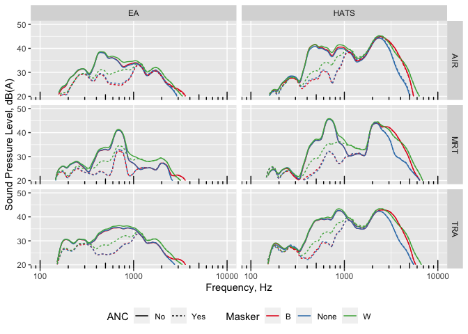
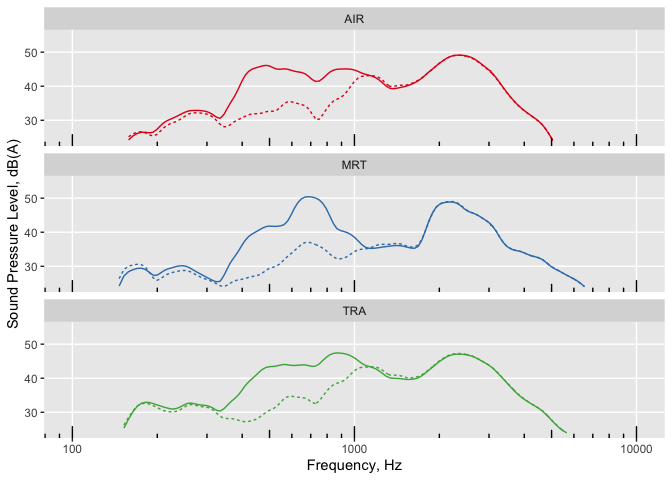

Replication code for: Anti-noise window: subjective perception of active
noise reduction and effect of informational masking
================

## Data loading

Load research data from dataverse data repository
(<https://doi.org/10.21979/N9/SEGEFM>) into dataframes then consolidate
them into a list data.l 1. data.subj: subjective response data from 44
participants 2. data.demo: demographic and pre-test assessment responses
from 44 particiapnts 3. data.spla: A-weighted equivalent sound pressure
level
()
vs time of all stimuli at 6 measurement microphone positions and
binaural channels from the HATS 4. data.splc:

vs time of all stimuli at 6 measurement microphone positions and
binaural channels from the HATS 5. data.ffta: Frequency domain plots in

of of all stimuli at 6 measurement microphone positions and binaural
channels from the HATS 6. data.fftc: Frequency domain plots in

of of all stimuli at 6 measurement microphone positions and binaural
channels from the HATS 7. data,sv: Single value psychoacoustic and
acoustic parameter data (see Table 1 in the paper) at 6 measurement
microphone positions and binaural channels from the HATS

``` r
#Set dataverse server
Sys.setenv("DATAVERSE_SERVER" = "https://researchdata.ntu.edu.sg")

#Retrieve research data from dataverse dataset
dv.dataset = "10.21979/N9/SEGEFM" #dataset linked to this paper
#define a list of data frame names and associated dataset file names
data.names <- data.frame(
        df.name=c(
                "data.subj","data.demo","data.spla","data.splc",
                "data.ffta","data.fftc","data.sv","trackInfo"),
        filename=c("SPANR_subj_clean.tab","SPANR_demo_clean.tab",
                   "SPANR_SPLdBA_clean.tab","SPANR_SPLdBC_clean.tab",
                   "SPANR_FFTdBA_clean.tab","SPANR_FFTdBC_clean.tab",
                   "SPANR_sv_clean.tab",
                   "SPANR_soundtrack_information.tab"))

# Empty list to store the data frames
data.l <- list()

#iteratively retrieve research data from dataverse
for (name in data.names$df.name) {
        
        #get dataset from dataverse
        df<-get_dataframe_by_name(filename = data.names[data.names$df.name==name,
                                            "filename"],
                      dataset = dv.dataset, orginal = TRUE,
                      .f = function(x) read.table(x, header = TRUE, 
                                                  sep = "\t", fill = TRUE))
        #assign the data frame to pre-defined name
        assign(name, df)
        #add data frame to list
        data.l[[name]] <- df
}
```

## Reliability check

Examine the within-subject test-retest reliability of the subjective
response data between stimuli \#1 and \#26

``` r
#no of participants from subjective response data
noPart<-length(unique(data.l[["data.subj"]]$ID))
        
#extract test tracks #1 and #26
data.trRel<-data.l[["data.subj"]] %>% 
        dplyr::filter(NoiseType=="Traffic" & SPL=="60dB") %>%
        #create time column, stimuli #1 & #3 correspond to 1st and 2nd assessments
        dplyr::mutate(time=ifelse(row_number()<(noPart+1),1,2))

#test-retest reliability between test tracks
trRel<-psych::testRetest(
        as.data.frame(data.trRel),
        select = c("annoyscale","loudness","pleasant","annoying",
                   "eventful","uneventful","vibrant","chaotic",
                   "monotonous","calm"))

#within person reliability
wPRel<-trRel$scores$rqq 

#ID of unreliable
IDunRel<-data.l[["data.subj"]]$ID[which(wPRel<0.7)][]

cat("ID number of unreliable responses: ",paste(as.character(IDunRel),collapse = ", "))
```

    ## ID number of unreliable responses:  8, 16, 19, 42

``` r
#Remove data with poor reliability <0.7
data.subj.rel <- data.l[["data.subj"]] %>% 
        dplyr::filter(!ID %in% IDunRel) %>%
        dplyr::mutate_at(.vars=c("NoiseType","Masker","SPL","ANC","annoycat"),
                         .funs = as.factor)

#Update demographic
data.demo.rel <- data.l[["data.demo"]] %>% 
        dplyr::filter(!ID %in% IDunRel) %>% 
        dplyr::filter(!ID==1)
```

## Energy-based assessment of active control and masking

## Single value objective indicators

``` r
#stimuli names for plotting
stimuli.trackInfo.names <- trackInfo[2:nrow(trackInfo),] %>%
        dplyr::select(!c("No.")) %>%
        dplyr::mutate(NoiseType=ifelse(NoiseType=="Train","MRT",
                                ifelse(NoiseType=="Aircraft","AIR",
                                       ifelse(NoiseType=="Traffic","TRA",NoiseType))),
               Masker=ifelse(Masker=="Bird","B",
                             ifelse(Masker=="Water","W",Masker))) %>%
        dplyr::mutate(stimuliID=row_number()) %>%
        dplyr::mutate(stimuli.name.short=case_when(
                Masker=="None" & ANC == "No" ~ paste0(NoiseType,"@",SPL),
                Masker=="None" & ANC == "Yes" ~ paste0(NoiseType,"*@",SPL),
                Masker!="None" & ANC == "No" ~ paste0(NoiseType,"@",SPL,
                                                      "+",Masker),
                Masker!="None" & ANC == "Yes" ~ paste0(NoiseType,"*@",SPL,
                                                       "+",Masker))) %>%
        dplyr::mutate(stimuli.name=case_when(
                Masker=="None" & ANC == "No" ~ paste0(NoiseType,"['",
                                                      SPL,"(A)']"),
                Masker=="None" & ANC == "Yes" ~ paste0(NoiseType,"['",
                                                       SPL, "(A)']^'*'"),
                Masker!="None" & ANC == "No" ~ paste0(NoiseType,"['",
                                                      SPL,"(A)']+",Masker),
                Masker!="None" & ANC == "Yes" ~ paste0(NoiseType,"['",SPL,
                                                     "(A)']^'*'+",Masker)))

mean.SV <- data.l[["data.sv"]] %>%
        dplyr::select(!Channel) %>%
        dplyr::filter(!stimuliID==0) %>% #remove noise floor
        group_by(stimuliID,measurement) %>%
        dplyr::summarise(across(everything(),list(mean))) %>%
        ungroup %>%
        `colnames<-`(gsub("_1","",colnames(.))) %>%
        `colnames<-`(gsub("\\.$",")",colnames(.))) %>%
        `colnames<-`(gsub("\\.","(",colnames(.))) %>%
        pivot_longer(cols = !c("stimuliID","measurement"), 
                     names_to = "Indicator",values_to = "Value") %>%
        #add stimuli details by merging
        left_join(.,stimuli.trackInfo.names, by="stimuliID") %>%
        dplyr::select(!c("NoiseType","Masker","ANC","SPL",
                         "stimuliID","stimuli.name.short")) %>%
        pivot_wider(names_from = stimuli.name, values_from = Value) %>%
        `colnames<-`(cbind(c("measurement","indicator",
                             stimuli.trackInfo.names$stimuli.name.short)))
```

    ## `summarise()` has grouped output by 'stimuliID'. You can override using the
    ## `.groups` argument.

### dB Attenuation

``` r
#compute difference before and after intervention only for dBA and dBC
mean.SV.att <- mean.SV %>%
        dplyr::filter(grepl("(C)|(A)", indicator)) %>%
        #compute attenuation
        dplyr::mutate(`AIR@65dB`=`AIR@65dB`-`AIR*@65dB`,
                      `MRT@65dB`=`MRT@65dB`-`MRT*@65dB`,
                      `TRA@65dB`=`TRA@65dB`-`TRA*@65dB`,
                      `AIR@70dB`=`AIR@70dB`-`AIR*@70dB`,
                      `MRT@70dB`=`MRT@70dB`-`MRT*@70dB`,
                      `TRA@70dB`=`TRA@70dB`-`TRA*@70dB`,
                      `AIR@65dB+B`=`AIR@65dB+B`-`AIR*@65dB+B`,
                      `MRT@65dB+B`=`MRT@65dB+B`-`MRT*@65dB+B`,
                      `TRA@65dB+B`=`TRA@65dB+B`-`TRA*@65dB+B`,
                      `AIR@65dB+W`=`AIR@65dB+W`-`AIR*@65dB+W`,
                      `MRT@65dB+W`=`MRT@65dB+W`-`MRT*@65dB+W`,
                      `TRA@65dB+W`=`TRA@65dB+W`-`TRA*@65dB+W`) %>%
        dplyr::select(!matches("\\*|60")) %>%
        dplyr::mutate(weight=ifelse(grepl("(C)",indicator),"C","A")) %>%
        group_by(measurement,weight) %>%
        dplyr::summarise_all(list(mean=mean,sd=sd))
```

    ## Warning: There were 8 warnings in `summarise()`.
    ## The first warning was:
    ## ℹ In argument: `indicator_mean = (function (x, ...) ...`.
    ## ℹ In group 1: `measurement = "EA"`, `weight = "A"`.
    ## Caused by warning in `mean.default()`:
    ## ! argument is not numeric or logical: returning NA
    ## ℹ Run `dplyr::last_dplyr_warnings()` to see the 7 remaining warnings.

``` r
mean.sv.derived <- mean.SV %>%
        `colnames<-`(cbind(c("measurement","indicator",
                             stimuli.trackInfo.names$stimuli.name))) %>%
        pivot_longer(names_to = "stimuli.name",values_to = "value",
                     cols = -c(1,2)) %>%
        pivot_wider(names_from = indicator, values_from = value) %>%
        dplyr::mutate(
                PA=ifelse(S>1.75,
                          N5*(1+sqrt(((S-1.75)*0.25*log10(N5+10))^2+
                                             ((2.18/N5^0.4)*(0.4*Fluc95+0.6*R))^2)),
                         N5*(1+sqrt(((2.18/N5^0.4)*(0.4*Fluc95+0.6*R))^2))),
               `L10(A)-L90(A)`=`L10(A)`-`L90(A)`,
               `L(C)-L(A)`=`L10(C)`-`L(A)`)

#generate table of attenuation scores
table.sv.att<- mean.sv.derived %>%
        #dplyr::select(!c(1,3:6)) %>%
        pivot_longer(cols = !c(1,2),
                     names_to = "Parameters", values_to = "Value") %>%
        pivot_wider(names_from = c("measurement","stimuli.name"),
                    values_from = Value) %>%
        dplyr::mutate(HATS_AIR65dBA.B0=`HATS_AIR['65dB(A)']`-`HATS_AIR['65dB(A)']+B`,
               HATS_AIR65dBA.W0=`HATS_AIR['65dB(A)']`-`HATS_AIR['65dB(A)']+W`,
               HATS_AIR65dBA=`HATS_AIR['65dB(A)']`-`HATS_AIR['65dB(A)']^'*'`,
               HATS_AIR65dBA.B=`HATS_AIR['65dB(A)']`-`HATS_AIR['65dB(A)']^'*'+B`,
               HATS_AIR65dBA.W=`HATS_AIR['65dB(A)']`-`HATS_AIR['65dB(A)']^'*'+W`,
               HATS_AIR70dBA=`HATS_AIR['70dB(A)']`-`HATS_AIR['70dB(A)']^'*'`,
               
               HATS_MRT65dBA.B0=`HATS_MRT['65dB(A)']`-`HATS_MRT['65dB(A)']+B`,
               HATS_MRT65dBA.W0=`HATS_MRT['65dB(A)']`-`HATS_MRT['65dB(A)']+W`,
               HATS_MRT65dBA=`HATS_MRT['65dB(A)']`-`HATS_MRT['65dB(A)']^'*'`,
               HATS_MRT65dBA.B=`HATS_MRT['65dB(A)']`-`HATS_MRT['65dB(A)']^'*'+B`,
               HATS_MRT65dBA.W=`HATS_MRT['65dB(A)']`-`HATS_MRT['65dB(A)']^'*'+W`,
               HATS_MRT70dBA=`HATS_MRT['70dB(A)']`-`HATS_MRT['70dB(A)']^'*'`,
               
               HATS_TRA65dBA.B0=`HATS_TRA['65dB(A)']`-`HATS_TRA['65dB(A)']+B`,
               HATS_TRA65dBA.W0=`HATS_TRA['65dB(A)']`-`HATS_TRA['65dB(A)']+W`,
               HATS_TRA65dBA=`HATS_TRA['65dB(A)']`-`HATS_TRA['65dB(A)']^'*'`,
               HATS_TRA65dBA.B=`HATS_TRA['65dB(A)']`-`HATS_TRA['65dB(A)']^'*'+B`,
               HATS_TRA65dBA.W=`HATS_TRA['65dB(A)']`-`HATS_TRA['65dB(A)']^'*'+W`,
               HATS_TRA70dBA=`HATS_TRA['70dB(A)']`-`HATS_TRA['70dB(A)']^'*'`,
               
               EA_AIR65dBA.B0=`EA_AIR['65dB(A)']`-`EA_AIR['65dB(A)']+B`,
               EA_AIR65dBA.W0=`EA_AIR['65dB(A)']`-`EA_AIR['65dB(A)']+W`,
               EA_AIR65dBA=`EA_AIR['65dB(A)']`-`EA_AIR['65dB(A)']^'*'`,
               EA_AIR65dBA.B=`EA_AIR['65dB(A)']`-`EA_AIR['65dB(A)']^'*'+B`,
               EA_AIR65dBA.W=`EA_AIR['65dB(A)']`-`EA_AIR['65dB(A)']^'*'+W`,
               EA_AIR70dBA=`EA_AIR['70dB(A)']`-`EA_AIR['70dB(A)']^'*'`,
               
               EA_MRT65dBA.B0=`EA_MRT['65dB(A)']`-`EA_MRT['65dB(A)']+B`,
               EA_MRT65dBA.W0=`EA_MRT['65dB(A)']`-`EA_MRT['65dB(A)']+W`,
               EA_MRT65dBA=`EA_MRT['65dB(A)']`-`EA_MRT['65dB(A)']^'*'`,
               EA_MRT65dBA.B=`EA_MRT['65dB(A)']`-`EA_MRT['65dB(A)']^'*'+B`,
               EA_MRT65dBA.W=`EA_MRT['65dB(A)']`-`EA_MRT['65dB(A)']^'*'+W`,
               EA_MRT70dBA=`EA_MRT['70dB(A)']`-`EA_MRT['70dB(A)']^'*'`,
               
               EA_TRA65dBA.B0=`EA_TRA['65dB(A)']`-`EA_TRA['65dB(A)']+B`,
               EA_TRA65dBA.W0=`EA_TRA['65dB(A)']`-`EA_TRA['65dB(A)']+W`,
               EA_TRA65dBA=`EA_TRA['65dB(A)']`-`EA_TRA['65dB(A)']^'*'`,
               EA_TRA65dBA.B=`EA_TRA['65dB(A)']`-`EA_TRA['65dB(A)']^'*'+B`,
               EA_TRA65dBA.W=`EA_TRA['65dB(A)']`-`EA_TRA['65dB(A)']^'*'+W`,
               EA_TRA70dBA=`EA_TRA['70dB(A)']`-`EA_TRA['70dB(A)']^'*'`) %>%
        dplyr::select(!c(2:51)) %>%
        dplyr::mutate(across(!1, round, 2)) %>%
        kableExtra::kbl(booktabs = T, linesep = "",
                        #format = "latex",
                        format = "html",
                        label = "attHATSEA_SV",
                        caption = "Difference between mean acoustic and 
                        psychoacoustic indices before and after intervention, 
                        across both KEMAR HATS and energetic average measurements") %>%
        #kable_styling(latex_table_env = "tabularx") %>%
        kable_styling(protect_latex = TRUE) %>%
        kable_paper(full_width = T) %>%
        add_header_above(c(" ", "65dB(A)" = 5, "70dB(A)" = 1, 
                           "65dB(A)" = 5, "70dB(A)" = 1, 
                           "65dB(A)" = 5, "70dB(A)" = 1, 
                           "65dB(A)" = 5, "70dB(A)" = 1, 
                           "65dB(A)" = 5, "70dB(A)" = 1, 
                           "65dB(A)" = 5, "70dB(A)" = 1), bold = T) %>%
        add_header_above(c(" ", "ANC:NO" = 2, "ANC:YES" = 4, 
                           "ANC:NO" = 2, "ANC:YES" = 4, 
                           "ANC:NO" = 2, "ANC:YES" = 4, 
                           "ANC:NO" = 2, "ANC:YES" = 4, 
                           "ANC:NO" = 2, "ANC:YES" = 4, 
                           "ANC:NO" = 2, "ANC:YES" = 4), bold = T) %>%
        add_header_above(c(" ", "Aircraft" = 6, "MRT" = 6, "Traffic" = 6, 
                           "Aircraft" = 6, "MRT" = 6, "Traffic" = 6),
                         bold = T) %>%
        add_header_above(c(" ", "HATS" = 18, 
                           "Energetic Average" = 18), bold = T) #%>%
```

    ## Warning: There was 1 warning in `dplyr::mutate()`.
    ## ℹ In argument: `across(!1, round, 2)`.
    ## Caused by warning:
    ## ! The `...` argument of `across()` is deprecated as of dplyr 1.1.0.
    ## Supply arguments directly to `.fns` through an anonymous function instead.
    ## 
    ##   # Previously
    ##   across(a:b, mean, na.rm = TRUE)
    ## 
    ##   # Now
    ##   across(a:b, \(x) mean(x, na.rm = TRUE))

``` r
        #save_kable(paste0(getwd(),"/diffHATSEV_SV.tex"))

table.sv.att
```

<table class="table lightable-paper" style="margin-left: auto; margin-right: auto; font-family: &quot;Arial Narrow&quot;, arial, helvetica, sans-serif; margin-left: auto; margin-right: auto;">
<caption>
Difference between mean acoustic and psychoacoustic indices before and
after intervention, across both KEMAR HATS and energetic average
measurements
</caption>
<thead>
<tr>
<th style="empty-cells: hide;" colspan="1">
</th>
<th style="padding-bottom:0; padding-left:3px;padding-right:3px;text-align: center; font-weight: bold; " colspan="18">

<div style="border-bottom: 1px solid #00000020; padding-bottom: 5px; ">

HATS

</div>

</th>
<th style="padding-bottom:0; padding-left:3px;padding-right:3px;text-align: center; font-weight: bold; " colspan="18">

<div style="border-bottom: 1px solid #00000020; padding-bottom: 5px; ">

Energetic Average

</div>

</th>
</tr>
<tr>
<th style="empty-cells: hide;" colspan="1">
</th>
<th style="padding-bottom:0; padding-left:3px;padding-right:3px;text-align: center; font-weight: bold; " colspan="6">

<div style="border-bottom: 1px solid #00000020; padding-bottom: 5px; ">

Aircraft

</div>

</th>
<th style="padding-bottom:0; padding-left:3px;padding-right:3px;text-align: center; font-weight: bold; " colspan="6">

<div style="border-bottom: 1px solid #00000020; padding-bottom: 5px; ">

MRT

</div>

</th>
<th style="padding-bottom:0; padding-left:3px;padding-right:3px;text-align: center; font-weight: bold; " colspan="6">

<div style="border-bottom: 1px solid #00000020; padding-bottom: 5px; ">

Traffic

</div>

</th>
<th style="padding-bottom:0; padding-left:3px;padding-right:3px;text-align: center; font-weight: bold; " colspan="6">

<div style="border-bottom: 1px solid #00000020; padding-bottom: 5px; ">

Aircraft

</div>

</th>
<th style="padding-bottom:0; padding-left:3px;padding-right:3px;text-align: center; font-weight: bold; " colspan="6">

<div style="border-bottom: 1px solid #00000020; padding-bottom: 5px; ">

MRT

</div>

</th>
<th style="padding-bottom:0; padding-left:3px;padding-right:3px;text-align: center; font-weight: bold; " colspan="6">

<div style="border-bottom: 1px solid #00000020; padding-bottom: 5px; ">

Traffic

</div>

</th>
</tr>
<tr>
<th style="empty-cells: hide;" colspan="1">
</th>
<th style="padding-bottom:0; padding-left:3px;padding-right:3px;text-align: center; font-weight: bold; " colspan="2">

<div style="border-bottom: 1px solid #00000020; padding-bottom: 5px; ">

ANC:NO

</div>

</th>
<th style="padding-bottom:0; padding-left:3px;padding-right:3px;text-align: center; font-weight: bold; " colspan="4">

<div style="border-bottom: 1px solid #00000020; padding-bottom: 5px; ">

ANC:YES

</div>

</th>
<th style="padding-bottom:0; padding-left:3px;padding-right:3px;text-align: center; font-weight: bold; " colspan="2">

<div style="border-bottom: 1px solid #00000020; padding-bottom: 5px; ">

ANC:NO

</div>

</th>
<th style="padding-bottom:0; padding-left:3px;padding-right:3px;text-align: center; font-weight: bold; " colspan="4">

<div style="border-bottom: 1px solid #00000020; padding-bottom: 5px; ">

ANC:YES

</div>

</th>
<th style="padding-bottom:0; padding-left:3px;padding-right:3px;text-align: center; font-weight: bold; " colspan="2">

<div style="border-bottom: 1px solid #00000020; padding-bottom: 5px; ">

ANC:NO

</div>

</th>
<th style="padding-bottom:0; padding-left:3px;padding-right:3px;text-align: center; font-weight: bold; " colspan="4">

<div style="border-bottom: 1px solid #00000020; padding-bottom: 5px; ">

ANC:YES

</div>

</th>
<th style="padding-bottom:0; padding-left:3px;padding-right:3px;text-align: center; font-weight: bold; " colspan="2">

<div style="border-bottom: 1px solid #00000020; padding-bottom: 5px; ">

ANC:NO

</div>

</th>
<th style="padding-bottom:0; padding-left:3px;padding-right:3px;text-align: center; font-weight: bold; " colspan="4">

<div style="border-bottom: 1px solid #00000020; padding-bottom: 5px; ">

ANC:YES

</div>

</th>
<th style="padding-bottom:0; padding-left:3px;padding-right:3px;text-align: center; font-weight: bold; " colspan="2">

<div style="border-bottom: 1px solid #00000020; padding-bottom: 5px; ">

ANC:NO

</div>

</th>
<th style="padding-bottom:0; padding-left:3px;padding-right:3px;text-align: center; font-weight: bold; " colspan="4">

<div style="border-bottom: 1px solid #00000020; padding-bottom: 5px; ">

ANC:YES

</div>

</th>
<th style="padding-bottom:0; padding-left:3px;padding-right:3px;text-align: center; font-weight: bold; " colspan="2">

<div style="border-bottom: 1px solid #00000020; padding-bottom: 5px; ">

ANC:NO

</div>

</th>
<th style="padding-bottom:0; padding-left:3px;padding-right:3px;text-align: center; font-weight: bold; " colspan="4">

<div style="border-bottom: 1px solid #00000020; padding-bottom: 5px; ">

ANC:YES

</div>

</th>
</tr>
<tr>
<th style="empty-cells: hide;" colspan="1">
</th>
<th style="padding-bottom:0; padding-left:3px;padding-right:3px;text-align: center; font-weight: bold; " colspan="5">

<div style="border-bottom: 1px solid #00000020; padding-bottom: 5px; ">

65dB(A)

</div>

</th>
<th style="padding-bottom:0; padding-left:3px;padding-right:3px;text-align: center; font-weight: bold; " colspan="1">

<div style="border-bottom: 1px solid #00000020; padding-bottom: 5px; ">

70dB(A)

</div>

</th>
<th style="padding-bottom:0; padding-left:3px;padding-right:3px;text-align: center; font-weight: bold; " colspan="5">

<div style="border-bottom: 1px solid #00000020; padding-bottom: 5px; ">

65dB(A)

</div>

</th>
<th style="padding-bottom:0; padding-left:3px;padding-right:3px;text-align: center; font-weight: bold; " colspan="1">

<div style="border-bottom: 1px solid #00000020; padding-bottom: 5px; ">

70dB(A)

</div>

</th>
<th style="padding-bottom:0; padding-left:3px;padding-right:3px;text-align: center; font-weight: bold; " colspan="5">

<div style="border-bottom: 1px solid #00000020; padding-bottom: 5px; ">

65dB(A)

</div>

</th>
<th style="padding-bottom:0; padding-left:3px;padding-right:3px;text-align: center; font-weight: bold; " colspan="1">

<div style="border-bottom: 1px solid #00000020; padding-bottom: 5px; ">

70dB(A)

</div>

</th>
<th style="padding-bottom:0; padding-left:3px;padding-right:3px;text-align: center; font-weight: bold; " colspan="5">

<div style="border-bottom: 1px solid #00000020; padding-bottom: 5px; ">

65dB(A)

</div>

</th>
<th style="padding-bottom:0; padding-left:3px;padding-right:3px;text-align: center; font-weight: bold; " colspan="1">

<div style="border-bottom: 1px solid #00000020; padding-bottom: 5px; ">

70dB(A)

</div>

</th>
<th style="padding-bottom:0; padding-left:3px;padding-right:3px;text-align: center; font-weight: bold; " colspan="5">

<div style="border-bottom: 1px solid #00000020; padding-bottom: 5px; ">

65dB(A)

</div>

</th>
<th style="padding-bottom:0; padding-left:3px;padding-right:3px;text-align: center; font-weight: bold; " colspan="1">

<div style="border-bottom: 1px solid #00000020; padding-bottom: 5px; ">

70dB(A)

</div>

</th>
<th style="padding-bottom:0; padding-left:3px;padding-right:3px;text-align: center; font-weight: bold; " colspan="5">

<div style="border-bottom: 1px solid #00000020; padding-bottom: 5px; ">

65dB(A)

</div>

</th>
<th style="padding-bottom:0; padding-left:3px;padding-right:3px;text-align: center; font-weight: bold; " colspan="1">

<div style="border-bottom: 1px solid #00000020; padding-bottom: 5px; ">

70dB(A)

</div>

</th>
</tr>
<tr>
<th style="text-align:left;">
Parameters
</th>
<th style="text-align:right;">
HATS_AIR65dBA.B0
</th>
<th style="text-align:right;">
HATS_AIR65dBA.W0
</th>
<th style="text-align:right;">
HATS_AIR65dBA
</th>
<th style="text-align:right;">
HATS_AIR65dBA.B
</th>
<th style="text-align:right;">
HATS_AIR65dBA.W
</th>
<th style="text-align:right;">
HATS_AIR70dBA
</th>
<th style="text-align:right;">
HATS_MRT65dBA.B0
</th>
<th style="text-align:right;">
HATS_MRT65dBA.W0
</th>
<th style="text-align:right;">
HATS_MRT65dBA
</th>
<th style="text-align:right;">
HATS_MRT65dBA.B
</th>
<th style="text-align:right;">
HATS_MRT65dBA.W
</th>
<th style="text-align:right;">
HATS_MRT70dBA
</th>
<th style="text-align:right;">
HATS_TRA65dBA.B0
</th>
<th style="text-align:right;">
HATS_TRA65dBA.W0
</th>
<th style="text-align:right;">
HATS_TRA65dBA
</th>
<th style="text-align:right;">
HATS_TRA65dBA.B
</th>
<th style="text-align:right;">
HATS_TRA65dBA.W
</th>
<th style="text-align:right;">
HATS_TRA70dBA
</th>
<th style="text-align:right;">
EA_AIR65dBA.B0
</th>
<th style="text-align:right;">
EA_AIR65dBA.W0
</th>
<th style="text-align:right;">
EA_AIR65dBA
</th>
<th style="text-align:right;">
EA_AIR65dBA.B
</th>
<th style="text-align:right;">
EA_AIR65dBA.W
</th>
<th style="text-align:right;">
EA_AIR70dBA
</th>
<th style="text-align:right;">
EA_MRT65dBA.B0
</th>
<th style="text-align:right;">
EA_MRT65dBA.W0
</th>
<th style="text-align:right;">
EA_MRT65dBA
</th>
<th style="text-align:right;">
EA_MRT65dBA.B
</th>
<th style="text-align:right;">
EA_MRT65dBA.W
</th>
<th style="text-align:right;">
EA_MRT70dBA
</th>
<th style="text-align:right;">
EA_TRA65dBA.B0
</th>
<th style="text-align:right;">
EA_TRA65dBA.W0
</th>
<th style="text-align:right;">
EA_TRA65dBA
</th>
<th style="text-align:right;">
EA_TRA65dBA.B
</th>
<th style="text-align:right;">
EA_TRA65dBA.W
</th>
<th style="text-align:right;">
EA_TRA70dBA
</th>
</tr>
</thead>
<tbody>
<tr>
<td style="text-align:left;">
L(C)
</td>
<td style="text-align:right;">
-1.21
</td>
<td style="text-align:right;">
-1.40
</td>
<td style="text-align:right;">
0.72
</td>
<td style="text-align:right;">
-0.05
</td>
<td style="text-align:right;">
-0.59
</td>
<td style="text-align:right;">
1.23
</td>
<td style="text-align:right;">
-1.16
</td>
<td style="text-align:right;">
-1.39
</td>
<td style="text-align:right;">
1.66
</td>
<td style="text-align:right;">
0.14
</td>
<td style="text-align:right;">
-0.20
</td>
<td style="text-align:right;">
1.81
</td>
<td style="text-align:right;">
-1.01
</td>
<td style="text-align:right;">
-1.24
</td>
<td style="text-align:right;">
1.21
</td>
<td style="text-align:right;">
-0.08
</td>
<td style="text-align:right;">
-0.35
</td>
<td style="text-align:right;">
1.26
</td>
<td style="text-align:right;">
0.01
</td>
<td style="text-align:right;">
-0.45
</td>
<td style="text-align:right;">
1.66
</td>
<td style="text-align:right;">
1.88
</td>
<td style="text-align:right;">
1.19
</td>
<td style="text-align:right;">
2.34
</td>
<td style="text-align:right;">
0.01
</td>
<td style="text-align:right;">
-0.46
</td>
<td style="text-align:right;">
1.95
</td>
<td style="text-align:right;">
2.02
</td>
<td style="text-align:right;">
1.20
</td>
<td style="text-align:right;">
2.48
</td>
<td style="text-align:right;">
-0.06
</td>
<td style="text-align:right;">
-0.36
</td>
<td style="text-align:right;">
1.37
</td>
<td style="text-align:right;">
1.28
</td>
<td style="text-align:right;">
0.87
</td>
<td style="text-align:right;">
1.65
</td>
</tr>
<tr>
<td style="text-align:left;">
Max(C)
</td>
<td style="text-align:right;">
-0.75
</td>
<td style="text-align:right;">
-0.44
</td>
<td style="text-align:right;">
0.39
</td>
<td style="text-align:right;">
-0.39
</td>
<td style="text-align:right;">
-0.06
</td>
<td style="text-align:right;">
0.44
</td>
<td style="text-align:right;">
-2.81
</td>
<td style="text-align:right;">
-0.11
</td>
<td style="text-align:right;">
2.47
</td>
<td style="text-align:right;">
-2.26
</td>
<td style="text-align:right;">
1.30
</td>
<td style="text-align:right;">
1.87
</td>
<td style="text-align:right;">
-3.77
</td>
<td style="text-align:right;">
-0.10
</td>
<td style="text-align:right;">
0.38
</td>
<td style="text-align:right;">
-3.62
</td>
<td style="text-align:right;">
-0.11
</td>
<td style="text-align:right;">
1.50
</td>
<td style="text-align:right;">
0.06
</td>
<td style="text-align:right;">
-0.61
</td>
<td style="text-align:right;">
2.19
</td>
<td style="text-align:right;">
3.22
</td>
<td style="text-align:right;">
3.52
</td>
<td style="text-align:right;">
3.79
</td>
<td style="text-align:right;">
0.30
</td>
<td style="text-align:right;">
1.15
</td>
<td style="text-align:right;">
2.74
</td>
<td style="text-align:right;">
2.66
</td>
<td style="text-align:right;">
2.08
</td>
<td style="text-align:right;">
2.42
</td>
<td style="text-align:right;">
-0.61
</td>
<td style="text-align:right;">
0.84
</td>
<td style="text-align:right;">
-0.68
</td>
<td style="text-align:right;">
-0.50
</td>
<td style="text-align:right;">
0.42
</td>
<td style="text-align:right;">
1.54
</td>
</tr>
<tr>
<td style="text-align:left;">
L5(C)
</td>
<td style="text-align:right;">
-1.01
</td>
<td style="text-align:right;">
-0.44
</td>
<td style="text-align:right;">
1.06
</td>
<td style="text-align:right;">
-0.16
</td>
<td style="text-align:right;">
0.56
</td>
<td style="text-align:right;">
1.16
</td>
<td style="text-align:right;">
-1.62
</td>
<td style="text-align:right;">
-0.93
</td>
<td style="text-align:right;">
1.69
</td>
<td style="text-align:right;">
-0.82
</td>
<td style="text-align:right;">
0.38
</td>
<td style="text-align:right;">
1.76
</td>
<td style="text-align:right;">
-2.34
</td>
<td style="text-align:right;">
-1.17
</td>
<td style="text-align:right;">
1.35
</td>
<td style="text-align:right;">
-1.83
</td>
<td style="text-align:right;">
-0.30
</td>
<td style="text-align:right;">
1.44
</td>
<td style="text-align:right;">
0.02
</td>
<td style="text-align:right;">
-0.17
</td>
<td style="text-align:right;">
2.26
</td>
<td style="text-align:right;">
2.41
</td>
<td style="text-align:right;">
2.12
</td>
<td style="text-align:right;">
2.78
</td>
<td style="text-align:right;">
-0.01
</td>
<td style="text-align:right;">
-0.27
</td>
<td style="text-align:right;">
2.02
</td>
<td style="text-align:right;">
2.07
</td>
<td style="text-align:right;">
1.53
</td>
<td style="text-align:right;">
2.56
</td>
<td style="text-align:right;">
-0.12
</td>
<td style="text-align:right;">
-0.30
</td>
<td style="text-align:right;">
1.21
</td>
<td style="text-align:right;">
1.11
</td>
<td style="text-align:right;">
0.84
</td>
<td style="text-align:right;">
1.53
</td>
</tr>
<tr>
<td style="text-align:left;">
L10(C)
</td>
<td style="text-align:right;">
-0.75
</td>
<td style="text-align:right;">
-0.49
</td>
<td style="text-align:right;">
0.98
</td>
<td style="text-align:right;">
0.43
</td>
<td style="text-align:right;">
0.45
</td>
<td style="text-align:right;">
1.07
</td>
<td style="text-align:right;">
-1.30
</td>
<td style="text-align:right;">
-0.97
</td>
<td style="text-align:right;">
1.70
</td>
<td style="text-align:right;">
-0.37
</td>
<td style="text-align:right;">
0.38
</td>
<td style="text-align:right;">
1.73
</td>
<td style="text-align:right;">
-1.97
</td>
<td style="text-align:right;">
-1.20
</td>
<td style="text-align:right;">
1.32
</td>
<td style="text-align:right;">
-1.36
</td>
<td style="text-align:right;">
-0.32
</td>
<td style="text-align:right;">
1.39
</td>
<td style="text-align:right;">
-0.04
</td>
<td style="text-align:right;">
-0.19
</td>
<td style="text-align:right;">
2.13
</td>
<td style="text-align:right;">
2.29
</td>
<td style="text-align:right;">
1.90
</td>
<td style="text-align:right;">
2.69
</td>
<td style="text-align:right;">
0.00
</td>
<td style="text-align:right;">
-0.35
</td>
<td style="text-align:right;">
2.02
</td>
<td style="text-align:right;">
2.07
</td>
<td style="text-align:right;">
1.48
</td>
<td style="text-align:right;">
2.55
</td>
<td style="text-align:right;">
-0.10
</td>
<td style="text-align:right;">
-0.31
</td>
<td style="text-align:right;">
1.27
</td>
<td style="text-align:right;">
1.16
</td>
<td style="text-align:right;">
0.84
</td>
<td style="text-align:right;">
1.56
</td>
</tr>
<tr>
<td style="text-align:left;">
L50(C)
</td>
<td style="text-align:right;">
-2.83
</td>
<td style="text-align:right;">
-3.30
</td>
<td style="text-align:right;">
0.62
</td>
<td style="text-align:right;">
-1.20
</td>
<td style="text-align:right;">
-2.67
</td>
<td style="text-align:right;">
1.66
</td>
<td style="text-align:right;">
-0.80
</td>
<td style="text-align:right;">
-1.26
</td>
<td style="text-align:right;">
1.80
</td>
<td style="text-align:right;">
0.78
</td>
<td style="text-align:right;">
0.08
</td>
<td style="text-align:right;">
1.95
</td>
<td style="text-align:right;">
-0.51
</td>
<td style="text-align:right;">
-1.27
</td>
<td style="text-align:right;">
1.19
</td>
<td style="text-align:right;">
0.68
</td>
<td style="text-align:right;">
-0.39
</td>
<td style="text-align:right;">
1.22
</td>
<td style="text-align:right;">
0.08
</td>
<td style="text-align:right;">
-0.60
</td>
<td style="text-align:right;">
1.26
</td>
<td style="text-align:right;">
1.45
</td>
<td style="text-align:right;">
0.55
</td>
<td style="text-align:right;">
1.84
</td>
<td style="text-align:right;">
0.01
</td>
<td style="text-align:right;">
-0.49
</td>
<td style="text-align:right;">
2.04
</td>
<td style="text-align:right;">
2.10
</td>
<td style="text-align:right;">
1.27
</td>
<td style="text-align:right;">
2.52
</td>
<td style="text-align:right;">
-0.03
</td>
<td style="text-align:right;">
-0.39
</td>
<td style="text-align:right;">
1.42
</td>
<td style="text-align:right;">
1.34
</td>
<td style="text-align:right;">
0.87
</td>
<td style="text-align:right;">
1.65
</td>
</tr>
<tr>
<td style="text-align:left;">
L90(C)
</td>
<td style="text-align:right;">
-0.25
</td>
<td style="text-align:right;">
-4.62
</td>
<td style="text-align:right;">
0.50
</td>
<td style="text-align:right;">
0.36
</td>
<td style="text-align:right;">
-4.19
</td>
<td style="text-align:right;">
1.61
</td>
<td style="text-align:right;">
-1.98
</td>
<td style="text-align:right;">
-3.92
</td>
<td style="text-align:right;">
0.97
</td>
<td style="text-align:right;">
-0.40
</td>
<td style="text-align:right;">
-3.50
</td>
<td style="text-align:right;">
1.56
</td>
<td style="text-align:right;">
-0.33
</td>
<td style="text-align:right;">
-1.29
</td>
<td style="text-align:right;">
1.12
</td>
<td style="text-align:right;">
0.88
</td>
<td style="text-align:right;">
-0.34
</td>
<td style="text-align:right;">
1.20
</td>
<td style="text-align:right;">
0.22
</td>
<td style="text-align:right;">
-1.02
</td>
<td style="text-align:right;">
0.78
</td>
<td style="text-align:right;">
1.08
</td>
<td style="text-align:right;">
-0.17
</td>
<td style="text-align:right;">
1.36
</td>
<td style="text-align:right;">
-0.08
</td>
<td style="text-align:right;">
-0.92
</td>
<td style="text-align:right;">
1.23
</td>
<td style="text-align:right;">
1.33
</td>
<td style="text-align:right;">
0.07
</td>
<td style="text-align:right;">
1.85
</td>
<td style="text-align:right;">
-0.06
</td>
<td style="text-align:right;">
-0.47
</td>
<td style="text-align:right;">
1.57
</td>
<td style="text-align:right;">
1.48
</td>
<td style="text-align:right;">
0.93
</td>
<td style="text-align:right;">
1.80
</td>
</tr>
<tr>
<td style="text-align:left;">
L95(C)
</td>
<td style="text-align:right;">
-0.11
</td>
<td style="text-align:right;">
-4.94
</td>
<td style="text-align:right;">
0.67
</td>
<td style="text-align:right;">
0.73
</td>
<td style="text-align:right;">
-4.51
</td>
<td style="text-align:right;">
1.66
</td>
<td style="text-align:right;">
-0.61
</td>
<td style="text-align:right;">
-4.30
</td>
<td style="text-align:right;">
0.91
</td>
<td style="text-align:right;">
0.69
</td>
<td style="text-align:right;">
-3.84
</td>
<td style="text-align:right;">
1.27
</td>
<td style="text-align:right;">
-0.32
</td>
<td style="text-align:right;">
-1.28
</td>
<td style="text-align:right;">
1.16
</td>
<td style="text-align:right;">
0.92
</td>
<td style="text-align:right;">
-0.25
</td>
<td style="text-align:right;">
1.27
</td>
<td style="text-align:right;">
0.19
</td>
<td style="text-align:right;">
-1.14
</td>
<td style="text-align:right;">
0.77
</td>
<td style="text-align:right;">
1.11
</td>
<td style="text-align:right;">
-0.29
</td>
<td style="text-align:right;">
1.68
</td>
<td style="text-align:right;">
-0.07
</td>
<td style="text-align:right;">
-0.95
</td>
<td style="text-align:right;">
1.20
</td>
<td style="text-align:right;">
1.32
</td>
<td style="text-align:right;">
-0.07
</td>
<td style="text-align:right;">
1.71
</td>
<td style="text-align:right;">
-0.05
</td>
<td style="text-align:right;">
-0.45
</td>
<td style="text-align:right;">
1.66
</td>
<td style="text-align:right;">
1.54
</td>
<td style="text-align:right;">
0.97
</td>
<td style="text-align:right;">
1.87
</td>
</tr>
<tr>
<td style="text-align:left;">
L(A)
</td>
<td style="text-align:right;">
-1.62
</td>
<td style="text-align:right;">
-1.73
</td>
<td style="text-align:right;">
0.16
</td>
<td style="text-align:right;">
-0.86
</td>
<td style="text-align:right;">
-1.36
</td>
<td style="text-align:right;">
0.65
</td>
<td style="text-align:right;">
-1.69
</td>
<td style="text-align:right;">
-1.87
</td>
<td style="text-align:right;">
1.02
</td>
<td style="text-align:right;">
-0.92
</td>
<td style="text-align:right;">
-1.16
</td>
<td style="text-align:right;">
1.09
</td>
<td style="text-align:right;">
-1.46
</td>
<td style="text-align:right;">
-1.68
</td>
<td style="text-align:right;">
0.82
</td>
<td style="text-align:right;">
-0.89
</td>
<td style="text-align:right;">
-1.13
</td>
<td style="text-align:right;">
0.80
</td>
<td style="text-align:right;">
-0.45
</td>
<td style="text-align:right;">
-1.29
</td>
<td style="text-align:right;">
2.29
</td>
<td style="text-align:right;">
2.41
</td>
<td style="text-align:right;">
0.60
</td>
<td style="text-align:right;">
2.68
</td>
<td style="text-align:right;">
-0.26
</td>
<td style="text-align:right;">
-1.62
</td>
<td style="text-align:right;">
4.13
</td>
<td style="text-align:right;">
3.74
</td>
<td style="text-align:right;">
1.20
</td>
<td style="text-align:right;">
4.32
</td>
<td style="text-align:right;">
-0.18
</td>
<td style="text-align:right;">
-1.11
</td>
<td style="text-align:right;">
2.75
</td>
<td style="text-align:right;">
2.44
</td>
<td style="text-align:right;">
0.92
</td>
<td style="text-align:right;">
2.74
</td>
</tr>
<tr>
<td style="text-align:left;">
Max(A)
</td>
<td style="text-align:right;">
-0.93
</td>
<td style="text-align:right;">
-0.49
</td>
<td style="text-align:right;">
0.15
</td>
<td style="text-align:right;">
-0.77
</td>
<td style="text-align:right;">
-0.34
</td>
<td style="text-align:right;">
0.19
</td>
<td style="text-align:right;">
-5.08
</td>
<td style="text-align:right;">
-1.51
</td>
<td style="text-align:right;">
0.84
</td>
<td style="text-align:right;">
-4.81
</td>
<td style="text-align:right;">
-0.72
</td>
<td style="text-align:right;">
0.84
</td>
<td style="text-align:right;">
-6.74
</td>
<td style="text-align:right;">
-1.98
</td>
<td style="text-align:right;">
0.83
</td>
<td style="text-align:right;">
-6.58
</td>
<td style="text-align:right;">
-1.42
</td>
<td style="text-align:right;">
0.90
</td>
<td style="text-align:right;">
-0.07
</td>
<td style="text-align:right;">
-0.14
</td>
<td style="text-align:right;">
2.95
</td>
<td style="text-align:right;">
2.88
</td>
<td style="text-align:right;">
2.66
</td>
<td style="text-align:right;">
2.98
</td>
<td style="text-align:right;">
-0.31
</td>
<td style="text-align:right;">
-0.97
</td>
<td style="text-align:right;">
4.97
</td>
<td style="text-align:right;">
3.38
</td>
<td style="text-align:right;">
2.32
</td>
<td style="text-align:right;">
5.16
</td>
<td style="text-align:right;">
-0.59
</td>
<td style="text-align:right;">
-1.46
</td>
<td style="text-align:right;">
2.95
</td>
<td style="text-align:right;">
1.25
</td>
<td style="text-align:right;">
0.44
</td>
<td style="text-align:right;">
2.86
</td>
</tr>
<tr>
<td style="text-align:left;">
L5(A)
</td>
<td style="text-align:right;">
-1.47
</td>
<td style="text-align:right;">
-0.52
</td>
<td style="text-align:right;">
0.40
</td>
<td style="text-align:right;">
-0.98
</td>
<td style="text-align:right;">
-0.13
</td>
<td style="text-align:right;">
0.47
</td>
<td style="text-align:right;">
-2.38
</td>
<td style="text-align:right;">
-1.20
</td>
<td style="text-align:right;">
1.00
</td>
<td style="text-align:right;">
-1.96
</td>
<td style="text-align:right;">
-0.47
</td>
<td style="text-align:right;">
0.97
</td>
<td style="text-align:right;">
-3.50
</td>
<td style="text-align:right;">
-1.74
</td>
<td style="text-align:right;">
0.86
</td>
<td style="text-align:right;">
-3.21
</td>
<td style="text-align:right;">
-1.22
</td>
<td style="text-align:right;">
0.83
</td>
<td style="text-align:right;">
-0.17
</td>
<td style="text-align:right;">
-0.35
</td>
<td style="text-align:right;">
2.31
</td>
<td style="text-align:right;">
2.29
</td>
<td style="text-align:right;">
1.79
</td>
<td style="text-align:right;">
2.39
</td>
<td style="text-align:right;">
-0.20
</td>
<td style="text-align:right;">
-1.20
</td>
<td style="text-align:right;">
4.22
</td>
<td style="text-align:right;">
3.82
</td>
<td style="text-align:right;">
1.96
</td>
<td style="text-align:right;">
4.34
</td>
<td style="text-align:right;">
-0.20
</td>
<td style="text-align:right;">
-1.03
</td>
<td style="text-align:right;">
2.89
</td>
<td style="text-align:right;">
2.34
</td>
<td style="text-align:right;">
0.98
</td>
<td style="text-align:right;">
2.85
</td>
</tr>
<tr>
<td style="text-align:left;">
L10(A)
</td>
<td style="text-align:right;">
-0.77
</td>
<td style="text-align:right;">
-0.54
</td>
<td style="text-align:right;">
0.41
</td>
<td style="text-align:right;">
-0.23
</td>
<td style="text-align:right;">
-0.13
</td>
<td style="text-align:right;">
0.47
</td>
<td style="text-align:right;">
-1.93
</td>
<td style="text-align:right;">
-1.21
</td>
<td style="text-align:right;">
1.04
</td>
<td style="text-align:right;">
-1.42
</td>
<td style="text-align:right;">
-0.43
</td>
<td style="text-align:right;">
1.03
</td>
<td style="text-align:right;">
-2.95
</td>
<td style="text-align:right;">
-1.70
</td>
<td style="text-align:right;">
0.85
</td>
<td style="text-align:right;">
-2.59
</td>
<td style="text-align:right;">
-1.18
</td>
<td style="text-align:right;">
0.82
</td>
<td style="text-align:right;">
-0.17
</td>
<td style="text-align:right;">
-0.44
</td>
<td style="text-align:right;">
2.41
</td>
<td style="text-align:right;">
2.43
</td>
<td style="text-align:right;">
1.75
</td>
<td style="text-align:right;">
2.49
</td>
<td style="text-align:right;">
-0.16
</td>
<td style="text-align:right;">
-1.26
</td>
<td style="text-align:right;">
4.12
</td>
<td style="text-align:right;">
3.82
</td>
<td style="text-align:right;">
1.83
</td>
<td style="text-align:right;">
4.24
</td>
<td style="text-align:right;">
-0.16
</td>
<td style="text-align:right;">
-1.00
</td>
<td style="text-align:right;">
2.86
</td>
<td style="text-align:right;">
2.45
</td>
<td style="text-align:right;">
1.01
</td>
<td style="text-align:right;">
2.82
</td>
</tr>
<tr>
<td style="text-align:left;">
L50(A)
</td>
<td style="text-align:right;">
-4.04
</td>
<td style="text-align:right;">
-4.53
</td>
<td style="text-align:right;">
0.48
</td>
<td style="text-align:right;">
-2.37
</td>
<td style="text-align:right;">
-4.27
</td>
<td style="text-align:right;">
0.93
</td>
<td style="text-align:right;">
-1.07
</td>
<td style="text-align:right;">
-1.62
</td>
<td style="text-align:right;">
1.24
</td>
<td style="text-align:right;">
-0.13
</td>
<td style="text-align:right;">
-0.80
</td>
<td style="text-align:right;">
1.27
</td>
<td style="text-align:right;">
-0.49
</td>
<td style="text-align:right;">
-1.65
</td>
<td style="text-align:right;">
0.78
</td>
<td style="text-align:right;">
0.30
</td>
<td style="text-align:right;">
-1.09
</td>
<td style="text-align:right;">
0.76
</td>
<td style="text-align:right;">
-1.52
</td>
<td style="text-align:right;">
-3.80
</td>
<td style="text-align:right;">
1.95
</td>
<td style="text-align:right;">
1.47
</td>
<td style="text-align:right;">
-2.78
</td>
<td style="text-align:right;">
3.06
</td>
<td style="text-align:right;">
-0.23
</td>
<td style="text-align:right;">
-1.51
</td>
<td style="text-align:right;">
4.15
</td>
<td style="text-align:right;">
3.85
</td>
<td style="text-align:right;">
1.43
</td>
<td style="text-align:right;">
4.29
</td>
<td style="text-align:right;">
-0.18
</td>
<td style="text-align:right;">
-1.13
</td>
<td style="text-align:right;">
2.68
</td>
<td style="text-align:right;">
2.43
</td>
<td style="text-align:right;">
0.88
</td>
<td style="text-align:right;">
2.68
</td>
</tr>
<tr>
<td style="text-align:left;">
L90(A)
</td>
<td style="text-align:right;">
-1.03
</td>
<td style="text-align:right;">
-10.31
</td>
<td style="text-align:right;">
0.89
</td>
<td style="text-align:right;">
0.50
</td>
<td style="text-align:right;">
-10.14
</td>
<td style="text-align:right;">
2.04
</td>
<td style="text-align:right;">
-3.27
</td>
<td style="text-align:right;">
-6.30
</td>
<td style="text-align:right;">
0.61
</td>
<td style="text-align:right;">
-1.90
</td>
<td style="text-align:right;">
-5.99
</td>
<td style="text-align:right;">
1.11
</td>
<td style="text-align:right;">
-0.34
</td>
<td style="text-align:right;">
-1.67
</td>
<td style="text-align:right;">
0.84
</td>
<td style="text-align:right;">
0.53
</td>
<td style="text-align:right;">
-1.08
</td>
<td style="text-align:right;">
0.81
</td>
<td style="text-align:right;">
-0.31
</td>
<td style="text-align:right;">
-5.08
</td>
<td style="text-align:right;">
2.93
</td>
<td style="text-align:right;">
3.06
</td>
<td style="text-align:right;">
-4.24
</td>
<td style="text-align:right;">
3.59
</td>
<td style="text-align:right;">
-0.62
</td>
<td style="text-align:right;">
-4.13
</td>
<td style="text-align:right;">
3.73
</td>
<td style="text-align:right;">
2.86
</td>
<td style="text-align:right;">
-2.71
</td>
<td style="text-align:right;">
4.18
</td>
<td style="text-align:right;">
-0.15
</td>
<td style="text-align:right;">
-1.19
</td>
<td style="text-align:right;">
2.75
</td>
<td style="text-align:right;">
2.58
</td>
<td style="text-align:right;">
0.92
</td>
<td style="text-align:right;">
2.74
</td>
</tr>
<tr>
<td style="text-align:left;">
L95(A)
</td>
<td style="text-align:right;">
-0.12
</td>
<td style="text-align:right;">
-11.32
</td>
<td style="text-align:right;">
1.17
</td>
<td style="text-align:right;">
1.41
</td>
<td style="text-align:right;">
-11.16
</td>
<td style="text-align:right;">
1.98
</td>
<td style="text-align:right;">
-1.45
</td>
<td style="text-align:right;">
-7.38
</td>
<td style="text-align:right;">
0.80
</td>
<td style="text-align:right;">
-0.49
</td>
<td style="text-align:right;">
-7.06
</td>
<td style="text-align:right;">
1.23
</td>
<td style="text-align:right;">
-0.28
</td>
<td style="text-align:right;">
-1.62
</td>
<td style="text-align:right;">
0.85
</td>
<td style="text-align:right;">
0.59
</td>
<td style="text-align:right;">
-0.97
</td>
<td style="text-align:right;">
0.82
</td>
<td style="text-align:right;">
-0.05
</td>
<td style="text-align:right;">
-5.33
</td>
<td style="text-align:right;">
3.07
</td>
<td style="text-align:right;">
3.27
</td>
<td style="text-align:right;">
-4.54
</td>
<td style="text-align:right;">
3.58
</td>
<td style="text-align:right;">
-0.17
</td>
<td style="text-align:right;">
-4.48
</td>
<td style="text-align:right;">
3.68
</td>
<td style="text-align:right;">
3.47
</td>
<td style="text-align:right;">
-3.25
</td>
<td style="text-align:right;">
3.93
</td>
<td style="text-align:right;">
-0.10
</td>
<td style="text-align:right;">
-1.14
</td>
<td style="text-align:right;">
2.78
</td>
<td style="text-align:right;">
2.64
</td>
<td style="text-align:right;">
1.01
</td>
<td style="text-align:right;">
2.77
</td>
</tr>
<tr>
<td style="text-align:left;">
Max(N)
</td>
<td style="text-align:right;">
-1.60
</td>
<td style="text-align:right;">
-1.12
</td>
<td style="text-align:right;">
2.38
</td>
<td style="text-align:right;">
0.65
</td>
<td style="text-align:right;">
1.16
</td>
<td style="text-align:right;">
3.15
</td>
<td style="text-align:right;">
-5.00
</td>
<td style="text-align:right;">
-3.29
</td>
<td style="text-align:right;">
2.35
</td>
<td style="text-align:right;">
-2.48
</td>
<td style="text-align:right;">
-0.76
</td>
<td style="text-align:right;">
3.00
</td>
<td style="text-align:right;">
-5.81
</td>
<td style="text-align:right;">
-3.43
</td>
<td style="text-align:right;">
2.71
</td>
<td style="text-align:right;">
-3.85
</td>
<td style="text-align:right;">
-1.87
</td>
<td style="text-align:right;">
3.65
</td>
<td style="text-align:right;">
-0.50
</td>
<td style="text-align:right;">
-0.84
</td>
<td style="text-align:right;">
1.93
</td>
<td style="text-align:right;">
1.47
</td>
<td style="text-align:right;">
1.28
</td>
<td style="text-align:right;">
2.62
</td>
<td style="text-align:right;">
-0.93
</td>
<td style="text-align:right;">
-1.32
</td>
<td style="text-align:right;">
1.79
</td>
<td style="text-align:right;">
0.55
</td>
<td style="text-align:right;">
-0.11
</td>
<td style="text-align:right;">
2.47
</td>
<td style="text-align:right;">
-1.06
</td>
<td style="text-align:right;">
-1.48
</td>
<td style="text-align:right;">
1.54
</td>
<td style="text-align:right;">
0.22
</td>
<td style="text-align:right;">
-0.36
</td>
<td style="text-align:right;">
2.20
</td>
</tr>
<tr>
<td style="text-align:left;">
N5
</td>
<td style="text-align:right;">
-1.79
</td>
<td style="text-align:right;">
-1.49
</td>
<td style="text-align:right;">
2.45
</td>
<td style="text-align:right;">
1.12
</td>
<td style="text-align:right;">
0.84
</td>
<td style="text-align:right;">
3.37
</td>
<td style="text-align:right;">
-1.73
</td>
<td style="text-align:right;">
-2.12
</td>
<td style="text-align:right;">
2.68
</td>
<td style="text-align:right;">
0.91
</td>
<td style="text-align:right;">
-0.06
</td>
<td style="text-align:right;">
3.57
</td>
<td style="text-align:right;">
-2.73
</td>
<td style="text-align:right;">
-2.31
</td>
<td style="text-align:right;">
2.09
</td>
<td style="text-align:right;">
-0.72
</td>
<td style="text-align:right;">
-0.72
</td>
<td style="text-align:right;">
2.72
</td>
<td style="text-align:right;">
-0.47
</td>
<td style="text-align:right;">
-0.83
</td>
<td style="text-align:right;">
1.62
</td>
<td style="text-align:right;">
1.36
</td>
<td style="text-align:right;">
0.67
</td>
<td style="text-align:right;">
2.18
</td>
<td style="text-align:right;">
-0.27
</td>
<td style="text-align:right;">
-1.30
</td>
<td style="text-align:right;">
1.55
</td>
<td style="text-align:right;">
1.35
</td>
<td style="text-align:right;">
0.01
</td>
<td style="text-align:right;">
2.07
</td>
<td style="text-align:right;">
-0.47
</td>
<td style="text-align:right;">
-1.25
</td>
<td style="text-align:right;">
1.36
</td>
<td style="text-align:right;">
0.87
</td>
<td style="text-align:right;">
-0.18
</td>
<td style="text-align:right;">
1.84
</td>
</tr>
<tr>
<td style="text-align:left;">
N10
</td>
<td style="text-align:right;">
-1.21
</td>
<td style="text-align:right;">
-1.52
</td>
<td style="text-align:right;">
2.29
</td>
<td style="text-align:right;">
1.55
</td>
<td style="text-align:right;">
0.62
</td>
<td style="text-align:right;">
3.21
</td>
<td style="text-align:right;">
-1.11
</td>
<td style="text-align:right;">
-2.08
</td>
<td style="text-align:right;">
2.63
</td>
<td style="text-align:right;">
1.56
</td>
<td style="text-align:right;">
-0.03
</td>
<td style="text-align:right;">
3.54
</td>
<td style="text-align:right;">
-1.79
</td>
<td style="text-align:right;">
-2.27
</td>
<td style="text-align:right;">
2.03
</td>
<td style="text-align:right;">
0.18
</td>
<td style="text-align:right;">
-0.68
</td>
<td style="text-align:right;">
2.64
</td>
<td style="text-align:right;">
-0.36
</td>
<td style="text-align:right;">
-0.89
</td>
<td style="text-align:right;">
1.54
</td>
<td style="text-align:right;">
1.40
</td>
<td style="text-align:right;">
0.55
</td>
<td style="text-align:right;">
2.11
</td>
<td style="text-align:right;">
-0.24
</td>
<td style="text-align:right;">
-1.30
</td>
<td style="text-align:right;">
1.49
</td>
<td style="text-align:right;">
1.33
</td>
<td style="text-align:right;">
-0.04
</td>
<td style="text-align:right;">
2.01
</td>
<td style="text-align:right;">
-0.33
</td>
<td style="text-align:right;">
-1.20
</td>
<td style="text-align:right;">
1.35
</td>
<td style="text-align:right;">
1.01
</td>
<td style="text-align:right;">
-0.13
</td>
<td style="text-align:right;">
1.81
</td>
</tr>
<tr>
<td style="text-align:left;">
N50
</td>
<td style="text-align:right;">
-1.33
</td>
<td style="text-align:right;">
-4.38
</td>
<td style="text-align:right;">
1.02
</td>
<td style="text-align:right;">
0.60
</td>
<td style="text-align:right;">
-3.56
</td>
<td style="text-align:right;">
1.91
</td>
<td style="text-align:right;">
-0.75
</td>
<td style="text-align:right;">
-2.47
</td>
<td style="text-align:right;">
2.43
</td>
<td style="text-align:right;">
1.71
</td>
<td style="text-align:right;">
-0.66
</td>
<td style="text-align:right;">
3.29
</td>
<td style="text-align:right;">
-0.43
</td>
<td style="text-align:right;">
-2.09
</td>
<td style="text-align:right;">
1.93
</td>
<td style="text-align:right;">
1.49
</td>
<td style="text-align:right;">
-0.55
</td>
<td style="text-align:right;">
2.47
</td>
<td style="text-align:right;">
-0.57
</td>
<td style="text-align:right;">
-2.36
</td>
<td style="text-align:right;">
0.79
</td>
<td style="text-align:right;">
0.64
</td>
<td style="text-align:right;">
-1.71
</td>
<td style="text-align:right;">
1.36
</td>
<td style="text-align:right;">
-0.21
</td>
<td style="text-align:right;">
-1.40
</td>
<td style="text-align:right;">
1.34
</td>
<td style="text-align:right;">
1.21
</td>
<td style="text-align:right;">
-0.32
</td>
<td style="text-align:right;">
1.83
</td>
<td style="text-align:right;">
-0.15
</td>
<td style="text-align:right;">
-1.15
</td>
<td style="text-align:right;">
1.28
</td>
<td style="text-align:right;">
1.13
</td>
<td style="text-align:right;">
-0.09
</td>
<td style="text-align:right;">
1.73
</td>
</tr>
<tr>
<td style="text-align:left;">
N90
</td>
<td style="text-align:right;">
-0.08
</td>
<td style="text-align:right;">
-5.79
</td>
<td style="text-align:right;">
0.76
</td>
<td style="text-align:right;">
0.83
</td>
<td style="text-align:right;">
-5.19
</td>
<td style="text-align:right;">
1.38
</td>
<td style="text-align:right;">
-0.72
</td>
<td style="text-align:right;">
-4.64
</td>
<td style="text-align:right;">
1.27
</td>
<td style="text-align:right;">
0.68
</td>
<td style="text-align:right;">
-3.80
</td>
<td style="text-align:right;">
2.02
</td>
<td style="text-align:right;">
-0.25
</td>
<td style="text-align:right;">
-1.99
</td>
<td style="text-align:right;">
1.80
</td>
<td style="text-align:right;">
1.61
</td>
<td style="text-align:right;">
-0.47
</td>
<td style="text-align:right;">
2.36
</td>
<td style="text-align:right;">
-0.03
</td>
<td style="text-align:right;">
-2.48
</td>
<td style="text-align:right;">
0.67
</td>
<td style="text-align:right;">
0.70
</td>
<td style="text-align:right;">
-2.00
</td>
<td style="text-align:right;">
1.05
</td>
<td style="text-align:right;">
-0.18
</td>
<td style="text-align:right;">
-2.30
</td>
<td style="text-align:right;">
0.89
</td>
<td style="text-align:right;">
0.78
</td>
<td style="text-align:right;">
-1.67
</td>
<td style="text-align:right;">
1.35
</td>
<td style="text-align:right;">
-0.07
</td>
<td style="text-align:right;">
-1.09
</td>
<td style="text-align:right;">
1.22
</td>
<td style="text-align:right;">
1.15
</td>
<td style="text-align:right;">
-0.04
</td>
<td style="text-align:right;">
1.66
</td>
</tr>
<tr>
<td style="text-align:left;">
N95
</td>
<td style="text-align:right;">
0.00
</td>
<td style="text-align:right;">
-5.93
</td>
<td style="text-align:right;">
0.72
</td>
<td style="text-align:right;">
0.81
</td>
<td style="text-align:right;">
-5.33
</td>
<td style="text-align:right;">
1.22
</td>
<td style="text-align:right;">
-0.26
</td>
<td style="text-align:right;">
-4.80
</td>
<td style="text-align:right;">
1.22
</td>
<td style="text-align:right;">
1.00
</td>
<td style="text-align:right;">
-4.07
</td>
<td style="text-align:right;">
1.87
</td>
<td style="text-align:right;">
-0.21
</td>
<td style="text-align:right;">
-1.98
</td>
<td style="text-align:right;">
1.78
</td>
<td style="text-align:right;">
1.59
</td>
<td style="text-align:right;">
-0.41
</td>
<td style="text-align:right;">
2.30
</td>
<td style="text-align:right;">
0.01
</td>
<td style="text-align:right;">
-2.50
</td>
<td style="text-align:right;">
0.64
</td>
<td style="text-align:right;">
0.69
</td>
<td style="text-align:right;">
-2.02
</td>
<td style="text-align:right;">
0.97
</td>
<td style="text-align:right;">
-0.07
</td>
<td style="text-align:right;">
-2.35
</td>
<td style="text-align:right;">
0.83
</td>
<td style="text-align:right;">
0.80
</td>
<td style="text-align:right;">
-1.79
</td>
<td style="text-align:right;">
1.24
</td>
<td style="text-align:right;">
-0.06
</td>
<td style="text-align:right;">
-1.06
</td>
<td style="text-align:right;">
1.20
</td>
<td style="text-align:right;">
1.15
</td>
<td style="text-align:right;">
-0.02
</td>
<td style="text-align:right;">
1.64
</td>
</tr>
<tr>
<td style="text-align:left;">
Max(S)
</td>
<td style="text-align:right;">
-0.11
</td>
<td style="text-align:right;">
-0.08
</td>
<td style="text-align:right;">
-0.12
</td>
<td style="text-align:right;">
-0.22
</td>
<td style="text-align:right;">
-0.14
</td>
<td style="text-align:right;">
-0.12
</td>
<td style="text-align:right;">
-0.09
</td>
<td style="text-align:right;">
-0.03
</td>
<td style="text-align:right;">
-0.14
</td>
<td style="text-align:right;">
-0.25
</td>
<td style="text-align:right;">
-0.07
</td>
<td style="text-align:right;">
-0.14
</td>
<td style="text-align:right;">
-0.14
</td>
<td style="text-align:right;">
-0.03
</td>
<td style="text-align:right;">
-0.09
</td>
<td style="text-align:right;">
-0.27
</td>
<td style="text-align:right;">
-0.12
</td>
<td style="text-align:right;">
-0.06
</td>
<td style="text-align:right;">
-0.11
</td>
<td style="text-align:right;">
-0.31
</td>
<td style="text-align:right;">
-0.22
</td>
<td style="text-align:right;">
-0.24
</td>
<td style="text-align:right;">
-0.41
</td>
<td style="text-align:right;">
-0.14
</td>
<td style="text-align:right;">
-0.09
</td>
<td style="text-align:right;">
-0.22
</td>
<td style="text-align:right;">
-0.15
</td>
<td style="text-align:right;">
-0.26
</td>
<td style="text-align:right;">
-0.28
</td>
<td style="text-align:right;">
-0.13
</td>
<td style="text-align:right;">
-0.17
</td>
<td style="text-align:right;">
-0.18
</td>
<td style="text-align:right;">
-0.09
</td>
<td style="text-align:right;">
-0.29
</td>
<td style="text-align:right;">
-0.28
</td>
<td style="text-align:right;">
-0.10
</td>
</tr>
<tr>
<td style="text-align:left;">
S
</td>
<td style="text-align:right;">
-0.03
</td>
<td style="text-align:right;">
-0.16
</td>
<td style="text-align:right;">
-0.14
</td>
<td style="text-align:right;">
-0.18
</td>
<td style="text-align:right;">
-0.23
</td>
<td style="text-align:right;">
-0.13
</td>
<td style="text-align:right;">
-0.03
</td>
<td style="text-align:right;">
-0.12
</td>
<td style="text-align:right;">
-0.18
</td>
<td style="text-align:right;">
-0.20
</td>
<td style="text-align:right;">
-0.23
</td>
<td style="text-align:right;">
-0.16
</td>
<td style="text-align:right;">
-0.03
</td>
<td style="text-align:right;">
-0.13
</td>
<td style="text-align:right;">
-0.12
</td>
<td style="text-align:right;">
-0.15
</td>
<td style="text-align:right;">
-0.22
</td>
<td style="text-align:right;">
-0.11
</td>
<td style="text-align:right;">
-0.03
</td>
<td style="text-align:right;">
-0.25
</td>
<td style="text-align:right;">
-0.14
</td>
<td style="text-align:right;">
-0.16
</td>
<td style="text-align:right;">
-0.33
</td>
<td style="text-align:right;">
-0.11
</td>
<td style="text-align:right;">
-0.03
</td>
<td style="text-align:right;">
-0.21
</td>
<td style="text-align:right;">
-0.14
</td>
<td style="text-align:right;">
-0.17
</td>
<td style="text-align:right;">
-0.30
</td>
<td style="text-align:right;">
-0.11
</td>
<td style="text-align:right;">
-0.03
</td>
<td style="text-align:right;">
-0.19
</td>
<td style="text-align:right;">
-0.10
</td>
<td style="text-align:right;">
-0.13
</td>
<td style="text-align:right;">
-0.28
</td>
<td style="text-align:right;">
-0.09
</td>
</tr>
<tr>
<td style="text-align:left;">
S5
</td>
<td style="text-align:right;">
-0.07
</td>
<td style="text-align:right;">
-0.18
</td>
<td style="text-align:right;">
-0.19
</td>
<td style="text-align:right;">
-0.23
</td>
<td style="text-align:right;">
-0.25
</td>
<td style="text-align:right;">
-0.13
</td>
<td style="text-align:right;">
-0.08
</td>
<td style="text-align:right;">
-0.15
</td>
<td style="text-align:right;">
-0.17
</td>
<td style="text-align:right;">
-0.24
</td>
<td style="text-align:right;">
-0.22
</td>
<td style="text-align:right;">
-0.16
</td>
<td style="text-align:right;">
-0.14
</td>
<td style="text-align:right;">
-0.15
</td>
<td style="text-align:right;">
-0.13
</td>
<td style="text-align:right;">
-0.25
</td>
<td style="text-align:right;">
-0.25
</td>
<td style="text-align:right;">
-0.12
</td>
<td style="text-align:right;">
-0.05
</td>
<td style="text-align:right;">
-0.29
</td>
<td style="text-align:right;">
-0.17
</td>
<td style="text-align:right;">
-0.20
</td>
<td style="text-align:right;">
-0.36
</td>
<td style="text-align:right;">
-0.12
</td>
<td style="text-align:right;">
-0.07
</td>
<td style="text-align:right;">
-0.23
</td>
<td style="text-align:right;">
-0.16
</td>
<td style="text-align:right;">
-0.22
</td>
<td style="text-align:right;">
-0.31
</td>
<td style="text-align:right;">
-0.13
</td>
<td style="text-align:right;">
-0.09
</td>
<td style="text-align:right;">
-0.21
</td>
<td style="text-align:right;">
-0.11
</td>
<td style="text-align:right;">
-0.20
</td>
<td style="text-align:right;">
-0.31
</td>
<td style="text-align:right;">
-0.10
</td>
</tr>
<tr>
<td style="text-align:left;">
S10
</td>
<td style="text-align:right;">
-0.04
</td>
<td style="text-align:right;">
-0.18
</td>
<td style="text-align:right;">
-0.17
</td>
<td style="text-align:right;">
-0.20
</td>
<td style="text-align:right;">
-0.24
</td>
<td style="text-align:right;">
-0.13
</td>
<td style="text-align:right;">
-0.06
</td>
<td style="text-align:right;">
-0.15
</td>
<td style="text-align:right;">
-0.17
</td>
<td style="text-align:right;">
-0.21
</td>
<td style="text-align:right;">
-0.22
</td>
<td style="text-align:right;">
-0.15
</td>
<td style="text-align:right;">
-0.07
</td>
<td style="text-align:right;">
-0.14
</td>
<td style="text-align:right;">
-0.13
</td>
<td style="text-align:right;">
-0.18
</td>
<td style="text-align:right;">
-0.24
</td>
<td style="text-align:right;">
-0.12
</td>
<td style="text-align:right;">
-0.03
</td>
<td style="text-align:right;">
-0.28
</td>
<td style="text-align:right;">
-0.16
</td>
<td style="text-align:right;">
-0.18
</td>
<td style="text-align:right;">
-0.35
</td>
<td style="text-align:right;">
-0.12
</td>
<td style="text-align:right;">
-0.05
</td>
<td style="text-align:right;">
-0.22
</td>
<td style="text-align:right;">
-0.15
</td>
<td style="text-align:right;">
-0.21
</td>
<td style="text-align:right;">
-0.31
</td>
<td style="text-align:right;">
-0.13
</td>
<td style="text-align:right;">
-0.06
</td>
<td style="text-align:right;">
-0.21
</td>
<td style="text-align:right;">
-0.11
</td>
<td style="text-align:right;">
-0.16
</td>
<td style="text-align:right;">
-0.30
</td>
<td style="text-align:right;">
-0.10
</td>
</tr>
<tr>
<td style="text-align:left;">
S50
</td>
<td style="text-align:right;">
-0.04
</td>
<td style="text-align:right;">
-0.17
</td>
<td style="text-align:right;">
-0.13
</td>
<td style="text-align:right;">
-0.19
</td>
<td style="text-align:right;">
-0.24
</td>
<td style="text-align:right;">
-0.12
</td>
<td style="text-align:right;">
-0.03
</td>
<td style="text-align:right;">
-0.13
</td>
<td style="text-align:right;">
-0.18
</td>
<td style="text-align:right;">
-0.19
</td>
<td style="text-align:right;">
-0.24
</td>
<td style="text-align:right;">
-0.16
</td>
<td style="text-align:right;">
-0.01
</td>
<td style="text-align:right;">
-0.13
</td>
<td style="text-align:right;">
-0.13
</td>
<td style="text-align:right;">
-0.14
</td>
<td style="text-align:right;">
-0.23
</td>
<td style="text-align:right;">
-0.11
</td>
<td style="text-align:right;">
-0.04
</td>
<td style="text-align:right;">
-0.24
</td>
<td style="text-align:right;">
-0.13
</td>
<td style="text-align:right;">
-0.16
</td>
<td style="text-align:right;">
-0.32
</td>
<td style="text-align:right;">
-0.10
</td>
<td style="text-align:right;">
-0.02
</td>
<td style="text-align:right;">
-0.21
</td>
<td style="text-align:right;">
-0.13
</td>
<td style="text-align:right;">
-0.16
</td>
<td style="text-align:right;">
-0.31
</td>
<td style="text-align:right;">
-0.11
</td>
<td style="text-align:right;">
-0.02
</td>
<td style="text-align:right;">
-0.19
</td>
<td style="text-align:right;">
-0.10
</td>
<td style="text-align:right;">
-0.12
</td>
<td style="text-align:right;">
-0.28
</td>
<td style="text-align:right;">
-0.09
</td>
</tr>
<tr>
<td style="text-align:left;">
S90
</td>
<td style="text-align:right;">
-0.01
</td>
<td style="text-align:right;">
-0.12
</td>
<td style="text-align:right;">
-0.13
</td>
<td style="text-align:right;">
-0.15
</td>
<td style="text-align:right;">
-0.23
</td>
<td style="text-align:right;">
-0.13
</td>
<td style="text-align:right;">
-0.01
</td>
<td style="text-align:right;">
-0.11
</td>
<td style="text-align:right;">
-0.18
</td>
<td style="text-align:right;">
-0.18
</td>
<td style="text-align:right;">
-0.24
</td>
<td style="text-align:right;">
-0.16
</td>
<td style="text-align:right;">
-0.01
</td>
<td style="text-align:right;">
-0.12
</td>
<td style="text-align:right;">
-0.12
</td>
<td style="text-align:right;">
-0.14
</td>
<td style="text-align:right;">
-0.22
</td>
<td style="text-align:right;">
-0.11
</td>
<td style="text-align:right;">
-0.03
</td>
<td style="text-align:right;">
-0.23
</td>
<td style="text-align:right;">
-0.12
</td>
<td style="text-align:right;">
-0.15
</td>
<td style="text-align:right;">
-0.32
</td>
<td style="text-align:right;">
-0.10
</td>
<td style="text-align:right;">
-0.01
</td>
<td style="text-align:right;">
-0.18
</td>
<td style="text-align:right;">
-0.12
</td>
<td style="text-align:right;">
-0.13
</td>
<td style="text-align:right;">
-0.28
</td>
<td style="text-align:right;">
-0.10
</td>
<td style="text-align:right;">
-0.01
</td>
<td style="text-align:right;">
-0.17
</td>
<td style="text-align:right;">
-0.10
</td>
<td style="text-align:right;">
-0.11
</td>
<td style="text-align:right;">
-0.26
</td>
<td style="text-align:right;">
-0.09
</td>
</tr>
<tr>
<td style="text-align:left;">
S95
</td>
<td style="text-align:right;">
-0.02
</td>
<td style="text-align:right;">
-0.13
</td>
<td style="text-align:right;">
-0.14
</td>
<td style="text-align:right;">
-0.16
</td>
<td style="text-align:right;">
-0.24
</td>
<td style="text-align:right;">
-0.14
</td>
<td style="text-align:right;">
-0.01
</td>
<td style="text-align:right;">
-0.11
</td>
<td style="text-align:right;">
-0.18
</td>
<td style="text-align:right;">
-0.18
</td>
<td style="text-align:right;">
-0.24
</td>
<td style="text-align:right;">
-0.16
</td>
<td style="text-align:right;">
-0.01
</td>
<td style="text-align:right;">
-0.11
</td>
<td style="text-align:right;">
-0.12
</td>
<td style="text-align:right;">
-0.13
</td>
<td style="text-align:right;">
-0.21
</td>
<td style="text-align:right;">
-0.11
</td>
<td style="text-align:right;">
-0.03
</td>
<td style="text-align:right;">
-0.22
</td>
<td style="text-align:right;">
-0.12
</td>
<td style="text-align:right;">
-0.15
</td>
<td style="text-align:right;">
-0.32
</td>
<td style="text-align:right;">
-0.10
</td>
<td style="text-align:right;">
-0.01
</td>
<td style="text-align:right;">
-0.17
</td>
<td style="text-align:right;">
-0.12
</td>
<td style="text-align:right;">
-0.13
</td>
<td style="text-align:right;">
-0.27
</td>
<td style="text-align:right;">
-0.10
</td>
<td style="text-align:right;">
-0.01
</td>
<td style="text-align:right;">
-0.16
</td>
<td style="text-align:right;">
-0.09
</td>
<td style="text-align:right;">
-0.10
</td>
<td style="text-align:right;">
-0.25
</td>
<td style="text-align:right;">
-0.08
</td>
</tr>
<tr>
<td style="text-align:left;">
Max(R)
</td>
<td style="text-align:right;">
0.00
</td>
<td style="text-align:right;">
0.00
</td>
<td style="text-align:right;">
0.02
</td>
<td style="text-align:right;">
0.00
</td>
<td style="text-align:right;">
0.02
</td>
<td style="text-align:right;">
0.02
</td>
<td style="text-align:right;">
-0.01
</td>
<td style="text-align:right;">
-0.01
</td>
<td style="text-align:right;">
0.01
</td>
<td style="text-align:right;">
0.00
</td>
<td style="text-align:right;">
0.00
</td>
<td style="text-align:right;">
0.01
</td>
<td style="text-align:right;">
0.00
</td>
<td style="text-align:right;">
0.00
</td>
<td style="text-align:right;">
0.02
</td>
<td style="text-align:right;">
0.01
</td>
<td style="text-align:right;">
0.02
</td>
<td style="text-align:right;">
0.01
</td>
<td style="text-align:right;">
0.00
</td>
<td style="text-align:right;">
0.00
</td>
<td style="text-align:right;">
0.00
</td>
<td style="text-align:right;">
0.01
</td>
<td style="text-align:right;">
0.01
</td>
<td style="text-align:right;">
0.01
</td>
<td style="text-align:right;">
0.00
</td>
<td style="text-align:right;">
0.00
</td>
<td style="text-align:right;">
0.02
</td>
<td style="text-align:right;">
0.02
</td>
<td style="text-align:right;">
0.02
</td>
<td style="text-align:right;">
0.02
</td>
<td style="text-align:right;">
0.00
</td>
<td style="text-align:right;">
0.00
</td>
<td style="text-align:right;">
0.02
</td>
<td style="text-align:right;">
0.01
</td>
<td style="text-align:right;">
0.01
</td>
<td style="text-align:right;">
0.02
</td>
</tr>
<tr>
<td style="text-align:left;">
R
</td>
<td style="text-align:right;">
0.00
</td>
<td style="text-align:right;">
0.00
</td>
<td style="text-align:right;">
0.00
</td>
<td style="text-align:right;">
0.00
</td>
<td style="text-align:right;">
0.00
</td>
<td style="text-align:right;">
0.01
</td>
<td style="text-align:right;">
0.00
</td>
<td style="text-align:right;">
0.00
</td>
<td style="text-align:right;">
0.01
</td>
<td style="text-align:right;">
0.01
</td>
<td style="text-align:right;">
0.00
</td>
<td style="text-align:right;">
0.01
</td>
<td style="text-align:right;">
0.00
</td>
<td style="text-align:right;">
0.00
</td>
<td style="text-align:right;">
0.01
</td>
<td style="text-align:right;">
0.01
</td>
<td style="text-align:right;">
0.01
</td>
<td style="text-align:right;">
0.01
</td>
<td style="text-align:right;">
0.00
</td>
<td style="text-align:right;">
0.00
</td>
<td style="text-align:right;">
0.00
</td>
<td style="text-align:right;">
0.00
</td>
<td style="text-align:right;">
0.00
</td>
<td style="text-align:right;">
0.00
</td>
<td style="text-align:right;">
0.00
</td>
<td style="text-align:right;">
0.00
</td>
<td style="text-align:right;">
0.01
</td>
<td style="text-align:right;">
0.01
</td>
<td style="text-align:right;">
0.00
</td>
<td style="text-align:right;">
0.01
</td>
<td style="text-align:right;">
0.00
</td>
<td style="text-align:right;">
0.00
</td>
<td style="text-align:right;">
0.01
</td>
<td style="text-align:right;">
0.01
</td>
<td style="text-align:right;">
0.00
</td>
<td style="text-align:right;">
0.01
</td>
</tr>
<tr>
<td style="text-align:left;">
R5
</td>
<td style="text-align:right;">
0.00
</td>
<td style="text-align:right;">
0.00
</td>
<td style="text-align:right;">
0.01
</td>
<td style="text-align:right;">
0.01
</td>
<td style="text-align:right;">
0.01
</td>
<td style="text-align:right;">
0.01
</td>
<td style="text-align:right;">
0.00
</td>
<td style="text-align:right;">
0.00
</td>
<td style="text-align:right;">
0.01
</td>
<td style="text-align:right;">
0.01
</td>
<td style="text-align:right;">
0.00
</td>
<td style="text-align:right;">
0.01
</td>
<td style="text-align:right;">
0.00
</td>
<td style="text-align:right;">
0.00
</td>
<td style="text-align:right;">
0.01
</td>
<td style="text-align:right;">
0.01
</td>
<td style="text-align:right;">
0.01
</td>
<td style="text-align:right;">
0.01
</td>
<td style="text-align:right;">
0.00
</td>
<td style="text-align:right;">
0.00
</td>
<td style="text-align:right;">
0.01
</td>
<td style="text-align:right;">
0.01
</td>
<td style="text-align:right;">
0.01
</td>
<td style="text-align:right;">
0.01
</td>
<td style="text-align:right;">
0.00
</td>
<td style="text-align:right;">
0.00
</td>
<td style="text-align:right;">
0.01
</td>
<td style="text-align:right;">
0.02
</td>
<td style="text-align:right;">
0.01
</td>
<td style="text-align:right;">
0.02
</td>
<td style="text-align:right;">
0.00
</td>
<td style="text-align:right;">
0.00
</td>
<td style="text-align:right;">
0.01
</td>
<td style="text-align:right;">
0.01
</td>
<td style="text-align:right;">
0.01
</td>
<td style="text-align:right;">
0.01
</td>
</tr>
<tr>
<td style="text-align:left;">
R10
</td>
<td style="text-align:right;">
0.00
</td>
<td style="text-align:right;">
0.00
</td>
<td style="text-align:right;">
0.01
</td>
<td style="text-align:right;">
0.01
</td>
<td style="text-align:right;">
0.00
</td>
<td style="text-align:right;">
0.01
</td>
<td style="text-align:right;">
0.00
</td>
<td style="text-align:right;">
0.00
</td>
<td style="text-align:right;">
0.01
</td>
<td style="text-align:right;">
0.01
</td>
<td style="text-align:right;">
0.00
</td>
<td style="text-align:right;">
0.01
</td>
<td style="text-align:right;">
0.00
</td>
<td style="text-align:right;">
0.00
</td>
<td style="text-align:right;">
0.01
</td>
<td style="text-align:right;">
0.01
</td>
<td style="text-align:right;">
0.01
</td>
<td style="text-align:right;">
0.01
</td>
<td style="text-align:right;">
0.00
</td>
<td style="text-align:right;">
0.00
</td>
<td style="text-align:right;">
0.01
</td>
<td style="text-align:right;">
0.01
</td>
<td style="text-align:right;">
0.00
</td>
<td style="text-align:right;">
0.01
</td>
<td style="text-align:right;">
0.00
</td>
<td style="text-align:right;">
0.00
</td>
<td style="text-align:right;">
0.01
</td>
<td style="text-align:right;">
0.01
</td>
<td style="text-align:right;">
0.01
</td>
<td style="text-align:right;">
0.01
</td>
<td style="text-align:right;">
0.00
</td>
<td style="text-align:right;">
0.00
</td>
<td style="text-align:right;">
0.01
</td>
<td style="text-align:right;">
0.01
</td>
<td style="text-align:right;">
0.01
</td>
<td style="text-align:right;">
0.01
</td>
</tr>
<tr>
<td style="text-align:left;">
R50
</td>
<td style="text-align:right;">
0.00
</td>
<td style="text-align:right;">
0.00
</td>
<td style="text-align:right;">
0.00
</td>
<td style="text-align:right;">
0.00
</td>
<td style="text-align:right;">
0.00
</td>
<td style="text-align:right;">
0.01
</td>
<td style="text-align:right;">
0.00
</td>
<td style="text-align:right;">
0.00
</td>
<td style="text-align:right;">
0.01
</td>
<td style="text-align:right;">
0.01
</td>
<td style="text-align:right;">
0.00
</td>
<td style="text-align:right;">
0.01
</td>
<td style="text-align:right;">
0.00
</td>
<td style="text-align:right;">
0.00
</td>
<td style="text-align:right;">
0.01
</td>
<td style="text-align:right;">
0.01
</td>
<td style="text-align:right;">
0.01
</td>
<td style="text-align:right;">
0.01
</td>
<td style="text-align:right;">
0.00
</td>
<td style="text-align:right;">
0.00
</td>
<td style="text-align:right;">
0.00
</td>
<td style="text-align:right;">
0.00
</td>
<td style="text-align:right;">
0.00
</td>
<td style="text-align:right;">
0.00
</td>
<td style="text-align:right;">
0.00
</td>
<td style="text-align:right;">
0.00
</td>
<td style="text-align:right;">
0.01
</td>
<td style="text-align:right;">
0.01
</td>
<td style="text-align:right;">
0.00
</td>
<td style="text-align:right;">
0.01
</td>
<td style="text-align:right;">
0.00
</td>
<td style="text-align:right;">
0.00
</td>
<td style="text-align:right;">
0.01
</td>
<td style="text-align:right;">
0.01
</td>
<td style="text-align:right;">
0.00
</td>
<td style="text-align:right;">
0.01
</td>
</tr>
<tr>
<td style="text-align:left;">
R90
</td>
<td style="text-align:right;">
0.00
</td>
<td style="text-align:right;">
0.00
</td>
<td style="text-align:right;">
0.00
</td>
<td style="text-align:right;">
0.00
</td>
<td style="text-align:right;">
0.00
</td>
<td style="text-align:right;">
0.00
</td>
<td style="text-align:right;">
0.00
</td>
<td style="text-align:right;">
0.00
</td>
<td style="text-align:right;">
0.00
</td>
<td style="text-align:right;">
0.00
</td>
<td style="text-align:right;">
0.00
</td>
<td style="text-align:right;">
0.01
</td>
<td style="text-align:right;">
0.00
</td>
<td style="text-align:right;">
0.00
</td>
<td style="text-align:right;">
0.01
</td>
<td style="text-align:right;">
0.01
</td>
<td style="text-align:right;">
0.00
</td>
<td style="text-align:right;">
0.01
</td>
<td style="text-align:right;">
0.00
</td>
<td style="text-align:right;">
0.00
</td>
<td style="text-align:right;">
0.00
</td>
<td style="text-align:right;">
0.00
</td>
<td style="text-align:right;">
0.00
</td>
<td style="text-align:right;">
0.00
</td>
<td style="text-align:right;">
0.00
</td>
<td style="text-align:right;">
0.00
</td>
<td style="text-align:right;">
0.00
</td>
<td style="text-align:right;">
0.00
</td>
<td style="text-align:right;">
0.00
</td>
<td style="text-align:right;">
0.01
</td>
<td style="text-align:right;">
0.00
</td>
<td style="text-align:right;">
0.00
</td>
<td style="text-align:right;">
0.00
</td>
<td style="text-align:right;">
0.00
</td>
<td style="text-align:right;">
0.00
</td>
<td style="text-align:right;">
0.00
</td>
</tr>
<tr>
<td style="text-align:left;">
R95
</td>
<td style="text-align:right;">
0.00
</td>
<td style="text-align:right;">
0.00
</td>
<td style="text-align:right;">
0.00
</td>
<td style="text-align:right;">
0.00
</td>
<td style="text-align:right;">
0.00
</td>
<td style="text-align:right;">
0.00
</td>
<td style="text-align:right;">
0.00
</td>
<td style="text-align:right;">
0.00
</td>
<td style="text-align:right;">
0.00
</td>
<td style="text-align:right;">
0.00
</td>
<td style="text-align:right;">
0.00
</td>
<td style="text-align:right;">
0.01
</td>
<td style="text-align:right;">
0.00
</td>
<td style="text-align:right;">
0.00
</td>
<td style="text-align:right;">
0.01
</td>
<td style="text-align:right;">
0.01
</td>
<td style="text-align:right;">
0.00
</td>
<td style="text-align:right;">
0.01
</td>
<td style="text-align:right;">
0.00
</td>
<td style="text-align:right;">
0.00
</td>
<td style="text-align:right;">
0.00
</td>
<td style="text-align:right;">
0.00
</td>
<td style="text-align:right;">
0.00
</td>
<td style="text-align:right;">
0.00
</td>
<td style="text-align:right;">
0.00
</td>
<td style="text-align:right;">
0.00
</td>
<td style="text-align:right;">
0.00
</td>
<td style="text-align:right;">
0.00
</td>
<td style="text-align:right;">
0.00
</td>
<td style="text-align:right;">
0.01
</td>
<td style="text-align:right;">
0.00
</td>
<td style="text-align:right;">
0.00
</td>
<td style="text-align:right;">
0.00
</td>
<td style="text-align:right;">
0.00
</td>
<td style="text-align:right;">
0.00
</td>
<td style="text-align:right;">
0.00
</td>
</tr>
<tr>
<td style="text-align:left;">
Max(Tone)
</td>
<td style="text-align:right;">
-1.09
</td>
<td style="text-align:right;">
0.14
</td>
<td style="text-align:right;">
0.25
</td>
<td style="text-align:right;">
-1.17
</td>
<td style="text-align:right;">
0.31
</td>
<td style="text-align:right;">
0.36
</td>
<td style="text-align:right;">
-0.98
</td>
<td style="text-align:right;">
0.15
</td>
<td style="text-align:right;">
-0.07
</td>
<td style="text-align:right;">
-1.05
</td>
<td style="text-align:right;">
0.06
</td>
<td style="text-align:right;">
-0.07
</td>
<td style="text-align:right;">
-1.38
</td>
<td style="text-align:right;">
-0.02
</td>
<td style="text-align:right;">
0.01
</td>
<td style="text-align:right;">
-1.47
</td>
<td style="text-align:right;">
0.03
</td>
<td style="text-align:right;">
0.00
</td>
<td style="text-align:right;">
-0.14
</td>
<td style="text-align:right;">
0.05
</td>
<td style="text-align:right;">
0.16
</td>
<td style="text-align:right;">
-0.11
</td>
<td style="text-align:right;">
0.27
</td>
<td style="text-align:right;">
0.20
</td>
<td style="text-align:right;">
-0.14
</td>
<td style="text-align:right;">
0.14
</td>
<td style="text-align:right;">
0.08
</td>
<td style="text-align:right;">
-0.10
</td>
<td style="text-align:right;">
0.29
</td>
<td style="text-align:right;">
0.14
</td>
<td style="text-align:right;">
-0.28
</td>
<td style="text-align:right;">
0.00
</td>
<td style="text-align:right;">
0.02
</td>
<td style="text-align:right;">
-0.34
</td>
<td style="text-align:right;">
0.05
</td>
<td style="text-align:right;">
0.01
</td>
</tr>
<tr>
<td style="text-align:left;">
Tone5
</td>
<td style="text-align:right;">
-0.53
</td>
<td style="text-align:right;">
0.04
</td>
<td style="text-align:right;">
-0.04
</td>
<td style="text-align:right;">
-0.53
</td>
<td style="text-align:right;">
0.03
</td>
<td style="text-align:right;">
-0.02
</td>
<td style="text-align:right;">
-0.17
</td>
<td style="text-align:right;">
0.15
</td>
<td style="text-align:right;">
-0.08
</td>
<td style="text-align:right;">
-0.23
</td>
<td style="text-align:right;">
0.09
</td>
<td style="text-align:right;">
-0.09
</td>
<td style="text-align:right;">
-0.50
</td>
<td style="text-align:right;">
0.02
</td>
<td style="text-align:right;">
0.01
</td>
<td style="text-align:right;">
-0.55
</td>
<td style="text-align:right;">
0.06
</td>
<td style="text-align:right;">
0.01
</td>
<td style="text-align:right;">
-0.10
</td>
<td style="text-align:right;">
0.04
</td>
<td style="text-align:right;">
0.00
</td>
<td style="text-align:right;">
-0.07
</td>
<td style="text-align:right;">
0.07
</td>
<td style="text-align:right;">
0.00
</td>
<td style="text-align:right;">
-0.03
</td>
<td style="text-align:right;">
0.12
</td>
<td style="text-align:right;">
0.02
</td>
<td style="text-align:right;">
0.01
</td>
<td style="text-align:right;">
0.19
</td>
<td style="text-align:right;">
0.06
</td>
<td style="text-align:right;">
-0.08
</td>
<td style="text-align:right;">
0.03
</td>
<td style="text-align:right;">
0.03
</td>
<td style="text-align:right;">
-0.07
</td>
<td style="text-align:right;">
0.07
</td>
<td style="text-align:right;">
0.02
</td>
</tr>
<tr>
<td style="text-align:left;">
Tone10
</td>
<td style="text-align:right;">
-0.32
</td>
<td style="text-align:right;">
0.03
</td>
<td style="text-align:right;">
-0.03
</td>
<td style="text-align:right;">
-0.32
</td>
<td style="text-align:right;">
0.04
</td>
<td style="text-align:right;">
0.00
</td>
<td style="text-align:right;">
-0.09
</td>
<td style="text-align:right;">
0.14
</td>
<td style="text-align:right;">
-0.09
</td>
<td style="text-align:right;">
-0.16
</td>
<td style="text-align:right;">
0.09
</td>
<td style="text-align:right;">
-0.09
</td>
<td style="text-align:right;">
-0.26
</td>
<td style="text-align:right;">
0.01
</td>
<td style="text-align:right;">
-0.01
</td>
<td style="text-align:right;">
-0.29
</td>
<td style="text-align:right;">
0.04
</td>
<td style="text-align:right;">
-0.01
</td>
<td style="text-align:right;">
-0.08
</td>
<td style="text-align:right;">
0.04
</td>
<td style="text-align:right;">
0.00
</td>
<td style="text-align:right;">
-0.06
</td>
<td style="text-align:right;">
0.06
</td>
<td style="text-align:right;">
0.00
</td>
<td style="text-align:right;">
-0.03
</td>
<td style="text-align:right;">
0.11
</td>
<td style="text-align:right;">
0.00
</td>
<td style="text-align:right;">
0.00
</td>
<td style="text-align:right;">
0.17
</td>
<td style="text-align:right;">
0.04
</td>
<td style="text-align:right;">
-0.05
</td>
<td style="text-align:right;">
0.03
</td>
<td style="text-align:right;">
0.04
</td>
<td style="text-align:right;">
-0.03
</td>
<td style="text-align:right;">
0.08
</td>
<td style="text-align:right;">
0.03
</td>
</tr>
<tr>
<td style="text-align:left;">
Tone50
</td>
<td style="text-align:right;">
-0.05
</td>
<td style="text-align:right;">
0.02
</td>
<td style="text-align:right;">
-0.02
</td>
<td style="text-align:right;">
-0.05
</td>
<td style="text-align:right;">
0.02
</td>
<td style="text-align:right;">
-0.02
</td>
<td style="text-align:right;">
-0.02
</td>
<td style="text-align:right;">
0.11
</td>
<td style="text-align:right;">
-0.05
</td>
<td style="text-align:right;">
-0.07
</td>
<td style="text-align:right;">
0.08
</td>
<td style="text-align:right;">
-0.05
</td>
<td style="text-align:right;">
-0.03
</td>
<td style="text-align:right;">
0.01
</td>
<td style="text-align:right;">
-0.01
</td>
<td style="text-align:right;">
-0.04
</td>
<td style="text-align:right;">
0.02
</td>
<td style="text-align:right;">
-0.02
</td>
<td style="text-align:right;">
-0.02
</td>
<td style="text-align:right;">
0.03
</td>
<td style="text-align:right;">
0.00
</td>
<td style="text-align:right;">
-0.01
</td>
<td style="text-align:right;">
0.03
</td>
<td style="text-align:right;">
0.00
</td>
<td style="text-align:right;">
-0.01
</td>
<td style="text-align:right;">
0.07
</td>
<td style="text-align:right;">
-0.02
</td>
<td style="text-align:right;">
-0.01
</td>
<td style="text-align:right;">
0.09
</td>
<td style="text-align:right;">
-0.01
</td>
<td style="text-align:right;">
-0.02
</td>
<td style="text-align:right;">
0.02
</td>
<td style="text-align:right;">
0.00
</td>
<td style="text-align:right;">
-0.01
</td>
<td style="text-align:right;">
0.03
</td>
<td style="text-align:right;">
0.00
</td>
</tr>
<tr>
<td style="text-align:left;">
Tone90
</td>
<td style="text-align:right;">
-0.01
</td>
<td style="text-align:right;">
0.01
</td>
<td style="text-align:right;">
-0.01
</td>
<td style="text-align:right;">
-0.01
</td>
<td style="text-align:right;">
0.01
</td>
<td style="text-align:right;">
-0.01
</td>
<td style="text-align:right;">
-0.02
</td>
<td style="text-align:right;">
0.10
</td>
<td style="text-align:right;">
-0.03
</td>
<td style="text-align:right;">
-0.04
</td>
<td style="text-align:right;">
0.09
</td>
<td style="text-align:right;">
-0.03
</td>
<td style="text-align:right;">
-0.01
</td>
<td style="text-align:right;">
0.01
</td>
<td style="text-align:right;">
-0.01
</td>
<td style="text-align:right;">
-0.02
</td>
<td style="text-align:right;">
0.01
</td>
<td style="text-align:right;">
-0.01
</td>
<td style="text-align:right;">
-0.01
</td>
<td style="text-align:right;">
0.01
</td>
<td style="text-align:right;">
0.00
</td>
<td style="text-align:right;">
0.00
</td>
<td style="text-align:right;">
0.01
</td>
<td style="text-align:right;">
0.00
</td>
<td style="text-align:right;">
-0.02
</td>
<td style="text-align:right;">
0.03
</td>
<td style="text-align:right;">
-0.01
</td>
<td style="text-align:right;">
-0.02
</td>
<td style="text-align:right;">
0.03
</td>
<td style="text-align:right;">
-0.01
</td>
<td style="text-align:right;">
-0.01
</td>
<td style="text-align:right;">
0.01
</td>
<td style="text-align:right;">
0.00
</td>
<td style="text-align:right;">
-0.01
</td>
<td style="text-align:right;">
0.01
</td>
<td style="text-align:right;">
-0.01
</td>
</tr>
<tr>
<td style="text-align:left;">
Tone95
</td>
<td style="text-align:right;">
0.00
</td>
<td style="text-align:right;">
0.01
</td>
<td style="text-align:right;">
-0.01
</td>
<td style="text-align:right;">
-0.01
</td>
<td style="text-align:right;">
0.01
</td>
<td style="text-align:right;">
-0.01
</td>
<td style="text-align:right;">
-0.01
</td>
<td style="text-align:right;">
0.10
</td>
<td style="text-align:right;">
-0.03
</td>
<td style="text-align:right;">
-0.04
</td>
<td style="text-align:right;">
0.09
</td>
<td style="text-align:right;">
-0.03
</td>
<td style="text-align:right;">
-0.01
</td>
<td style="text-align:right;">
0.01
</td>
<td style="text-align:right;">
-0.01
</td>
<td style="text-align:right;">
-0.02
</td>
<td style="text-align:right;">
0.01
</td>
<td style="text-align:right;">
-0.01
</td>
<td style="text-align:right;">
-0.01
</td>
<td style="text-align:right;">
0.01
</td>
<td style="text-align:right;">
0.00
</td>
<td style="text-align:right;">
0.00
</td>
<td style="text-align:right;">
0.01
</td>
<td style="text-align:right;">
0.00
</td>
<td style="text-align:right;">
-0.01
</td>
<td style="text-align:right;">
0.02
</td>
<td style="text-align:right;">
-0.01
</td>
<td style="text-align:right;">
-0.01
</td>
<td style="text-align:right;">
0.02
</td>
<td style="text-align:right;">
0.00
</td>
<td style="text-align:right;">
0.00
</td>
<td style="text-align:right;">
0.01
</td>
<td style="text-align:right;">
0.00
</td>
<td style="text-align:right;">
-0.01
</td>
<td style="text-align:right;">
0.01
</td>
<td style="text-align:right;">
0.00
</td>
</tr>
<tr>
<td style="text-align:left;">
Max(Fluc)
</td>
<td style="text-align:right;">
-0.02
</td>
<td style="text-align:right;">
0.01
</td>
<td style="text-align:right;">
0.01
</td>
<td style="text-align:right;">
-0.02
</td>
<td style="text-align:right;">
0.01
</td>
<td style="text-align:right;">
0.00
</td>
<td style="text-align:right;">
-0.01
</td>
<td style="text-align:right;">
0.00
</td>
<td style="text-align:right;">
0.01
</td>
<td style="text-align:right;">
-0.01
</td>
<td style="text-align:right;">
0.00
</td>
<td style="text-align:right;">
0.01
</td>
<td style="text-align:right;">
0.00
</td>
<td style="text-align:right;">
-0.01
</td>
<td style="text-align:right;">
0.00
</td>
<td style="text-align:right;">
0.00
</td>
<td style="text-align:right;">
0.00
</td>
<td style="text-align:right;">
0.01
</td>
<td style="text-align:right;">
0.01
</td>
<td style="text-align:right;">
0.00
</td>
<td style="text-align:right;">
-0.01
</td>
<td style="text-align:right;">
0.00
</td>
<td style="text-align:right;">
0.00
</td>
<td style="text-align:right;">
0.00
</td>
<td style="text-align:right;">
0.00
</td>
<td style="text-align:right;">
0.00
</td>
<td style="text-align:right;">
0.00
</td>
<td style="text-align:right;">
0.01
</td>
<td style="text-align:right;">
0.00
</td>
<td style="text-align:right;">
0.00
</td>
<td style="text-align:right;">
0.00
</td>
<td style="text-align:right;">
-0.01
</td>
<td style="text-align:right;">
-0.01
</td>
<td style="text-align:right;">
-0.01
</td>
<td style="text-align:right;">
-0.01
</td>
<td style="text-align:right;">
0.01
</td>
</tr>
<tr>
<td style="text-align:left;">
Fluc5
</td>
<td style="text-align:right;">
-0.03
</td>
<td style="text-align:right;">
0.00
</td>
<td style="text-align:right;">
0.00
</td>
<td style="text-align:right;">
-0.04
</td>
<td style="text-align:right;">
0.01
</td>
<td style="text-align:right;">
0.01
</td>
<td style="text-align:right;">
-0.03
</td>
<td style="text-align:right;">
0.00
</td>
<td style="text-align:right;">
0.01
</td>
<td style="text-align:right;">
-0.03
</td>
<td style="text-align:right;">
0.00
</td>
<td style="text-align:right;">
0.01
</td>
<td style="text-align:right;">
-0.02
</td>
<td style="text-align:right;">
0.00
</td>
<td style="text-align:right;">
0.00
</td>
<td style="text-align:right;">
-0.02
</td>
<td style="text-align:right;">
0.00
</td>
<td style="text-align:right;">
0.01
</td>
<td style="text-align:right;">
0.00
</td>
<td style="text-align:right;">
0.00
</td>
<td style="text-align:right;">
-0.01
</td>
<td style="text-align:right;">
0.00
</td>
<td style="text-align:right;">
0.00
</td>
<td style="text-align:right;">
0.01
</td>
<td style="text-align:right;">
0.00
</td>
<td style="text-align:right;">
0.00
</td>
<td style="text-align:right;">
0.00
</td>
<td style="text-align:right;">
0.00
</td>
<td style="text-align:right;">
0.00
</td>
<td style="text-align:right;">
0.00
</td>
<td style="text-align:right;">
0.00
</td>
<td style="text-align:right;">
0.00
</td>
<td style="text-align:right;">
0.00
</td>
<td style="text-align:right;">
0.00
</td>
<td style="text-align:right;">
0.00
</td>
<td style="text-align:right;">
0.00
</td>
</tr>
<tr>
<td style="text-align:left;">
Fluc10
</td>
<td style="text-align:right;">
-0.03
</td>
<td style="text-align:right;">
0.01
</td>
<td style="text-align:right;">
0.01
</td>
<td style="text-align:right;">
-0.04
</td>
<td style="text-align:right;">
0.02
</td>
<td style="text-align:right;">
0.02
</td>
<td style="text-align:right;">
-0.04
</td>
<td style="text-align:right;">
0.01
</td>
<td style="text-align:right;">
0.00
</td>
<td style="text-align:right;">
-0.04
</td>
<td style="text-align:right;">
0.00
</td>
<td style="text-align:right;">
0.00
</td>
<td style="text-align:right;">
-0.04
</td>
<td style="text-align:right;">
0.00
</td>
<td style="text-align:right;">
0.00
</td>
<td style="text-align:right;">
-0.04
</td>
<td style="text-align:right;">
0.00
</td>
<td style="text-align:right;">
0.00
</td>
<td style="text-align:right;">
0.00
</td>
<td style="text-align:right;">
0.00
</td>
<td style="text-align:right;">
0.00
</td>
<td style="text-align:right;">
0.00
</td>
<td style="text-align:right;">
0.01
</td>
<td style="text-align:right;">
0.00
</td>
<td style="text-align:right;">
-0.01
</td>
<td style="text-align:right;">
0.00
</td>
<td style="text-align:right;">
-0.01
</td>
<td style="text-align:right;">
-0.01
</td>
<td style="text-align:right;">
0.00
</td>
<td style="text-align:right;">
0.00
</td>
<td style="text-align:right;">
-0.01
</td>
<td style="text-align:right;">
0.00
</td>
<td style="text-align:right;">
-0.01
</td>
<td style="text-align:right;">
-0.01
</td>
<td style="text-align:right;">
0.00
</td>
<td style="text-align:right;">
0.00
</td>
</tr>
<tr>
<td style="text-align:left;">
Fluc50
</td>
<td style="text-align:right;">
-0.02
</td>
<td style="text-align:right;">
0.00
</td>
<td style="text-align:right;">
0.00
</td>
<td style="text-align:right;">
-0.02
</td>
<td style="text-align:right;">
0.00
</td>
<td style="text-align:right;">
0.00
</td>
<td style="text-align:right;">
-0.02
</td>
<td style="text-align:right;">
0.00
</td>
<td style="text-align:right;">
0.00
</td>
<td style="text-align:right;">
-0.02
</td>
<td style="text-align:right;">
0.00
</td>
<td style="text-align:right;">
0.00
</td>
<td style="text-align:right;">
-0.01
</td>
<td style="text-align:right;">
0.00
</td>
<td style="text-align:right;">
0.00
</td>
<td style="text-align:right;">
-0.01
</td>
<td style="text-align:right;">
0.00
</td>
<td style="text-align:right;">
0.00
</td>
<td style="text-align:right;">
0.00
</td>
<td style="text-align:right;">
0.00
</td>
<td style="text-align:right;">
0.00
</td>
<td style="text-align:right;">
-0.01
</td>
<td style="text-align:right;">
0.00
</td>
<td style="text-align:right;">
0.00
</td>
<td style="text-align:right;">
-0.01
</td>
<td style="text-align:right;">
0.00
</td>
<td style="text-align:right;">
0.00
</td>
<td style="text-align:right;">
0.00
</td>
<td style="text-align:right;">
0.00
</td>
<td style="text-align:right;">
0.00
</td>
<td style="text-align:right;">
0.00
</td>
<td style="text-align:right;">
0.00
</td>
<td style="text-align:right;">
0.00
</td>
<td style="text-align:right;">
-0.01
</td>
<td style="text-align:right;">
0.00
</td>
<td style="text-align:right;">
0.00
</td>
</tr>
<tr>
<td style="text-align:left;">
Fluc90
</td>
<td style="text-align:right;">
0.00
</td>
<td style="text-align:right;">
0.00
</td>
<td style="text-align:right;">
0.00
</td>
<td style="text-align:right;">
0.00
</td>
<td style="text-align:right;">
0.00
</td>
<td style="text-align:right;">
0.00
</td>
<td style="text-align:right;">
0.00
</td>
<td style="text-align:right;">
0.00
</td>
<td style="text-align:right;">
0.00
</td>
<td style="text-align:right;">
0.00
</td>
<td style="text-align:right;">
0.00
</td>
<td style="text-align:right;">
0.00
</td>
<td style="text-align:right;">
0.00
</td>
<td style="text-align:right;">
0.00
</td>
<td style="text-align:right;">
0.00
</td>
<td style="text-align:right;">
0.00
</td>
<td style="text-align:right;">
0.00
</td>
<td style="text-align:right;">
0.00
</td>
<td style="text-align:right;">
0.00
</td>
<td style="text-align:right;">
0.00
</td>
<td style="text-align:right;">
0.00
</td>
<td style="text-align:right;">
0.00
</td>
<td style="text-align:right;">
0.00
</td>
<td style="text-align:right;">
0.00
</td>
<td style="text-align:right;">
0.00
</td>
<td style="text-align:right;">
0.00
</td>
<td style="text-align:right;">
0.00
</td>
<td style="text-align:right;">
0.00
</td>
<td style="text-align:right;">
0.00
</td>
<td style="text-align:right;">
0.00
</td>
<td style="text-align:right;">
0.00
</td>
<td style="text-align:right;">
0.00
</td>
<td style="text-align:right;">
0.00
</td>
<td style="text-align:right;">
0.00
</td>
<td style="text-align:right;">
0.00
</td>
<td style="text-align:right;">
0.00
</td>
</tr>
<tr>
<td style="text-align:left;">
Fluc95
</td>
<td style="text-align:right;">
0.00
</td>
<td style="text-align:right;">
0.00
</td>
<td style="text-align:right;">
0.00
</td>
<td style="text-align:right;">
0.00
</td>
<td style="text-align:right;">
0.00
</td>
<td style="text-align:right;">
0.00
</td>
<td style="text-align:right;">
0.00
</td>
<td style="text-align:right;">
0.00
</td>
<td style="text-align:right;">
0.00
</td>
<td style="text-align:right;">
0.00
</td>
<td style="text-align:right;">
0.00
</td>
<td style="text-align:right;">
0.00
</td>
<td style="text-align:right;">
0.00
</td>
<td style="text-align:right;">
0.00
</td>
<td style="text-align:right;">
0.00
</td>
<td style="text-align:right;">
0.00
</td>
<td style="text-align:right;">
0.00
</td>
<td style="text-align:right;">
0.00
</td>
<td style="text-align:right;">
0.00
</td>
<td style="text-align:right;">
0.00
</td>
<td style="text-align:right;">
0.00
</td>
<td style="text-align:right;">
0.00
</td>
<td style="text-align:right;">
0.00
</td>
<td style="text-align:right;">
0.00
</td>
<td style="text-align:right;">
0.00
</td>
<td style="text-align:right;">
0.00
</td>
<td style="text-align:right;">
0.00
</td>
<td style="text-align:right;">
0.00
</td>
<td style="text-align:right;">
0.00
</td>
<td style="text-align:right;">
0.00
</td>
<td style="text-align:right;">
0.00
</td>
<td style="text-align:right;">
0.00
</td>
<td style="text-align:right;">
0.00
</td>
<td style="text-align:right;">
0.00
</td>
<td style="text-align:right;">
0.00
</td>
<td style="text-align:right;">
0.00
</td>
</tr>
<tr>
<td style="text-align:left;">
PA
</td>
<td style="text-align:right;">
-1.83
</td>
<td style="text-align:right;">
-1.72
</td>
<td style="text-align:right;">
2.43
</td>
<td style="text-align:right;">
0.83
</td>
<td style="text-align:right;">
0.09
</td>
<td style="text-align:right;">
3.45
</td>
<td style="text-align:right;">
-1.75
</td>
<td style="text-align:right;">
-2.31
</td>
<td style="text-align:right;">
2.35
</td>
<td style="text-align:right;">
0.38
</td>
<td style="text-align:right;">
-0.88
</td>
<td style="text-align:right;">
3.61
</td>
<td style="text-align:right;">
-2.75
</td>
<td style="text-align:right;">
-2.32
</td>
<td style="text-align:right;">
2.15
</td>
<td style="text-align:right;">
-0.67
</td>
<td style="text-align:right;">
-1.00
</td>
<td style="text-align:right;">
2.81
</td>
<td style="text-align:right;">
-0.48
</td>
<td style="text-align:right;">
-0.86
</td>
<td style="text-align:right;">
1.64
</td>
<td style="text-align:right;">
1.38
</td>
<td style="text-align:right;">
0.66
</td>
<td style="text-align:right;">
2.22
</td>
<td style="text-align:right;">
-0.28
</td>
<td style="text-align:right;">
-1.31
</td>
<td style="text-align:right;">
1.60
</td>
<td style="text-align:right;">
1.40
</td>
<td style="text-align:right;">
0.03
</td>
<td style="text-align:right;">
2.15
</td>
<td style="text-align:right;">
-0.48
</td>
<td style="text-align:right;">
-1.26
</td>
<td style="text-align:right;">
1.40
</td>
<td style="text-align:right;">
0.90
</td>
<td style="text-align:right;">
-0.16
</td>
<td style="text-align:right;">
1.89
</td>
</tr>
<tr>
<td style="text-align:left;">
L10(A)-L90(A)
</td>
<td style="text-align:right;">
0.25
</td>
<td style="text-align:right;">
9.78
</td>
<td style="text-align:right;">
-0.47
</td>
<td style="text-align:right;">
-0.73
</td>
<td style="text-align:right;">
10.01
</td>
<td style="text-align:right;">
-1.57
</td>
<td style="text-align:right;">
1.35
</td>
<td style="text-align:right;">
5.09
</td>
<td style="text-align:right;">
0.43
</td>
<td style="text-align:right;">
0.48
</td>
<td style="text-align:right;">
5.56
</td>
<td style="text-align:right;">
-0.08
</td>
<td style="text-align:right;">
-2.60
</td>
<td style="text-align:right;">
-0.03
</td>
<td style="text-align:right;">
0.01
</td>
<td style="text-align:right;">
-3.13
</td>
<td style="text-align:right;">
-0.11
</td>
<td style="text-align:right;">
0.01
</td>
<td style="text-align:right;">
0.14
</td>
<td style="text-align:right;">
4.63
</td>
<td style="text-align:right;">
-0.52
</td>
<td style="text-align:right;">
-0.63
</td>
<td style="text-align:right;">
5.99
</td>
<td style="text-align:right;">
-1.10
</td>
<td style="text-align:right;">
0.46
</td>
<td style="text-align:right;">
2.88
</td>
<td style="text-align:right;">
0.39
</td>
<td style="text-align:right;">
0.96
</td>
<td style="text-align:right;">
4.54
</td>
<td style="text-align:right;">
0.06
</td>
<td style="text-align:right;">
-0.02
</td>
<td style="text-align:right;">
0.19
</td>
<td style="text-align:right;">
0.11
</td>
<td style="text-align:right;">
-0.13
</td>
<td style="text-align:right;">
0.10
</td>
<td style="text-align:right;">
0.08
</td>
</tr>
<tr>
<td style="text-align:left;">
L(C)-L(A)
</td>
<td style="text-align:right;">
0.86
</td>
<td style="text-align:right;">
1.24
</td>
<td style="text-align:right;">
0.82
</td>
<td style="text-align:right;">
1.29
</td>
<td style="text-align:right;">
1.81
</td>
<td style="text-align:right;">
0.42
</td>
<td style="text-align:right;">
0.39
</td>
<td style="text-align:right;">
0.90
</td>
<td style="text-align:right;">
0.68
</td>
<td style="text-align:right;">
0.55
</td>
<td style="text-align:right;">
1.55
</td>
<td style="text-align:right;">
0.64
</td>
<td style="text-align:right;">
-0.50
</td>
<td style="text-align:right;">
0.47
</td>
<td style="text-align:right;">
0.49
</td>
<td style="text-align:right;">
-0.47
</td>
<td style="text-align:right;">
0.80
</td>
<td style="text-align:right;">
0.59
</td>
<td style="text-align:right;">
0.41
</td>
<td style="text-align:right;">
1.11
</td>
<td style="text-align:right;">
-0.17
</td>
<td style="text-align:right;">
-0.12
</td>
<td style="text-align:right;">
1.30
</td>
<td style="text-align:right;">
0.01
</td>
<td style="text-align:right;">
0.26
</td>
<td style="text-align:right;">
1.27
</td>
<td style="text-align:right;">
-2.11
</td>
<td style="text-align:right;">
-1.67
</td>
<td style="text-align:right;">
0.28
</td>
<td style="text-align:right;">
-1.77
</td>
<td style="text-align:right;">
0.08
</td>
<td style="text-align:right;">
0.81
</td>
<td style="text-align:right;">
-1.47
</td>
<td style="text-align:right;">
-1.28
</td>
<td style="text-align:right;">
-0.08
</td>
<td style="text-align:right;">
-1.18
</td>
</tr>
</tbody>
</table>

### FFT (dBA)

``` r
#color
set1clr<-brewer.pal(n = 9,"Set1")

#mean across runs and EA/HATS channels
summary.FFT.dBA.df <- data.l[["data.ffta"]] %>%
        #mean across runs
        group_by(freq,stimuliID) %>%
        dplyr::summarise(across(-c(run),list(meandB))) %>%
        ungroup() %>%
        `colnames<-`(gsub("_1","",colnames(.))) %>% #remove "_1"
        rowwise() %>% #mean across EA/HATS mics
        mutate(EA=meandB(c(mic5,mic13,mic14,mic15,mic17,mic18)),
               HATS=meandB(c(HATS.L,HATS.R))) %>%
        dplyr::select(!c(mic5,mic13,mic14,mic15,mic17,mic18,HATS.L,HATS.R)) %>%
        filter(!stimuliID==0) %>%
        ungroup() %>%
        left_join(.,stimuli.trackInfo.names,by="stimuliID") %>%
        pivot_longer(cols = c(EA,HATS),names_to = "measurement",values_to = "dBA")
        
g.65dBA<-ggplot(data = summary.FFT.dBA.df %>% 
               mutate(stimuliID=as.factor(stimuliID)) %>%
               filter(SPL=="65dB"), 
       aes(x = freq,y = dBA,color=Masker)) +
        facet_grid(NoiseType~measurement) +
        geom_line(aes(linetype=ANC))+
        scale_x_log10(limits=c(100,10000)) +
        annotation_logticks(sides="b") + 
        scale_color_manual(values = set1clr) +
        ylim(20,50) + xlab("Frequency, Hz") + 
        scale_color_manual(values = set1clr) +
        ylab ("Sound Pressure Level, dB(A)") + theme(legend.position="bottom")
g.65dBA
```

    ## Warning: Removed 18564 rows containing missing values (`geom_line()`).

<!-- -->

``` r
ggsave("./outputs/65dBA_HATS.pdf",plot = g.65dBA, width = 1800, height = 1500, units = "px",scale = 1)
```

    ## Warning: Removed 18564 rows containing missing values (`geom_line()`).

``` r
#70 dBA only HATS
g.70dBA<-ggplot(data = summary.FFT.dBA.df %>% 
               mutate(stimuliID=as.factor(stimuliID)) %>%
               filter(SPL=="70dB" & measurement=="HATS"), 
       aes(x = freq,y = dBA,color=NoiseType)) +
        facet_wrap(~NoiseType,nrow = 3) +
        geom_line(aes(linetype=ANC))+
        ylim(24,55) + xlab("Frequency, Hz") + 
        scale_color_manual(values = set1clr) +
        ylab ("Sound Pressure Level, dB(A)") +
        scale_x_log10(limits=c(100,10000)) +
        annotation_logticks(sides="b") +
        theme(legend.position="none",panel.grid.minor = element_blank())
g.70dBA
```

    ## Warning: Removed 18832 rows containing missing values (`geom_line()`).

<!-- -->

``` r
ggsave("./outputs/70dBA_HATS.pdf",plot = g.70dBA, width = 900, height = 1500, units = "px",scale = 1)
```

    ## Warning: Removed 18832 rows containing missing values (`geom_line()`).

### FFT (dBC)

``` r
#color
set1clr<-brewer.pal(n = 9,"Set1")

#mean across runs and EA/HATS channels
summary.FFT.dBC.df <- data.l[["data.fftc"]] %>%
        #mean across runs
        group_by(freq,stimuliID) %>%
        dplyr::summarise(across(-c(run),list(meandB))) %>%
        ungroup() %>%
        `colnames<-`(gsub("_1","",colnames(.))) %>% #remove "_1"
        rowwise() %>% #mean across EA/HATS mics
        mutate(EA=meandB(c(mic5,mic13,mic14,mic15,mic17,mic18)),
               HATS=meandB(c(HATS.L,HATS.R))) %>%
        dplyr::select(!c(mic5,mic13,mic14,mic15,mic17,mic18,HATS.L,HATS.R)) %>%
        filter(!stimuliID==0) %>%
        ungroup() %>%
        left_join(.,stimuli.trackInfo.names,by="stimuliID") %>%
        pivot_longer(cols = c(EA,HATS),names_to = "measurement",values_to = "dBC")
        
g.65dBC<-ggplot(data = summary.FFT.dBC.df %>% 
               mutate(stimuliID=as.factor(stimuliID)) %>%
               filter(SPL=="65dB"), 
       aes(x = freq,y = dBC,color=Masker)) +
        facet_grid(NoiseType~measurement) +
        geom_line(aes(linetype=ANC))+
        scale_x_log10(limits=c(100,10000)) +
        annotation_logticks(sides="b") + 
        scale_color_manual(values = set1clr) +
        ylim(20,50) + xlab("Frequency, Hz") + 
        scale_color_manual(values = set1clr) +
        ylab ("Sound Pressure Level, dB(C)") + theme(legend.position="bottom")
g.65dBC
```

    ## Warning: Removed 18860 rows containing missing values (`geom_line()`).

<!-- -->

``` r
ggsave("./outputs/65dBC_HATS.pdf",plot = g.65dBC, width = 1800, height = 1500, units = "px",scale = 1)
```

    ## Warning: Removed 18860 rows containing missing values (`geom_line()`).

``` r
#70 dBA only HATS
g.70dBC<-ggplot(data = summary.FFT.dBC.df %>% 
               mutate(stimuliID=as.factor(stimuliID)) %>%
               filter(SPL=="70dB" & measurement=="HATS"), 
       aes(x = freq,y = dBC,color=NoiseType)) +
        facet_wrap(~NoiseType,nrow = 3) +
        geom_line(aes(linetype=ANC))+
        ylim(24,55) + xlab("Frequency, Hz") + 
        scale_color_manual(values = set1clr) +
        ylab ("Sound Pressure Level, dB(C)") +
        scale_x_log10(limits=c(100,10000)) +
        annotation_logticks(sides="b") +
        theme(legend.position="none",panel.grid.minor = element_blank())
g.70dBC
```

    ## Warning: Removed 19114 rows containing missing values (`geom_line()`).

<!-- -->

``` r
ggsave("./outputs/70dBC_HATS.pdf",plot = g.70dBC, width = 900, height = 1500, units = "px",scale = 1)
```

    ## Warning: Removed 19114 rows containing missing values (`geom_line()`).

``` r
#create combined plot of 70dBA and 70dBC

#70 dBA only HATS
g.70dBC_legend<-ggplot(data = summary.FFT.dBC.df %>% 
               mutate(stimuliID=as.factor(stimuliID)) %>%
               filter(SPL=="70dB" & measurement=="HATS"), 
       aes(x = freq,y = dBC,color=NoiseType)) +
        facet_wrap(~NoiseType,nrow = 3) +
        geom_line(aes(linetype=ANC))+
        ylim(24,55) + xlab("Frequency, Hz") + 
        scale_color_manual(values = set1clr) +
        ylab ("Sound Pressure Level, dB(C)") +
        scale_x_log10(limits=c(100,10000)) +
        annotation_logticks(sides="b") +
        theme(legend.position="bottom",panel.grid.minor = element_blank())

# Create user-defined function, which extracts legends from ggplots
extract_legend <- function(my_ggp) {
  step1 <- ggplot_gtable(ggplot_build(my_ggp))
  step2 <- which(sapply(step1$grobs, function(x) x$name) == "guide-box")
  step3 <- step1$grobs[[step2]]
  return(step3)
}

# Apply user-defined function to extract legend
shared_legend <- extract_legend(g.70dBC_legend)
```

    ## Warning: Removed 19114 rows containing missing values (`geom_line()`).

``` r
# combine plots with shared legend
g.comb.70dB<-grid.arrange(arrangeGrob(g.70dBA, g.70dBC, ncol = 2),
             shared_legend, nrow = 2, heights = c(20, 1))
```

    ## Warning: Removed 18832 rows containing missing values (`geom_line()`).

    ## Warning: Removed 19114 rows containing missing values (`geom_line()`).

<!-- -->

``` r
ggsave("./outputs/70dB_HATS_comb.pdf",plot = g.comb.70dB, width = 1800, height = 1500, units = "px",scale = 1)
```

## Perceived annoyance

Section 3.4

Degree of agreement using Bland-Altman statistics is detailed in section
[Degree of agreement](#agreement)

### ART Anova Annoyance

This code block generates the ART anova statistics for perceived
annoyance (PAY), as shown in Table C.2.

``` r
shapiro.test(x = data.subj.rel$annoyscale)
```

    ## 
    ##  Shapiro-Wilk normality test
    ## 
    ## data:  data.subj.rel$annoyscale
    ## W = 0.9816, p-value = 3.428e-10

``` r
#Aligned Rank Transformed ANOVA
m.art.annoyscale = ARTool::art(annoyscale ~ NoiseType * Masker * ANC + (1|ID), 
                               data=data.subj.rel) 
# linear mixed model syntax; see lme4::lmer
art.anova.annoyance<-anova(m.art.annoyscale)

#ART Effects sizes using Cohen's d
#https://cran.r-project.org/web/packages/ARTool/vignettes/art-effect-size.html#cohens-d
m.linear.annoyscale <- lm(annoyscale ~ NoiseType * Masker * ANC, 
                          data=data.subj.rel)
#PC with ANC conditions
ANC.contrasts.annoyscale <- summary(art.con(m.art.annoyscale, "ANC",
                                            adjust = "bonferroni"))
```

    ## NOTE: Results may be misleading due to involvement in interactions

``` r
ANC.contrasts.annoyscale$d = ANC.contrasts.annoyscale$estimate / 
        car::sigmaHat(m.linear.annoyscale)
ANC.contrasts.annoyscale
```

    ##  contrast estimate   SE  df t.ratio p.value    d
    ##  No - Yes     43.7 16.8 983   2.602  0.0094 1.96
    ## 
    ## Results are averaged over the levels of: NoiseType, Masker 
    ## Degrees-of-freedom method: kenward-roger

``` r
#PC with Maskers
Masker.contrasts.annoyscale <- summary(art.con(m.art.annoyscale,
                                               "Masker",adjust = "bonferroni"))
```

    ## NOTE: Results may be misleading due to involvement in interactions

``` r
Masker.contrasts.annoyscale$d <- Masker.contrasts.annoyscale$estimate / 
        car::sigmaHat(m.linear.annoyscale)
Masker.contrasts.annoyscale
```

    ##  contrast     estimate   SE  df t.ratio p.value      d
    ##  Bird - None     -72.9 19.2 983  -3.793  0.0005 -3.263
    ##  Bird - Water     17.3 22.5 983   0.770  1.0000  0.776
    ##  None - Water     90.2 19.2 983   4.694  <.0001  4.039
    ## 
    ## Results are averaged over the levels of: NoiseType, ANC 
    ## Degrees-of-freedom method: kenward-roger 
    ## P value adjustment: bonferroni method for 3 tests

``` r
#PC with NoiseType
NoiseType.contrasts.annoyscale <- summary(art.con(m.art.annoyscale, "NoiseType",
                                                  adjust = "bonferroni"))
```

    ## NOTE: Results may be misleading due to involvement in interactions

``` r
NoiseType.contrasts.annoyscale$d <- NoiseType.contrasts.annoyscale$estimate / car::sigmaHat(m.linear.annoyscale)
NoiseType.contrasts.annoyscale
```

    ##  contrast           estimate   SE  df t.ratio p.value      d
    ##  Aircraft - Traffic    76.10 20.5 983   3.715  0.0006  3.407
    ##  Aircraft - Train      66.17 20.7 983   3.190  0.0044  2.962
    ##  Traffic - Train       -9.93 20.5 983  -0.485  1.0000 -0.445
    ## 
    ## Results are averaged over the levels of: Masker, ANC 
    ## Degrees-of-freedom method: kenward-roger 
    ## P value adjustment: bonferroni method for 3 tests

``` r
#PC with Masker and ANC
MaskANC.contrasts.annoyscale <- summary(art.con(m.art.annoyscale, "Masker:ANC",
                                                adjust = "bonferroni"))
```

    ## NOTE: Results may be misleading due to involvement in interactions

``` r
MaskANC.contrasts.annoyscale$d <- NoiseType.contrasts.annoyscale$estimate / car::sigmaHat(m.linear.annoyscale)
MaskANC.contrasts.annoyscale
```

    ##  contrast             estimate   SE  df t.ratio p.value      d
    ##  Bird,No - Bird,Yes     113.52 31.6 983   3.590  0.0052  3.407
    ##  Bird,No - None,No       -7.40 26.6 983  -0.278  1.0000  2.962
    ##  Bird,No - None,Yes     -24.00 27.4 983  -0.876  1.0000 -0.445
    ##  Bird,No - Water,No      30.57 31.6 983   0.967  1.0000  3.407
    ##  Bird,No - Water,Yes    118.38 31.6 983   3.743  0.0029  2.962
    ##  Bird,Yes - None,No    -120.91 26.6 983  -4.543  0.0001 -0.445
    ##  Bird,Yes - None,Yes   -137.52 27.4 983  -5.021  <.0001  3.407
    ##  Bird,Yes - Water,No    -82.95 31.6 983  -2.623  0.1328  2.962
    ##  Bird,Yes - Water,Yes     4.87 31.6 983   0.154  1.0000 -0.445
    ##  None,No - None,Yes     -16.61 21.4 983  -0.776  1.0000  3.407
    ##  None,No - Water,No      37.96 26.6 983   1.426  1.0000  2.962
    ##  None,No - Water,Yes    125.78 26.6 983   4.726  <.0001 -0.445
    ##  None,Yes - Water,No     54.57 27.4 983   1.993  0.6988  3.407
    ##  None,Yes - Water,Yes   142.39 27.4 983   5.199  <.0001  2.962
    ##  Water,No - Water,Yes    87.82 31.6 983   2.777  0.0839 -0.445
    ## 
    ## Results are averaged over the levels of: NoiseType 
    ## Degrees-of-freedom method: kenward-roger 
    ## P value adjustment: bonferroni method for 15 tests

``` r
#Statistical test table for sentiment analysis
annoy.art.anova.stat<- as.data.frame(art.anova.annoyance) %>% 
        mutate(Test="3W-ART ANOVA", d="") %>%
        dplyr::select(!c("F","Df","Df.res")) %>%
        `rownames<-`(NULL) %>%
        `colnames<-`(c("Term","p-value","Test","d")) %>%
        relocate("Test",.after = "Term") %>%
        mutate(`p-value`=round(`p-value`,4))

annoy.stat.tbl <- rbind(annoy.art.anova.stat[1,], #noise type
                        as.data.frame(NoiseType.contrasts.annoyscale) %>% 
                                mutate(Test="ART Contrast") %>%
                               dplyr::select(!c("estimate","SE","df",
                                                "t.ratio")) %>%
                                `colnames<-`(c("Term","p-value","d","Test")) %>%
                                relocate("Test",.after = "Term") %>%
                                mutate(across(c("p-value","d"),round,4)),
                        annoy.art.anova.stat[2,], #masker
                        as.data.frame(Masker.contrasts.annoyscale) %>% 
                                mutate(Test="ART Contrast") %>%
                               dplyr::select(!c("estimate","SE","df",
                                                "t.ratio")) %>%
                                `colnames<-`(c("Term","p-value","d","Test")) %>%
                                relocate("Test",.after = "Term") %>%
                                mutate(across(c("p-value","d"),round,4)),
                        annoy.art.anova.stat[3,],
                        as.data.frame(ANC.contrasts.annoyscale) %>% 
                                mutate(Test="ART Contrast") %>%
                               dplyr::select(!c("estimate","SE","df",
                                                "t.ratio")) %>%
                                `colnames<-`(c("Term","p-value","d","Test")) %>%
                                relocate("Test",.after = "Term") %>%
                                mutate(across(c("p-value","d"),round,4)),
                        annoy.art.anova.stat[4:6,],
                        as.data.frame(MaskANC.contrasts.annoyscale) %>% 
                                mutate(Test="ART Contrast") %>%
                               dplyr::select(!c("estimate","SE","df",
                                                "t.ratio")) %>%
                                `colnames<-`(c("Term","p-value","d","Test")) %>%
                                relocate("Test",.after = "Term") %>%
                                mutate(across(c("p-value","d"),round,4)),
                        annoy.art.anova.stat[7,]) %>%
        `rownames<-`(NULL) %>%
        kableExtra::kbl(booktabs = T, linesep = "",
                        #row.names = NULL,
                        #format = "latex",
                        format = "html",
                        label = "annoyARTstats",
                        caption = "Summary of ART ANOVA and relevant post-hoc 
                        contrast tests for annoyance analysis") %>%
        #kable_styling(latex_table_env = "tabularx") %>%
        kable_styling(protect_latex = TRUE) %>%
        kable_paper(full_width = T) %>%
        #collapse_rows(columns = 1:2, valign = "top") %>%
        footnote(general = "*:p<0.05, **:p<0.01, ***:p<0.001, ****:p<0.0001") #%>%
        #save_kable(paste0(getwd(),"/annoyARTstats.tex"))
annoy.stat.tbl              
```

<table class="table lightable-paper" style="margin-left: auto; margin-right: auto; font-family: &quot;Arial Narrow&quot;, arial, helvetica, sans-serif; margin-left: auto; margin-right: auto;border-bottom: 0;">
<caption>
Summary of ART ANOVA and relevant post-hoc contrast tests for annoyance
analysis
</caption>
<thead>
<tr>
<th style="text-align:left;">
Term
</th>
<th style="text-align:left;">
Test
</th>
<th style="text-align:right;">
p-value
</th>
<th style="text-align:left;">
d
</th>
</tr>
</thead>
<tbody>
<tr>
<td style="text-align:left;">
NoiseType
</td>
<td style="text-align:left;">
3W-ART ANOVA
</td>
<td style="text-align:right;">
0.0003
</td>
<td style="text-align:left;">
</td>
</tr>
<tr>
<td style="text-align:left;">
Aircraft - Traffic
</td>
<td style="text-align:left;">
ART Contrast
</td>
<td style="text-align:right;">
0.0006
</td>
<td style="text-align:left;">
3.4071
</td>
</tr>
<tr>
<td style="text-align:left;">
Aircraft - Train
</td>
<td style="text-align:left;">
ART Contrast
</td>
<td style="text-align:right;">
0.0044
</td>
<td style="text-align:left;">
2.9624
</td>
</tr>
<tr>
<td style="text-align:left;">
Traffic - Train
</td>
<td style="text-align:left;">
ART Contrast
</td>
<td style="text-align:right;">
1.0000
</td>
<td style="text-align:left;">
-0.4447
</td>
</tr>
<tr>
<td style="text-align:left;">
Masker
</td>
<td style="text-align:left;">
3W-ART ANOVA
</td>
<td style="text-align:right;">
0.0000
</td>
<td style="text-align:left;">
</td>
</tr>
<tr>
<td style="text-align:left;">
Bird - None
</td>
<td style="text-align:left;">
ART Contrast
</td>
<td style="text-align:right;">
0.0005
</td>
<td style="text-align:left;">
-3.2629
</td>
</tr>
<tr>
<td style="text-align:left;">
Bird - Water
</td>
<td style="text-align:left;">
ART Contrast
</td>
<td style="text-align:right;">
1.0000
</td>
<td style="text-align:left;">
0.7757
</td>
</tr>
<tr>
<td style="text-align:left;">
None - Water
</td>
<td style="text-align:left;">
ART Contrast
</td>
<td style="text-align:right;">
0.0000
</td>
<td style="text-align:left;">
4.0386
</td>
</tr>
<tr>
<td style="text-align:left;">
ANC
</td>
<td style="text-align:left;">
3W-ART ANOVA
</td>
<td style="text-align:right;">
0.0094
</td>
<td style="text-align:left;">
</td>
</tr>
<tr>
<td style="text-align:left;">
No - Yes
</td>
<td style="text-align:left;">
ART Contrast
</td>
<td style="text-align:right;">
0.0094
</td>
<td style="text-align:left;">
1.9551
</td>
</tr>
<tr>
<td style="text-align:left;">
NoiseType:Masker
</td>
<td style="text-align:left;">
3W-ART ANOVA
</td>
<td style="text-align:right;">
0.2329
</td>
<td style="text-align:left;">
</td>
</tr>
<tr>
<td style="text-align:left;">
NoiseType:ANC
</td>
<td style="text-align:left;">
3W-ART ANOVA
</td>
<td style="text-align:right;">
0.2886
</td>
<td style="text-align:left;">
</td>
</tr>
<tr>
<td style="text-align:left;">
Masker:ANC
</td>
<td style="text-align:left;">
3W-ART ANOVA
</td>
<td style="text-align:right;">
0.0011
</td>
<td style="text-align:left;">
</td>
</tr>
<tr>
<td style="text-align:left;">
Bird,No - Bird,Yes
</td>
<td style="text-align:left;">
ART Contrast
</td>
<td style="text-align:right;">
0.0052
</td>
<td style="text-align:left;">
3.4071
</td>
</tr>
<tr>
<td style="text-align:left;">
Bird,No - None,No
</td>
<td style="text-align:left;">
ART Contrast
</td>
<td style="text-align:right;">
1.0000
</td>
<td style="text-align:left;">
2.9624
</td>
</tr>
<tr>
<td style="text-align:left;">
Bird,No - None,Yes
</td>
<td style="text-align:left;">
ART Contrast
</td>
<td style="text-align:right;">
1.0000
</td>
<td style="text-align:left;">
-0.4447
</td>
</tr>
<tr>
<td style="text-align:left;">
Bird,No - Water,No
</td>
<td style="text-align:left;">
ART Contrast
</td>
<td style="text-align:right;">
1.0000
</td>
<td style="text-align:left;">
3.4071
</td>
</tr>
<tr>
<td style="text-align:left;">
Bird,No - Water,Yes
</td>
<td style="text-align:left;">
ART Contrast
</td>
<td style="text-align:right;">
0.0029
</td>
<td style="text-align:left;">
2.9624
</td>
</tr>
<tr>
<td style="text-align:left;">
Bird,Yes - None,No
</td>
<td style="text-align:left;">
ART Contrast
</td>
<td style="text-align:right;">
0.0001
</td>
<td style="text-align:left;">
-0.4447
</td>
</tr>
<tr>
<td style="text-align:left;">
Bird,Yes - None,Yes
</td>
<td style="text-align:left;">
ART Contrast
</td>
<td style="text-align:right;">
0.0000
</td>
<td style="text-align:left;">
3.4071
</td>
</tr>
<tr>
<td style="text-align:left;">
Bird,Yes - Water,No
</td>
<td style="text-align:left;">
ART Contrast
</td>
<td style="text-align:right;">
0.1328
</td>
<td style="text-align:left;">
2.9624
</td>
</tr>
<tr>
<td style="text-align:left;">
Bird,Yes - Water,Yes
</td>
<td style="text-align:left;">
ART Contrast
</td>
<td style="text-align:right;">
1.0000
</td>
<td style="text-align:left;">
-0.4447
</td>
</tr>
<tr>
<td style="text-align:left;">
None,No - None,Yes
</td>
<td style="text-align:left;">
ART Contrast
</td>
<td style="text-align:right;">
1.0000
</td>
<td style="text-align:left;">
3.4071
</td>
</tr>
<tr>
<td style="text-align:left;">
None,No - Water,No
</td>
<td style="text-align:left;">
ART Contrast
</td>
<td style="text-align:right;">
1.0000
</td>
<td style="text-align:left;">
2.9624
</td>
</tr>
<tr>
<td style="text-align:left;">
None,No - Water,Yes
</td>
<td style="text-align:left;">
ART Contrast
</td>
<td style="text-align:right;">
0.0000
</td>
<td style="text-align:left;">
-0.4447
</td>
</tr>
<tr>
<td style="text-align:left;">
None,Yes - Water,No
</td>
<td style="text-align:left;">
ART Contrast
</td>
<td style="text-align:right;">
0.6988
</td>
<td style="text-align:left;">
3.4071
</td>
</tr>
<tr>
<td style="text-align:left;">
None,Yes - Water,Yes
</td>
<td style="text-align:left;">
ART Contrast
</td>
<td style="text-align:right;">
0.0000
</td>
<td style="text-align:left;">
2.9624
</td>
</tr>
<tr>
<td style="text-align:left;">
Water,No - Water,Yes
</td>
<td style="text-align:left;">
ART Contrast
</td>
<td style="text-align:right;">
0.0839
</td>
<td style="text-align:left;">
-0.4447
</td>
</tr>
<tr>
<td style="text-align:left;">
NoiseType:Masker:ANC
</td>
<td style="text-align:left;">
3W-ART ANOVA
</td>
<td style="text-align:right;">
0.4323
</td>
<td style="text-align:left;">
</td>
</tr>
</tbody>
<tfoot>
<tr>
<td style="padding: 0; " colspan="100%">
<span style="font-style: italic;">Note: </span>
</td>
</tr>
<tr>
<td style="padding: 0; " colspan="100%">
<sup></sup> *:p\<0.05, **:p\<0.01, ***:p\<0.001, \*\*\*\*:p\<0.0001
</td>
</tr>
</tfoot>
</table>

## Peceived Affective Quality

Section 3.5

The circumplexity analysis is detailed in the section: [circumplexity
analysis](#circumplex)

### ISOPL & ISOEV 3WMANOVA

``` r
data.subj.rel <- data.subj.rel %>%
        #ISO 12913-3 normalise by (100+sqrt(20000))
        mutate(ISOPL=((pleasant-annoying)+cospi(0.25)*(calm-chaotic)+cospi(0.25)*(vibrant-monotonous))/(100+sqrt(20000))) %>%
        mutate(ISOEV=((eventful-uneventful)+cospi(0.25)*(chaotic-calm)+cospi(0.25)*(vibrant-monotonous))/(100+sqrt(20000)))

#test for normality
MVN::mvn(data = data.subj.rel %>% 
                 dplyr::select(c(ISOPL,ISOEV)),
         mvnTest = "mardia",multivariatePlot = "qq",desc = T)
```

<!-- -->

    ## $multivariateNormality
    ##              Test        Statistic              p value Result
    ## 1 Mardia Skewness 39.8707544195288 4.60316426927978e-08     NO
    ## 2 Mardia Kurtosis 1.75559408685919    0.079157742618855    YES
    ## 3             MVN             <NA>                 <NA>     NO
    ## 
    ## $univariateNormality
    ##               Test  Variable Statistic   p value Normality
    ## 1 Anderson-Darling   ISOPL      1.2549  0.0029      NO    
    ## 2 Anderson-Darling   ISOEV      2.5746  <0.001      NO    
    ## 
    ## $Descriptives
    ##          n       Mean   Std.Dev      Median        Min       Max       25th
    ## ISOPL 1040 -0.1332016 0.3078006 -0.14121320 -0.9765685 0.9841421 -0.3334709
    ## ISOEV 1040  0.0369281 0.3014263  0.06226136 -0.8934315 0.8312132 -0.1612110
    ##             75th       Skew    Kurtosis
    ## ISOPL 0.03997845  0.2347544  0.23093028
    ## ISOEV 0.22428562 -0.2546361 -0.03910393

``` r
#three way manova
ISOPLEV.res.man<-manova(cbind(ISOPL,ISOEV) ~ NoiseType * Masker * ANC, 
                        data=data.subj.rel %>% filter(SPL=="65dB"))

#convert to manova object to dataframe with broom
ISOPLEV.man.stat<-tidy(ISOPLEV.res.man) %>%
        filter(term!="Residuals") %>%
        dplyr::select(!c("df","pillai","statistic","num.df","den.df"))

#effect size
ISOPLEV.man.stat.eff<-as.data.frame(effectsize::eta_squared(ISOPLEV.res.man)) %>% 
                          dplyr::select(c("Parameter","Eta2_partial")) %>% 
                          `colnames<-`(c("term","Eta2_partial"))

#homogenity of variance assumption
grouped.data <- data.subj.rel %>% 
        filter(SPL=="65dB") %>%
        gather(key = "variable", value = "value", ISOPL, ISOEV) %>%
  group_by(variable)
grouped.data %>% rstatix::levene_test(value ~ NoiseType * Masker * ANC)
```

    ## # A tibble: 2 × 5
    ##   variable   df1   df2 statistic     p
    ##   <chr>    <int> <int>     <dbl> <dbl>
    ## 1 ISOEV       17   702     1.41  0.123
    ## 2 ISOPL       17   702     0.309 0.997

``` r
#Compute ANOVA with pEta2 eff; and posthoc tukey HSD (emmeans+tukey) with cohen's d eff
ISOPL.anovaPH.stat<-data.subj.rel %>% filter(SPL=="65dB") %>%
         dplyr::select(c(NoiseType,Masker,ANC,ISOPL)) %>%
        jmv::ANOVA(formula = ISOPL ~ NoiseType*Masker*ANC,
                data = ., effectSize = "partEta",
                #only main eff significant variables
                postHoc = ~ Masker+ANC+NoiseType:Masker, 
                   postHocCorr = list("tukey"),
                postHocES = "d")
```

    ## NOTE: Results may be misleading due to involvement in interactions
    ## NOTE: Results may be misleading due to involvement in interactions
    ## NOTE: Results may be misleading due to involvement in interactions

``` r
ISOEV.anovaPH.stat<-data.subj.rel %>% filter(SPL=="65dB") %>%
         dplyr::select(c(NoiseType,Masker,ANC,ISOEV)) %>%
        jmv::ANOVA(formula = ISOEV ~ NoiseType*Masker*ANC,
                data = ., effectSize = "partEta",
                #only main eff significant variables
                postHoc = ~ Masker+NoiseType, 
                   postHocCorr = list("tukey"),
                postHocES = "d")
```

    ## NOTE: Results may be misleading due to involvement in interactions
    ## NOTE: Results may be misleading due to involvement in interactions

``` r
# 3WANOVA main effect statistics
ISOPLEV.anovaMain.stat<-rbind(as.data.frame(ISOPL.anovaPH.stat$main) %>%
                                      mutate(Variable="ISOPL"),
                              as.data.frame(ISOEV.anovaPH.stat$main) %>%
                                      mutate(Variable="ISOEV")) %>%
        filter(!name %in% c("Residuals")) %>% #remove not needed
        dplyr::select(-ss,-df,-ms,-`F`) %>%
        mutate(across(c("p","etaSqP"),round,4),
               p=format(p),
               p=ifelse(as.numeric(p)<0.0001,paste0(p,"****"),
                        ifelse(as.numeric(p)<0.001,paste0(p,"***"),
                               ifelse(as.numeric(p)<0.01,paste0(p,"**"),
                                      ifelse(as.numeric(p)<0.05,
                                             paste0(p,"*"),p))))) %>%
        `colnames<-`(c("Term","p-value","Effect","Variable")) %>%
        `rownames<-`(NULL) %>%
        mutate(Test="3WANOVA")

#postHoc paired comparisons; Masker, ANC, NoiseType:Masker
ISOPLEV.anovaPH.stat.pc<-rbind(
        #ISOPL masker
        as.data.frame(ISOPL.anovaPH.stat$postHoc[[1]]) %>% 
        mutate(Term=paste0(Masker1,"--",Masker2),
               preTerm="Masker",Variable="ISOPL") %>%
        dplyr::select(!c("Masker1","sep","Masker2")),
        #ISOPL ANC
        as.data.frame(ISOPL.anovaPH.stat$postHoc[[2]]) %>% 
        mutate(Term=paste0(ANC1,"--",ANC2),
               preTerm="ANC",Variable="ISOPL") %>%
        dplyr::select(!c("ANC1","sep","ANC2")),
        #ISOPL NoiseType:Masker
        as.data.frame(ISOPL.anovaPH.stat$postHoc[[3]]) %>% 
        mutate(Term=paste0(NoiseType1,",",Masker1,"--"
                           ,NoiseType2,",",Masker2),
               preTerm="Noise Type:Masker",Variable="ISOPL") %>%
        dplyr::select(!c("NoiseType1","NoiseType2","sep","Masker1","Masker2")),
        #ISOEV NoiseType
        as.data.frame(ISOEV.anovaPH.stat$postHoc[[2]]) %>% 
        mutate(Term=paste0(NoiseType1,"--",NoiseType2),
               preTerm="Noise Type",Variable="ISOEV") %>%
        dplyr::select(!c("NoiseType1","NoiseType2","sep")),
        #ISOEV Masker
        as.data.frame(ISOEV.anovaPH.stat$postHoc[[1]]) %>% 
        mutate(Term=paste0(Masker1,"--",Masker2),
               preTerm="Masker",Variable="ISOEV") %>%
        dplyr::select(!c("Masker1","Masker2","sep"))) %>%
        dplyr::select(-df,-t) %>%
        mutate(across(c("ptukey","d","md","se"),round,4),
               ptukey=format(ptukey),
               ptukey=ifelse(as.numeric(ptukey)<0.0001,paste0(ptukey,"****"),
                        ifelse(as.numeric(ptukey)<0.001,paste0(ptukey,"***"),
                               ifelse(as.numeric(ptukey)<0.01,paste0(ptukey,"**"),
                                      ifelse(as.numeric(ptukey)<0.05,paste0(ptukey,"*"),ptukey))))) %>%
        mutate(Test="Tukey HSD") %>%
        `colnames<-`(c("md","se","p-value","Effect","Term","preTerm","Variable","Test"))

#generate table of 3wmanova
ISOPLEV.man.stat.tbl<-ISOPLEV.man.stat %>% 
        left_join(.,ISOPLEV.man.stat.eff) %>%
        mutate(Test="3WMANOVA", Variable="ISOPL:ISOEV") %>%
        `colnames<-`(c("Term","p-value","Effect","Test","Variable")) %>%
        mutate(across(c("p-value","Effect"),round,4)) %>%
        mutate(`p-value`=format(`p-value`),
                `p-value`=ifelse(as.numeric(`p-value`)<0.0001,
                                 paste0(`p-value`,"****"),
                                 ifelse(as.numeric(`p-value`)<0.001,
                                        paste0(`p-value`,"***"),
                               ifelse(as.numeric(`p-value`)<0.01,
                                      paste0(`p-value`,"**"),
                                      ifelse(as.numeric(`p-value`)<0.05,
                                             paste0(`p-value`,"*"),`p-value`)))))
```

    ## Joining with `by = join_by(term)`

``` r
#generate combined table with 3WMANOVA, 3WANOVA, Tukey HSD
ISOPLEV.comb.stat <- rbind(ISOPLEV.man.stat.tbl, 
                               #ISOPL NoiseType
                               ISOPLEV.anovaMain.stat[1,],
                               #ISOPL Masker
                               ISOPLEV.anovaMain.stat[2,],
                               #ISOPL Masker PH
                               ISOPLEV.anovaPH.stat.pc %>%
                                       filter(Variable=="ISOPL" &
                                                      preTerm=="Masker") %>%
                                       dplyr::select(-md,-se,-preTerm),
                               #ISOPL ANC
                               ISOPLEV.anovaMain.stat[3,],
                               #ISOPL Masker PH
                               ISOPLEV.anovaPH.stat.pc %>%
                                       filter(Variable=="ISOPL" & preTerm=="ANC") %>%
                                       dplyr::select(-md,-se,-preTerm),
                               #ISOPL NoiseType:Masker
                               ISOPLEV.anovaMain.stat[4,],
                               #ISOPL NoiseType:Masker PH
                               ISOPLEV.anovaPH.stat.pc %>%
                                       filter(Variable=="ISOPL" & preTerm=="Noise Type:Masker") %>%
                                       dplyr::select(-md,-se,-preTerm),
                               #ISOPL rest of interaction effects 3WANOVA
                               #ISOEV Noise Type
                               ISOPLEV.anovaMain.stat[5:8,],
                               #ISOEV Noise Type PH
                               ISOPLEV.anovaPH.stat.pc %>%
                                       filter(Variable=="ISOEV" & preTerm=="Noise Type") %>%
                                       dplyr::select(-md,-se,-preTerm),
                               #ISOEV Masker
                               ISOPLEV.anovaMain.stat[9,],
                               #ISOEV Masker PH
                               ISOPLEV.anovaPH.stat.pc %>%
                                       filter(Variable=="ISOEV" & preTerm=="Masker") %>%
                                       dplyr::select(-md,-se,-preTerm),
                               ISOPLEV.anovaMain.stat[10:14,]) %>%
        relocate(c("Variable","Term","Test"))
        

ISOPLEV.comb.stat.tbl <- ISOPLEV.comb.stat %>%
        `rownames<-`(NULL) %>%
        kableExtra::kbl(booktabs = T, linesep = "",
                        #row.names = NULL,
                        #format = "latex",
                        format = "html",
                        label = "PAQANOVAstats",
                        caption = "Summary of 3WMANOVA, post-hoc univariate 3WANOVA, and relevant post-hoc 
                        Tukey HSD tests for ISOPL and ISOEV. ") %>%
        #kable_styling(latex_table_env = "tabularx") %>%
        kable_styling(protect_latex = TRUE) %>%
        kable_paper(full_width = T) %>%
        collapse_rows(columns = 1, valign = "top") %>%
        footnote(general = "*:p<0.05, **:p<0.01, ***:p<0.001, ****:p<0.0001") #%>%
        #save_kable(paste0(getwd(),"/PAQANOVAstats.tex"))

ISOPLEV.comb.stat.tbl
```

<table class="table lightable-paper" style="margin-left: auto; margin-right: auto; font-family: &quot;Arial Narrow&quot;, arial, helvetica, sans-serif; margin-left: auto; margin-right: auto;border-bottom: 0;">
<caption>
Summary of 3WMANOVA, post-hoc univariate 3WANOVA, and relevant post-hoc
Tukey HSD tests for ISOPL and ISOEV.
</caption>
<thead>
<tr>
<th style="text-align:left;">
Variable
</th>
<th style="text-align:left;">
Term
</th>
<th style="text-align:left;">
Test
</th>
<th style="text-align:left;">
p-value
</th>
<th style="text-align:right;">
Effect
</th>
</tr>
</thead>
<tbody>
<tr>
<td style="text-align:left;">
ISOPL:ISOEV
</td>
<td style="text-align:left;">
NoiseType
</td>
<td style="text-align:left;">
3WMANOVA
</td>
<td style="text-align:left;">
0.0000\*\*\*\*
</td>
<td style="text-align:right;">
0.0716
</td>
</tr>
<tr>
<td style="text-align:left;">
ISOPL:ISOEV
</td>
<td style="text-align:left;">
Masker
</td>
<td style="text-align:left;">
3WMANOVA
</td>
<td style="text-align:left;">
0.0000\*\*\*\*
</td>
<td style="text-align:right;">
0.0604
</td>
</tr>
<tr>
<td style="text-align:left;">
ISOPL:ISOEV
</td>
<td style="text-align:left;">
ANC
</td>
<td style="text-align:left;">
3WMANOVA
</td>
<td style="text-align:left;">
0.0001\*\*\*
</td>
<td style="text-align:right;">
0.0270
</td>
</tr>
<tr>
<td style="text-align:left;">
ISOPL:ISOEV
</td>
<td style="text-align:left;">
NoiseType:Masker
</td>
<td style="text-align:left;">
3WMANOVA
</td>
<td style="text-align:left;">
0.0089\*\*
</td>
<td style="text-align:right;">
0.0144
</td>
</tr>
<tr>
<td style="text-align:left;">
ISOPL:ISOEV
</td>
<td style="text-align:left;">
NoiseType:ANC
</td>
<td style="text-align:left;">
3WMANOVA
</td>
<td style="text-align:left;">
0.4764
</td>
<td style="text-align:right;">
0.0025
</td>
</tr>
<tr>
<td style="text-align:left;">
ISOPL:ISOEV
</td>
<td style="text-align:left;">
Masker:ANC
</td>
<td style="text-align:left;">
3WMANOVA
</td>
<td style="text-align:left;">
0.4471
</td>
<td style="text-align:right;">
0.0026
</td>
</tr>
<tr>
<td style="text-align:left;">
ISOPL:ISOEV
</td>
<td style="text-align:left;">
NoiseType:Masker:ANC
</td>
<td style="text-align:left;">
3WMANOVA
</td>
<td style="text-align:left;">
0.9810
</td>
<td style="text-align:right;">
0.0014
</td>
</tr>
<tr>
<td style="text-align:left;">
ISOPL
</td>
<td style="text-align:left;">
NoiseType
</td>
<td style="text-align:left;">
3WANOVA
</td>
<td style="text-align:left;">
0.1400
</td>
<td style="text-align:right;">
0.0056
</td>
</tr>
<tr>
<td style="text-align:left;">
ISOPL
</td>
<td style="text-align:left;">
Masker
</td>
<td style="text-align:left;">
3WANOVA
</td>
<td style="text-align:left;">
0.0000\*\*\*\*
</td>
<td style="text-align:right;">
0.0812
</td>
</tr>
<tr>
<td style="text-align:left;">
ISOPL
</td>
<td style="text-align:left;">
Bird–None
</td>
<td style="text-align:left;">
Tukey HSD
</td>
<td style="text-align:left;">
0.0000\*\*\*\*
</td>
<td style="text-align:right;">
0.5343
</td>
</tr>
<tr>
<td style="text-align:left;">
ISOPL
</td>
<td style="text-align:left;">
Bird–Water
</td>
<td style="text-align:left;">
Tukey HSD
</td>
<td style="text-align:left;">
0.2296
</td>
<td style="text-align:right;">
-0.1497
</td>
</tr>
<tr>
<td style="text-align:left;">
ISOPL
</td>
<td style="text-align:left;">
None–Water
</td>
<td style="text-align:left;">
Tukey HSD
</td>
<td style="text-align:left;">
0.0000\*\*\*\*
</td>
<td style="text-align:right;">
-0.6840
</td>
</tr>
<tr>
<td style="text-align:left;">
ISOPL
</td>
<td style="text-align:left;">
ANC
</td>
<td style="text-align:left;">
3WANOVA
</td>
<td style="text-align:left;">
0.0001\*\*\*
</td>
<td style="text-align:right;">
0.0222
</td>
</tr>
<tr>
<td style="text-align:left;">
ISOPL
</td>
<td style="text-align:left;">
No–Yes
</td>
<td style="text-align:left;">
Tukey HSD
</td>
<td style="text-align:left;">
0.0001\*\*\*
</td>
<td style="text-align:right;">
-0.2974
</td>
</tr>
<tr>
<td style="text-align:left;">
ISOPL
</td>
<td style="text-align:left;">
NoiseType:Masker
</td>
<td style="text-align:left;">
3WANOVA
</td>
<td style="text-align:left;">
0.0082\*\*
</td>
<td style="text-align:right;">
0.0193
</td>
</tr>
<tr>
<td style="text-align:left;">
ISOPL
</td>
<td style="text-align:left;">
Aircraft,Bird–Aircraft,None
</td>
<td style="text-align:left;">
Tukey HSD
</td>
<td style="text-align:left;">
0.1202
</td>
<td style="text-align:right;">
0.4411
</td>
</tr>
<tr>
<td style="text-align:left;">
ISOPL
</td>
<td style="text-align:left;">
Aircraft,Bird–Aircraft,Water
</td>
<td style="text-align:left;">
Tukey HSD
</td>
<td style="text-align:left;">
0.4008
</td>
<td style="text-align:right;">
-0.3493
</td>
</tr>
<tr>
<td style="text-align:left;">
ISOPL
</td>
<td style="text-align:left;">
Aircraft,Bird–Traffic,Bird
</td>
<td style="text-align:left;">
Tukey HSD
</td>
<td style="text-align:left;">
0.6234
</td>
<td style="text-align:right;">
-0.2983
</td>
</tr>
<tr>
<td style="text-align:left;">
ISOPL
</td>
<td style="text-align:left;">
Aircraft,Bird–Traffic,None
</td>
<td style="text-align:left;">
Tukey HSD
</td>
<td style="text-align:left;">
0.0061\*\*
</td>
<td style="text-align:right;">
0.5921
</td>
</tr>
<tr>
<td style="text-align:left;">
ISOPL
</td>
<td style="text-align:left;">
Aircraft,Bird–Traffic,Water
</td>
<td style="text-align:left;">
Tukey HSD
</td>
<td style="text-align:left;">
0.2775
</td>
<td style="text-align:right;">
-0.3818
</td>
</tr>
<tr>
<td style="text-align:left;">
ISOPL
</td>
<td style="text-align:left;">
Aircraft,Bird–Train,Bird
</td>
<td style="text-align:left;">
Tukey HSD
</td>
<td style="text-align:left;">
0.8687
</td>
<td style="text-align:right;">
-0.2326
</td>
</tr>
<tr>
<td style="text-align:left;">
ISOPL
</td>
<td style="text-align:left;">
Aircraft,Bird–Train,None
</td>
<td style="text-align:left;">
Tukey HSD
</td>
<td style="text-align:left;">
1.0000
</td>
<td style="text-align:right;">
0.0389
</td>
</tr>
<tr>
<td style="text-align:left;">
ISOPL
</td>
<td style="text-align:left;">
Aircraft,Bird–Train,Water
</td>
<td style="text-align:left;">
Tukey HSD
</td>
<td style="text-align:left;">
0.8187
</td>
<td style="text-align:right;">
-0.2489
</td>
</tr>
<tr>
<td style="text-align:left;">
ISOPL
</td>
<td style="text-align:left;">
Aircraft,None–Aircraft,Water
</td>
<td style="text-align:left;">
Tukey HSD
</td>
<td style="text-align:left;">
0.0000\*\*\*\*
</td>
<td style="text-align:right;">
-0.7904
</td>
</tr>
<tr>
<td style="text-align:left;">
ISOPL
</td>
<td style="text-align:left;">
Aircraft,None–Traffic,Bird
</td>
<td style="text-align:left;">
Tukey HSD
</td>
<td style="text-align:left;">
0.0001\*\*\*
</td>
<td style="text-align:right;">
0.7394
</td>
</tr>
<tr>
<td style="text-align:left;">
ISOPL
</td>
<td style="text-align:left;">
Aircraft,None–Traffic,None
</td>
<td style="text-align:left;">
Tukey HSD
</td>
<td style="text-align:left;">
0.9895
</td>
<td style="text-align:right;">
0.1510
</td>
</tr>
<tr>
<td style="text-align:left;">
ISOPL
</td>
<td style="text-align:left;">
Aircraft,None–Traffic,Water
</td>
<td style="text-align:left;">
Tukey HSD
</td>
<td style="text-align:left;">
0.0000\*\*\*\*
</td>
<td style="text-align:right;">
-0.8228
</td>
</tr>
<tr>
<td style="text-align:left;">
ISOPL
</td>
<td style="text-align:left;">
Aircraft,None–Train,Bird
</td>
<td style="text-align:left;">
Tukey HSD
</td>
<td style="text-align:left;">
0.0008\*\*\*
</td>
<td style="text-align:right;">
0.6737
</td>
</tr>
<tr>
<td style="text-align:left;">
ISOPL
</td>
<td style="text-align:left;">
Aircraft,None–Train,None
</td>
<td style="text-align:left;">
Tukey HSD
</td>
<td style="text-align:left;">
0.2130
</td>
<td style="text-align:right;">
-0.4022
</td>
</tr>
<tr>
<td style="text-align:left;">
ISOPL
</td>
<td style="text-align:left;">
Aircraft,None–Train,Water
</td>
<td style="text-align:left;">
Tukey HSD
</td>
<td style="text-align:left;">
0.0005\*\*\*
</td>
<td style="text-align:right;">
-0.6900
</td>
</tr>
<tr>
<td style="text-align:left;">
ISOPL
</td>
<td style="text-align:left;">
Aircraft,Water–Traffic,Bird
</td>
<td style="text-align:left;">
Tukey HSD
</td>
<td style="text-align:left;">
1.0000
</td>
<td style="text-align:right;">
-0.0510
</td>
</tr>
<tr>
<td style="text-align:left;">
ISOPL
</td>
<td style="text-align:left;">
Aircraft,Water–Traffic,None
</td>
<td style="text-align:left;">
Tukey HSD
</td>
<td style="text-align:left;">
0.0000\*\*\*\*
</td>
<td style="text-align:right;">
-0.9414
</td>
</tr>
<tr>
<td style="text-align:left;">
ISOPL
</td>
<td style="text-align:left;">
Aircraft,Water–Traffic,Water
</td>
<td style="text-align:left;">
Tukey HSD
</td>
<td style="text-align:left;">
1.0000
</td>
<td style="text-align:right;">
-0.0325
</td>
</tr>
<tr>
<td style="text-align:left;">
ISOPL
</td>
<td style="text-align:left;">
Aircraft,Water–Train,Bird
</td>
<td style="text-align:left;">
Tukey HSD
</td>
<td style="text-align:left;">
0.9982
</td>
<td style="text-align:right;">
-0.1167
</td>
</tr>
<tr>
<td style="text-align:left;">
ISOPL
</td>
<td style="text-align:left;">
Aircraft,Water–Train,None
</td>
<td style="text-align:left;">
Tukey HSD
</td>
<td style="text-align:left;">
0.2562
</td>
<td style="text-align:right;">
-0.3882
</td>
</tr>
<tr>
<td style="text-align:left;">
ISOPL
</td>
<td style="text-align:left;">
Aircraft,Water–Train,Water
</td>
<td style="text-align:left;">
Tukey HSD
</td>
<td style="text-align:left;">
0.9994
</td>
<td style="text-align:right;">
0.1004
</td>
</tr>
<tr>
<td style="text-align:left;">
ISOPL
</td>
<td style="text-align:left;">
Traffic,Bird–Traffic,None
</td>
<td style="text-align:left;">
Tukey HSD
</td>
<td style="text-align:left;">
0.0000\*\*\*\*
</td>
<td style="text-align:right;">
0.8904
</td>
</tr>
<tr>
<td style="text-align:left;">
ISOPL
</td>
<td style="text-align:left;">
Traffic,Bird–Traffic,Water
</td>
<td style="text-align:left;">
Tukey HSD
</td>
<td style="text-align:left;">
0.9998
</td>
<td style="text-align:right;">
-0.0835
</td>
</tr>
<tr>
<td style="text-align:left;">
ISOPL
</td>
<td style="text-align:left;">
Traffic,Bird–Train,Bird
</td>
<td style="text-align:left;">
Tukey HSD
</td>
<td style="text-align:left;">
1.0000
</td>
<td style="text-align:right;">
0.0657
</td>
</tr>
<tr>
<td style="text-align:left;">
ISOPL
</td>
<td style="text-align:left;">
Traffic,Bird–Train,None
</td>
<td style="text-align:left;">
Tukey HSD
</td>
<td style="text-align:left;">
0.4520
</td>
<td style="text-align:right;">
0.3372
</td>
</tr>
<tr>
<td style="text-align:left;">
ISOPL
</td>
<td style="text-align:left;">
Traffic,Bird–Train,Water
</td>
<td style="text-align:left;">
Tukey HSD
</td>
<td style="text-align:left;">
1.0000
</td>
<td style="text-align:right;">
0.0494
</td>
</tr>
<tr>
<td style="text-align:left;">
ISOPL
</td>
<td style="text-align:left;">
Traffic,None–Traffic,Water
</td>
<td style="text-align:left;">
Tukey HSD
</td>
<td style="text-align:left;">
0.0000\*\*\*\*
</td>
<td style="text-align:right;">
-0.9738
</td>
</tr>
<tr>
<td style="text-align:left;">
ISOPL
</td>
<td style="text-align:left;">
Traffic,None–Train,Bird
</td>
<td style="text-align:left;">
Tukey HSD
</td>
<td style="text-align:left;">
0.0000\*\*\*\*
</td>
<td style="text-align:right;">
0.8247
</td>
</tr>
<tr>
<td style="text-align:left;">
ISOPL
</td>
<td style="text-align:left;">
Traffic,None–Train,None
</td>
<td style="text-align:left;">
Tukey HSD
</td>
<td style="text-align:left;">
0.0146\*
</td>
<td style="text-align:right;">
-0.5532
</td>
</tr>
<tr>
<td style="text-align:left;">
ISOPL
</td>
<td style="text-align:left;">
Traffic,None–Train,Water
</td>
<td style="text-align:left;">
Tukey HSD
</td>
<td style="text-align:left;">
0.0000\*\*\*\*
</td>
<td style="text-align:right;">
-0.8410
</td>
</tr>
<tr>
<td style="text-align:left;">
ISOPL
</td>
<td style="text-align:left;">
Traffic,Water–Train,Bird
</td>
<td style="text-align:left;">
Tukey HSD
</td>
<td style="text-align:left;">
0.9903
</td>
<td style="text-align:right;">
-0.1492
</td>
</tr>
<tr>
<td style="text-align:left;">
ISOPL
</td>
<td style="text-align:left;">
Traffic,Water–Train,None
</td>
<td style="text-align:left;">
Tukey HSD
</td>
<td style="text-align:left;">
0.1642
</td>
<td style="text-align:right;">
-0.4206
</td>
</tr>
<tr>
<td style="text-align:left;">
ISOPL
</td>
<td style="text-align:left;">
Traffic,Water–Train,Water
</td>
<td style="text-align:left;">
Tukey HSD
</td>
<td style="text-align:left;">
0.9956
</td>
<td style="text-align:right;">
0.1329
</td>
</tr>
<tr>
<td style="text-align:left;">
ISOPL
</td>
<td style="text-align:left;">
Train,Bird–Train,None
</td>
<td style="text-align:left;">
Tukey HSD
</td>
<td style="text-align:left;">
0.7361
</td>
<td style="text-align:right;">
0.2715
</td>
</tr>
<tr>
<td style="text-align:left;">
ISOPL
</td>
<td style="text-align:left;">
Train,Bird–Train,Water
</td>
<td style="text-align:left;">
Tukey HSD
</td>
<td style="text-align:left;">
1.0000
</td>
<td style="text-align:right;">
-0.0163
</td>
</tr>
<tr>
<td style="text-align:left;">
ISOPL
</td>
<td style="text-align:left;">
Train,None–Train,Water
</td>
<td style="text-align:left;">
Tukey HSD
</td>
<td style="text-align:left;">
0.6689
</td>
<td style="text-align:right;">
-0.2878
</td>
</tr>
<tr>
<td style="text-align:left;">
ISOPL
</td>
<td style="text-align:left;">
NoiseType:ANC
</td>
<td style="text-align:left;">
3WANOVA
</td>
<td style="text-align:left;">
0.1926
</td>
<td style="text-align:right;">
0.0047
</td>
</tr>
<tr>
<td style="text-align:left;">
ISOPL
</td>
<td style="text-align:left;">
Masker:ANC
</td>
<td style="text-align:left;">
3WANOVA
</td>
<td style="text-align:left;">
0.1887
</td>
<td style="text-align:right;">
0.0047
</td>
</tr>
<tr>
<td style="text-align:left;">
ISOPL
</td>
<td style="text-align:left;">
NoiseType:Masker:ANC
</td>
<td style="text-align:left;">
3WANOVA
</td>
<td style="text-align:left;">
0.7576
</td>
<td style="text-align:right;">
0.0027
</td>
</tr>
<tr>
<td style="text-align:left;">
ISOEV
</td>
<td style="text-align:left;">
NoiseType
</td>
<td style="text-align:left;">
3WANOVA
</td>
<td style="text-align:left;">
0.0000\*\*\*\*
</td>
<td style="text-align:right;">
0.1377
</td>
</tr>
<tr>
<td style="text-align:left;">
ISOEV
</td>
<td style="text-align:left;">
Aircraft–Traffic
</td>
<td style="text-align:left;">
Tukey HSD
</td>
<td style="text-align:left;">
0.0000\*\*\*\*
</td>
<td style="text-align:right;">
0.8168
</td>
</tr>
<tr>
<td style="text-align:left;">
ISOEV
</td>
<td style="text-align:left;">
Aircraft–Train
</td>
<td style="text-align:left;">
Tukey HSD
</td>
<td style="text-align:left;">
0.9043
</td>
<td style="text-align:right;">
-0.0390
</td>
</tr>
<tr>
<td style="text-align:left;">
ISOEV
</td>
<td style="text-align:left;">
Traffic–Train
</td>
<td style="text-align:left;">
Tukey HSD
</td>
<td style="text-align:left;">
0.0000\*\*\*\*
</td>
<td style="text-align:right;">
-0.8558
</td>
</tr>
<tr>
<td style="text-align:left;">
ISOEV
</td>
<td style="text-align:left;">
Masker
</td>
<td style="text-align:left;">
3WANOVA
</td>
<td style="text-align:left;">
0.0000\*\*\*\*
</td>
<td style="text-align:right;">
0.0443
</td>
</tr>
<tr>
<td style="text-align:left;">
ISOEV
</td>
<td style="text-align:left;">
Bird–None
</td>
<td style="text-align:left;">
Tukey HSD
</td>
<td style="text-align:left;">
0.0000\*\*\*\*
</td>
<td style="text-align:right;">
0.4994
</td>
</tr>
<tr>
<td style="text-align:left;">
ISOEV
</td>
<td style="text-align:left;">
Bird–Water
</td>
<td style="text-align:left;">
Tukey HSD
</td>
<td style="text-align:left;">
0.3704
</td>
<td style="text-align:right;">
0.1228
</td>
</tr>
<tr>
<td style="text-align:left;">
ISOEV
</td>
<td style="text-align:left;">
None–Water
</td>
<td style="text-align:left;">
Tukey HSD
</td>
<td style="text-align:left;">
0.0001\*\*\*
</td>
<td style="text-align:right;">
-0.3766
</td>
</tr>
<tr>
<td style="text-align:left;">
ISOEV
</td>
<td style="text-align:left;">
ANC
</td>
<td style="text-align:left;">
3WANOVA
</td>
<td style="text-align:left;">
0.0545
</td>
<td style="text-align:right;">
0.0053
</td>
</tr>
<tr>
<td style="text-align:left;">
ISOEV
</td>
<td style="text-align:left;">
NoiseType:Masker
</td>
<td style="text-align:left;">
3WANOVA
</td>
<td style="text-align:left;">
0.1498
</td>
<td style="text-align:right;">
0.0096
</td>
</tr>
<tr>
<td style="text-align:left;">
ISOEV
</td>
<td style="text-align:left;">
NoiseType:ANC
</td>
<td style="text-align:left;">
3WANOVA
</td>
<td style="text-align:left;">
0.9027
</td>
<td style="text-align:right;">
0.0003
</td>
</tr>
<tr>
<td style="text-align:left;">
ISOEV
</td>
<td style="text-align:left;">
Masker:ANC
</td>
<td style="text-align:left;">
3WANOVA
</td>
<td style="text-align:left;">
0.8344
</td>
<td style="text-align:right;">
0.0005
</td>
</tr>
<tr>
<td style="text-align:left;">
ISOEV
</td>
<td style="text-align:left;">
NoiseType:Masker:ANC
</td>
<td style="text-align:left;">
3WANOVA
</td>
<td style="text-align:left;">
0.9984
</td>
<td style="text-align:right;">
0.0002
</td>
</tr>
</tbody>
<tfoot>
<tr>
<td style="padding: 0; " colspan="100%">
<span style="font-style: italic;">Note: </span>
</td>
</tr>
<tr>
<td style="padding: 0; " colspan="100%">
<sup></sup> *:p\<0.05, **:p\<0.01, ***:p\<0.001, \*\*\*\*:p\<0.0001
</td>
</tr>
</tfoot>
</table>

### PAQ 2D density plots

The following code block generates the 2D density plots of the ISOPL and
ISOEV scores, as shown in Figure 3.

``` r
#define color palette for density plot using pal package
densityClr<-census.blueyellow()[c(3,6,9)]

#aircraft
g.2Dden.air<-ggplot(
        data=data.subj.rel %>% 
                dplyr::filter(NoiseType=="Aircraft"& SPL=="65dB"),
        aes(x = ISOPL, y = ISOEV, group = Masker)) +
        #facet_wrap(~ANC)+
        geom_point(aes(group = Masker,color=Masker),alpha=0.3) +
        stat_density_2d(geom = "polygon", aes(alpha = ..level..,
                                              fill = Masker),
                  bins = 5) +
        scale_fill_manual(values = densityClr) +
        scale_color_manual(values = densityClr) +
        xlim(c(-1,1)) + ylim(c(-1,1)) + 
        ylab(expression(italic(E))) +
        xlab(expression(italic(P))) + 
        theme(legend.position = "left",legend.box="vertical")

#add density plot at margins
g.2Dden.air.marg<-ggMarginal(g.2Dden.air,groupColour = T,
                             groupFill = T)
```

    ## Warning: The dot-dot notation (`..level..`) was deprecated in ggplot2 3.4.0.
    ## ℹ Please use `after_stat(level)` instead.
    ## This warning is displayed once every 8 hours.
    ## Call `lifecycle::last_lifecycle_warnings()` to see where this warning was
    ## generated.

``` r
g.2Dden.air.marg
ggsave("./outputs/2DISO_Aircraft.pdf",plot = g.2Dden.air.marg, width = 2000, height = 1700, units = "px",scale = 1)

#train
g.2Dden.train<-ggplot(data=data.subj.rel %>% filter(NoiseType=="Train"& SPL=="65dB"), 
       aes(x = ISOPL, y = ISOEV, group = Masker)) +
        #facet_wrap(~ANC)+
        geom_point(aes(group = Masker,color=Masker),alpha=0.3) +
        stat_density_2d(geom = "polygon", aes(alpha = ..level..,
                                              fill = Masker),
                  bins = 5) +
        scale_fill_manual(values = densityClr) +
        scale_color_manual(values = densityClr) +
        xlim(c(-1,1)) + ylim(c(-1,1)) +
        xlab(expression(italic(P))) + 
        ylab(expression(italic(E))) +
        theme(legend.position = "left",legend.box="vertical")

#add density plot at margins
g.2Dden.train.marg<-ggMarginal(g.2Dden.train,groupColour = T,groupFill = T)
g.2Dden.train.marg
ggsave("./outputs/2DISO_Train.pdf",plot = g.2Dden.train.marg, width = 2000, height = 1700, units = "px",scale = 1)

#traffic
g.2Dden.traffic<-ggplot(data=data.subj.rel %>% filter(NoiseType=="Traffic" & SPL=="65dB"), 
       aes(x = ISOPL, y = ISOEV, group = Masker)) +
        #facet_wrap(~ANC)+
        geom_point(aes(color=Masker,group = Masker,),alpha=0.3) +
        stat_density_2d(geom = "polygon", aes(alpha = stat(level),
                                              fill = Masker,
                                              group = Masker),
                  bins = 4,contour_var = "ndensity",n=80) + #normalised density
        scale_fill_manual(values = densityClr) +
        scale_color_manual(values = densityClr) +
        xlim(c(-1,1)) + ylim(c(-1,1)) +
        xlab(expression(italic(P))) + 
        ylab(expression(italic(E))) +
        theme(legend.position = "left",legend.box="vertical")


#add density plot at margins
g.2Dden.traffic.marg<-ggMarginal(g.2Dden.traffic,groupColour = T,groupFill = T)
```

    ## Warning: `stat(level)` was deprecated in ggplot2 3.4.0.
    ## ℹ Please use `after_stat(level)` instead.
    ## This warning is displayed once every 8 hours.
    ## Call `lifecycle::last_lifecycle_warnings()` to see where this warning was
    ## generated.

``` r
g.2Dden.traffic.marg
```

<!-- -->

``` r
ggsave("./outputs/2DISO_Traffic.pdf",plot = g.2Dden.traffic.marg, width = 2000, height = 1700, units = "px",scale = 1)
```

## Percived Loudness (traffic, aircraft, MRT)

- normality test
- non-normal -\> ART ANOVA

``` r
#mean scores for ANC
meanLoudnessANC <- data.subj.rel %>%
        filter(Masker=="None") %>%
        group_by(NoiseType, SPL, ANC) %>%
        summarize(mean_loud=mean(loudness),
                  logmean=10^mean(log10(loudness)))
```

    ## `summarise()` has grouped output by 'NoiseType', 'SPL'. You can override using
    ## the `.groups` argument.

``` r
#normality test
loudness.air.65dB <- data.subj.rel %>% 
        dplyr::filter(SPL=="65dB" & NoiseType=="Aircraft") %>% 
        dplyr::select(loudness)
loudness.mrt.65dB <- data.subj.rel %>% 
        dplyr::filter(SPL=="65dB" & NoiseType=="Train") %>% 
        dplyr::select(loudness)
loudness.tra.65dB <- data.subj.rel %>% 
        dplyr::filter(SPL=="65dB" & NoiseType=="Traffic") %>% 
        dplyr::select(loudness)

shapiro.test(x = loudness.air.65dB$loudness)
```

    ## 
    ##  Shapiro-Wilk normality test
    ## 
    ## data:  loudness.air.65dB$loudness
    ## W = 0.89443, p-value = 6.386e-12

``` r
shapiro.test(x = loudness.mrt.65dB$loudness)
```

    ## 
    ##  Shapiro-Wilk normality test
    ## 
    ## data:  loudness.mrt.65dB$loudness
    ## W = 0.88878, p-value = 2.742e-12

``` r
shapiro.test(x = loudness.tra.65dB$loudness)
```

    ## 
    ##  Shapiro-Wilk normality test
    ## 
    ## data:  loudness.tra.65dB$loudness
    ## W = 0.923, p-value = 7.771e-10

``` r
#Aligned Rank Transformed ANOVA

data.air<-data.subj.rel %>% dplyr::filter(SPL=="65dB" & NoiseType=="Aircraft")
m.art.air = ARTool::art(loudness ~ Masker * ANC + (1|ID),
                        data=data.air) 
# linear mixed model syntax; see lme4::lmer
anova(m.art.air)
```

    ## Analysis of Variance of Aligned Rank Transformed Data
    ## 
    ## Table Type: Analysis of Deviance Table (Type III Wald F tests with Kenward-Roger df) 
    ## Model: Mixed Effects (lmer)
    ## Response: art(loudness)
    ## 
    ##                     F Df Df.res     Pr(>F)    
    ## 1 Masker      7.28310  2    195 0.00089033 ***
    ## 2 ANC        17.63442  1    195 4.0685e-05 ***
    ## 3 Masker:ANC  0.57406  2    195 0.56418250    
    ## ---
    ## Signif. codes:   0 '***' 0.001 '**' 0.01 '*' 0.05 '.' 0.1 ' ' 1

``` r
data.mrt<-data.subj.rel %>% dplyr::filter(SPL=="65dB" & NoiseType=="Train")
m.art.mrt = ARTool::art(loudness ~ Masker * ANC + (1|ID),
                        data=data.mrt) 
# linear mixed model syntax; see lme4::lmer
anova(m.art.mrt)
```

    ## Analysis of Variance of Aligned Rank Transformed Data
    ## 
    ## Table Type: Analysis of Deviance Table (Type III Wald F tests with Kenward-Roger df) 
    ## Model: Mixed Effects (lmer)
    ## Response: art(loudness)
    ## 
    ##                     F Df Df.res     Pr(>F)    
    ## 1 Masker     21.54349  2    195 3.5209e-09 ***
    ## 2 ANC         7.53504  1    195  0.0066165  **
    ## 3 Masker:ANC  0.52236  2    195  0.5939491    
    ## ---
    ## Signif. codes:   0 '***' 0.001 '**' 0.01 '*' 0.05 '.' 0.1 ' ' 1

``` r
data.tra<-data.subj.rel %>% dplyr::filter(SPL=="65dB" & NoiseType=="Traffic")
m.art.tra = ARTool::art(loudness ~ Masker * ANC + (1|ID),
                        data=data.tra) 
# linear mixed model syntax; see lme4::lmer
anova(m.art.tra)
```

    ## Analysis of Variance of Aligned Rank Transformed Data
    ## 
    ## Table Type: Analysis of Deviance Table (Type III Wald F tests with Kenward-Roger df) 
    ## Model: Mixed Effects (lmer)
    ## Response: art(loudness)
    ## 
    ##                    F Df Df.res     Pr(>F)    
    ## 1 Masker     36.3353  2    195 3.8665e-14 ***
    ## 2 ANC        65.2026  1    195 6.8552e-14 ***
    ## 3 Masker:ANC  2.1631  2    195    0.11771    
    ## ---
    ## Signif. codes:   0 '***' 0.001 '**' 0.01 '*' 0.05 '.' 0.1 ' ' 1

``` r
#ART Effects sizes using Cohen's d
#https://cran.r-project.org/web/packages/ARTool/vignettes/art-effect-size.html#cohens-d
m.linear.air <- lm(loudness ~ Masker * ANC, data=data.air)
#PC with ANC conditions
ANC.contrasts.air <- summary(art.con(m.art.air, "ANC",adjust = "bonferroni"))
```

    ## NOTE: Results may be misleading due to involvement in interactions

``` r
ANC.contrasts.air$d = ANC.contrasts.air$estimate / car::sigmaHat(m.linear.air)
ANC.contrasts.air
```

    ##  contrast estimate   SE  df t.ratio p.value d
    ##  No - Yes     32.5 7.74 195   4.199  <.0001 1
    ## 
    ## Results are averaged over the levels of: Masker 
    ## Degrees-of-freedom method: kenward-roger

``` r
#PC with Maskers
Masker.contrasts.air <- summary(art.con(m.art.air, "Masker",adjust = "bonferroni"))
```

    ## NOTE: Results may be misleading due to involvement in interactions

``` r
Masker.contrasts.air$d <- Masker.contrasts.air$estimate / car::sigmaHat(m.linear.air)
Masker.contrasts.air
```

    ##  contrast     estimate   SE  df t.ratio p.value      d
    ##  Bird - None     -4.46 9.48 195  -0.471  1.0000 -0.138
    ##  Bird - Water   -33.34 9.48 195  -3.515  0.0016 -1.029
    ##  None - Water   -28.88 9.48 195  -3.045  0.0080 -0.891
    ## 
    ## Results are averaged over the levels of: ANC 
    ## Degrees-of-freedom method: kenward-roger 
    ## P value adjustment: bonferroni method for 3 tests

``` r
m.linear.mrt <- lm(loudness ~ Masker * ANC, data=data.mrt)
#PC with ANC conditions
ANC.contrasts.mrt <- summary(art.con(m.art.mrt, "ANC",adjust = "bonferroni"))
```

    ## NOTE: Results may be misleading due to involvement in interactions

``` r
ANC.contrasts.mrt$d = ANC.contrasts.mrt$estimate / car::sigmaHat(m.linear.mrt)
ANC.contrasts.mrt
```

    ##  contrast estimate   SE  df t.ratio p.value     d
    ##  No - Yes     21.3 7.77 195   2.745  0.0066 0.697
    ## 
    ## Results are averaged over the levels of: Masker 
    ## Degrees-of-freedom method: kenward-roger

``` r
#PC with Maskers
Masker.contrasts.mrt <- summary(art.con(m.art.mrt, "Masker",adjust = "bonferroni"))
```

    ## NOTE: Results may be misleading due to involvement in interactions

``` r
Masker.contrasts.mrt$d <- Masker.contrasts.mrt$estimate / car::sigmaHat(m.linear.mrt)
Masker.contrasts.mrt
```

    ##  contrast     estimate   SE  df t.ratio p.value      d
    ##  Bird - None      23.5 8.99 195   2.619  0.0286  0.769
    ##  Bird - Water    -35.1 8.99 195  -3.903  0.0004 -1.147
    ##  None - Water    -58.6 8.99 195  -6.522  <.0001 -1.916
    ## 
    ## Results are averaged over the levels of: ANC 
    ## Degrees-of-freedom method: kenward-roger 
    ## P value adjustment: bonferroni method for 3 tests

``` r
m.linear.tra <- lm(loudness ~ Masker * ANC, data=data.tra)
#PC with ANC conditions
ANC.contrasts.tra <- summary(art.con(m.art.tra, "ANC",adjust = "bonferroni"))
```

    ## NOTE: Results may be misleading due to involvement in interactions

``` r
ANC.contrasts.tra$d = ANC.contrasts.tra$estimate / car::sigmaHat(m.linear.tra)
ANC.contrasts.tra
```

    ##  contrast estimate  SE  df t.ratio p.value    d
    ##  No - Yes     62.2 7.7 195   8.075  <.0001 2.24
    ## 
    ## Results are averaged over the levels of: Masker 
    ## Degrees-of-freedom method: kenward-roger

``` r
#PC with Maskers
Masker.contrasts.tra <- summary(art.con(m.art.tra, "Masker",adjust = "bonferroni"))
```

    ## NOTE: Results may be misleading due to involvement in interactions

``` r
Masker.contrasts.tra$d <- Masker.contrasts.tra$estimate / car::sigmaHat(m.linear.tra)
Masker.contrasts.tra
```

    ##  contrast     estimate   SE  df t.ratio p.value     d
    ##  Bird - None      2.23 9.15 195   0.243  1.0000  0.08
    ##  Bird - Water   -66.39 9.15 195  -7.258  <.0001 -2.39
    ##  None - Water   -68.61 9.15 195  -7.501  <.0001 -2.47
    ## 
    ## Results are averaged over the levels of: ANC 
    ## Degrees-of-freedom method: kenward-roger 
    ## P value adjustment: bonferroni method for 3 tests

``` r
#Generate table of ART ANOVA statistics for loudness
#art anova main effect
loudness.art.anova.stats <- 
        rbind(as.data.frame(anova(m.art.air)) %>% 
                      mutate(`Variable`="AIR",d="",Test="2W-ART ANOVA"),
              as.data.frame(anova(m.art.mrt)) %>% 
                      mutate(`Variable`="MRT",d="",Test="2W-ART ANOVA"),
              as.data.frame(anova(m.art.tra)) %>% 
                      mutate(`Variable`="TRA",d="",Test="2W-ART ANOVA")) %>%
        dplyr::select(-`F`,-Df,-Df.res) %>%
        `colnames<-`(c("Term","p-value","Variable","d","Test"))
#contrast tests for masker
loudness.art.anova.contrast.masker <- 
        rbind(as.data.frame(Masker.contrasts.air) %>% 
                      mutate(Variable="AIR",Test="ART Contrast"),
              as.data.frame(Masker.contrasts.mrt) %>% 
                      mutate(Variable="MRT",Test="ART Contrast"),
              as.data.frame(Masker.contrasts.tra) %>% 
                      mutate(Variable="TRA",Test="ART Contrast")) %>%
                dplyr::select(-estimate, -SE, -df, -t.ratio) %>%
                `colnames<-`(c("Term","p-value","d","Variable","Test"))

#contrast tests for masker
loudness.art.anova.contrast.anc <- 
        rbind(as.data.frame(ANC.contrasts.air) %>% 
                      mutate(Variable="AIR",Test="ART Contrast"),
              as.data.frame(ANC.contrasts.mrt) %>% 
                      mutate(Variable="MRT",Test="ART Contrast"),
              as.data.frame(ANC.contrasts.tra) %>% 
                      mutate(Variable="TRA",Test="ART Contrast")) %>%
                dplyr::select(-estimate, -SE, -df, -t.ratio) %>%
                `colnames<-`(c("Term","p-value","d","Variable","Test"))
        
loudness.art.anova.stats.tbl <- 
        rbind(loudness.art.anova.stats[1,],
              loudness.art.anova.contrast.masker %>% filter(Variable=="AIR"),
              loudness.art.anova.stats[2,],
              loudness.art.anova.contrast.anc %>% filter(Variable=="AIR"),
              loudness.art.anova.stats[3:4,],
              loudness.art.anova.contrast.masker %>% filter(Variable=="MRT"),
              loudness.art.anova.stats[5,],
              loudness.art.anova.contrast.anc %>% filter(Variable=="MRT"),
              loudness.art.anova.stats[6:7,],
              loudness.art.anova.contrast.masker %>% filter(Variable=="TRA"),
              loudness.art.anova.stats[8,],
              loudness.art.anova.contrast.anc %>% filter(Variable=="TRA"),
              loudness.art.anova.stats[9,]) %>%
        #rounding
        mutate(d=as.numeric(d)) %>%
        mutate(across(c("p-value","d"),round,4)) %>%
        mutate(`p-value`=format(`p-value`),
               `p-value`=ifelse(as.numeric(`p-value`)<0.0001,
                                paste0(`p-value`,"****"),
                        ifelse(as.numeric(`p-value`)<0.001,
                               paste0(`p-value`,"***"),
                               ifelse(as.numeric(`p-value`)<0.01,
                                      paste0(`p-value`,"**"),
                                      ifelse(as.numeric(`p-value`)<0.05,
                                             paste0(`p-value`,"*"),`p-value`)))),
               d=ifelse(is.na(d),"",d)) %>%
        relocate(c("Variable","Term","Test")) %>%
        `rownames<-`(NULL) %>%
        kableExtra::kbl(booktabs = T, linesep = "",
                        #row.names = NULL,
                        #format = "latex",
                        format = "html",
                        label = "PLNANOVAstats",
                        caption = "Summary of 2W-ART ANOVA, and relevant post-hoc 
                        ART constrast tests for PLN.") %>%
        #kable_styling(latex_table_env = "tabularx") %>%
        kable_styling(protect_latex = TRUE) %>%
        kable_paper(full_width = T) %>%
        collapse_rows(columns = 2, valign = "top") %>%
        footnote(general = "*:p<0.05, **:p<0.01, ***:p<0.001, ****:p<0.0001") #%>%
        #save_kable(paste0(getwd(),"/PLNANOVAstats.tex"))
loudness.art.anova.stats.tbl        
```

<table class="table lightable-paper" style="margin-left: auto; margin-right: auto; font-family: &quot;Arial Narrow&quot;, arial, helvetica, sans-serif; margin-left: auto; margin-right: auto;border-bottom: 0;">
<caption>
Summary of 2W-ART ANOVA, and relevant post-hoc ART constrast tests for
PLN.
</caption>
<thead>
<tr>
<th style="text-align:left;">
Variable
</th>
<th style="text-align:left;">
Term
</th>
<th style="text-align:left;">
Test
</th>
<th style="text-align:left;">
p-value
</th>
<th style="text-align:left;">
d
</th>
</tr>
</thead>
<tbody>
<tr>
<td style="text-align:left;">
AIR
</td>
<td style="text-align:left;">
Masker
</td>
<td style="text-align:left;">
2W-ART ANOVA
</td>
<td style="text-align:left;">
0.0009\*\*\*
</td>
<td style="text-align:left;">
</td>
</tr>
<tr>
<td style="text-align:left;">
AIR
</td>
<td style="text-align:left;">
Bird - None
</td>
<td style="text-align:left;">
ART Contrast
</td>
<td style="text-align:left;">
1.0000
</td>
<td style="text-align:left;">
-0.1377
</td>
</tr>
<tr>
<td style="text-align:left;">
AIR
</td>
<td style="text-align:left;">
Bird - Water
</td>
<td style="text-align:left;">
ART Contrast
</td>
<td style="text-align:left;">
0.0016\*\*
</td>
<td style="text-align:left;">
-1.0288
</td>
</tr>
<tr>
<td style="text-align:left;">
AIR
</td>
<td style="text-align:left;">
None - Water
</td>
<td style="text-align:left;">
ART Contrast
</td>
<td style="text-align:left;">
0.0080\*\*
</td>
<td style="text-align:left;">
-0.8911
</td>
</tr>
<tr>
<td style="text-align:left;">
AIR
</td>
<td style="text-align:left;">
ANC
</td>
<td style="text-align:left;">
2W-ART ANOVA
</td>
<td style="text-align:left;">
0.0000\*\*\*\*
</td>
<td style="text-align:left;">
</td>
</tr>
<tr>
<td style="text-align:left;">
AIR
</td>
<td style="text-align:left;">
No - Yes
</td>
<td style="text-align:left;">
ART Contrast
</td>
<td style="text-align:left;">
0.0000\*\*\*\*
</td>
<td style="text-align:left;">
1.0035
</td>
</tr>
<tr>
<td style="text-align:left;">
AIR
</td>
<td style="text-align:left;">
Masker:ANC
</td>
<td style="text-align:left;">
2W-ART ANOVA
</td>
<td style="text-align:left;">
0.5642
</td>
<td style="text-align:left;">
</td>
</tr>
<tr>
<td style="text-align:left;">
MRT
</td>
<td style="text-align:left;">
Masker
</td>
<td style="text-align:left;">
2W-ART ANOVA
</td>
<td style="text-align:left;">
0.0000\*\*\*\*
</td>
<td style="text-align:left;">
</td>
</tr>
<tr>
<td style="text-align:left;">
MRT
</td>
<td style="text-align:left;">
Bird - None
</td>
<td style="text-align:left;">
ART Contrast
</td>
<td style="text-align:left;">
0.0286\*
</td>
<td style="text-align:left;">
0.7693
</td>
</tr>
<tr>
<td style="text-align:left;">
MRT
</td>
<td style="text-align:left;">
Bird - Water
</td>
<td style="text-align:left;">
ART Contrast
</td>
<td style="text-align:left;">
0.0004\*\*\*
</td>
<td style="text-align:left;">
-1.1468
</td>
</tr>
<tr>
<td style="text-align:left;">
MRT
</td>
<td style="text-align:left;">
None - Water
</td>
<td style="text-align:left;">
ART Contrast
</td>
<td style="text-align:left;">
0.0000\*\*\*\*
</td>
<td style="text-align:left;">
-1.916
</td>
</tr>
<tr>
<td style="text-align:left;">
MRT
</td>
<td style="text-align:left;">
ANC
</td>
<td style="text-align:left;">
2W-ART ANOVA
</td>
<td style="text-align:left;">
0.0066\*\*
</td>
<td style="text-align:left;">
</td>
</tr>
<tr>
<td style="text-align:left;">
MRT
</td>
<td style="text-align:left;">
No - Yes
</td>
<td style="text-align:left;">
ART Contrast
</td>
<td style="text-align:left;">
0.0066\*\*
</td>
<td style="text-align:left;">
0.6972
</td>
</tr>
<tr>
<td style="text-align:left;">
MRT
</td>
<td style="text-align:left;">
Masker:ANC
</td>
<td style="text-align:left;">
2W-ART ANOVA
</td>
<td style="text-align:left;">
0.5939
</td>
<td style="text-align:left;">
</td>
</tr>
<tr>
<td style="text-align:left;">
TRA
</td>
<td style="text-align:left;">
Masker
</td>
<td style="text-align:left;">
2W-ART ANOVA
</td>
<td style="text-align:left;">
0.0000\*\*\*\*
</td>
<td style="text-align:left;">
</td>
</tr>
<tr>
<td style="text-align:left;">
TRA
</td>
<td style="text-align:left;">
Bird - None
</td>
<td style="text-align:left;">
ART Contrast
</td>
<td style="text-align:left;">
1.0000
</td>
<td style="text-align:left;">
0.08
</td>
</tr>
<tr>
<td style="text-align:left;">
TRA
</td>
<td style="text-align:left;">
Bird - Water
</td>
<td style="text-align:left;">
ART Contrast
</td>
<td style="text-align:left;">
0.0000\*\*\*\*
</td>
<td style="text-align:left;">
-2.3868
</td>
</tr>
<tr>
<td style="text-align:left;">
TRA
</td>
<td style="text-align:left;">
None - Water
</td>
<td style="text-align:left;">
ART Contrast
</td>
<td style="text-align:left;">
0.0000\*\*\*\*
</td>
<td style="text-align:left;">
-2.4668
</td>
</tr>
<tr>
<td style="text-align:left;">
TRA
</td>
<td style="text-align:left;">
ANC
</td>
<td style="text-align:left;">
2W-ART ANOVA
</td>
<td style="text-align:left;">
0.0000\*\*\*\*
</td>
<td style="text-align:left;">
</td>
</tr>
<tr>
<td style="text-align:left;">
TRA
</td>
<td style="text-align:left;">
No - Yes
</td>
<td style="text-align:left;">
ART Contrast
</td>
<td style="text-align:left;">
0.0000\*\*\*\*
</td>
<td style="text-align:left;">
2.2363
</td>
</tr>
<tr>
<td style="text-align:left;">
TRA
</td>
<td style="text-align:left;">
Masker:ANC
</td>
<td style="text-align:left;">
2W-ART ANOVA
</td>
<td style="text-align:left;">
0.1177
</td>
<td style="text-align:left;">
</td>
</tr>
</tbody>
<tfoot>
<tr>
<td style="padding: 0; " colspan="100%">
<span style="font-style: italic;">Note: </span>
</td>
</tr>
<tr>
<td style="padding: 0; " colspan="100%">
<sup></sup> *:p\<0.05, **:p\<0.01, ***:p\<0.001, \*\*\*\*:p\<0.0001
</td>
</tr>
</tfoot>
</table>

## Sentiment analysis

Section 3.8

This code block generates the summary statistics and two-way ART ANOVA
statistics for the sentiment analysis, as shown in Table C.5 and C.6,
respectively.

``` r
#generate sentiment score for descriptions
data.senti <- data.subj.rel %>%
        dplyr::mutate(desc=gsub("\n"," ",desc)) %>%
        dplyr::mutate(desc=iconv(desc, to = 'latin1')) %>%
        rowwise() %>%
        dplyr::mutate(senti=list(sentimentr::sentiment(desc)$sentiment)) %>%
        #merge scores
        dplyr::mutate(senti=mean(senti,na.rm=T))
```

    ## Warning: There were 7 warnings in `dplyr::mutate()`.
    ## The first warning was:
    ## ℹ In argument: `senti = list(sentimentr::sentiment(desc)$sentiment)`.
    ## ℹ In row 168.
    ## Caused by warning in `max()`:
    ## ! no non-missing arguments to max; returning -Inf
    ## ℹ Run `dplyr::last_dplyr_warnings()` to see the 6 remaining warnings.

``` r
#summary statistics
data.senti.summary.air <- data.senti %>%
        dplyr::select(c("ID","NoiseType","Masker","ANC","SPL","senti")) %>%
        dplyr::filter(NoiseType=="Aircraft" & SPL=="65dB") %>%
        group_by(Masker,ANC) %>%
        dplyr::summarize(senti.mean=mean(senti),senti.sd=sd(senti))
```

    ## `summarise()` has grouped output by 'Masker'. You can override using the
    ## `.groups` argument.

``` r
data.senti.summary.mrt <- data.senti %>%
        dplyr::select(c("ID","NoiseType","Masker","ANC","SPL","senti")) %>%
        dplyr::filter(NoiseType=="Train" & SPL=="65dB") %>%
        group_by(Masker,ANC) %>%
        dplyr::summarize(senti.mean=mean(senti),senti.sd=sd(senti))
```

    ## `summarise()` has grouped output by 'Masker'. You can override using the
    ## `.groups` argument.

``` r
data.senti.summary.tra <- data.senti %>%
        dplyr::select(c("ID","NoiseType","Masker","ANC","SPL","senti")) %>%
        dplyr::filter(NoiseType=="Traffic" & SPL=="65dB") %>%
        group_by(Masker,ANC) %>%
        dplyr::summarize(senti.mean=mean(senti),senti.sd=sd(senti))
```

    ## `summarise()` has grouped output by 'Masker'. You can override using the
    ## `.groups` argument.

``` r
df.senti.air <- data.senti %>% dplyr::filter(NoiseType=="Aircraft")
df.senti.mrt <- data.senti %>% dplyr::filter(NoiseType=="Train")
df.senti.tra <- data.senti %>% dplyr::filter(NoiseType=="Traffic")

#test for normality
shapiro.test(x = df.senti.air$senti)
```

    ## 
    ##  Shapiro-Wilk normality test
    ## 
    ## data:  df.senti.air$senti
    ## W = 0.88519, p-value = 9.105e-15

``` r
shapiro.test(x = df.senti.mrt$senti)
```

    ## 
    ##  Shapiro-Wilk normality test
    ## 
    ## data:  df.senti.mrt$senti
    ## W = 0.89521, p-value = 4.748e-14

``` r
shapiro.test(x = df.senti.tra$senti)
```

    ## 
    ##  Shapiro-Wilk normality test
    ## 
    ## data:  df.senti.tra$senti
    ## W = 0.9223, p-value = 1.57e-13

``` r
#Aligned Rank Transformed ANOVA
m.art.senti.air = ARTool::art(senti ~  Masker * ANC + (1|ID), data=df.senti.air) 
# linear mixed model syntax; see lme4::lmer
art.anova.senti.air<-as.data.frame(anova(m.art.senti.air))

#Aligned Rank Transformed ANOVA
m.art.senti.mrt = ARTool::art(senti ~  Masker * ANC + (1|ID), data=df.senti.mrt) 
# linear mixed model syntax; see lme4::lmer
art.anova.senti.mrt<-as.data.frame(anova(m.art.senti.mrt))

#Aligned Rank Transformed ANOVA
m.art.senti.tra = ARTool::art(senti ~  Masker * ANC + (1|ID), data=df.senti.tra) 
# linear mixed model syntax; see lme4::lmer
art.anova.senti.tra<-as.data.frame(anova(m.art.senti.tra))

#only PC for MRT
#PC with Maskers
m.linear.senti.mrt <- lm(senti ~ Masker * ANC, data=df.senti.mrt)
Masker.contrasts.senti.mrt <- summary(art.con(m.art.senti.mrt, "Masker",
                                              adjust = "bonferroni"))
```

    ## NOTE: Results may be misleading due to involvement in interactions

``` r
Masker.contrasts.senti.mrt$d <- Masker.contrasts.senti.mrt$estimate / car::sigmaHat(m.linear.senti.mrt)
art.contra.senti.mrt<-as.data.frame(Masker.contrasts.senti.mrt)

#Mean score table for sentiment analysis
senti.summary.tbl <- rbind(data.senti.summary.air %>% mutate(`Noise Type`="AIR"),
                           data.senti.summary.mrt %>% mutate(`Noise Type`="MRT"),
                           data.senti.summary.tra %>% mutate(`Noise Type`="TRA")) %>%
        `colnames<-`(c("Masker","ANC","Mean","SD","Noise Type")) %>%
        mutate(across(c("Mean","SD"),round,2)) %>%
        relocate("Noise Type") %>%
        kableExtra::kbl(booktabs = T, linesep = "",
                        #row.names = NULL,
                        #format = "latex", #select latex mode to export to tex
                        format = "html",
                        label = "sentiARTsummary",
                        caption = "Summary statistics of sentiment scores") %>%
        #kable_styling(latex_table_env = "tabularx") %>%
        kable_styling(protect_latex = TRUE) %>%
        kable_paper(full_width = T) %>%
        collapse_rows(columns = 1:3, valign = "top") #%>%
        #save_kable(paste0(getwd(),"/sentiARTsummary.tex"))
senti.summary.tbl
```

<table class="table lightable-paper" style="margin-left: auto; margin-right: auto; font-family: &quot;Arial Narrow&quot;, arial, helvetica, sans-serif; margin-left: auto; margin-right: auto;">
<caption>
Summary statistics of sentiment scores
</caption>
<thead>
<tr>
<th style="text-align:left;">
Noise Type
</th>
<th style="text-align:left;">
Masker
</th>
<th style="text-align:left;">
ANC
</th>
<th style="text-align:right;">
Mean
</th>
<th style="text-align:right;">
SD
</th>
</tr>
</thead>
<tbody>
<tr>
<td style="text-align:left;">
AIR
</td>
<td style="text-align:left;">
Bird
</td>
<td style="text-align:left;">
No
</td>
<td style="text-align:right;">
-0.12
</td>
<td style="text-align:right;">
0.36
</td>
</tr>
<tr>
<td style="text-align:left;">
AIR
</td>
<td style="text-align:left;">
Bird
</td>
<td style="text-align:left;">
Yes
</td>
<td style="text-align:right;">
0.10
</td>
<td style="text-align:right;">
0.42
</td>
</tr>
<tr>
<td style="text-align:left;">
AIR
</td>
<td style="text-align:left;">
None
</td>
<td style="text-align:left;">
No
</td>
<td style="text-align:right;">
-0.07
</td>
<td style="text-align:right;">
0.33
</td>
</tr>
<tr>
<td style="text-align:left;">
AIR
</td>
<td style="text-align:left;">
None
</td>
<td style="text-align:left;">
Yes
</td>
<td style="text-align:right;">
0.02
</td>
<td style="text-align:right;">
0.32
</td>
</tr>
<tr>
<td style="text-align:left;">
AIR
</td>
<td style="text-align:left;">
Water
</td>
<td style="text-align:left;">
No
</td>
<td style="text-align:right;">
-0.02
</td>
<td style="text-align:right;">
0.42
</td>
</tr>
<tr>
<td style="text-align:left;">
AIR
</td>
<td style="text-align:left;">
Water
</td>
<td style="text-align:left;">
Yes
</td>
<td style="text-align:right;">
-0.06
</td>
<td style="text-align:right;">
0.46
</td>
</tr>
<tr>
<td style="text-align:left;">
MRT
</td>
<td style="text-align:left;">
Bird
</td>
<td style="text-align:left;">
No
</td>
<td style="text-align:right;">
-0.08
</td>
<td style="text-align:right;">
0.31
</td>
</tr>
<tr>
<td style="text-align:left;">
MRT
</td>
<td style="text-align:left;">
Bird
</td>
<td style="text-align:left;">
Yes
</td>
<td style="text-align:right;">
0.11
</td>
<td style="text-align:right;">
0.27
</td>
</tr>
<tr>
<td style="text-align:left;">
MRT
</td>
<td style="text-align:left;">
None
</td>
<td style="text-align:left;">
No
</td>
<td style="text-align:right;">
-0.02
</td>
<td style="text-align:right;">
0.29
</td>
</tr>
<tr>
<td style="text-align:left;">
MRT
</td>
<td style="text-align:left;">
None
</td>
<td style="text-align:left;">
Yes
</td>
<td style="text-align:right;">
-0.04
</td>
<td style="text-align:right;">
0.41
</td>
</tr>
<tr>
<td style="text-align:left;">
MRT
</td>
<td style="text-align:left;">
Water
</td>
<td style="text-align:left;">
No
</td>
<td style="text-align:right;">
-0.19
</td>
<td style="text-align:right;">
0.47
</td>
</tr>
<tr>
<td style="text-align:left;">
MRT
</td>
<td style="text-align:left;">
Water
</td>
<td style="text-align:left;">
Yes
</td>
<td style="text-align:right;">
-0.10
</td>
<td style="text-align:right;">
0.45
</td>
</tr>
<tr>
<td style="text-align:left;">
TRA
</td>
<td style="text-align:left;">
Bird
</td>
<td style="text-align:left;">
No
</td>
<td style="text-align:right;">
0.05
</td>
<td style="text-align:right;">
0.49
</td>
</tr>
<tr>
<td style="text-align:left;">
TRA
</td>
<td style="text-align:left;">
Bird
</td>
<td style="text-align:left;">
Yes
</td>
<td style="text-align:right;">
-0.03
</td>
<td style="text-align:right;">
0.31
</td>
</tr>
<tr>
<td style="text-align:left;">
TRA
</td>
<td style="text-align:left;">
None
</td>
<td style="text-align:left;">
No
</td>
<td style="text-align:right;">
-0.02
</td>
<td style="text-align:right;">
0.35
</td>
</tr>
<tr>
<td style="text-align:left;">
TRA
</td>
<td style="text-align:left;">
None
</td>
<td style="text-align:left;">
Yes
</td>
<td style="text-align:right;">
-0.05
</td>
<td style="text-align:right;">
0.31
</td>
</tr>
<tr>
<td style="text-align:left;">
TRA
</td>
<td style="text-align:left;">
Water
</td>
<td style="text-align:left;">
No
</td>
<td style="text-align:right;">
-0.21
</td>
<td style="text-align:right;">
0.37
</td>
</tr>
<tr>
<td style="text-align:left;">
TRA
</td>
<td style="text-align:left;">
Water
</td>
<td style="text-align:left;">
Yes
</td>
<td style="text-align:right;">
-0.02
</td>
<td style="text-align:right;">
0.43
</td>
</tr>
</tbody>
</table>

``` r
#Statistical test table for sentiment analysis
senti.stat.tbl <- rbind(art.anova.senti.air %>% mutate(`Noise Type`="AIR",
                                                  Test="2W-ART ANOVA",
                                                  p.value=`Pr(>F)`,
                                                  d="") %>%
                           dplyr::select(!c("F","Df","Df.res","Pr(>F)")),
                   art.anova.senti.mrt %>% mutate(`Noise Type`="MRT",
                                                  Test="2W-ART ANOVA",
                                                  p.value=`Pr(>F)`,
                                                  d="") %>%
                           dplyr::select(!c("F","Df","Df.res","Pr(>F)")),
                   art.contra.senti.mrt %>% mutate(`Noise Type`="MRT",
                                                   Test="ART Contrast",
                                                   Term=contrast,
                                                   d=round(d,2)) %>%
                           dplyr::select(!c("contrast","estimate","SE",
                                            "df","t.ratio")),
                   art.anova.senti.tra %>% mutate(`Noise Type`="TRA",
                                                  Test="2W-ART ANOVA",
                                                  p.value=`Pr(>F)`,
                                                  d="") %>%
                           dplyr::select(!c("F","Df","Df.res","Pr(>F)"))) %>%
        mutate(p.value=round(p.value,4)) %>%
        relocate(c("Noise Type","Test"),.before = "Term") %>%
        `rownames<-`(NULL) %>%
        kableExtra::kbl(booktabs = T, linesep = "",
                        #row.names = NULL,
                        #format = "latex",
                        format = "html",
                        label = "sentiARTstats",
                        caption = "Summary of ART ANOVA and relevant post-hoc 
                        contrast tests for sentiment analysis") %>%
        #kable_styling(latex_table_env = "tabularx") %>%
        kable_styling(protect_latex = TRUE) %>%
        kable_paper(full_width = T) %>%
        collapse_rows(columns = 1:2, valign = "top") %>%
        footnote(general = "*:p<0.05, **:p<0.01, ***:p<0.001, ****:p<0.0001") #%>%
        #save_kable(paste0(getwd(),"/sentiARTstats.tex"))
senti.stat.tbl
```

<table class="table lightable-paper" style="margin-left: auto; margin-right: auto; font-family: &quot;Arial Narrow&quot;, arial, helvetica, sans-serif; margin-left: auto; margin-right: auto;border-bottom: 0;">
<caption>
Summary of ART ANOVA and relevant post-hoc contrast tests for sentiment
analysis
</caption>
<thead>
<tr>
<th style="text-align:left;">
Noise Type
</th>
<th style="text-align:left;">
Test
</th>
<th style="text-align:left;">
Term
</th>
<th style="text-align:right;">
p.value
</th>
<th style="text-align:left;">
d
</th>
</tr>
</thead>
<tbody>
<tr>
<td style="text-align:left;">
AIR
</td>
<td style="text-align:left;">
2W-ART ANOVA
</td>
<td style="text-align:left;">
Masker
</td>
<td style="text-align:right;">
0.4194
</td>
<td style="text-align:left;">
</td>
</tr>
<tr>
<td style="text-align:left;">
AIR
</td>
<td style="text-align:left;">
2W-ART ANOVA
</td>
<td style="text-align:left;">
ANC
</td>
<td style="text-align:right;">
0.1111
</td>
<td style="text-align:left;">
</td>
</tr>
<tr>
<td style="text-align:left;">
AIR
</td>
<td style="text-align:left;">
2W-ART ANOVA
</td>
<td style="text-align:left;">
Masker:ANC
</td>
<td style="text-align:right;">
0.3544
</td>
<td style="text-align:left;">
</td>
</tr>
<tr>
<td style="text-align:left;">
MRT
</td>
<td style="text-align:left;">
2W-ART ANOVA
</td>
<td style="text-align:left;">
Masker
</td>
<td style="text-align:right;">
0.0023
</td>
<td style="text-align:left;">
</td>
</tr>
<tr>
<td style="text-align:left;">
MRT
</td>
<td style="text-align:left;">
2W-ART ANOVA
</td>
<td style="text-align:left;">
ANC
</td>
<td style="text-align:right;">
0.1014
</td>
<td style="text-align:left;">
</td>
</tr>
<tr>
<td style="text-align:left;">
MRT
</td>
<td style="text-align:left;">
2W-ART ANOVA
</td>
<td style="text-align:left;">
Masker:ANC
</td>
<td style="text-align:right;">
0.1425
</td>
<td style="text-align:left;">
</td>
</tr>
<tr>
<td style="text-align:left;">
MRT
</td>
<td style="text-align:left;">
ART Contrast
</td>
<td style="text-align:left;">
Bird - None
</td>
<td style="text-align:right;">
0.0733
</td>
<td style="text-align:left;">
69.86
</td>
</tr>
<tr>
<td style="text-align:left;">
MRT
</td>
<td style="text-align:left;">
ART Contrast
</td>
<td style="text-align:left;">
Bird - Water
</td>
<td style="text-align:right;">
0.0015
</td>
<td style="text-align:left;">
125.46
</td>
</tr>
<tr>
<td style="text-align:left;">
MRT
</td>
<td style="text-align:left;">
ART Contrast
</td>
<td style="text-align:left;">
None - Water
</td>
<td style="text-align:right;">
0.2184
</td>
<td style="text-align:left;">
55.6
</td>
</tr>
<tr>
<td style="text-align:left;">
TRA
</td>
<td style="text-align:left;">
2W-ART ANOVA
</td>
<td style="text-align:left;">
Masker
</td>
<td style="text-align:right;">
0.1046
</td>
<td style="text-align:left;">
</td>
</tr>
<tr>
<td style="text-align:left;">
TRA
</td>
<td style="text-align:left;">
2W-ART ANOVA
</td>
<td style="text-align:left;">
ANC
</td>
<td style="text-align:right;">
0.3322
</td>
<td style="text-align:left;">
</td>
</tr>
<tr>
<td style="text-align:left;">
TRA
</td>
<td style="text-align:left;">
2W-ART ANOVA
</td>
<td style="text-align:left;">
Masker:ANC
</td>
<td style="text-align:right;">
0.1030
</td>
<td style="text-align:left;">
</td>
</tr>
</tbody>
<tfoot>
<tr>
<td style="padding: 0; " colspan="100%">
<span style="font-style: italic;">Note: </span>
</td>
</tr>
<tr>
<td style="padding: 0; " colspan="100%">
<sup></sup> *:p\<0.05, **:p\<0.01, ***:p\<0.001, \*\*\*\*:p\<0.0001
</td>
</tr>
</tfoot>
</table>

## Prediction of perceived annoyance and loudness

Section 3.7

### Correlation analysis

This code block generates the Pearson’s correlation across all objective
and subjective indices as shown in Table C.7.

``` r
#generate single value table
mean.sv.tbl <- mean.sv.derived %>% 
        filter(!(measurement=="EA")) %>% #remove EA mics
        dplyr::select(!c("measurement")) %>%
        #mutate(across(6:52, round, 2)) %>%
        #relocate("ANC", .before = SPL) %>%
        #relocate("NoiseType", .after = SPL) %>%
        #dplyr::select(!c(1:6)) %>%
        #collapse parameters to long form
        pivot_longer(cols = !c(1),
                     names_to = "Parameters", values_to = "Value") %>% 
        #expand stimuli name
        pivot_wider(names_from = "stimuli.name", values_from = "Value") %>%
        mutate(across(2:26, round, 2)) %>%
        #rearrange columns
        relocate("TRA['60dB(A)']", .after = "Parameters") %>%
        relocate(c("AIR['65dB(A)']+W",
                   "MRT['65dB(A)']+W",
                   "TRA['65dB(A)']+W"),
                 .after = "TRA['65dB(A)']^'*'+B") %>%
        kableExtra::kbl(booktabs = T, linesep = "",
                        #format = "latex",
                        format = "html",
                        label = "meanHATS_SV",
                        caption = "Mean acoustic and psychoacoustic parameters
                        cross both left and right channels of the KEMAR HATS
                        for each stimuli") %>%
        #kable_styling(latex_table_env = "tabularx") %>%
        kable_styling(protect_latex = TRUE) %>%
        kable_paper(full_width = T) %>%
        add_header_above(c(" ", "60dB(A)" = 1, "65dB(A)" = 3, "70dB(A)" = 3, 
                           "65dB(A)" = 3, "70dB(A)" = 3,
                           "65dB(A)" = 12), bold = T) %>%
        add_header_above(c(" ", "ANC:NO" = 7, "ANC:YES" = 6,
                           "ANC:NO" = 3, "ANC:YES" = 3,
                           "ANC:NO" = 3, "ANC:YES" = 3), bold = T) %>%
        add_header_above(c(" ", "Masker:None" = 13, 
                           "Masker:B" = 6, "Masker:W" = 6), bold = T) #%>%
        #collapse_rows(columns = 1:4, valign = "top") #%>%
        #save_kable(paste0(getwd(),"/meanHATS_SV.tex"))
mean.sv.tbl
```

<table class="table lightable-paper" style="margin-left: auto; margin-right: auto; font-family: &quot;Arial Narrow&quot;, arial, helvetica, sans-serif; margin-left: auto; margin-right: auto;">
<caption>
Mean acoustic and psychoacoustic parameters cross both left and right
channels of the KEMAR HATS for each stimuli
</caption>
<thead>
<tr>
<th style="empty-cells: hide;" colspan="1">
</th>
<th style="padding-bottom:0; padding-left:3px;padding-right:3px;text-align: center; font-weight: bold; " colspan="13">

<div style="border-bottom: 1px solid #00000020; padding-bottom: 5px; ">

Masker:None

</div>

</th>
<th style="padding-bottom:0; padding-left:3px;padding-right:3px;text-align: center; font-weight: bold; " colspan="6">

<div style="border-bottom: 1px solid #00000020; padding-bottom: 5px; ">

Masker:B

</div>

</th>
<th style="padding-bottom:0; padding-left:3px;padding-right:3px;text-align: center; font-weight: bold; " colspan="6">

<div style="border-bottom: 1px solid #00000020; padding-bottom: 5px; ">

Masker:W

</div>

</th>
</tr>
<tr>
<th style="empty-cells: hide;" colspan="1">
</th>
<th style="padding-bottom:0; padding-left:3px;padding-right:3px;text-align: center; font-weight: bold; " colspan="7">

<div style="border-bottom: 1px solid #00000020; padding-bottom: 5px; ">

ANC:NO

</div>

</th>
<th style="padding-bottom:0; padding-left:3px;padding-right:3px;text-align: center; font-weight: bold; " colspan="6">

<div style="border-bottom: 1px solid #00000020; padding-bottom: 5px; ">

ANC:YES

</div>

</th>
<th style="padding-bottom:0; padding-left:3px;padding-right:3px;text-align: center; font-weight: bold; " colspan="3">

<div style="border-bottom: 1px solid #00000020; padding-bottom: 5px; ">

ANC:NO

</div>

</th>
<th style="padding-bottom:0; padding-left:3px;padding-right:3px;text-align: center; font-weight: bold; " colspan="3">

<div style="border-bottom: 1px solid #00000020; padding-bottom: 5px; ">

ANC:YES

</div>

</th>
<th style="padding-bottom:0; padding-left:3px;padding-right:3px;text-align: center; font-weight: bold; " colspan="3">

<div style="border-bottom: 1px solid #00000020; padding-bottom: 5px; ">

ANC:NO

</div>

</th>
<th style="padding-bottom:0; padding-left:3px;padding-right:3px;text-align: center; font-weight: bold; " colspan="3">

<div style="border-bottom: 1px solid #00000020; padding-bottom: 5px; ">

ANC:YES

</div>

</th>
</tr>
<tr>
<th style="empty-cells: hide;" colspan="1">
</th>
<th style="padding-bottom:0; padding-left:3px;padding-right:3px;text-align: center; font-weight: bold; " colspan="1">

<div style="border-bottom: 1px solid #00000020; padding-bottom: 5px; ">

60dB(A)

</div>

</th>
<th style="padding-bottom:0; padding-left:3px;padding-right:3px;text-align: center; font-weight: bold; " colspan="3">

<div style="border-bottom: 1px solid #00000020; padding-bottom: 5px; ">

65dB(A)

</div>

</th>
<th style="padding-bottom:0; padding-left:3px;padding-right:3px;text-align: center; font-weight: bold; " colspan="3">

<div style="border-bottom: 1px solid #00000020; padding-bottom: 5px; ">

70dB(A)

</div>

</th>
<th style="padding-bottom:0; padding-left:3px;padding-right:3px;text-align: center; font-weight: bold; " colspan="3">

<div style="border-bottom: 1px solid #00000020; padding-bottom: 5px; ">

65dB(A)

</div>

</th>
<th style="padding-bottom:0; padding-left:3px;padding-right:3px;text-align: center; font-weight: bold; " colspan="3">

<div style="border-bottom: 1px solid #00000020; padding-bottom: 5px; ">

70dB(A)

</div>

</th>
<th style="padding-bottom:0; padding-left:3px;padding-right:3px;text-align: center; font-weight: bold; " colspan="12">

<div style="border-bottom: 1px solid #00000020; padding-bottom: 5px; ">

65dB(A)

</div>

</th>
</tr>
<tr>
<th style="text-align:left;">
Parameters
</th>
<th style="text-align:right;">
TRA\[‘60dB(A)’\]
</th>
<th style="text-align:right;">
AIR\[‘65dB(A)’\]
</th>
<th style="text-align:right;">
MRT\[‘65dB(A)’\]
</th>
<th style="text-align:right;">
TRA\[‘65dB(A)’\]
</th>
<th style="text-align:right;">
AIR\[‘70dB(A)’\]
</th>
<th style="text-align:right;">
MRT\[‘70dB(A)’\]
</th>
<th style="text-align:right;">
TRA\[‘70dB(A)’\]
</th>
<th style="text-align:right;">
AIR\[‘65dB(A)’\]^’\*’
</th>
<th style="text-align:right;">
MRT\[‘65dB(A)’\]^’\*’
</th>
<th style="text-align:right;">
TRA\[‘65dB(A)’\]^’\*’
</th>
<th style="text-align:right;">
AIR\[‘70dB(A)’\]^’\*’
</th>
<th style="text-align:right;">
MRT\[‘70dB(A)’\]^’\*’
</th>
<th style="text-align:right;">
TRA\[‘70dB(A)’\]^’\*’
</th>
<th style="text-align:right;">
AIR\[‘65dB(A)’\]+B
</th>
<th style="text-align:right;">
MRT\[‘65dB(A)’\]+B
</th>
<th style="text-align:right;">
TRA\[‘65dB(A)’\]+B
</th>
<th style="text-align:right;">
AIR\[‘65dB(A)’\]^’\*’+B
</th>
<th style="text-align:right;">
MRT\[‘65dB(A)’\]^’\*’+B
</th>
<th style="text-align:right;">
TRA\[‘65dB(A)’\]^’\*’+B
</th>
<th style="text-align:right;">
AIR\[‘65dB(A)’\]+W
</th>
<th style="text-align:right;">
MRT\[‘65dB(A)’\]+W
</th>
<th style="text-align:right;">
TRA\[‘65dB(A)’\]+W
</th>
<th style="text-align:right;">
AIR\[‘65dB(A)’\]^’\*’+W
</th>
<th style="text-align:right;">
MRT\[‘65dB(A)’\]^’\*’+W
</th>
<th style="text-align:right;">
TRA\[‘65dB(A)’\]^’\*’+W
</th>
</tr>
</thead>
<tbody>
<tr>
<td style="text-align:left;">
L(C)
</td>
<td style="text-align:right;">
61.02
</td>
<td style="text-align:right;">
65.88
</td>
<td style="text-align:right;">
65.43
</td>
<td style="text-align:right;">
65.47
</td>
<td style="text-align:right;">
70.52
</td>
<td style="text-align:right;">
70.16
</td>
<td style="text-align:right;">
69.97
</td>
<td style="text-align:right;">
65.16
</td>
<td style="text-align:right;">
63.76
</td>
<td style="text-align:right;">
64.26
</td>
<td style="text-align:right;">
69.28
</td>
<td style="text-align:right;">
68.35
</td>
<td style="text-align:right;">
68.71
</td>
<td style="text-align:right;">
67.09
</td>
<td style="text-align:right;">
66.59
</td>
<td style="text-align:right;">
66.48
</td>
<td style="text-align:right;">
65.93
</td>
<td style="text-align:right;">
65.28
</td>
<td style="text-align:right;">
65.55
</td>
<td style="text-align:right;">
67.28
</td>
<td style="text-align:right;">
66.82
</td>
<td style="text-align:right;">
66.71
</td>
<td style="text-align:right;">
66.47
</td>
<td style="text-align:right;">
65.63
</td>
<td style="text-align:right;">
65.82
</td>
</tr>
<tr>
<td style="text-align:left;">
Max(C)
</td>
<td style="text-align:right;">
63.41
</td>
<td style="text-align:right;">
73.13
</td>
<td style="text-align:right;">
69.23
</td>
<td style="text-align:right;">
67.89
</td>
<td style="text-align:right;">
77.67
</td>
<td style="text-align:right;">
73.09
</td>
<td style="text-align:right;">
71.12
</td>
<td style="text-align:right;">
72.74
</td>
<td style="text-align:right;">
66.76
</td>
<td style="text-align:right;">
67.51
</td>
<td style="text-align:right;">
77.23
</td>
<td style="text-align:right;">
71.22
</td>
<td style="text-align:right;">
69.62
</td>
<td style="text-align:right;">
73.88
</td>
<td style="text-align:right;">
72.04
</td>
<td style="text-align:right;">
71.66
</td>
<td style="text-align:right;">
73.52
</td>
<td style="text-align:right;">
71.49
</td>
<td style="text-align:right;">
71.51
</td>
<td style="text-align:right;">
73.57
</td>
<td style="text-align:right;">
69.34
</td>
<td style="text-align:right;">
67.99
</td>
<td style="text-align:right;">
73.19
</td>
<td style="text-align:right;">
67.93
</td>
<td style="text-align:right;">
68.00
</td>
</tr>
<tr>
<td style="text-align:left;">
L5(C)
</td>
<td style="text-align:right;">
61.97
</td>
<td style="text-align:right;">
70.69
</td>
<td style="text-align:right;">
67.52
</td>
<td style="text-align:right;">
66.17
</td>
<td style="text-align:right;">
75.22
</td>
<td style="text-align:right;">
72.34
</td>
<td style="text-align:right;">
70.67
</td>
<td style="text-align:right;">
69.63
</td>
<td style="text-align:right;">
65.83
</td>
<td style="text-align:right;">
64.83
</td>
<td style="text-align:right;">
74.06
</td>
<td style="text-align:right;">
70.58
</td>
<td style="text-align:right;">
69.23
</td>
<td style="text-align:right;">
71.70
</td>
<td style="text-align:right;">
69.14
</td>
<td style="text-align:right;">
68.52
</td>
<td style="text-align:right;">
70.85
</td>
<td style="text-align:right;">
68.34
</td>
<td style="text-align:right;">
68.00
</td>
<td style="text-align:right;">
71.14
</td>
<td style="text-align:right;">
68.45
</td>
<td style="text-align:right;">
67.35
</td>
<td style="text-align:right;">
70.13
</td>
<td style="text-align:right;">
67.14
</td>
<td style="text-align:right;">
66.47
</td>
</tr>
<tr>
<td style="text-align:left;">
L10(C)
</td>
<td style="text-align:right;">
61.71
</td>
<td style="text-align:right;">
70.23
</td>
<td style="text-align:right;">
67.26
</td>
<td style="text-align:right;">
66.02
</td>
<td style="text-align:right;">
74.76
</td>
<td style="text-align:right;">
72.07
</td>
<td style="text-align:right;">
70.53
</td>
<td style="text-align:right;">
69.25
</td>
<td style="text-align:right;">
65.56
</td>
<td style="text-align:right;">
64.70
</td>
<td style="text-align:right;">
73.69
</td>
<td style="text-align:right;">
70.34
</td>
<td style="text-align:right;">
69.14
</td>
<td style="text-align:right;">
70.98
</td>
<td style="text-align:right;">
68.57
</td>
<td style="text-align:right;">
67.98
</td>
<td style="text-align:right;">
69.80
</td>
<td style="text-align:right;">
67.64
</td>
<td style="text-align:right;">
67.38
</td>
<td style="text-align:right;">
70.72
</td>
<td style="text-align:right;">
68.23
</td>
<td style="text-align:right;">
67.22
</td>
<td style="text-align:right;">
69.78
</td>
<td style="text-align:right;">
66.88
</td>
<td style="text-align:right;">
66.34
</td>
</tr>
<tr>
<td style="text-align:left;">
L50(C)
</td>
<td style="text-align:right;">
60.94
</td>
<td style="text-align:right;">
61.25
</td>
<td style="text-align:right;">
65.73
</td>
<td style="text-align:right;">
65.44
</td>
<td style="text-align:right;">
65.65
</td>
<td style="text-align:right;">
70.47
</td>
<td style="text-align:right;">
69.96
</td>
<td style="text-align:right;">
60.63
</td>
<td style="text-align:right;">
63.93
</td>
<td style="text-align:right;">
64.24
</td>
<td style="text-align:right;">
63.98
</td>
<td style="text-align:right;">
68.52
</td>
<td style="text-align:right;">
68.74
</td>
<td style="text-align:right;">
64.08
</td>
<td style="text-align:right;">
66.53
</td>
<td style="text-align:right;">
65.94
</td>
<td style="text-align:right;">
62.45
</td>
<td style="text-align:right;">
64.95
</td>
<td style="text-align:right;">
64.76
</td>
<td style="text-align:right;">
64.55
</td>
<td style="text-align:right;">
66.98
</td>
<td style="text-align:right;">
66.71
</td>
<td style="text-align:right;">
63.92
</td>
<td style="text-align:right;">
65.65
</td>
<td style="text-align:right;">
65.83
</td>
</tr>
<tr>
<td style="text-align:left;">
L90(C)
</td>
<td style="text-align:right;">
60.30
</td>
<td style="text-align:right;">
57.97
</td>
<td style="text-align:right;">
60.11
</td>
<td style="text-align:right;">
64.84
</td>
<td style="text-align:right;">
61.30
</td>
<td style="text-align:right;">
64.18
</td>
<td style="text-align:right;">
69.40
</td>
<td style="text-align:right;">
57.47
</td>
<td style="text-align:right;">
59.14
</td>
<td style="text-align:right;">
63.72
</td>
<td style="text-align:right;">
59.69
</td>
<td style="text-align:right;">
62.62
</td>
<td style="text-align:right;">
68.19
</td>
<td style="text-align:right;">
58.22
</td>
<td style="text-align:right;">
62.08
</td>
<td style="text-align:right;">
65.17
</td>
<td style="text-align:right;">
57.61
</td>
<td style="text-align:right;">
60.51
</td>
<td style="text-align:right;">
63.96
</td>
<td style="text-align:right;">
62.58
</td>
<td style="text-align:right;">
64.03
</td>
<td style="text-align:right;">
66.13
</td>
<td style="text-align:right;">
62.16
</td>
<td style="text-align:right;">
63.61
</td>
<td style="text-align:right;">
65.18
</td>
</tr>
<tr>
<td style="text-align:left;">
L95(C)
</td>
<td style="text-align:right;">
60.15
</td>
<td style="text-align:right;">
57.37
</td>
<td style="text-align:right;">
59.25
</td>
<td style="text-align:right;">
64.68
</td>
<td style="text-align:right;">
60.65
</td>
<td style="text-align:right;">
63.14
</td>
<td style="text-align:right;">
69.18
</td>
<td style="text-align:right;">
56.70
</td>
<td style="text-align:right;">
58.34
</td>
<td style="text-align:right;">
63.53
</td>
<td style="text-align:right;">
58.99
</td>
<td style="text-align:right;">
61.87
</td>
<td style="text-align:right;">
67.92
</td>
<td style="text-align:right;">
57.48
</td>
<td style="text-align:right;">
59.86
</td>
<td style="text-align:right;">
65.00
</td>
<td style="text-align:right;">
56.64
</td>
<td style="text-align:right;">
58.56
</td>
<td style="text-align:right;">
63.77
</td>
<td style="text-align:right;">
62.31
</td>
<td style="text-align:right;">
63.55
</td>
<td style="text-align:right;">
65.97
</td>
<td style="text-align:right;">
61.87
</td>
<td style="text-align:right;">
63.08
</td>
<td style="text-align:right;">
64.94
</td>
</tr>
<tr>
<td style="text-align:left;">
L(A)
</td>
<td style="text-align:right;">
60.08
</td>
<td style="text-align:right;">
66.02
</td>
<td style="text-align:right;">
65.24
</td>
<td style="text-align:right;">
65.25
</td>
<td style="text-align:right;">
70.90
</td>
<td style="text-align:right;">
70.25
</td>
<td style="text-align:right;">
70.00
</td>
<td style="text-align:right;">
65.85
</td>
<td style="text-align:right;">
64.22
</td>
<td style="text-align:right;">
64.43
</td>
<td style="text-align:right;">
70.26
</td>
<td style="text-align:right;">
69.16
</td>
<td style="text-align:right;">
69.21
</td>
<td style="text-align:right;">
67.63
</td>
<td style="text-align:right;">
66.94
</td>
<td style="text-align:right;">
66.72
</td>
<td style="text-align:right;">
66.88
</td>
<td style="text-align:right;">
66.17
</td>
<td style="text-align:right;">
66.14
</td>
<td style="text-align:right;">
67.75
</td>
<td style="text-align:right;">
67.11
</td>
<td style="text-align:right;">
66.93
</td>
<td style="text-align:right;">
67.38
</td>
<td style="text-align:right;">
66.41
</td>
<td style="text-align:right;">
66.38
</td>
</tr>
<tr>
<td style="text-align:left;">
Max(A)
</td>
<td style="text-align:right;">
61.08
</td>
<td style="text-align:right;">
74.17
</td>
<td style="text-align:right;">
68.25
</td>
<td style="text-align:right;">
66.26
</td>
<td style="text-align:right;">
78.75
</td>
<td style="text-align:right;">
73.24
</td>
<td style="text-align:right;">
71.01
</td>
<td style="text-align:right;">
74.02
</td>
<td style="text-align:right;">
67.40
</td>
<td style="text-align:right;">
65.43
</td>
<td style="text-align:right;">
78.56
</td>
<td style="text-align:right;">
72.41
</td>
<td style="text-align:right;">
70.11
</td>
<td style="text-align:right;">
75.10
</td>
<td style="text-align:right;">
73.33
</td>
<td style="text-align:right;">
73.00
</td>
<td style="text-align:right;">
74.94
</td>
<td style="text-align:right;">
73.06
</td>
<td style="text-align:right;">
72.84
</td>
<td style="text-align:right;">
74.66
</td>
<td style="text-align:right;">
69.76
</td>
<td style="text-align:right;">
68.25
</td>
<td style="text-align:right;">
74.51
</td>
<td style="text-align:right;">
68.97
</td>
<td style="text-align:right;">
67.68
</td>
</tr>
<tr>
<td style="text-align:left;">
L5(A)
</td>
<td style="text-align:right;">
60.70
</td>
<td style="text-align:right;">
71.17
</td>
<td style="text-align:right;">
67.64
</td>
<td style="text-align:right;">
65.88
</td>
<td style="text-align:right;">
75.75
</td>
<td style="text-align:right;">
72.62
</td>
<td style="text-align:right;">
70.63
</td>
<td style="text-align:right;">
70.77
</td>
<td style="text-align:right;">
66.65
</td>
<td style="text-align:right;">
65.01
</td>
<td style="text-align:right;">
75.28
</td>
<td style="text-align:right;">
71.65
</td>
<td style="text-align:right;">
69.80
</td>
<td style="text-align:right;">
72.64
</td>
<td style="text-align:right;">
70.03
</td>
<td style="text-align:right;">
69.37
</td>
<td style="text-align:right;">
72.15
</td>
<td style="text-align:right;">
69.61
</td>
<td style="text-align:right;">
69.09
</td>
<td style="text-align:right;">
71.68
</td>
<td style="text-align:right;">
68.84
</td>
<td style="text-align:right;">
67.61
</td>
<td style="text-align:right;">
71.30
</td>
<td style="text-align:right;">
68.11
</td>
<td style="text-align:right;">
67.09
</td>
</tr>
<tr>
<td style="text-align:left;">
L10(A)
</td>
<td style="text-align:right;">
60.60
</td>
<td style="text-align:right;">
70.81
</td>
<td style="text-align:right;">
67.40
</td>
<td style="text-align:right;">
65.77
</td>
<td style="text-align:right;">
75.40
</td>
<td style="text-align:right;">
72.39
</td>
<td style="text-align:right;">
70.53
</td>
<td style="text-align:right;">
70.40
</td>
<td style="text-align:right;">
66.36
</td>
<td style="text-align:right;">
64.92
</td>
<td style="text-align:right;">
74.93
</td>
<td style="text-align:right;">
71.36
</td>
<td style="text-align:right;">
69.71
</td>
<td style="text-align:right;">
71.58
</td>
<td style="text-align:right;">
69.33
</td>
<td style="text-align:right;">
68.72
</td>
<td style="text-align:right;">
71.04
</td>
<td style="text-align:right;">
68.83
</td>
<td style="text-align:right;">
68.37
</td>
<td style="text-align:right;">
71.35
</td>
<td style="text-align:right;">
68.61
</td>
<td style="text-align:right;">
67.47
</td>
<td style="text-align:right;">
70.94
</td>
<td style="text-align:right;">
67.83
</td>
<td style="text-align:right;">
66.96
</td>
</tr>
<tr>
<td style="text-align:left;">
L50(A)
</td>
<td style="text-align:right;">
60.14
</td>
<td style="text-align:right;">
60.08
</td>
<td style="text-align:right;">
65.61
</td>
<td style="text-align:right;">
65.31
</td>
<td style="text-align:right;">
65.07
</td>
<td style="text-align:right;">
70.56
</td>
<td style="text-align:right;">
70.06
</td>
<td style="text-align:right;">
59.61
</td>
<td style="text-align:right;">
64.37
</td>
<td style="text-align:right;">
64.53
</td>
<td style="text-align:right;">
64.14
</td>
<td style="text-align:right;">
69.29
</td>
<td style="text-align:right;">
69.31
</td>
<td style="text-align:right;">
64.12
</td>
<td style="text-align:right;">
66.67
</td>
<td style="text-align:right;">
65.80
</td>
<td style="text-align:right;">
62.46
</td>
<td style="text-align:right;">
65.73
</td>
<td style="text-align:right;">
65.01
</td>
<td style="text-align:right;">
64.62
</td>
<td style="text-align:right;">
67.22
</td>
<td style="text-align:right;">
66.96
</td>
<td style="text-align:right;">
64.35
</td>
<td style="text-align:right;">
66.41
</td>
<td style="text-align:right;">
66.40
</td>
</tr>
<tr>
<td style="text-align:left;">
L90(A)
</td>
<td style="text-align:right;">
59.41
</td>
<td style="text-align:right;">
52.27
</td>
<td style="text-align:right;">
58.03
</td>
<td style="text-align:right;">
64.57
</td>
<td style="text-align:right;">
56.85
</td>
<td style="text-align:right;">
63.19
</td>
<td style="text-align:right;">
69.32
</td>
<td style="text-align:right;">
51.38
</td>
<td style="text-align:right;">
57.42
</td>
<td style="text-align:right;">
63.74
</td>
<td style="text-align:right;">
54.81
</td>
<td style="text-align:right;">
62.09
</td>
<td style="text-align:right;">
68.51
</td>
<td style="text-align:right;">
53.30
</td>
<td style="text-align:right;">
61.31
</td>
<td style="text-align:right;">
64.92
</td>
<td style="text-align:right;">
51.77
</td>
<td style="text-align:right;">
59.94
</td>
<td style="text-align:right;">
64.04
</td>
<td style="text-align:right;">
62.58
</td>
<td style="text-align:right;">
64.33
</td>
<td style="text-align:right;">
66.24
</td>
<td style="text-align:right;">
62.41
</td>
<td style="text-align:right;">
64.02
</td>
<td style="text-align:right;">
65.65
</td>
</tr>
<tr>
<td style="text-align:left;">
L95(A)
</td>
<td style="text-align:right;">
59.24
</td>
<td style="text-align:right;">
50.99
</td>
<td style="text-align:right;">
56.38
</td>
<td style="text-align:right;">
64.40
</td>
<td style="text-align:right;">
55.12
</td>
<td style="text-align:right;">
61.39
</td>
<td style="text-align:right;">
69.14
</td>
<td style="text-align:right;">
49.82
</td>
<td style="text-align:right;">
55.58
</td>
<td style="text-align:right;">
63.55
</td>
<td style="text-align:right;">
53.14
</td>
<td style="text-align:right;">
60.16
</td>
<td style="text-align:right;">
68.32
</td>
<td style="text-align:right;">
51.11
</td>
<td style="text-align:right;">
57.83
</td>
<td style="text-align:right;">
64.68
</td>
<td style="text-align:right;">
49.58
</td>
<td style="text-align:right;">
56.87
</td>
<td style="text-align:right;">
63.81
</td>
<td style="text-align:right;">
62.30
</td>
<td style="text-align:right;">
63.76
</td>
<td style="text-align:right;">
66.02
</td>
<td style="text-align:right;">
62.15
</td>
<td style="text-align:right;">
63.44
</td>
<td style="text-align:right;">
65.37
</td>
</tr>
<tr>
<td style="text-align:left;">
Max(N)
</td>
<td style="text-align:right;">
13.89
</td>
<td style="text-align:right;">
28.36
</td>
<td style="text-align:right;">
20.26
</td>
<td style="text-align:right;">
19.24
</td>
<td style="text-align:right;">
37.60
</td>
<td style="text-align:right;">
27.67
</td>
<td style="text-align:right;">
25.94
</td>
<td style="text-align:right;">
25.98
</td>
<td style="text-align:right;">
17.91
</td>
<td style="text-align:right;">
16.53
</td>
<td style="text-align:right;">
34.45
</td>
<td style="text-align:right;">
24.67
</td>
<td style="text-align:right;">
22.29
</td>
<td style="text-align:right;">
29.96
</td>
<td style="text-align:right;">
25.26
</td>
<td style="text-align:right;">
25.05
</td>
<td style="text-align:right;">
27.71
</td>
<td style="text-align:right;">
22.74
</td>
<td style="text-align:right;">
23.09
</td>
<td style="text-align:right;">
29.48
</td>
<td style="text-align:right;">
23.55
</td>
<td style="text-align:right;">
22.67
</td>
<td style="text-align:right;">
27.20
</td>
<td style="text-align:right;">
21.02
</td>
<td style="text-align:right;">
21.11
</td>
</tr>
<tr>
<td style="text-align:left;">
N5
</td>
<td style="text-align:right;">
12.86
</td>
<td style="text-align:right;">
22.46
</td>
<td style="text-align:right;">
18.53
</td>
<td style="text-align:right;">
17.83
</td>
<td style="text-align:right;">
29.86
</td>
<td style="text-align:right;">
25.40
</td>
<td style="text-align:right;">
24.02
</td>
<td style="text-align:right;">
20.01
</td>
<td style="text-align:right;">
15.85
</td>
<td style="text-align:right;">
15.74
</td>
<td style="text-align:right;">
26.49
</td>
<td style="text-align:right;">
21.83
</td>
<td style="text-align:right;">
21.30
</td>
<td style="text-align:right;">
24.25
</td>
<td style="text-align:right;">
20.26
</td>
<td style="text-align:right;">
20.56
</td>
<td style="text-align:right;">
21.34
</td>
<td style="text-align:right;">
17.62
</td>
<td style="text-align:right;">
18.55
</td>
<td style="text-align:right;">
23.95
</td>
<td style="text-align:right;">
20.65
</td>
<td style="text-align:right;">
20.14
</td>
<td style="text-align:right;">
21.62
</td>
<td style="text-align:right;">
18.59
</td>
<td style="text-align:right;">
18.55
</td>
</tr>
<tr>
<td style="text-align:left;">
N10
</td>
<td style="text-align:right;">
12.70
</td>
<td style="text-align:right;">
21.42
</td>
<td style="text-align:right;">
18.12
</td>
<td style="text-align:right;">
17.57
</td>
<td style="text-align:right;">
28.51
</td>
<td style="text-align:right;">
24.84
</td>
<td style="text-align:right;">
23.67
</td>
<td style="text-align:right;">
19.13
</td>
<td style="text-align:right;">
15.49
</td>
<td style="text-align:right;">
15.54
</td>
<td style="text-align:right;">
25.30
</td>
<td style="text-align:right;">
21.30
</td>
<td style="text-align:right;">
21.03
</td>
<td style="text-align:right;">
22.63
</td>
<td style="text-align:right;">
19.23
</td>
<td style="text-align:right;">
19.36
</td>
<td style="text-align:right;">
19.87
</td>
<td style="text-align:right;">
16.56
</td>
<td style="text-align:right;">
17.39
</td>
<td style="text-align:right;">
22.94
</td>
<td style="text-align:right;">
20.20
</td>
<td style="text-align:right;">
19.84
</td>
<td style="text-align:right;">
20.80
</td>
<td style="text-align:right;">
18.15
</td>
<td style="text-align:right;">
18.25
</td>
</tr>
<tr>
<td style="text-align:left;">
N50
</td>
<td style="text-align:right;">
12.07
</td>
<td style="text-align:right;">
11.70
</td>
<td style="text-align:right;">
15.80
</td>
<td style="text-align:right;">
16.71
</td>
<td style="text-align:right;">
15.85
</td>
<td style="text-align:right;">
21.62
</td>
<td style="text-align:right;">
22.49
</td>
<td style="text-align:right;">
10.68
</td>
<td style="text-align:right;">
13.37
</td>
<td style="text-align:right;">
14.78
</td>
<td style="text-align:right;">
13.94
</td>
<td style="text-align:right;">
18.33
</td>
<td style="text-align:right;">
20.02
</td>
<td style="text-align:right;">
13.03
</td>
<td style="text-align:right;">
16.55
</td>
<td style="text-align:right;">
17.14
</td>
<td style="text-align:right;">
11.10
</td>
<td style="text-align:right;">
14.09
</td>
<td style="text-align:right;">
15.22
</td>
<td style="text-align:right;">
16.08
</td>
<td style="text-align:right;">
18.27
</td>
<td style="text-align:right;">
18.80
</td>
<td style="text-align:right;">
15.26
</td>
<td style="text-align:right;">
16.46
</td>
<td style="text-align:right;">
17.26
</td>
</tr>
<tr>
<td style="text-align:left;">
N90
</td>
<td style="text-align:right;">
11.50
</td>
<td style="text-align:right;">
7.96
</td>
<td style="text-align:right;">
10.63
</td>
<td style="text-align:right;">
15.89
</td>
<td style="text-align:right;">
10.39
</td>
<td style="text-align:right;">
14.68
</td>
<td style="text-align:right;">
21.39
</td>
<td style="text-align:right;">
7.20
</td>
<td style="text-align:right;">
9.36
</td>
<td style="text-align:right;">
14.09
</td>
<td style="text-align:right;">
9.01
</td>
<td style="text-align:right;">
12.66
</td>
<td style="text-align:right;">
19.03
</td>
<td style="text-align:right;">
8.04
</td>
<td style="text-align:right;">
11.35
</td>
<td style="text-align:right;">
16.14
</td>
<td style="text-align:right;">
7.14
</td>
<td style="text-align:right;">
9.95
</td>
<td style="text-align:right;">
14.28
</td>
<td style="text-align:right;">
13.75
</td>
<td style="text-align:right;">
15.27
</td>
<td style="text-align:right;">
17.88
</td>
<td style="text-align:right;">
13.15
</td>
<td style="text-align:right;">
14.43
</td>
<td style="text-align:right;">
16.36
</td>
</tr>
<tr>
<td style="text-align:left;">
N95
</td>
<td style="text-align:right;">
11.33
</td>
<td style="text-align:right;">
7.50
</td>
<td style="text-align:right;">
9.82
</td>
<td style="text-align:right;">
15.68
</td>
<td style="text-align:right;">
9.69
</td>
<td style="text-align:right;">
13.46
</td>
<td style="text-align:right;">
21.11
</td>
<td style="text-align:right;">
6.78
</td>
<td style="text-align:right;">
8.59
</td>
<td style="text-align:right;">
13.90
</td>
<td style="text-align:right;">
8.47
</td>
<td style="text-align:right;">
11.59
</td>
<td style="text-align:right;">
18.81
</td>
<td style="text-align:right;">
7.50
</td>
<td style="text-align:right;">
10.07
</td>
<td style="text-align:right;">
15.89
</td>
<td style="text-align:right;">
6.69
</td>
<td style="text-align:right;">
8.82
</td>
<td style="text-align:right;">
14.09
</td>
<td style="text-align:right;">
13.43
</td>
<td style="text-align:right;">
14.62
</td>
<td style="text-align:right;">
17.66
</td>
<td style="text-align:right;">
12.83
</td>
<td style="text-align:right;">
13.89
</td>
<td style="text-align:right;">
16.09
</td>
</tr>
<tr>
<td style="text-align:left;">
Max(S)
</td>
<td style="text-align:right;">
2.00
</td>
<td style="text-align:right;">
1.98
</td>
<td style="text-align:right;">
2.00
</td>
<td style="text-align:right;">
1.82
</td>
<td style="text-align:right;">
1.80
</td>
<td style="text-align:right;">
1.83
</td>
<td style="text-align:right;">
1.70
</td>
<td style="text-align:right;">
2.10
</td>
<td style="text-align:right;">
2.14
</td>
<td style="text-align:right;">
1.92
</td>
<td style="text-align:right;">
1.93
</td>
<td style="text-align:right;">
1.97
</td>
<td style="text-align:right;">
1.76
</td>
<td style="text-align:right;">
2.09
</td>
<td style="text-align:right;">
2.09
</td>
<td style="text-align:right;">
1.96
</td>
<td style="text-align:right;">
2.21
</td>
<td style="text-align:right;">
2.25
</td>
<td style="text-align:right;">
2.10
</td>
<td style="text-align:right;">
2.06
</td>
<td style="text-align:right;">
2.03
</td>
<td style="text-align:right;">
1.85
</td>
<td style="text-align:right;">
2.12
</td>
<td style="text-align:right;">
2.07
</td>
<td style="text-align:right;">
1.94
</td>
</tr>
<tr>
<td style="text-align:left;">
S
</td>
<td style="text-align:right;">
1.69
</td>
<td style="text-align:right;">
1.63
</td>
<td style="text-align:right;">
1.67
</td>
<td style="text-align:right;">
1.60
</td>
<td style="text-align:right;">
1.54
</td>
<td style="text-align:right;">
1.61
</td>
<td style="text-align:right;">
1.55
</td>
<td style="text-align:right;">
1.77
</td>
<td style="text-align:right;">
1.85
</td>
<td style="text-align:right;">
1.72
</td>
<td style="text-align:right;">
1.66
</td>
<td style="text-align:right;">
1.77
</td>
<td style="text-align:right;">
1.66
</td>
<td style="text-align:right;">
1.67
</td>
<td style="text-align:right;">
1.70
</td>
<td style="text-align:right;">
1.62
</td>
<td style="text-align:right;">
1.81
</td>
<td style="text-align:right;">
1.87
</td>
<td style="text-align:right;">
1.75
</td>
<td style="text-align:right;">
1.79
</td>
<td style="text-align:right;">
1.79
</td>
<td style="text-align:right;">
1.72
</td>
<td style="text-align:right;">
1.87
</td>
<td style="text-align:right;">
1.90
</td>
<td style="text-align:right;">
1.82
</td>
</tr>
<tr>
<td style="text-align:left;">
S5
</td>
<td style="text-align:right;">
1.73
</td>
<td style="text-align:right;">
1.77
</td>
<td style="text-align:right;">
1.79
</td>
<td style="text-align:right;">
1.63
</td>
<td style="text-align:right;">
1.64
</td>
<td style="text-align:right;">
1.72
</td>
<td style="text-align:right;">
1.58
</td>
<td style="text-align:right;">
1.95
</td>
<td style="text-align:right;">
1.96
</td>
<td style="text-align:right;">
1.76
</td>
<td style="text-align:right;">
1.77
</td>
<td style="text-align:right;">
1.87
</td>
<td style="text-align:right;">
1.71
</td>
<td style="text-align:right;">
1.84
</td>
<td style="text-align:right;">
1.87
</td>
<td style="text-align:right;">
1.77
</td>
<td style="text-align:right;">
2.00
</td>
<td style="text-align:right;">
2.03
</td>
<td style="text-align:right;">
1.88
</td>
<td style="text-align:right;">
1.95
</td>
<td style="text-align:right;">
1.93
</td>
<td style="text-align:right;">
1.78
</td>
<td style="text-align:right;">
2.01
</td>
<td style="text-align:right;">
2.01
</td>
<td style="text-align:right;">
1.88
</td>
</tr>
<tr>
<td style="text-align:left;">
S10
</td>
<td style="text-align:right;">
1.71
</td>
<td style="text-align:right;">
1.74
</td>
<td style="text-align:right;">
1.76
</td>
<td style="text-align:right;">
1.62
</td>
<td style="text-align:right;">
1.63
</td>
<td style="text-align:right;">
1.69
</td>
<td style="text-align:right;">
1.58
</td>
<td style="text-align:right;">
1.91
</td>
<td style="text-align:right;">
1.93
</td>
<td style="text-align:right;">
1.75
</td>
<td style="text-align:right;">
1.75
</td>
<td style="text-align:right;">
1.84
</td>
<td style="text-align:right;">
1.70
</td>
<td style="text-align:right;">
1.78
</td>
<td style="text-align:right;">
1.82
</td>
<td style="text-align:right;">
1.69
</td>
<td style="text-align:right;">
1.95
</td>
<td style="text-align:right;">
1.97
</td>
<td style="text-align:right;">
1.81
</td>
<td style="text-align:right;">
1.93
</td>
<td style="text-align:right;">
1.90
</td>
<td style="text-align:right;">
1.77
</td>
<td style="text-align:right;">
1.98
</td>
<td style="text-align:right;">
1.98
</td>
<td style="text-align:right;">
1.86
</td>
</tr>
<tr>
<td style="text-align:left;">
S50
</td>
<td style="text-align:right;">
1.69
</td>
<td style="text-align:right;">
1.63
</td>
<td style="text-align:right;">
1.66
</td>
<td style="text-align:right;">
1.60
</td>
<td style="text-align:right;">
1.54
</td>
<td style="text-align:right;">
1.61
</td>
<td style="text-align:right;">
1.55
</td>
<td style="text-align:right;">
1.76
</td>
<td style="text-align:right;">
1.84
</td>
<td style="text-align:right;">
1.72
</td>
<td style="text-align:right;">
1.66
</td>
<td style="text-align:right;">
1.77
</td>
<td style="text-align:right;">
1.66
</td>
<td style="text-align:right;">
1.67
</td>
<td style="text-align:right;">
1.69
</td>
<td style="text-align:right;">
1.61
</td>
<td style="text-align:right;">
1.82
</td>
<td style="text-align:right;">
1.85
</td>
<td style="text-align:right;">
1.73
</td>
<td style="text-align:right;">
1.80
</td>
<td style="text-align:right;">
1.78
</td>
<td style="text-align:right;">
1.73
</td>
<td style="text-align:right;">
1.87
</td>
<td style="text-align:right;">
1.90
</td>
<td style="text-align:right;">
1.82
</td>
</tr>
<tr>
<td style="text-align:left;">
S90
</td>
<td style="text-align:right;">
1.65
</td>
<td style="text-align:right;">
1.52
</td>
<td style="text-align:right;">
1.60
</td>
<td style="text-align:right;">
1.56
</td>
<td style="text-align:right;">
1.45
</td>
<td style="text-align:right;">
1.55
</td>
<td style="text-align:right;">
1.51
</td>
<td style="text-align:right;">
1.65
</td>
<td style="text-align:right;">
1.77
</td>
<td style="text-align:right;">
1.69
</td>
<td style="text-align:right;">
1.59
</td>
<td style="text-align:right;">
1.71
</td>
<td style="text-align:right;">
1.62
</td>
<td style="text-align:right;">
1.54
</td>
<td style="text-align:right;">
1.61
</td>
<td style="text-align:right;">
1.58
</td>
<td style="text-align:right;">
1.68
</td>
<td style="text-align:right;">
1.78
</td>
<td style="text-align:right;">
1.70
</td>
<td style="text-align:right;">
1.65
</td>
<td style="text-align:right;">
1.71
</td>
<td style="text-align:right;">
1.68
</td>
<td style="text-align:right;">
1.76
</td>
<td style="text-align:right;">
1.84
</td>
<td style="text-align:right;">
1.78
</td>
</tr>
<tr>
<td style="text-align:left;">
S95
</td>
<td style="text-align:right;">
1.65
</td>
<td style="text-align:right;">
1.50
</td>
<td style="text-align:right;">
1.58
</td>
<td style="text-align:right;">
1.56
</td>
<td style="text-align:right;">
1.42
</td>
<td style="text-align:right;">
1.54
</td>
<td style="text-align:right;">
1.50
</td>
<td style="text-align:right;">
1.64
</td>
<td style="text-align:right;">
1.76
</td>
<td style="text-align:right;">
1.68
</td>
<td style="text-align:right;">
1.57
</td>
<td style="text-align:right;">
1.70
</td>
<td style="text-align:right;">
1.61
</td>
<td style="text-align:right;">
1.52
</td>
<td style="text-align:right;">
1.59
</td>
<td style="text-align:right;">
1.56
</td>
<td style="text-align:right;">
1.66
</td>
<td style="text-align:right;">
1.76
</td>
<td style="text-align:right;">
1.69
</td>
<td style="text-align:right;">
1.63
</td>
<td style="text-align:right;">
1.69
</td>
<td style="text-align:right;">
1.67
</td>
<td style="text-align:right;">
1.74
</td>
<td style="text-align:right;">
1.82
</td>
<td style="text-align:right;">
1.77
</td>
</tr>
<tr>
<td style="text-align:left;">
Max(R)
</td>
<td style="text-align:right;">
0.04
</td>
<td style="text-align:right;">
0.06
</td>
<td style="text-align:right;">
0.05
</td>
<td style="text-align:right;">
0.06
</td>
<td style="text-align:right;">
0.07
</td>
<td style="text-align:right;">
0.06
</td>
<td style="text-align:right;">
0.08
</td>
<td style="text-align:right;">
0.04
</td>
<td style="text-align:right;">
0.04
</td>
<td style="text-align:right;">
0.04
</td>
<td style="text-align:right;">
0.05
</td>
<td style="text-align:right;">
0.05
</td>
<td style="text-align:right;">
0.06
</td>
<td style="text-align:right;">
0.06
</td>
<td style="text-align:right;">
0.05
</td>
<td style="text-align:right;">
0.06
</td>
<td style="text-align:right;">
0.07
</td>
<td style="text-align:right;">
0.05
</td>
<td style="text-align:right;">
0.05
</td>
<td style="text-align:right;">
0.06
</td>
<td style="text-align:right;">
0.05
</td>
<td style="text-align:right;">
0.06
</td>
<td style="text-align:right;">
0.04
</td>
<td style="text-align:right;">
0.05
</td>
<td style="text-align:right;">
0.04
</td>
</tr>
<tr>
<td style="text-align:left;">
R
</td>
<td style="text-align:right;">
0.02
</td>
<td style="text-align:right;">
0.02
</td>
<td style="text-align:right;">
0.03
</td>
<td style="text-align:right;">
0.03
</td>
<td style="text-align:right;">
0.03
</td>
<td style="text-align:right;">
0.03
</td>
<td style="text-align:right;">
0.03
</td>
<td style="text-align:right;">
0.02
</td>
<td style="text-align:right;">
0.02
</td>
<td style="text-align:right;">
0.02
</td>
<td style="text-align:right;">
0.02
</td>
<td style="text-align:right;">
0.02
</td>
<td style="text-align:right;">
0.03
</td>
<td style="text-align:right;">
0.02
</td>
<td style="text-align:right;">
0.03
</td>
<td style="text-align:right;">
0.03
</td>
<td style="text-align:right;">
0.02
</td>
<td style="text-align:right;">
0.02
</td>
<td style="text-align:right;">
0.02
</td>
<td style="text-align:right;">
0.03
</td>
<td style="text-align:right;">
0.03
</td>
<td style="text-align:right;">
0.03
</td>
<td style="text-align:right;">
0.02
</td>
<td style="text-align:right;">
0.02
</td>
<td style="text-align:right;">
0.02
</td>
</tr>
<tr>
<td style="text-align:left;">
R5
</td>
<td style="text-align:right;">
0.03
</td>
<td style="text-align:right;">
0.04
</td>
<td style="text-align:right;">
0.04
</td>
<td style="text-align:right;">
0.04
</td>
<td style="text-align:right;">
0.04
</td>
<td style="text-align:right;">
0.04
</td>
<td style="text-align:right;">
0.05
</td>
<td style="text-align:right;">
0.03
</td>
<td style="text-align:right;">
0.03
</td>
<td style="text-align:right;">
0.03
</td>
<td style="text-align:right;">
0.03
</td>
<td style="text-align:right;">
0.03
</td>
<td style="text-align:right;">
0.04
</td>
<td style="text-align:right;">
0.04
</td>
<td style="text-align:right;">
0.04
</td>
<td style="text-align:right;">
0.04
</td>
<td style="text-align:right;">
0.03
</td>
<td style="text-align:right;">
0.03
</td>
<td style="text-align:right;">
0.03
</td>
<td style="text-align:right;">
0.04
</td>
<td style="text-align:right;">
0.04
</td>
<td style="text-align:right;">
0.04
</td>
<td style="text-align:right;">
0.03
</td>
<td style="text-align:right;">
0.03
</td>
<td style="text-align:right;">
0.03
</td>
</tr>
<tr>
<td style="text-align:left;">
R10
</td>
<td style="text-align:right;">
0.03
</td>
<td style="text-align:right;">
0.03
</td>
<td style="text-align:right;">
0.03
</td>
<td style="text-align:right;">
0.04
</td>
<td style="text-align:right;">
0.04
</td>
<td style="text-align:right;">
0.04
</td>
<td style="text-align:right;">
0.04
</td>
<td style="text-align:right;">
0.03
</td>
<td style="text-align:right;">
0.02
</td>
<td style="text-align:right;">
0.03
</td>
<td style="text-align:right;">
0.03
</td>
<td style="text-align:right;">
0.03
</td>
<td style="text-align:right;">
0.03
</td>
<td style="text-align:right;">
0.03
</td>
<td style="text-align:right;">
0.03
</td>
<td style="text-align:right;">
0.04
</td>
<td style="text-align:right;">
0.03
</td>
<td style="text-align:right;">
0.03
</td>
<td style="text-align:right;">
0.03
</td>
<td style="text-align:right;">
0.03
</td>
<td style="text-align:right;">
0.03
</td>
<td style="text-align:right;">
0.04
</td>
<td style="text-align:right;">
0.03
</td>
<td style="text-align:right;">
0.03
</td>
<td style="text-align:right;">
0.03
</td>
</tr>
<tr>
<td style="text-align:left;">
R50
</td>
<td style="text-align:right;">
0.02
</td>
<td style="text-align:right;">
0.02
</td>
<td style="text-align:right;">
0.02
</td>
<td style="text-align:right;">
0.03
</td>
<td style="text-align:right;">
0.03
</td>
<td style="text-align:right;">
0.03
</td>
<td style="text-align:right;">
0.03
</td>
<td style="text-align:right;">
0.02
</td>
<td style="text-align:right;">
0.02
</td>
<td style="text-align:right;">
0.02
</td>
<td style="text-align:right;">
0.02
</td>
<td style="text-align:right;">
0.02
</td>
<td style="text-align:right;">
0.02
</td>
<td style="text-align:right;">
0.02
</td>
<td style="text-align:right;">
0.02
</td>
<td style="text-align:right;">
0.03
</td>
<td style="text-align:right;">
0.02
</td>
<td style="text-align:right;">
0.02
</td>
<td style="text-align:right;">
0.02
</td>
<td style="text-align:right;">
0.02
</td>
<td style="text-align:right;">
0.03
</td>
<td style="text-align:right;">
0.03
</td>
<td style="text-align:right;">
0.02
</td>
<td style="text-align:right;">
0.02
</td>
<td style="text-align:right;">
0.02
</td>
</tr>
<tr>
<td style="text-align:left;">
R90
</td>
<td style="text-align:right;">
0.02
</td>
<td style="text-align:right;">
0.01
</td>
<td style="text-align:right;">
0.02
</td>
<td style="text-align:right;">
0.02
</td>
<td style="text-align:right;">
0.02
</td>
<td style="text-align:right;">
0.02
</td>
<td style="text-align:right;">
0.02
</td>
<td style="text-align:right;">
0.01
</td>
<td style="text-align:right;">
0.01
</td>
<td style="text-align:right;">
0.02
</td>
<td style="text-align:right;">
0.01
</td>
<td style="text-align:right;">
0.01
</td>
<td style="text-align:right;">
0.02
</td>
<td style="text-align:right;">
0.01
</td>
<td style="text-align:right;">
0.02
</td>
<td style="text-align:right;">
0.02
</td>
<td style="text-align:right;">
0.01
</td>
<td style="text-align:right;">
0.01
</td>
<td style="text-align:right;">
0.01
</td>
<td style="text-align:right;">
0.02
</td>
<td style="text-align:right;">
0.02
</td>
<td style="text-align:right;">
0.02
</td>
<td style="text-align:right;">
0.02
</td>
<td style="text-align:right;">
0.02
</td>
<td style="text-align:right;">
0.02
</td>
</tr>
<tr>
<td style="text-align:left;">
R95
</td>
<td style="text-align:right;">
0.02
</td>
<td style="text-align:right;">
0.01
</td>
<td style="text-align:right;">
0.02
</td>
<td style="text-align:right;">
0.02
</td>
<td style="text-align:right;">
0.02
</td>
<td style="text-align:right;">
0.02
</td>
<td style="text-align:right;">
0.02
</td>
<td style="text-align:right;">
0.01
</td>
<td style="text-align:right;">
0.01
</td>
<td style="text-align:right;">
0.01
</td>
<td style="text-align:right;">
0.01
</td>
<td style="text-align:right;">
0.01
</td>
<td style="text-align:right;">
0.02
</td>
<td style="text-align:right;">
0.01
</td>
<td style="text-align:right;">
0.02
</td>
<td style="text-align:right;">
0.02
</td>
<td style="text-align:right;">
0.01
</td>
<td style="text-align:right;">
0.01
</td>
<td style="text-align:right;">
0.01
</td>
<td style="text-align:right;">
0.02
</td>
<td style="text-align:right;">
0.02
</td>
<td style="text-align:right;">
0.02
</td>
<td style="text-align:right;">
0.02
</td>
<td style="text-align:right;">
0.02
</td>
<td style="text-align:right;">
0.02
</td>
</tr>
<tr>
<td style="text-align:left;">
Max(Tone)
</td>
<td style="text-align:right;">
0.36
</td>
<td style="text-align:right;">
0.97
</td>
<td style="text-align:right;">
1.09
</td>
<td style="text-align:right;">
0.43
</td>
<td style="text-align:right;">
1.17
</td>
<td style="text-align:right;">
1.31
</td>
<td style="text-align:right;">
0.52
</td>
<td style="text-align:right;">
0.72
</td>
<td style="text-align:right;">
1.16
</td>
<td style="text-align:right;">
0.42
</td>
<td style="text-align:right;">
0.81
</td>
<td style="text-align:right;">
1.39
</td>
<td style="text-align:right;">
0.52
</td>
<td style="text-align:right;">
2.06
</td>
<td style="text-align:right;">
2.06
</td>
<td style="text-align:right;">
1.81
</td>
<td style="text-align:right;">
2.14
</td>
<td style="text-align:right;">
2.14
</td>
<td style="text-align:right;">
1.90
</td>
<td style="text-align:right;">
0.83
</td>
<td style="text-align:right;">
0.94
</td>
<td style="text-align:right;">
0.45
</td>
<td style="text-align:right;">
0.66
</td>
<td style="text-align:right;">
1.03
</td>
<td style="text-align:right;">
0.40
</td>
</tr>
<tr>
<td style="text-align:left;">
Tone5
</td>
<td style="text-align:right;">
0.24
</td>
<td style="text-align:right;">
0.37
</td>
<td style="text-align:right;">
0.80
</td>
<td style="text-align:right;">
0.28
</td>
<td style="text-align:right;">
0.46
</td>
<td style="text-align:right;">
0.96
</td>
<td style="text-align:right;">
0.33
</td>
<td style="text-align:right;">
0.41
</td>
<td style="text-align:right;">
0.88
</td>
<td style="text-align:right;">
0.27
</td>
<td style="text-align:right;">
0.48
</td>
<td style="text-align:right;">
1.05
</td>
<td style="text-align:right;">
0.32
</td>
<td style="text-align:right;">
0.89
</td>
<td style="text-align:right;">
0.97
</td>
<td style="text-align:right;">
0.78
</td>
<td style="text-align:right;">
0.90
</td>
<td style="text-align:right;">
1.03
</td>
<td style="text-align:right;">
0.83
</td>
<td style="text-align:right;">
0.33
</td>
<td style="text-align:right;">
0.64
</td>
<td style="text-align:right;">
0.26
</td>
<td style="text-align:right;">
0.34
</td>
<td style="text-align:right;">
0.70
</td>
<td style="text-align:right;">
0.22
</td>
</tr>
<tr>
<td style="text-align:left;">
Tone10
</td>
<td style="text-align:right;">
0.19
</td>
<td style="text-align:right;">
0.29
</td>
<td style="text-align:right;">
0.70
</td>
<td style="text-align:right;">
0.23
</td>
<td style="text-align:right;">
0.36
</td>
<td style="text-align:right;">
0.85
</td>
<td style="text-align:right;">
0.27
</td>
<td style="text-align:right;">
0.32
</td>
<td style="text-align:right;">
0.79
</td>
<td style="text-align:right;">
0.24
</td>
<td style="text-align:right;">
0.36
</td>
<td style="text-align:right;">
0.94
</td>
<td style="text-align:right;">
0.28
</td>
<td style="text-align:right;">
0.61
</td>
<td style="text-align:right;">
0.80
</td>
<td style="text-align:right;">
0.49
</td>
<td style="text-align:right;">
0.61
</td>
<td style="text-align:right;">
0.87
</td>
<td style="text-align:right;">
0.52
</td>
<td style="text-align:right;">
0.26
</td>
<td style="text-align:right;">
0.57
</td>
<td style="text-align:right;">
0.22
</td>
<td style="text-align:right;">
0.25
</td>
<td style="text-align:right;">
0.62
</td>
<td style="text-align:right;">
0.19
</td>
</tr>
<tr>
<td style="text-align:left;">
Tone50
</td>
<td style="text-align:right;">
0.10
</td>
<td style="text-align:right;">
0.12
</td>
<td style="text-align:right;">
0.43
</td>
<td style="text-align:right;">
0.12
</td>
<td style="text-align:right;">
0.15
</td>
<td style="text-align:right;">
0.52
</td>
<td style="text-align:right;">
0.14
</td>
<td style="text-align:right;">
0.14
</td>
<td style="text-align:right;">
0.49
</td>
<td style="text-align:right;">
0.13
</td>
<td style="text-align:right;">
0.17
</td>
<td style="text-align:right;">
0.57
</td>
<td style="text-align:right;">
0.16
</td>
<td style="text-align:right;">
0.16
</td>
<td style="text-align:right;">
0.45
</td>
<td style="text-align:right;">
0.15
</td>
<td style="text-align:right;">
0.17
</td>
<td style="text-align:right;">
0.50
</td>
<td style="text-align:right;">
0.16
</td>
<td style="text-align:right;">
0.10
</td>
<td style="text-align:right;">
0.33
</td>
<td style="text-align:right;">
0.11
</td>
<td style="text-align:right;">
0.10
</td>
<td style="text-align:right;">
0.35
</td>
<td style="text-align:right;">
0.10
</td>
</tr>
<tr>
<td style="text-align:left;">
Tone90
</td>
<td style="text-align:right;">
0.05
</td>
<td style="text-align:right;">
0.05
</td>
<td style="text-align:right;">
0.22
</td>
<td style="text-align:right;">
0.06
</td>
<td style="text-align:right;">
0.06
</td>
<td style="text-align:right;">
0.26
</td>
<td style="text-align:right;">
0.07
</td>
<td style="text-align:right;">
0.06
</td>
<td style="text-align:right;">
0.25
</td>
<td style="text-align:right;">
0.07
</td>
<td style="text-align:right;">
0.07
</td>
<td style="text-align:right;">
0.29
</td>
<td style="text-align:right;">
0.08
</td>
<td style="text-align:right;">
0.06
</td>
<td style="text-align:right;">
0.23
</td>
<td style="text-align:right;">
0.07
</td>
<td style="text-align:right;">
0.06
</td>
<td style="text-align:right;">
0.26
</td>
<td style="text-align:right;">
0.08
</td>
<td style="text-align:right;">
0.04
</td>
<td style="text-align:right;">
0.12
</td>
<td style="text-align:right;">
0.05
</td>
<td style="text-align:right;">
0.04
</td>
<td style="text-align:right;">
0.13
</td>
<td style="text-align:right;">
0.05
</td>
</tr>
<tr>
<td style="text-align:left;">
Tone95
</td>
<td style="text-align:right;">
0.04
</td>
<td style="text-align:right;">
0.04
</td>
<td style="text-align:right;">
0.17
</td>
<td style="text-align:right;">
0.05
</td>
<td style="text-align:right;">
0.05
</td>
<td style="text-align:right;">
0.21
</td>
<td style="text-align:right;">
0.06
</td>
<td style="text-align:right;">
0.05
</td>
<td style="text-align:right;">
0.20
</td>
<td style="text-align:right;">
0.06
</td>
<td style="text-align:right;">
0.06
</td>
<td style="text-align:right;">
0.24
</td>
<td style="text-align:right;">
0.07
</td>
<td style="text-align:right;">
0.04
</td>
<td style="text-align:right;">
0.18
</td>
<td style="text-align:right;">
0.06
</td>
<td style="text-align:right;">
0.05
</td>
<td style="text-align:right;">
0.21
</td>
<td style="text-align:right;">
0.06
</td>
<td style="text-align:right;">
0.03
</td>
<td style="text-align:right;">
0.07
</td>
<td style="text-align:right;">
0.04
</td>
<td style="text-align:right;">
0.03
</td>
<td style="text-align:right;">
0.08
</td>
<td style="text-align:right;">
0.04
</td>
</tr>
<tr>
<td style="text-align:left;">
Max(Fluc)
</td>
<td style="text-align:right;">
0.08
</td>
<td style="text-align:right;">
0.09
</td>
<td style="text-align:right;">
0.07
</td>
<td style="text-align:right;">
0.08
</td>
<td style="text-align:right;">
0.09
</td>
<td style="text-align:right;">
0.08
</td>
<td style="text-align:right;">
0.09
</td>
<td style="text-align:right;">
0.09
</td>
<td style="text-align:right;">
0.07
</td>
<td style="text-align:right;">
0.08
</td>
<td style="text-align:right;">
0.09
</td>
<td style="text-align:right;">
0.08
</td>
<td style="text-align:right;">
0.08
</td>
<td style="text-align:right;">
0.11
</td>
<td style="text-align:right;">
0.08
</td>
<td style="text-align:right;">
0.08
</td>
<td style="text-align:right;">
0.11
</td>
<td style="text-align:right;">
0.08
</td>
<td style="text-align:right;">
0.08
</td>
<td style="text-align:right;">
0.09
</td>
<td style="text-align:right;">
0.08
</td>
<td style="text-align:right;">
0.09
</td>
<td style="text-align:right;">
0.08
</td>
<td style="text-align:right;">
0.08
</td>
<td style="text-align:right;">
0.08
</td>
</tr>
<tr>
<td style="text-align:left;">
Fluc5
</td>
<td style="text-align:right;">
0.05
</td>
<td style="text-align:right;">
0.05
</td>
<td style="text-align:right;">
0.04
</td>
<td style="text-align:right;">
0.05
</td>
<td style="text-align:right;">
0.06
</td>
<td style="text-align:right;">
0.05
</td>
<td style="text-align:right;">
0.05
</td>
<td style="text-align:right;">
0.05
</td>
<td style="text-align:right;">
0.04
</td>
<td style="text-align:right;">
0.05
</td>
<td style="text-align:right;">
0.05
</td>
<td style="text-align:right;">
0.04
</td>
<td style="text-align:right;">
0.05
</td>
<td style="text-align:right;">
0.08
</td>
<td style="text-align:right;">
0.07
</td>
<td style="text-align:right;">
0.07
</td>
<td style="text-align:right;">
0.09
</td>
<td style="text-align:right;">
0.07
</td>
<td style="text-align:right;">
0.07
</td>
<td style="text-align:right;">
0.05
</td>
<td style="text-align:right;">
0.05
</td>
<td style="text-align:right;">
0.05
</td>
<td style="text-align:right;">
0.05
</td>
<td style="text-align:right;">
0.04
</td>
<td style="text-align:right;">
0.05
</td>
</tr>
<tr>
<td style="text-align:left;">
Fluc10
</td>
<td style="text-align:right;">
0.03
</td>
<td style="text-align:right;">
0.05
</td>
<td style="text-align:right;">
0.02
</td>
<td style="text-align:right;">
0.01
</td>
<td style="text-align:right;">
0.05
</td>
<td style="text-align:right;">
0.02
</td>
<td style="text-align:right;">
0.01
</td>
<td style="text-align:right;">
0.03
</td>
<td style="text-align:right;">
0.02
</td>
<td style="text-align:right;">
0.02
</td>
<td style="text-align:right;">
0.03
</td>
<td style="text-align:right;">
0.02
</td>
<td style="text-align:right;">
0.01
</td>
<td style="text-align:right;">
0.08
</td>
<td style="text-align:right;">
0.06
</td>
<td style="text-align:right;">
0.05
</td>
<td style="text-align:right;">
0.08
</td>
<td style="text-align:right;">
0.07
</td>
<td style="text-align:right;">
0.05
</td>
<td style="text-align:right;">
0.04
</td>
<td style="text-align:right;">
0.02
</td>
<td style="text-align:right;">
0.01
</td>
<td style="text-align:right;">
0.02
</td>
<td style="text-align:right;">
0.02
</td>
<td style="text-align:right;">
0.01
</td>
</tr>
<tr>
<td style="text-align:left;">
Fluc50
</td>
<td style="text-align:right;">
0.01
</td>
<td style="text-align:right;">
0.02
</td>
<td style="text-align:right;">
0.01
</td>
<td style="text-align:right;">
0.01
</td>
<td style="text-align:right;">
0.02
</td>
<td style="text-align:right;">
0.01
</td>
<td style="text-align:right;">
0.01
</td>
<td style="text-align:right;">
0.02
</td>
<td style="text-align:right;">
0.01
</td>
<td style="text-align:right;">
0.01
</td>
<td style="text-align:right;">
0.02
</td>
<td style="text-align:right;">
0.01
</td>
<td style="text-align:right;">
0.01
</td>
<td style="text-align:right;">
0.04
</td>
<td style="text-align:right;">
0.03
</td>
<td style="text-align:right;">
0.02
</td>
<td style="text-align:right;">
0.03
</td>
<td style="text-align:right;">
0.03
</td>
<td style="text-align:right;">
0.02
</td>
<td style="text-align:right;">
0.01
</td>
<td style="text-align:right;">
0.01
</td>
<td style="text-align:right;">
0.01
</td>
<td style="text-align:right;">
0.01
</td>
<td style="text-align:right;">
0.01
</td>
<td style="text-align:right;">
0.01
</td>
</tr>
<tr>
<td style="text-align:left;">
Fluc90
</td>
<td style="text-align:right;">
0.00
</td>
<td style="text-align:right;">
0.01
</td>
<td style="text-align:right;">
0.01
</td>
<td style="text-align:right;">
0.00
</td>
<td style="text-align:right;">
0.01
</td>
<td style="text-align:right;">
0.01
</td>
<td style="text-align:right;">
0.00
</td>
<td style="text-align:right;">
0.01
</td>
<td style="text-align:right;">
0.01
</td>
<td style="text-align:right;">
0.00
</td>
<td style="text-align:right;">
0.01
</td>
<td style="text-align:right;">
0.01
</td>
<td style="text-align:right;">
0.00
</td>
<td style="text-align:right;">
0.01
</td>
<td style="text-align:right;">
0.01
</td>
<td style="text-align:right;">
0.01
</td>
<td style="text-align:right;">
0.01
</td>
<td style="text-align:right;">
0.01
</td>
<td style="text-align:right;">
0.01
</td>
<td style="text-align:right;">
0.01
</td>
<td style="text-align:right;">
0.01
</td>
<td style="text-align:right;">
0.00
</td>
<td style="text-align:right;">
0.01
</td>
<td style="text-align:right;">
0.01
</td>
<td style="text-align:right;">
0.00
</td>
</tr>
<tr>
<td style="text-align:left;">
Fluc95
</td>
<td style="text-align:right;">
0.00
</td>
<td style="text-align:right;">
0.01
</td>
<td style="text-align:right;">
0.01
</td>
<td style="text-align:right;">
0.00
</td>
<td style="text-align:right;">
0.00
</td>
<td style="text-align:right;">
0.01
</td>
<td style="text-align:right;">
0.00
</td>
<td style="text-align:right;">
0.01
</td>
<td style="text-align:right;">
0.00
</td>
<td style="text-align:right;">
0.00
</td>
<td style="text-align:right;">
0.01
</td>
<td style="text-align:right;">
0.01
</td>
<td style="text-align:right;">
0.00
</td>
<td style="text-align:right;">
0.01
</td>
<td style="text-align:right;">
0.01
</td>
<td style="text-align:right;">
0.00
</td>
<td style="text-align:right;">
0.01
</td>
<td style="text-align:right;">
0.01
</td>
<td style="text-align:right;">
0.00
</td>
<td style="text-align:right;">
0.01
</td>
<td style="text-align:right;">
0.01
</td>
<td style="text-align:right;">
0.00
</td>
<td style="text-align:right;">
0.01
</td>
<td style="text-align:right;">
0.00
</td>
<td style="text-align:right;">
0.00
</td>
</tr>
<tr>
<td style="text-align:left;">
PA
</td>
<td style="text-align:right;">
13.01
</td>
<td style="text-align:right;">
22.68
</td>
<td style="text-align:right;">
18.76
</td>
<td style="text-align:right;">
18.06
</td>
<td style="text-align:right;">
30.17
</td>
<td style="text-align:right;">
25.72
</td>
<td style="text-align:right;">
24.33
</td>
<td style="text-align:right;">
20.25
</td>
<td style="text-align:right;">
16.41
</td>
<td style="text-align:right;">
15.90
</td>
<td style="text-align:right;">
26.72
</td>
<td style="text-align:right;">
22.11
</td>
<td style="text-align:right;">
21.53
</td>
<td style="text-align:right;">
24.52
</td>
<td style="text-align:right;">
20.51
</td>
<td style="text-align:right;">
20.80
</td>
<td style="text-align:right;">
21.86
</td>
<td style="text-align:right;">
18.38
</td>
<td style="text-align:right;">
18.73
</td>
<td style="text-align:right;">
24.40
</td>
<td style="text-align:right;">
21.07
</td>
<td style="text-align:right;">
20.38
</td>
<td style="text-align:right;">
22.60
</td>
<td style="text-align:right;">
19.64
</td>
<td style="text-align:right;">
19.05
</td>
</tr>
<tr>
<td style="text-align:left;">
L10(A)-L90(A)
</td>
<td style="text-align:right;">
1.19
</td>
<td style="text-align:right;">
18.54
</td>
<td style="text-align:right;">
9.37
</td>
<td style="text-align:right;">
1.20
</td>
<td style="text-align:right;">
18.54
</td>
<td style="text-align:right;">
9.20
</td>
<td style="text-align:right;">
1.21
</td>
<td style="text-align:right;">
19.02
</td>
<td style="text-align:right;">
8.94
</td>
<td style="text-align:right;">
1.19
</td>
<td style="text-align:right;">
20.12
</td>
<td style="text-align:right;">
9.28
</td>
<td style="text-align:right;">
1.20
</td>
<td style="text-align:right;">
18.29
</td>
<td style="text-align:right;">
8.02
</td>
<td style="text-align:right;">
3.81
</td>
<td style="text-align:right;">
19.27
</td>
<td style="text-align:right;">
8.89
</td>
<td style="text-align:right;">
4.33
</td>
<td style="text-align:right;">
8.77
</td>
<td style="text-align:right;">
4.28
</td>
<td style="text-align:right;">
1.23
</td>
<td style="text-align:right;">
8.53
</td>
<td style="text-align:right;">
3.81
</td>
<td style="text-align:right;">
1.31
</td>
</tr>
<tr>
<td style="text-align:left;">
L(C)-L(A)
</td>
<td style="text-align:right;">
1.63
</td>
<td style="text-align:right;">
4.22
</td>
<td style="text-align:right;">
2.02
</td>
<td style="text-align:right;">
0.76
</td>
<td style="text-align:right;">
3.86
</td>
<td style="text-align:right;">
1.82
</td>
<td style="text-align:right;">
0.53
</td>
<td style="text-align:right;">
3.40
</td>
<td style="text-align:right;">
1.34
</td>
<td style="text-align:right;">
0.27
</td>
<td style="text-align:right;">
3.44
</td>
<td style="text-align:right;">
1.18
</td>
<td style="text-align:right;">
-0.07
</td>
<td style="text-align:right;">
3.35
</td>
<td style="text-align:right;">
1.63
</td>
<td style="text-align:right;">
1.27
</td>
<td style="text-align:right;">
2.92
</td>
<td style="text-align:right;">
1.47
</td>
<td style="text-align:right;">
1.23
</td>
<td style="text-align:right;">
2.97
</td>
<td style="text-align:right;">
1.11
</td>
<td style="text-align:right;">
0.29
</td>
<td style="text-align:right;">
2.41
</td>
<td style="text-align:right;">
0.47
</td>
<td style="text-align:right;">
-0.04
</td>
</tr>
</tbody>
</table>

``` r
#combine subjective and objective scores
comb.obj.subj <- data.senti %>%
        dplyr::mutate(
                NoiseType=ifelse(NoiseType=="Traffic","TRA",
                                 ifelse(NoiseType=="Aircraft","AIR","MRT")),
                Masker=ifelse(Masker=="Bird","B",
                              ifelse(Masker=="Water","W","None"))) %>%
        left_join(.,stimuli.trackInfo.names, by=c("NoiseType","ANC","Masker","SPL")) %>%
        left_join(.,mean.sv.derived %>% 
                          filter(!(measurement=="EA")) %>% #remove EA mics
                          dplyr::select(!c("measurement")), 
                  by=c("stimuli.name")) %>%
        #ISO 12913-3 normalise by (100+sqrt(20000))
        #mutate(ISOPL=((pleasant-annoying)+cospi(0.25)*(calm-chaotic)+cospi(0.25)*(vibrant-monotonous))/(100+sqrt(20000))) %>%
        #mutate(ISOEV=((eventful-uneventful)+cospi(0.25)*(chaotic-calm)+cospi(0.25)*(vibrant-monotonous))/(100+sqrt(20000))) %>%
        dplyr::select(!c("eventful","vibrant","pleasant","calm","uneventful","annoycat",
                         "monotonous","annoying","chaotic","senti","desc")) %>%
        #decibel derivatives
        mutate(`L(C)-L(A)`=`L(C)`-`L(A)`,
               `L10(A)-L90(A)`=`L10(A)`-`L90(A)`,
               `L10(C)-L90(C)`=`L10(C)`-`L90(C)`)

comb.obj.subj.simp <- comb.obj.subj %>% 
        dplyr::select(!c("NoiseType","ANC","Masker","stimuli.name.short",
                         "SPL","stimuliID","stimuli.name","ID")) 

#pearson correlation 
res<-Hmisc::rcorr(as.matrix(comb.obj.subj.simp[,unlist(lapply(comb.obj.subj.simp, is.numeric))]), type="pearson")

#r > 0.28
res$r[1,which(abs(res$r[1,])>0.28)][which(res$P[1,which(abs(res$r[1,])>0.28)]<0.05)] #annoyscale
```

    ##      ISOPL      ISOEV       L(C)      L5(C)     L10(C)       L(A)         N5 
    ## -0.5968224  0.3630399  0.3160286  0.2813887  0.2899619  0.2982244  0.2996796 
    ##        N10         PA 
    ##  0.3082230  0.2931331

``` r
res$r[50,which(abs(res$r[50,])>0.28)][which(res$P[50,which(abs(res$r[50,])>0.28)]<0.05)] #ISOPL
```

    ##         ISOEV        Max(C)         L5(C)        L10(C)        L90(C) 
    ##     0.3507216     0.4497431     0.4125409     0.3828969    -0.4954345 
    ##        L95(C)        Max(A)         L5(A)        L10(A)        L90(A) 
    ##    -0.5542273     0.4663496     0.4350890     0.4005315    -0.4795546 
    ##        L95(A)        Max(N)            N5           N90           N95 
    ##    -0.5392988     0.3965739     0.3147300    -0.5086182    -0.5419901 
    ##        Max(S)            S5           S10     Max(Tone)         Tone5 
    ##     0.5153224     0.4526498     0.4135819     0.5560520     0.5396408 
    ##        Tone10        Tone50        Tone90     Max(Fluc)         Fluc5 
    ##     0.5067886     0.3507228     0.2895406     0.3492067     0.4355429 
    ##        Fluc10        Fluc50        Fluc90            PA L10(A)-L90(A) 
    ##     0.5065632     0.6665075     0.9824344     0.3266204     0.5638266 
    ##     L(C)-L(A) L10(C)-L90(C) 
    ##    -0.2983723     0.6106709

``` r
res$r[51,which(abs(res$r[51,])>0.28)][which(res$P[51,which(abs(res$r[51,])>0.28)]<0.05)] #ISOEV
```

    ##    annoyscale      loudness         ISOEV          L(C)        Max(C) 
    ##     0.2931331     0.4145049     0.3032729     0.9165181     0.8980959 
    ##         L5(C)        L10(C)        L50(C)          L(A)        Max(A) 
    ##     0.9715067     0.9786329     0.4049153     0.9151199     0.8700446 
    ##         L5(A)        L10(A)        L50(A)        Max(N)            N5 
    ##     0.9395114     0.9515437     0.3660059     0.9560503     0.9981653 
    ##           N10           N50        Max(S)             S           S50 
    ##     0.9927581     0.3303775    -0.2915346    -0.3324121    -0.3265575 
    ##           S90           S95        Max(R)             R            R5 
    ##    -0.5195539    -0.5500414     0.6300865     0.3708247     0.5652653 
    ##           R10           R50     Max(Fluc)        Fluc90        Fluc95 
    ##     0.5371079     0.3294292     0.4435099     0.3106440     0.3266204 
    ## L10(A)-L90(A)     L(C)-L(A) L10(C)-L90(C) 
    ##     0.5838610    -0.5085238     0.6298594

``` r
#Generate correlation table
corr.tbl.p1 <- as.data.frame(res$r) %>%
        dplyr::select(c(1:18)) %>%
        mutate(across(everything(),round,2)) %>%
        kableExtra::kbl(booktabs = T, linesep = "",
                        #format = "latex",
                        format = "html",
                        label = "corrObjSubj",
                        caption = "Pearson's correlation across all objective 
                        and subjective indices. Values smaller than 0.0001 have
                        been removed for conciseness. Values greater than 0.28 
                        are indicated in bold") %>%
        #kable_styling(latex_table_env = "tabularx") %>%
        kable_styling(protect_latex = TRUE) %>%
        kable_paper(full_width = T) #%>%
        #save_kable(paste0(getwd(),"/corrObjSubjPt1.tex"))
corr.tbl.p1
```

<table class="table lightable-paper" style="margin-left: auto; margin-right: auto; font-family: &quot;Arial Narrow&quot;, arial, helvetica, sans-serif; margin-left: auto; margin-right: auto;">
<caption>
Pearson’s correlation across all objective and subjective indices.
Values smaller than 0.0001 have been removed for conciseness. Values
greater than 0.28 are indicated in bold
</caption>
<thead>
<tr>
<th style="text-align:left;">
</th>
<th style="text-align:right;">
annoyscale
</th>
<th style="text-align:right;">
loudness
</th>
<th style="text-align:right;">
ISOPL
</th>
<th style="text-align:right;">
ISOEV
</th>
<th style="text-align:right;">
L(C)
</th>
<th style="text-align:right;">
Max(C)
</th>
<th style="text-align:right;">
L5(C)
</th>
<th style="text-align:right;">
L10(C)
</th>
<th style="text-align:right;">
L50(C)
</th>
<th style="text-align:right;">
L90(C)
</th>
<th style="text-align:right;">
L95(C)
</th>
<th style="text-align:right;">
L(A)
</th>
<th style="text-align:right;">
Max(A)
</th>
<th style="text-align:right;">
L5(A)
</th>
<th style="text-align:right;">
L10(A)
</th>
<th style="text-align:right;">
L50(A)
</th>
<th style="text-align:right;">
L90(A)
</th>
<th style="text-align:right;">
L95(A)
</th>
</tr>
</thead>
<tbody>
<tr>
<td style="text-align:left;">
annoyscale
</td>
<td style="text-align:right;">
1.00
</td>
<td style="text-align:right;">
0.14
</td>
<td style="text-align:right;">
-0.60
</td>
<td style="text-align:right;">
0.36
</td>
<td style="text-align:right;">
0.32
</td>
<td style="text-align:right;">
0.23
</td>
<td style="text-align:right;">
0.28
</td>
<td style="text-align:right;">
0.29
</td>
<td style="text-align:right;">
0.20
</td>
<td style="text-align:right;">
0.09
</td>
<td style="text-align:right;">
0.08
</td>
<td style="text-align:right;">
0.30
</td>
<td style="text-align:right;">
0.21
</td>
<td style="text-align:right;">
0.26
</td>
<td style="text-align:right;">
0.27
</td>
<td style="text-align:right;">
0.17
</td>
<td style="text-align:right;">
0.01
</td>
<td style="text-align:right;">
0.00
</td>
</tr>
<tr>
<td style="text-align:left;">
loudness
</td>
<td style="text-align:right;">
0.14
</td>
<td style="text-align:right;">
1.00
</td>
<td style="text-align:right;">
-0.16
</td>
<td style="text-align:right;">
0.09
</td>
<td style="text-align:right;">
0.51
</td>
<td style="text-align:right;">
0.26
</td>
<td style="text-align:right;">
0.37
</td>
<td style="text-align:right;">
0.39
</td>
<td style="text-align:right;">
0.45
</td>
<td style="text-align:right;">
0.32
</td>
<td style="text-align:right;">
0.29
</td>
<td style="text-align:right;">
0.49
</td>
<td style="text-align:right;">
0.26
</td>
<td style="text-align:right;">
0.35
</td>
<td style="text-align:right;">
0.37
</td>
<td style="text-align:right;">
0.44
</td>
<td style="text-align:right;">
0.23
</td>
<td style="text-align:right;">
0.20
</td>
</tr>
<tr>
<td style="text-align:left;">
ISOPL
</td>
<td style="text-align:right;">
-0.60
</td>
<td style="text-align:right;">
-0.16
</td>
<td style="text-align:right;">
1.00
</td>
<td style="text-align:right;">
0.04
</td>
<td style="text-align:right;">
-0.17
</td>
<td style="text-align:right;">
-0.06
</td>
<td style="text-align:right;">
-0.11
</td>
<td style="text-align:right;">
-0.13
</td>
<td style="text-align:right;">
-0.10
</td>
<td style="text-align:right;">
-0.08
</td>
<td style="text-align:right;">
-0.08
</td>
<td style="text-align:right;">
-0.13
</td>
<td style="text-align:right;">
-0.02
</td>
<td style="text-align:right;">
-0.07
</td>
<td style="text-align:right;">
-0.09
</td>
<td style="text-align:right;">
-0.06
</td>
<td style="text-align:right;">
0.00
</td>
<td style="text-align:right;">
0.00
</td>
</tr>
<tr>
<td style="text-align:left;">
ISOEV
</td>
<td style="text-align:right;">
0.36
</td>
<td style="text-align:right;">
0.09
</td>
<td style="text-align:right;">
0.04
</td>
<td style="text-align:right;">
1.00
</td>
<td style="text-align:right;">
0.25
</td>
<td style="text-align:right;">
0.33
</td>
<td style="text-align:right;">
0.34
</td>
<td style="text-align:right;">
0.33
</td>
<td style="text-align:right;">
0.11
</td>
<td style="text-align:right;">
-0.16
</td>
<td style="text-align:right;">
-0.19
</td>
<td style="text-align:right;">
0.28
</td>
<td style="text-align:right;">
0.35
</td>
<td style="text-align:right;">
0.36
</td>
<td style="text-align:right;">
0.35
</td>
<td style="text-align:right;">
0.12
</td>
<td style="text-align:right;">
-0.17
</td>
<td style="text-align:right;">
-0.20
</td>
</tr>
<tr>
<td style="text-align:left;">
L(C)
</td>
<td style="text-align:right;">
0.32
</td>
<td style="text-align:right;">
0.51
</td>
<td style="text-align:right;">
-0.17
</td>
<td style="text-align:right;">
0.25
</td>
<td style="text-align:right;">
1.00
</td>
<td style="text-align:right;">
0.76
</td>
<td style="text-align:right;">
0.88
</td>
<td style="text-align:right;">
0.90
</td>
<td style="text-align:right;">
0.71
</td>
<td style="text-align:right;">
0.37
</td>
<td style="text-align:right;">
0.33
</td>
<td style="text-align:right;">
0.99
</td>
<td style="text-align:right;">
0.73
</td>
<td style="text-align:right;">
0.85
</td>
<td style="text-align:right;">
0.88
</td>
<td style="text-align:right;">
0.68
</td>
<td style="text-align:right;">
0.19
</td>
<td style="text-align:right;">
0.13
</td>
</tr>
<tr>
<td style="text-align:left;">
Max(C)
</td>
<td style="text-align:right;">
0.23
</td>
<td style="text-align:right;">
0.26
</td>
<td style="text-align:right;">
-0.06
</td>
<td style="text-align:right;">
0.33
</td>
<td style="text-align:right;">
0.76
</td>
<td style="text-align:right;">
1.00
</td>
<td style="text-align:right;">
0.96
</td>
<td style="text-align:right;">
0.95
</td>
<td style="text-align:right;">
0.15
</td>
<td style="text-align:right;">
-0.20
</td>
<td style="text-align:right;">
-0.24
</td>
<td style="text-align:right;">
0.80
</td>
<td style="text-align:right;">
0.98
</td>
<td style="text-align:right;">
0.96
</td>
<td style="text-align:right;">
0.96
</td>
<td style="text-align:right;">
0.13
</td>
<td style="text-align:right;">
-0.36
</td>
<td style="text-align:right;">
-0.40
</td>
</tr>
<tr>
<td style="text-align:left;">
L5(C)
</td>
<td style="text-align:right;">
0.28
</td>
<td style="text-align:right;">
0.37
</td>
<td style="text-align:right;">
-0.11
</td>
<td style="text-align:right;">
0.34
</td>
<td style="text-align:right;">
0.88
</td>
<td style="text-align:right;">
0.96
</td>
<td style="text-align:right;">
1.00
</td>
<td style="text-align:right;">
1.00
</td>
<td style="text-align:right;">
0.33
</td>
<td style="text-align:right;">
-0.08
</td>
<td style="text-align:right;">
-0.12
</td>
<td style="text-align:right;">
0.90
</td>
<td style="text-align:right;">
0.95
</td>
<td style="text-align:right;">
0.99
</td>
<td style="text-align:right;">
0.99
</td>
<td style="text-align:right;">
0.30
</td>
<td style="text-align:right;">
-0.26
</td>
<td style="text-align:right;">
-0.30
</td>
</tr>
<tr>
<td style="text-align:left;">
L10(C)
</td>
<td style="text-align:right;">
0.29
</td>
<td style="text-align:right;">
0.39
</td>
<td style="text-align:right;">
-0.13
</td>
<td style="text-align:right;">
0.33
</td>
<td style="text-align:right;">
0.90
</td>
<td style="text-align:right;">
0.95
</td>
<td style="text-align:right;">
1.00
</td>
<td style="text-align:right;">
1.00
</td>
<td style="text-align:right;">
0.36
</td>
<td style="text-align:right;">
-0.04
</td>
<td style="text-align:right;">
-0.08
</td>
<td style="text-align:right;">
0.92
</td>
<td style="text-align:right;">
0.93
</td>
<td style="text-align:right;">
0.98
</td>
<td style="text-align:right;">
0.99
</td>
<td style="text-align:right;">
0.33
</td>
<td style="text-align:right;">
-0.22
</td>
<td style="text-align:right;">
-0.26
</td>
</tr>
<tr>
<td style="text-align:left;">
L50(C)
</td>
<td style="text-align:right;">
0.20
</td>
<td style="text-align:right;">
0.45
</td>
<td style="text-align:right;">
-0.10
</td>
<td style="text-align:right;">
0.11
</td>
<td style="text-align:right;">
0.71
</td>
<td style="text-align:right;">
0.15
</td>
<td style="text-align:right;">
0.33
</td>
<td style="text-align:right;">
0.36
</td>
<td style="text-align:right;">
1.00
</td>
<td style="text-align:right;">
0.76
</td>
<td style="text-align:right;">
0.69
</td>
<td style="text-align:right;">
0.66
</td>
<td style="text-align:right;">
0.15
</td>
<td style="text-align:right;">
0.31
</td>
<td style="text-align:right;">
0.34
</td>
<td style="text-align:right;">
0.99
</td>
<td style="text-align:right;">
0.70
</td>
<td style="text-align:right;">
0.62
</td>
</tr>
<tr>
<td style="text-align:left;">
L90(C)
</td>
<td style="text-align:right;">
0.09
</td>
<td style="text-align:right;">
0.32
</td>
<td style="text-align:right;">
-0.08
</td>
<td style="text-align:right;">
-0.16
</td>
<td style="text-align:right;">
0.37
</td>
<td style="text-align:right;">
-0.20
</td>
<td style="text-align:right;">
-0.08
</td>
<td style="text-align:right;">
-0.04
</td>
<td style="text-align:right;">
0.76
</td>
<td style="text-align:right;">
1.00
</td>
<td style="text-align:right;">
0.99
</td>
<td style="text-align:right;">
0.32
</td>
<td style="text-align:right;">
-0.21
</td>
<td style="text-align:right;">
-0.10
</td>
<td style="text-align:right;">
-0.06
</td>
<td style="text-align:right;">
0.75
</td>
<td style="text-align:right;">
0.96
</td>
<td style="text-align:right;">
0.95
</td>
</tr>
<tr>
<td style="text-align:left;">
L95(C)
</td>
<td style="text-align:right;">
0.08
</td>
<td style="text-align:right;">
0.29
</td>
<td style="text-align:right;">
-0.08
</td>
<td style="text-align:right;">
-0.19
</td>
<td style="text-align:right;">
0.33
</td>
<td style="text-align:right;">
-0.24
</td>
<td style="text-align:right;">
-0.12
</td>
<td style="text-align:right;">
-0.08
</td>
<td style="text-align:right;">
0.69
</td>
<td style="text-align:right;">
0.99
</td>
<td style="text-align:right;">
1.00
</td>
<td style="text-align:right;">
0.26
</td>
<td style="text-align:right;">
-0.25
</td>
<td style="text-align:right;">
-0.14
</td>
<td style="text-align:right;">
-0.11
</td>
<td style="text-align:right;">
0.68
</td>
<td style="text-align:right;">
0.95
</td>
<td style="text-align:right;">
0.96
</td>
</tr>
<tr>
<td style="text-align:left;">
L(A)
</td>
<td style="text-align:right;">
0.30
</td>
<td style="text-align:right;">
0.49
</td>
<td style="text-align:right;">
-0.13
</td>
<td style="text-align:right;">
0.28
</td>
<td style="text-align:right;">
0.99
</td>
<td style="text-align:right;">
0.80
</td>
<td style="text-align:right;">
0.90
</td>
<td style="text-align:right;">
0.92
</td>
<td style="text-align:right;">
0.66
</td>
<td style="text-align:right;">
0.32
</td>
<td style="text-align:right;">
0.26
</td>
<td style="text-align:right;">
1.00
</td>
<td style="text-align:right;">
0.79
</td>
<td style="text-align:right;">
0.90
</td>
<td style="text-align:right;">
0.92
</td>
<td style="text-align:right;">
0.65
</td>
<td style="text-align:right;">
0.14
</td>
<td style="text-align:right;">
0.08
</td>
</tr>
<tr>
<td style="text-align:left;">
Max(A)
</td>
<td style="text-align:right;">
0.21
</td>
<td style="text-align:right;">
0.26
</td>
<td style="text-align:right;">
-0.02
</td>
<td style="text-align:right;">
0.35
</td>
<td style="text-align:right;">
0.73
</td>
<td style="text-align:right;">
0.98
</td>
<td style="text-align:right;">
0.95
</td>
<td style="text-align:right;">
0.93
</td>
<td style="text-align:right;">
0.15
</td>
<td style="text-align:right;">
-0.21
</td>
<td style="text-align:right;">
-0.25
</td>
<td style="text-align:right;">
0.79
</td>
<td style="text-align:right;">
1.00
</td>
<td style="text-align:right;">
0.97
</td>
<td style="text-align:right;">
0.96
</td>
<td style="text-align:right;">
0.15
</td>
<td style="text-align:right;">
-0.35
</td>
<td style="text-align:right;">
-0.39
</td>
</tr>
<tr>
<td style="text-align:left;">
L5(A)
</td>
<td style="text-align:right;">
0.26
</td>
<td style="text-align:right;">
0.35
</td>
<td style="text-align:right;">
-0.07
</td>
<td style="text-align:right;">
0.36
</td>
<td style="text-align:right;">
0.85
</td>
<td style="text-align:right;">
0.96
</td>
<td style="text-align:right;">
0.99
</td>
<td style="text-align:right;">
0.98
</td>
<td style="text-align:right;">
0.31
</td>
<td style="text-align:right;">
-0.10
</td>
<td style="text-align:right;">
-0.14
</td>
<td style="text-align:right;">
0.90
</td>
<td style="text-align:right;">
0.97
</td>
<td style="text-align:right;">
1.00
</td>
<td style="text-align:right;">
1.00
</td>
<td style="text-align:right;">
0.30
</td>
<td style="text-align:right;">
-0.26
</td>
<td style="text-align:right;">
-0.32
</td>
</tr>
<tr>
<td style="text-align:left;">
L10(A)
</td>
<td style="text-align:right;">
0.27
</td>
<td style="text-align:right;">
0.37
</td>
<td style="text-align:right;">
-0.09
</td>
<td style="text-align:right;">
0.35
</td>
<td style="text-align:right;">
0.88
</td>
<td style="text-align:right;">
0.96
</td>
<td style="text-align:right;">
0.99
</td>
<td style="text-align:right;">
0.99
</td>
<td style="text-align:right;">
0.34
</td>
<td style="text-align:right;">
-0.06
</td>
<td style="text-align:right;">
-0.11
</td>
<td style="text-align:right;">
0.92
</td>
<td style="text-align:right;">
0.96
</td>
<td style="text-align:right;">
1.00
</td>
<td style="text-align:right;">
1.00
</td>
<td style="text-align:right;">
0.32
</td>
<td style="text-align:right;">
-0.23
</td>
<td style="text-align:right;">
-0.28
</td>
</tr>
<tr>
<td style="text-align:left;">
L50(A)
</td>
<td style="text-align:right;">
0.17
</td>
<td style="text-align:right;">
0.44
</td>
<td style="text-align:right;">
-0.06
</td>
<td style="text-align:right;">
0.12
</td>
<td style="text-align:right;">
0.68
</td>
<td style="text-align:right;">
0.13
</td>
<td style="text-align:right;">
0.30
</td>
<td style="text-align:right;">
0.33
</td>
<td style="text-align:right;">
0.99
</td>
<td style="text-align:right;">
0.75
</td>
<td style="text-align:right;">
0.68
</td>
<td style="text-align:right;">
0.65
</td>
<td style="text-align:right;">
0.15
</td>
<td style="text-align:right;">
0.30
</td>
<td style="text-align:right;">
0.32
</td>
<td style="text-align:right;">
1.00
</td>
<td style="text-align:right;">
0.71
</td>
<td style="text-align:right;">
0.63
</td>
</tr>
<tr>
<td style="text-align:left;">
L90(A)
</td>
<td style="text-align:right;">
0.01
</td>
<td style="text-align:right;">
0.23
</td>
<td style="text-align:right;">
0.00
</td>
<td style="text-align:right;">
-0.17
</td>
<td style="text-align:right;">
0.19
</td>
<td style="text-align:right;">
-0.36
</td>
<td style="text-align:right;">
-0.26
</td>
<td style="text-align:right;">
-0.22
</td>
<td style="text-align:right;">
0.70
</td>
<td style="text-align:right;">
0.96
</td>
<td style="text-align:right;">
0.95
</td>
<td style="text-align:right;">
0.14
</td>
<td style="text-align:right;">
-0.35
</td>
<td style="text-align:right;">
-0.26
</td>
<td style="text-align:right;">
-0.23
</td>
<td style="text-align:right;">
0.71
</td>
<td style="text-align:right;">
1.00
</td>
<td style="text-align:right;">
0.99
</td>
</tr>
<tr>
<td style="text-align:left;">
L95(A)
</td>
<td style="text-align:right;">
0.00
</td>
<td style="text-align:right;">
0.20
</td>
<td style="text-align:right;">
0.00
</td>
<td style="text-align:right;">
-0.20
</td>
<td style="text-align:right;">
0.13
</td>
<td style="text-align:right;">
-0.40
</td>
<td style="text-align:right;">
-0.30
</td>
<td style="text-align:right;">
-0.26
</td>
<td style="text-align:right;">
0.62
</td>
<td style="text-align:right;">
0.95
</td>
<td style="text-align:right;">
0.96
</td>
<td style="text-align:right;">
0.08
</td>
<td style="text-align:right;">
-0.39
</td>
<td style="text-align:right;">
-0.32
</td>
<td style="text-align:right;">
-0.28
</td>
<td style="text-align:right;">
0.63
</td>
<td style="text-align:right;">
0.99
</td>
<td style="text-align:right;">
1.00
</td>
</tr>
<tr>
<td style="text-align:left;">
Max(N)
</td>
<td style="text-align:right;">
0.25
</td>
<td style="text-align:right;">
0.31
</td>
<td style="text-align:right;">
-0.08
</td>
<td style="text-align:right;">
0.32
</td>
<td style="text-align:right;">
0.79
</td>
<td style="text-align:right;">
0.97
</td>
<td style="text-align:right;">
0.97
</td>
<td style="text-align:right;">
0.96
</td>
<td style="text-align:right;">
0.17
</td>
<td style="text-align:right;">
-0.15
</td>
<td style="text-align:right;">
-0.18
</td>
<td style="text-align:right;">
0.82
</td>
<td style="text-align:right;">
0.95
</td>
<td style="text-align:right;">
0.95
</td>
<td style="text-align:right;">
0.95
</td>
<td style="text-align:right;">
0.14
</td>
<td style="text-align:right;">
-0.33
</td>
<td style="text-align:right;">
-0.36
</td>
</tr>
<tr>
<td style="text-align:left;">
N5
</td>
<td style="text-align:right;">
0.30
</td>
<td style="text-align:right;">
0.41
</td>
<td style="text-align:right;">
-0.15
</td>
<td style="text-align:right;">
0.29
</td>
<td style="text-align:right;">
0.92
</td>
<td style="text-align:right;">
0.90
</td>
<td style="text-align:right;">
0.97
</td>
<td style="text-align:right;">
0.98
</td>
<td style="text-align:right;">
0.40
</td>
<td style="text-align:right;">
0.06
</td>
<td style="text-align:right;">
0.03
</td>
<td style="text-align:right;">
0.91
</td>
<td style="text-align:right;">
0.86
</td>
<td style="text-align:right;">
0.93
</td>
<td style="text-align:right;">
0.95
</td>
<td style="text-align:right;">
0.36
</td>
<td style="text-align:right;">
-0.13
</td>
<td style="text-align:right;">
-0.16
</td>
</tr>
<tr>
<td style="text-align:left;">
N10
</td>
<td style="text-align:right;">
0.31
</td>
<td style="text-align:right;">
0.44
</td>
<td style="text-align:right;">
-0.17
</td>
<td style="text-align:right;">
0.28
</td>
<td style="text-align:right;">
0.94
</td>
<td style="text-align:right;">
0.86
</td>
<td style="text-align:right;">
0.95
</td>
<td style="text-align:right;">
0.96
</td>
<td style="text-align:right;">
0.46
</td>
<td style="text-align:right;">
0.12
</td>
<td style="text-align:right;">
0.10
</td>
<td style="text-align:right;">
0.92
</td>
<td style="text-align:right;">
0.82
</td>
<td style="text-align:right;">
0.91
</td>
<td style="text-align:right;">
0.93
</td>
<td style="text-align:right;">
0.41
</td>
<td style="text-align:right;">
-0.07
</td>
<td style="text-align:right;">
-0.10
</td>
</tr>
<tr>
<td style="text-align:left;">
N50
</td>
<td style="text-align:right;">
0.17
</td>
<td style="text-align:right;">
0.45
</td>
<td style="text-align:right;">
-0.11
</td>
<td style="text-align:right;">
0.02
</td>
<td style="text-align:right;">
0.63
</td>
<td style="text-align:right;">
0.02
</td>
<td style="text-align:right;">
0.21
</td>
<td style="text-align:right;">
0.25
</td>
<td style="text-align:right;">
0.96
</td>
<td style="text-align:right;">
0.88
</td>
<td style="text-align:right;">
0.84
</td>
<td style="text-align:right;">
0.57
</td>
<td style="text-align:right;">
0.02
</td>
<td style="text-align:right;">
0.18
</td>
<td style="text-align:right;">
0.21
</td>
<td style="text-align:right;">
0.93
</td>
<td style="text-align:right;">
0.82
</td>
<td style="text-align:right;">
0.77
</td>
</tr>
<tr>
<td style="text-align:left;">
N90
</td>
<td style="text-align:right;">
0.06
</td>
<td style="text-align:right;">
0.29
</td>
<td style="text-align:right;">
-0.06
</td>
<td style="text-align:right;">
-0.19
</td>
<td style="text-align:right;">
0.28
</td>
<td style="text-align:right;">
-0.30
</td>
<td style="text-align:right;">
-0.17
</td>
<td style="text-align:right;">
-0.13
</td>
<td style="text-align:right;">
0.70
</td>
<td style="text-align:right;">
0.99
</td>
<td style="text-align:right;">
0.99
</td>
<td style="text-align:right;">
0.22
</td>
<td style="text-align:right;">
-0.30
</td>
<td style="text-align:right;">
-0.20
</td>
<td style="text-align:right;">
-0.16
</td>
<td style="text-align:right;">
0.69
</td>
<td style="text-align:right;">
0.96
</td>
<td style="text-align:right;">
0.97
</td>
</tr>
<tr>
<td style="text-align:left;">
N95
</td>
<td style="text-align:right;">
0.05
</td>
<td style="text-align:right;">
0.26
</td>
<td style="text-align:right;">
-0.06
</td>
<td style="text-align:right;">
-0.21
</td>
<td style="text-align:right;">
0.24
</td>
<td style="text-align:right;">
-0.32
</td>
<td style="text-align:right;">
-0.20
</td>
<td style="text-align:right;">
-0.16
</td>
<td style="text-align:right;">
0.64
</td>
<td style="text-align:right;">
0.98
</td>
<td style="text-align:right;">
0.99
</td>
<td style="text-align:right;">
0.18
</td>
<td style="text-align:right;">
-0.32
</td>
<td style="text-align:right;">
-0.23
</td>
<td style="text-align:right;">
-0.19
</td>
<td style="text-align:right;">
0.63
</td>
<td style="text-align:right;">
0.95
</td>
<td style="text-align:right;">
0.97
</td>
</tr>
<tr>
<td style="text-align:left;">
Max(S)
</td>
<td style="text-align:right;">
-0.22
</td>
<td style="text-align:right;">
-0.31
</td>
<td style="text-align:right;">
0.32
</td>
<td style="text-align:right;">
0.19
</td>
<td style="text-align:right;">
-0.48
</td>
<td style="text-align:right;">
0.02
</td>
<td style="text-align:right;">
-0.14
</td>
<td style="text-align:right;">
-0.19
</td>
<td style="text-align:right;">
-0.54
</td>
<td style="text-align:right;">
-0.67
</td>
<td style="text-align:right;">
-0.69
</td>
<td style="text-align:right;">
-0.36
</td>
<td style="text-align:right;">
0.12
</td>
<td style="text-align:right;">
-0.04
</td>
<td style="text-align:right;">
-0.09
</td>
<td style="text-align:right;">
-0.46
</td>
<td style="text-align:right;">
-0.50
</td>
<td style="text-align:right;">
-0.53
</td>
</tr>
<tr>
<td style="text-align:left;">
S
</td>
<td style="text-align:right;">
-0.22
</td>
<td style="text-align:right;">
-0.13
</td>
<td style="text-align:right;">
0.34
</td>
<td style="text-align:right;">
0.12
</td>
<td style="text-align:right;">
-0.37
</td>
<td style="text-align:right;">
-0.20
</td>
<td style="text-align:right;">
-0.25
</td>
<td style="text-align:right;">
-0.27
</td>
<td style="text-align:right;">
-0.24
</td>
<td style="text-align:right;">
-0.23
</td>
<td style="text-align:right;">
-0.24
</td>
<td style="text-align:right;">
-0.23
</td>
<td style="text-align:right;">
-0.08
</td>
<td style="text-align:right;">
-0.14
</td>
<td style="text-align:right;">
-0.16
</td>
<td style="text-align:right;">
-0.12
</td>
<td style="text-align:right;">
-0.05
</td>
<td style="text-align:right;">
-0.06
</td>
</tr>
<tr>
<td style="text-align:left;">
S5
</td>
<td style="text-align:right;">
-0.17
</td>
<td style="text-align:right;">
-0.12
</td>
<td style="text-align:right;">
0.34
</td>
<td style="text-align:right;">
0.24
</td>
<td style="text-align:right;">
-0.24
</td>
<td style="text-align:right;">
0.08
</td>
<td style="text-align:right;">
-0.01
</td>
<td style="text-align:right;">
-0.04
</td>
<td style="text-align:right;">
-0.28
</td>
<td style="text-align:right;">
-0.40
</td>
<td style="text-align:right;">
-0.43
</td>
<td style="text-align:right;">
-0.09
</td>
<td style="text-align:right;">
0.21
</td>
<td style="text-align:right;">
0.11
</td>
<td style="text-align:right;">
0.08
</td>
<td style="text-align:right;">
-0.18
</td>
<td style="text-align:right;">
-0.26
</td>
<td style="text-align:right;">
-0.29
</td>
</tr>
<tr>
<td style="text-align:left;">
S10
</td>
<td style="text-align:right;">
-0.17
</td>
<td style="text-align:right;">
-0.11
</td>
<td style="text-align:right;">
0.33
</td>
<td style="text-align:right;">
0.22
</td>
<td style="text-align:right;">
-0.25
</td>
<td style="text-align:right;">
0.03
</td>
<td style="text-align:right;">
-0.04
</td>
<td style="text-align:right;">
-0.06
</td>
<td style="text-align:right;">
-0.29
</td>
<td style="text-align:right;">
-0.39
</td>
<td style="text-align:right;">
-0.41
</td>
<td style="text-align:right;">
-0.11
</td>
<td style="text-align:right;">
0.15
</td>
<td style="text-align:right;">
0.08
</td>
<td style="text-align:right;">
0.05
</td>
<td style="text-align:right;">
-0.18
</td>
<td style="text-align:right;">
-0.24
</td>
<td style="text-align:right;">
-0.26
</td>
</tr>
<tr>
<td style="text-align:left;">
S50
</td>
<td style="text-align:right;">
-0.22
</td>
<td style="text-align:right;">
-0.13
</td>
<td style="text-align:right;">
0.33
</td>
<td style="text-align:right;">
0.11
</td>
<td style="text-align:right;">
-0.36
</td>
<td style="text-align:right;">
-0.21
</td>
<td style="text-align:right;">
-0.25
</td>
<td style="text-align:right;">
-0.27
</td>
<td style="text-align:right;">
-0.24
</td>
<td style="text-align:right;">
-0.22
</td>
<td style="text-align:right;">
-0.22
</td>
<td style="text-align:right;">
-0.23
</td>
<td style="text-align:right;">
-0.09
</td>
<td style="text-align:right;">
-0.14
</td>
<td style="text-align:right;">
-0.16
</td>
<td style="text-align:right;">
-0.12
</td>
<td style="text-align:right;">
-0.04
</td>
<td style="text-align:right;">
-0.05
</td>
</tr>
<tr>
<td style="text-align:left;">
S90
</td>
<td style="text-align:right;">
-0.25
</td>
<td style="text-align:right;">
-0.14
</td>
<td style="text-align:right;">
0.31
</td>
<td style="text-align:right;">
0.00
</td>
<td style="text-align:right;">
-0.45
</td>
<td style="text-align:right;">
-0.44
</td>
<td style="text-align:right;">
-0.47
</td>
<td style="text-align:right;">
-0.47
</td>
<td style="text-align:right;">
-0.13
</td>
<td style="text-align:right;">
-0.01
</td>
<td style="text-align:right;">
-0.01
</td>
<td style="text-align:right;">
-0.34
</td>
<td style="text-align:right;">
-0.33
</td>
<td style="text-align:right;">
-0.36
</td>
<td style="text-align:right;">
-0.37
</td>
<td style="text-align:right;">
-0.01
</td>
<td style="text-align:right;">
0.19
</td>
<td style="text-align:right;">
0.19
</td>
</tr>
<tr>
<td style="text-align:left;">
S95
</td>
<td style="text-align:right;">
-0.25
</td>
<td style="text-align:right;">
-0.15
</td>
<td style="text-align:right;">
0.31
</td>
<td style="text-align:right;">
-0.02
</td>
<td style="text-align:right;">
-0.47
</td>
<td style="text-align:right;">
-0.48
</td>
<td style="text-align:right;">
-0.50
</td>
<td style="text-align:right;">
-0.51
</td>
<td style="text-align:right;">
-0.12
</td>
<td style="text-align:right;">
0.01
</td>
<td style="text-align:right;">
0.01
</td>
<td style="text-align:right;">
-0.36
</td>
<td style="text-align:right;">
-0.36
</td>
<td style="text-align:right;">
-0.40
</td>
<td style="text-align:right;">
-0.41
</td>
<td style="text-align:right;">
0.00
</td>
<td style="text-align:right;">
0.21
</td>
<td style="text-align:right;">
0.21
</td>
</tr>
<tr>
<td style="text-align:left;">
Max(R)
</td>
<td style="text-align:right;">
0.25
</td>
<td style="text-align:right;">
0.33
</td>
<td style="text-align:right;">
-0.22
</td>
<td style="text-align:right;">
0.09
</td>
<td style="text-align:right;">
0.63
</td>
<td style="text-align:right;">
0.45
</td>
<td style="text-align:right;">
0.56
</td>
<td style="text-align:right;">
0.56
</td>
<td style="text-align:right;">
0.43
</td>
<td style="text-align:right;">
0.29
</td>
<td style="text-align:right;">
0.27
</td>
<td style="text-align:right;">
0.57
</td>
<td style="text-align:right;">
0.41
</td>
<td style="text-align:right;">
0.49
</td>
<td style="text-align:right;">
0.49
</td>
<td style="text-align:right;">
0.37
</td>
<td style="text-align:right;">
0.11
</td>
<td style="text-align:right;">
0.08
</td>
</tr>
<tr>
<td style="text-align:left;">
R
</td>
<td style="text-align:right;">
0.18
</td>
<td style="text-align:right;">
0.33
</td>
<td style="text-align:right;">
-0.19
</td>
<td style="text-align:right;">
-0.04
</td>
<td style="text-align:right;">
0.50
</td>
<td style="text-align:right;">
0.07
</td>
<td style="text-align:right;">
0.20
</td>
<td style="text-align:right;">
0.23
</td>
<td style="text-align:right;">
0.65
</td>
<td style="text-align:right;">
0.68
</td>
<td style="text-align:right;">
0.66
</td>
<td style="text-align:right;">
0.38
</td>
<td style="text-align:right;">
0.00
</td>
<td style="text-align:right;">
0.10
</td>
<td style="text-align:right;">
0.13
</td>
<td style="text-align:right;">
0.56
</td>
<td style="text-align:right;">
0.58
</td>
<td style="text-align:right;">
0.57
</td>
</tr>
<tr>
<td style="text-align:left;">
R5
</td>
<td style="text-align:right;">
0.24
</td>
<td style="text-align:right;">
0.35
</td>
<td style="text-align:right;">
-0.23
</td>
<td style="text-align:right;">
0.04
</td>
<td style="text-align:right;">
0.61
</td>
<td style="text-align:right;">
0.31
</td>
<td style="text-align:right;">
0.43
</td>
<td style="text-align:right;">
0.45
</td>
<td style="text-align:right;">
0.54
</td>
<td style="text-align:right;">
0.46
</td>
<td style="text-align:right;">
0.44
</td>
<td style="text-align:right;">
0.49
</td>
<td style="text-align:right;">
0.23
</td>
<td style="text-align:right;">
0.32
</td>
<td style="text-align:right;">
0.35
</td>
<td style="text-align:right;">
0.44
</td>
<td style="text-align:right;">
0.31
</td>
<td style="text-align:right;">
0.29
</td>
</tr>
<tr>
<td style="text-align:left;">
R10
</td>
<td style="text-align:right;">
0.23
</td>
<td style="text-align:right;">
0.34
</td>
<td style="text-align:right;">
-0.23
</td>
<td style="text-align:right;">
0.01
</td>
<td style="text-align:right;">
0.59
</td>
<td style="text-align:right;">
0.27
</td>
<td style="text-align:right;">
0.39
</td>
<td style="text-align:right;">
0.41
</td>
<td style="text-align:right;">
0.54
</td>
<td style="text-align:right;">
0.50
</td>
<td style="text-align:right;">
0.49
</td>
<td style="text-align:right;">
0.47
</td>
<td style="text-align:right;">
0.19
</td>
<td style="text-align:right;">
0.28
</td>
<td style="text-align:right;">
0.31
</td>
<td style="text-align:right;">
0.44
</td>
<td style="text-align:right;">
0.35
</td>
<td style="text-align:right;">
0.34
</td>
</tr>
<tr>
<td style="text-align:left;">
R50
</td>
<td style="text-align:right;">
0.17
</td>
<td style="text-align:right;">
0.33
</td>
<td style="text-align:right;">
-0.18
</td>
<td style="text-align:right;">
-0.05
</td>
<td style="text-align:right;">
0.48
</td>
<td style="text-align:right;">
0.02
</td>
<td style="text-align:right;">
0.16
</td>
<td style="text-align:right;">
0.19
</td>
<td style="text-align:right;">
0.67
</td>
<td style="text-align:right;">
0.71
</td>
<td style="text-align:right;">
0.70
</td>
<td style="text-align:right;">
0.36
</td>
<td style="text-align:right;">
-0.05
</td>
<td style="text-align:right;">
0.06
</td>
<td style="text-align:right;">
0.10
</td>
<td style="text-align:right;">
0.59
</td>
<td style="text-align:right;">
0.62
</td>
<td style="text-align:right;">
0.61
</td>
</tr>
<tr>
<td style="text-align:left;">
R90
</td>
<td style="text-align:right;">
0.11
</td>
<td style="text-align:right;">
0.28
</td>
<td style="text-align:right;">
-0.13
</td>
<td style="text-align:right;">
-0.12
</td>
<td style="text-align:right;">
0.33
</td>
<td style="text-align:right;">
-0.17
</td>
<td style="text-align:right;">
-0.04
</td>
<td style="text-align:right;">
0.00
</td>
<td style="text-align:right;">
0.64
</td>
<td style="text-align:right;">
0.79
</td>
<td style="text-align:right;">
0.79
</td>
<td style="text-align:right;">
0.21
</td>
<td style="text-align:right;">
-0.23
</td>
<td style="text-align:right;">
-0.13
</td>
<td style="text-align:right;">
-0.09
</td>
<td style="text-align:right;">
0.58
</td>
<td style="text-align:right;">
0.75
</td>
<td style="text-align:right;">
0.75
</td>
</tr>
<tr>
<td style="text-align:left;">
R95
</td>
<td style="text-align:right;">
0.10
</td>
<td style="text-align:right;">
0.27
</td>
<td style="text-align:right;">
-0.13
</td>
<td style="text-align:right;">
-0.13
</td>
<td style="text-align:right;">
0.31
</td>
<td style="text-align:right;">
-0.19
</td>
<td style="text-align:right;">
-0.06
</td>
<td style="text-align:right;">
-0.02
</td>
<td style="text-align:right;">
0.62
</td>
<td style="text-align:right;">
0.80
</td>
<td style="text-align:right;">
0.80
</td>
<td style="text-align:right;">
0.19
</td>
<td style="text-align:right;">
-0.25
</td>
<td style="text-align:right;">
-0.15
</td>
<td style="text-align:right;">
-0.11
</td>
<td style="text-align:right;">
0.56
</td>
<td style="text-align:right;">
0.76
</td>
<td style="text-align:right;">
0.76
</td>
</tr>
<tr>
<td style="text-align:left;">
Max(Tone)
</td>
<td style="text-align:right;">
0.01
</td>
<td style="text-align:right;">
-0.05
</td>
<td style="text-align:right;">
0.15
</td>
<td style="text-align:right;">
0.31
</td>
<td style="text-align:right;">
0.17
</td>
<td style="text-align:right;">
0.46
</td>
<td style="text-align:right;">
0.37
</td>
<td style="text-align:right;">
0.32
</td>
<td style="text-align:right;">
0.07
</td>
<td style="text-align:right;">
-0.33
</td>
<td style="text-align:right;">
-0.41
</td>
<td style="text-align:right;">
0.24
</td>
<td style="text-align:right;">
0.53
</td>
<td style="text-align:right;">
0.44
</td>
<td style="text-align:right;">
0.38
</td>
<td style="text-align:right;">
0.10
</td>
<td style="text-align:right;">
-0.33
</td>
<td style="text-align:right;">
-0.41
</td>
</tr>
<tr>
<td style="text-align:left;">
Tone5
</td>
<td style="text-align:right;">
0.02
</td>
<td style="text-align:right;">
0.02
</td>
<td style="text-align:right;">
0.12
</td>
<td style="text-align:right;">
0.33
</td>
<td style="text-align:right;">
0.19
</td>
<td style="text-align:right;">
0.29
</td>
<td style="text-align:right;">
0.28
</td>
<td style="text-align:right;">
0.25
</td>
<td style="text-align:right;">
0.27
</td>
<td style="text-align:right;">
-0.27
</td>
<td style="text-align:right;">
-0.35
</td>
<td style="text-align:right;">
0.24
</td>
<td style="text-align:right;">
0.37
</td>
<td style="text-align:right;">
0.35
</td>
<td style="text-align:right;">
0.31
</td>
<td style="text-align:right;">
0.30
</td>
<td style="text-align:right;">
-0.22
</td>
<td style="text-align:right;">
-0.32
</td>
</tr>
<tr>
<td style="text-align:left;">
Tone10
</td>
<td style="text-align:right;">
0.02
</td>
<td style="text-align:right;">
0.07
</td>
<td style="text-align:right;">
0.09
</td>
<td style="text-align:right;">
0.33
</td>
<td style="text-align:right;">
0.19
</td>
<td style="text-align:right;">
0.20
</td>
<td style="text-align:right;">
0.23
</td>
<td style="text-align:right;">
0.21
</td>
<td style="text-align:right;">
0.35
</td>
<td style="text-align:right;">
-0.23
</td>
<td style="text-align:right;">
-0.32
</td>
<td style="text-align:right;">
0.24
</td>
<td style="text-align:right;">
0.27
</td>
<td style="text-align:right;">
0.29
</td>
<td style="text-align:right;">
0.26
</td>
<td style="text-align:right;">
0.38
</td>
<td style="text-align:right;">
-0.16
</td>
<td style="text-align:right;">
-0.27
</td>
</tr>
<tr>
<td style="text-align:left;">
Tone50
</td>
<td style="text-align:right;">
0.02
</td>
<td style="text-align:right;">
0.11
</td>
<td style="text-align:right;">
0.05
</td>
<td style="text-align:right;">
0.26
</td>
<td style="text-align:right;">
0.15
</td>
<td style="text-align:right;">
0.01
</td>
<td style="text-align:right;">
0.10
</td>
<td style="text-align:right;">
0.09
</td>
<td style="text-align:right;">
0.43
</td>
<td style="text-align:right;">
-0.10
</td>
<td style="text-align:right;">
-0.19
</td>
<td style="text-align:right;">
0.17
</td>
<td style="text-align:right;">
0.08
</td>
<td style="text-align:right;">
0.14
</td>
<td style="text-align:right;">
0.13
</td>
<td style="text-align:right;">
0.46
</td>
<td style="text-align:right;">
0.00
</td>
<td style="text-align:right;">
-0.12
</td>
</tr>
<tr>
<td style="text-align:left;">
Tone90
</td>
<td style="text-align:right;">
0.02
</td>
<td style="text-align:right;">
0.09
</td>
<td style="text-align:right;">
0.02
</td>
<td style="text-align:right;">
0.23
</td>
<td style="text-align:right;">
0.13
</td>
<td style="text-align:right;">
-0.01
</td>
<td style="text-align:right;">
0.06
</td>
<td style="text-align:right;">
0.06
</td>
<td style="text-align:right;">
0.44
</td>
<td style="text-align:right;">
-0.07
</td>
<td style="text-align:right;">
-0.17
</td>
<td style="text-align:right;">
0.15
</td>
<td style="text-align:right;">
0.04
</td>
<td style="text-align:right;">
0.09
</td>
<td style="text-align:right;">
0.09
</td>
<td style="text-align:right;">
0.46
</td>
<td style="text-align:right;">
0.03
</td>
<td style="text-align:right;">
-0.09
</td>
</tr>
<tr>
<td style="text-align:left;">
Tone95
</td>
<td style="text-align:right;">
0.02
</td>
<td style="text-align:right;">
0.09
</td>
<td style="text-align:right;">
0.01
</td>
<td style="text-align:right;">
0.21
</td>
<td style="text-align:right;">
0.13
</td>
<td style="text-align:right;">
-0.02
</td>
<td style="text-align:right;">
0.05
</td>
<td style="text-align:right;">
0.05
</td>
<td style="text-align:right;">
0.43
</td>
<td style="text-align:right;">
-0.06
</td>
<td style="text-align:right;">
-0.16
</td>
<td style="text-align:right;">
0.14
</td>
<td style="text-align:right;">
0.03
</td>
<td style="text-align:right;">
0.09
</td>
<td style="text-align:right;">
0.08
</td>
<td style="text-align:right;">
0.46
</td>
<td style="text-align:right;">
0.03
</td>
<td style="text-align:right;">
-0.09
</td>
</tr>
<tr>
<td style="text-align:left;">
Max(Fluc)
</td>
<td style="text-align:right;">
0.12
</td>
<td style="text-align:right;">
0.02
</td>
<td style="text-align:right;">
-0.08
</td>
<td style="text-align:right;">
0.10
</td>
<td style="text-align:right;">
0.24
</td>
<td style="text-align:right;">
0.50
</td>
<td style="text-align:right;">
0.46
</td>
<td style="text-align:right;">
0.43
</td>
<td style="text-align:right;">
-0.22
</td>
<td style="text-align:right;">
-0.34
</td>
<td style="text-align:right;">
-0.34
</td>
<td style="text-align:right;">
0.24
</td>
<td style="text-align:right;">
0.46
</td>
<td style="text-align:right;">
0.43
</td>
<td style="text-align:right;">
0.40
</td>
<td style="text-align:right;">
-0.25
</td>
<td style="text-align:right;">
-0.50
</td>
<td style="text-align:right;">
-0.50
</td>
</tr>
<tr>
<td style="text-align:left;">
Fluc5
</td>
<td style="text-align:right;">
0.01
</td>
<td style="text-align:right;">
-0.12
</td>
<td style="text-align:right;">
0.09
</td>
<td style="text-align:right;">
0.14
</td>
<td style="text-align:right;">
0.06
</td>
<td style="text-align:right;">
0.43
</td>
<td style="text-align:right;">
0.30
</td>
<td style="text-align:right;">
0.24
</td>
<td style="text-align:right;">
-0.21
</td>
<td style="text-align:right;">
-0.34
</td>
<td style="text-align:right;">
-0.38
</td>
<td style="text-align:right;">
0.10
</td>
<td style="text-align:right;">
0.46
</td>
<td style="text-align:right;">
0.33
</td>
<td style="text-align:right;">
0.27
</td>
<td style="text-align:right;">
-0.20
</td>
<td style="text-align:right;">
-0.40
</td>
<td style="text-align:right;">
-0.44
</td>
</tr>
<tr>
<td style="text-align:left;">
Fluc10
</td>
<td style="text-align:right;">
0.00
</td>
<td style="text-align:right;">
-0.16
</td>
<td style="text-align:right;">
0.11
</td>
<td style="text-align:right;">
0.22
</td>
<td style="text-align:right;">
0.04
</td>
<td style="text-align:right;">
0.53
</td>
<td style="text-align:right;">
0.38
</td>
<td style="text-align:right;">
0.32
</td>
<td style="text-align:right;">
-0.32
</td>
<td style="text-align:right;">
-0.55
</td>
<td style="text-align:right;">
-0.59
</td>
<td style="text-align:right;">
0.10
</td>
<td style="text-align:right;">
0.56
</td>
<td style="text-align:right;">
0.41
</td>
<td style="text-align:right;">
0.35
</td>
<td style="text-align:right;">
-0.31
</td>
<td style="text-align:right;">
-0.58
</td>
<td style="text-align:right;">
-0.62
</td>
</tr>
<tr>
<td style="text-align:left;">
Fluc50
</td>
<td style="text-align:right;">
0.00
</td>
<td style="text-align:right;">
-0.13
</td>
<td style="text-align:right;">
0.14
</td>
<td style="text-align:right;">
0.24
</td>
<td style="text-align:right;">
0.04
</td>
<td style="text-align:right;">
0.51
</td>
<td style="text-align:right;">
0.36
</td>
<td style="text-align:right;">
0.30
</td>
<td style="text-align:right;">
-0.26
</td>
<td style="text-align:right;">
-0.53
</td>
<td style="text-align:right;">
-0.60
</td>
<td style="text-align:right;">
0.11
</td>
<td style="text-align:right;">
0.55
</td>
<td style="text-align:right;">
0.41
</td>
<td style="text-align:right;">
0.34
</td>
<td style="text-align:right;">
-0.25
</td>
<td style="text-align:right;">
-0.55
</td>
<td style="text-align:right;">
-0.61
</td>
</tr>
<tr>
<td style="text-align:left;">
Fluc90
</td>
<td style="text-align:right;">
0.02
</td>
<td style="text-align:right;">
-0.03
</td>
<td style="text-align:right;">
0.14
</td>
<td style="text-align:right;">
0.34
</td>
<td style="text-align:right;">
0.12
</td>
<td style="text-align:right;">
0.46
</td>
<td style="text-align:right;">
0.41
</td>
<td style="text-align:right;">
0.37
</td>
<td style="text-align:right;">
-0.14
</td>
<td style="text-align:right;">
-0.57
</td>
<td style="text-align:right;">
-0.62
</td>
<td style="text-align:right;">
0.16
</td>
<td style="text-align:right;">
0.48
</td>
<td style="text-align:right;">
0.43
</td>
<td style="text-align:right;">
0.39
</td>
<td style="text-align:right;">
-0.14
</td>
<td style="text-align:right;">
-0.56
</td>
<td style="text-align:right;">
-0.61
</td>
</tr>
<tr>
<td style="text-align:left;">
Fluc95
</td>
<td style="text-align:right;">
0.04
</td>
<td style="text-align:right;">
0.02
</td>
<td style="text-align:right;">
0.13
</td>
<td style="text-align:right;">
0.35
</td>
<td style="text-align:right;">
0.17
</td>
<td style="text-align:right;">
0.45
</td>
<td style="text-align:right;">
0.41
</td>
<td style="text-align:right;">
0.38
</td>
<td style="text-align:right;">
-0.04
</td>
<td style="text-align:right;">
-0.50
</td>
<td style="text-align:right;">
-0.55
</td>
<td style="text-align:right;">
0.21
</td>
<td style="text-align:right;">
0.47
</td>
<td style="text-align:right;">
0.44
</td>
<td style="text-align:right;">
0.40
</td>
<td style="text-align:right;">
-0.04
</td>
<td style="text-align:right;">
-0.48
</td>
<td style="text-align:right;">
-0.54
</td>
</tr>
<tr>
<td style="text-align:left;">
PA
</td>
<td style="text-align:right;">
0.29
</td>
<td style="text-align:right;">
0.41
</td>
<td style="text-align:right;">
-0.13
</td>
<td style="text-align:right;">
0.30
</td>
<td style="text-align:right;">
0.92
</td>
<td style="text-align:right;">
0.90
</td>
<td style="text-align:right;">
0.97
</td>
<td style="text-align:right;">
0.98
</td>
<td style="text-align:right;">
0.40
</td>
<td style="text-align:right;">
0.06
</td>
<td style="text-align:right;">
0.03
</td>
<td style="text-align:right;">
0.92
</td>
<td style="text-align:right;">
0.87
</td>
<td style="text-align:right;">
0.94
</td>
<td style="text-align:right;">
0.95
</td>
<td style="text-align:right;">
0.37
</td>
<td style="text-align:right;">
-0.13
</td>
<td style="text-align:right;">
-0.16
</td>
</tr>
<tr>
<td style="text-align:left;">
L10(A)-L90(A)
</td>
<td style="text-align:right;">
0.13
</td>
<td style="text-align:right;">
0.02
</td>
<td style="text-align:right;">
-0.05
</td>
<td style="text-align:right;">
0.30
</td>
<td style="text-align:right;">
0.31
</td>
<td style="text-align:right;">
0.76
</td>
<td style="text-align:right;">
0.70
</td>
<td style="text-align:right;">
0.67
</td>
<td style="text-align:right;">
-0.35
</td>
<td style="text-align:right;">
-0.75
</td>
<td style="text-align:right;">
-0.76
</td>
<td style="text-align:right;">
0.37
</td>
<td style="text-align:right;">
0.75
</td>
<td style="text-align:right;">
0.71
</td>
<td style="text-align:right;">
0.69
</td>
<td style="text-align:right;">
-0.36
</td>
<td style="text-align:right;">
-0.87
</td>
<td style="text-align:right;">
-0.88
</td>
</tr>
<tr>
<td style="text-align:left;">
L(C)-L(A)
</td>
<td style="text-align:right;">
-0.08
</td>
<td style="text-align:right;">
-0.21
</td>
<td style="text-align:right;">
-0.13
</td>
<td style="text-align:right;">
-0.30
</td>
<td style="text-align:right;">
-0.49
</td>
<td style="text-align:right;">
-0.64
</td>
<td style="text-align:right;">
-0.62
</td>
<td style="text-align:right;">
-0.60
</td>
<td style="text-align:right;">
-0.16
</td>
<td style="text-align:right;">
0.09
</td>
<td style="text-align:right;">
0.14
</td>
<td style="text-align:right;">
-0.63
</td>
<td style="text-align:right;">
-0.73
</td>
<td style="text-align:right;">
-0.72
</td>
<td style="text-align:right;">
-0.70
</td>
<td style="text-align:right;">
-0.25
</td>
<td style="text-align:right;">
0.14
</td>
<td style="text-align:right;">
0.19
</td>
</tr>
<tr>
<td style="text-align:left;">
L10(C)-L90(C)
</td>
<td style="text-align:right;">
0.14
</td>
<td style="text-align:right;">
0.05
</td>
<td style="text-align:right;">
-0.03
</td>
<td style="text-align:right;">
0.34
</td>
<td style="text-align:right;">
0.36
</td>
<td style="text-align:right;">
0.79
</td>
<td style="text-align:right;">
0.74
</td>
<td style="text-align:right;">
0.71
</td>
<td style="text-align:right;">
-0.28
</td>
<td style="text-align:right;">
-0.73
</td>
<td style="text-align:right;">
-0.75
</td>
<td style="text-align:right;">
0.41
</td>
<td style="text-align:right;">
0.78
</td>
<td style="text-align:right;">
0.74
</td>
<td style="text-align:right;">
0.72
</td>
<td style="text-align:right;">
-0.30
</td>
<td style="text-align:right;">
-0.82
</td>
<td style="text-align:right;">
-0.85
</td>
</tr>
</tbody>
</table>

``` r
#split table
corr.tbl.p2 <- as.data.frame(res$r) %>%
        dplyr::select(c(19:36)) %>%
        mutate(across(everything(),round,2)) %>%
        kableExtra::kbl(booktabs = T, linesep = "",
                        #format = "latex",
                        format = "html",
                        label = "corrObjSubj",
                        caption = "Pearson's correlation across all objective 
                        and subjective indices. Values smaller than 0.0001 have
                        been removed for conciseness. Values greater than 0.28 
                        are indicated in bold") %>%
        #kable_styling(latex_table_env = "tabularx") %>%
        kable_styling(protect_latex = TRUE) %>%
        kable_paper(full_width = T) #%>%
        #save_kable(paste0(getwd(),"/corrObjSubjPt2.tex"))
corr.tbl.p2
```

<table class="table lightable-paper" style="margin-left: auto; margin-right: auto; font-family: &quot;Arial Narrow&quot;, arial, helvetica, sans-serif; margin-left: auto; margin-right: auto;">
<caption>
Pearson’s correlation across all objective and subjective indices.
Values smaller than 0.0001 have been removed for conciseness. Values
greater than 0.28 are indicated in bold
</caption>
<thead>
<tr>
<th style="text-align:left;">
</th>
<th style="text-align:right;">
Max(N)
</th>
<th style="text-align:right;">
N5
</th>
<th style="text-align:right;">
N10
</th>
<th style="text-align:right;">
N50
</th>
<th style="text-align:right;">
N90
</th>
<th style="text-align:right;">
N95
</th>
<th style="text-align:right;">
Max(S)
</th>
<th style="text-align:right;">
S
</th>
<th style="text-align:right;">
S5
</th>
<th style="text-align:right;">
S10
</th>
<th style="text-align:right;">
S50
</th>
<th style="text-align:right;">
S90
</th>
<th style="text-align:right;">
S95
</th>
<th style="text-align:right;">
Max(R)
</th>
<th style="text-align:right;">
R
</th>
<th style="text-align:right;">
R5
</th>
<th style="text-align:right;">
R10
</th>
<th style="text-align:right;">
R50
</th>
</tr>
</thead>
<tbody>
<tr>
<td style="text-align:left;">
annoyscale
</td>
<td style="text-align:right;">
0.25
</td>
<td style="text-align:right;">
0.30
</td>
<td style="text-align:right;">
0.31
</td>
<td style="text-align:right;">
0.17
</td>
<td style="text-align:right;">
0.06
</td>
<td style="text-align:right;">
0.05
</td>
<td style="text-align:right;">
-0.22
</td>
<td style="text-align:right;">
-0.22
</td>
<td style="text-align:right;">
-0.17
</td>
<td style="text-align:right;">
-0.17
</td>
<td style="text-align:right;">
-0.22
</td>
<td style="text-align:right;">
-0.25
</td>
<td style="text-align:right;">
-0.25
</td>
<td style="text-align:right;">
0.25
</td>
<td style="text-align:right;">
0.18
</td>
<td style="text-align:right;">
0.24
</td>
<td style="text-align:right;">
0.23
</td>
<td style="text-align:right;">
0.17
</td>
</tr>
<tr>
<td style="text-align:left;">
loudness
</td>
<td style="text-align:right;">
0.31
</td>
<td style="text-align:right;">
0.41
</td>
<td style="text-align:right;">
0.44
</td>
<td style="text-align:right;">
0.45
</td>
<td style="text-align:right;">
0.29
</td>
<td style="text-align:right;">
0.26
</td>
<td style="text-align:right;">
-0.31
</td>
<td style="text-align:right;">
-0.13
</td>
<td style="text-align:right;">
-0.12
</td>
<td style="text-align:right;">
-0.11
</td>
<td style="text-align:right;">
-0.13
</td>
<td style="text-align:right;">
-0.14
</td>
<td style="text-align:right;">
-0.15
</td>
<td style="text-align:right;">
0.33
</td>
<td style="text-align:right;">
0.33
</td>
<td style="text-align:right;">
0.35
</td>
<td style="text-align:right;">
0.34
</td>
<td style="text-align:right;">
0.33
</td>
</tr>
<tr>
<td style="text-align:left;">
ISOPL
</td>
<td style="text-align:right;">
-0.08
</td>
<td style="text-align:right;">
-0.15
</td>
<td style="text-align:right;">
-0.17
</td>
<td style="text-align:right;">
-0.11
</td>
<td style="text-align:right;">
-0.06
</td>
<td style="text-align:right;">
-0.06
</td>
<td style="text-align:right;">
0.32
</td>
<td style="text-align:right;">
0.34
</td>
<td style="text-align:right;">
0.34
</td>
<td style="text-align:right;">
0.33
</td>
<td style="text-align:right;">
0.33
</td>
<td style="text-align:right;">
0.31
</td>
<td style="text-align:right;">
0.31
</td>
<td style="text-align:right;">
-0.22
</td>
<td style="text-align:right;">
-0.19
</td>
<td style="text-align:right;">
-0.23
</td>
<td style="text-align:right;">
-0.23
</td>
<td style="text-align:right;">
-0.18
</td>
</tr>
<tr>
<td style="text-align:left;">
ISOEV
</td>
<td style="text-align:right;">
0.32
</td>
<td style="text-align:right;">
0.29
</td>
<td style="text-align:right;">
0.28
</td>
<td style="text-align:right;">
0.02
</td>
<td style="text-align:right;">
-0.19
</td>
<td style="text-align:right;">
-0.21
</td>
<td style="text-align:right;">
0.19
</td>
<td style="text-align:right;">
0.12
</td>
<td style="text-align:right;">
0.24
</td>
<td style="text-align:right;">
0.22
</td>
<td style="text-align:right;">
0.11
</td>
<td style="text-align:right;">
0.00
</td>
<td style="text-align:right;">
-0.02
</td>
<td style="text-align:right;">
0.09
</td>
<td style="text-align:right;">
-0.04
</td>
<td style="text-align:right;">
0.04
</td>
<td style="text-align:right;">
0.01
</td>
<td style="text-align:right;">
-0.05
</td>
</tr>
<tr>
<td style="text-align:left;">
L(C)
</td>
<td style="text-align:right;">
0.79
</td>
<td style="text-align:right;">
0.92
</td>
<td style="text-align:right;">
0.94
</td>
<td style="text-align:right;">
0.63
</td>
<td style="text-align:right;">
0.28
</td>
<td style="text-align:right;">
0.24
</td>
<td style="text-align:right;">
-0.48
</td>
<td style="text-align:right;">
-0.37
</td>
<td style="text-align:right;">
-0.24
</td>
<td style="text-align:right;">
-0.25
</td>
<td style="text-align:right;">
-0.36
</td>
<td style="text-align:right;">
-0.45
</td>
<td style="text-align:right;">
-0.47
</td>
<td style="text-align:right;">
0.63
</td>
<td style="text-align:right;">
0.50
</td>
<td style="text-align:right;">
0.61
</td>
<td style="text-align:right;">
0.59
</td>
<td style="text-align:right;">
0.48
</td>
</tr>
<tr>
<td style="text-align:left;">
Max(C)
</td>
<td style="text-align:right;">
0.97
</td>
<td style="text-align:right;">
0.90
</td>
<td style="text-align:right;">
0.86
</td>
<td style="text-align:right;">
0.02
</td>
<td style="text-align:right;">
-0.30
</td>
<td style="text-align:right;">
-0.32
</td>
<td style="text-align:right;">
0.02
</td>
<td style="text-align:right;">
-0.20
</td>
<td style="text-align:right;">
0.08
</td>
<td style="text-align:right;">
0.03
</td>
<td style="text-align:right;">
-0.21
</td>
<td style="text-align:right;">
-0.44
</td>
<td style="text-align:right;">
-0.48
</td>
<td style="text-align:right;">
0.45
</td>
<td style="text-align:right;">
0.07
</td>
<td style="text-align:right;">
0.31
</td>
<td style="text-align:right;">
0.27
</td>
<td style="text-align:right;">
0.02
</td>
</tr>
<tr>
<td style="text-align:left;">
L5(C)
</td>
<td style="text-align:right;">
0.97
</td>
<td style="text-align:right;">
0.97
</td>
<td style="text-align:right;">
0.95
</td>
<td style="text-align:right;">
0.21
</td>
<td style="text-align:right;">
-0.17
</td>
<td style="text-align:right;">
-0.20
</td>
<td style="text-align:right;">
-0.14
</td>
<td style="text-align:right;">
-0.25
</td>
<td style="text-align:right;">
-0.01
</td>
<td style="text-align:right;">
-0.04
</td>
<td style="text-align:right;">
-0.25
</td>
<td style="text-align:right;">
-0.47
</td>
<td style="text-align:right;">
-0.50
</td>
<td style="text-align:right;">
0.56
</td>
<td style="text-align:right;">
0.20
</td>
<td style="text-align:right;">
0.43
</td>
<td style="text-align:right;">
0.39
</td>
<td style="text-align:right;">
0.16
</td>
</tr>
<tr>
<td style="text-align:left;">
L10(C)
</td>
<td style="text-align:right;">
0.96
</td>
<td style="text-align:right;">
0.98
</td>
<td style="text-align:right;">
0.96
</td>
<td style="text-align:right;">
0.25
</td>
<td style="text-align:right;">
-0.13
</td>
<td style="text-align:right;">
-0.16
</td>
<td style="text-align:right;">
-0.19
</td>
<td style="text-align:right;">
-0.27
</td>
<td style="text-align:right;">
-0.04
</td>
<td style="text-align:right;">
-0.06
</td>
<td style="text-align:right;">
-0.27
</td>
<td style="text-align:right;">
-0.47
</td>
<td style="text-align:right;">
-0.51
</td>
<td style="text-align:right;">
0.56
</td>
<td style="text-align:right;">
0.23
</td>
<td style="text-align:right;">
0.45
</td>
<td style="text-align:right;">
0.41
</td>
<td style="text-align:right;">
0.19
</td>
</tr>
<tr>
<td style="text-align:left;">
L50(C)
</td>
<td style="text-align:right;">
0.17
</td>
<td style="text-align:right;">
0.40
</td>
<td style="text-align:right;">
0.46
</td>
<td style="text-align:right;">
0.96
</td>
<td style="text-align:right;">
0.70
</td>
<td style="text-align:right;">
0.64
</td>
<td style="text-align:right;">
-0.54
</td>
<td style="text-align:right;">
-0.24
</td>
<td style="text-align:right;">
-0.28
</td>
<td style="text-align:right;">
-0.29
</td>
<td style="text-align:right;">
-0.24
</td>
<td style="text-align:right;">
-0.13
</td>
<td style="text-align:right;">
-0.12
</td>
<td style="text-align:right;">
0.43
</td>
<td style="text-align:right;">
0.65
</td>
<td style="text-align:right;">
0.54
</td>
<td style="text-align:right;">
0.54
</td>
<td style="text-align:right;">
0.67
</td>
</tr>
<tr>
<td style="text-align:left;">
L90(C)
</td>
<td style="text-align:right;">
-0.15
</td>
<td style="text-align:right;">
0.06
</td>
<td style="text-align:right;">
0.12
</td>
<td style="text-align:right;">
0.88
</td>
<td style="text-align:right;">
0.99
</td>
<td style="text-align:right;">
0.98
</td>
<td style="text-align:right;">
-0.67
</td>
<td style="text-align:right;">
-0.23
</td>
<td style="text-align:right;">
-0.40
</td>
<td style="text-align:right;">
-0.39
</td>
<td style="text-align:right;">
-0.22
</td>
<td style="text-align:right;">
-0.01
</td>
<td style="text-align:right;">
0.01
</td>
<td style="text-align:right;">
0.29
</td>
<td style="text-align:right;">
0.68
</td>
<td style="text-align:right;">
0.46
</td>
<td style="text-align:right;">
0.50
</td>
<td style="text-align:right;">
0.71
</td>
</tr>
<tr>
<td style="text-align:left;">
L95(C)
</td>
<td style="text-align:right;">
-0.18
</td>
<td style="text-align:right;">
0.03
</td>
<td style="text-align:right;">
0.10
</td>
<td style="text-align:right;">
0.84
</td>
<td style="text-align:right;">
0.99
</td>
<td style="text-align:right;">
0.99
</td>
<td style="text-align:right;">
-0.69
</td>
<td style="text-align:right;">
-0.24
</td>
<td style="text-align:right;">
-0.43
</td>
<td style="text-align:right;">
-0.41
</td>
<td style="text-align:right;">
-0.22
</td>
<td style="text-align:right;">
-0.01
</td>
<td style="text-align:right;">
0.01
</td>
<td style="text-align:right;">
0.27
</td>
<td style="text-align:right;">
0.66
</td>
<td style="text-align:right;">
0.44
</td>
<td style="text-align:right;">
0.49
</td>
<td style="text-align:right;">
0.70
</td>
</tr>
<tr>
<td style="text-align:left;">
L(A)
</td>
<td style="text-align:right;">
0.82
</td>
<td style="text-align:right;">
0.91
</td>
<td style="text-align:right;">
0.92
</td>
<td style="text-align:right;">
0.57
</td>
<td style="text-align:right;">
0.22
</td>
<td style="text-align:right;">
0.18
</td>
<td style="text-align:right;">
-0.36
</td>
<td style="text-align:right;">
-0.23
</td>
<td style="text-align:right;">
-0.09
</td>
<td style="text-align:right;">
-0.11
</td>
<td style="text-align:right;">
-0.23
</td>
<td style="text-align:right;">
-0.34
</td>
<td style="text-align:right;">
-0.36
</td>
<td style="text-align:right;">
0.57
</td>
<td style="text-align:right;">
0.38
</td>
<td style="text-align:right;">
0.49
</td>
<td style="text-align:right;">
0.47
</td>
<td style="text-align:right;">
0.36
</td>
</tr>
<tr>
<td style="text-align:left;">
Max(A)
</td>
<td style="text-align:right;">
0.95
</td>
<td style="text-align:right;">
0.86
</td>
<td style="text-align:right;">
0.82
</td>
<td style="text-align:right;">
0.02
</td>
<td style="text-align:right;">
-0.30
</td>
<td style="text-align:right;">
-0.32
</td>
<td style="text-align:right;">
0.12
</td>
<td style="text-align:right;">
-0.08
</td>
<td style="text-align:right;">
0.21
</td>
<td style="text-align:right;">
0.15
</td>
<td style="text-align:right;">
-0.09
</td>
<td style="text-align:right;">
-0.33
</td>
<td style="text-align:right;">
-0.36
</td>
<td style="text-align:right;">
0.41
</td>
<td style="text-align:right;">
0.00
</td>
<td style="text-align:right;">
0.23
</td>
<td style="text-align:right;">
0.19
</td>
<td style="text-align:right;">
-0.05
</td>
</tr>
<tr>
<td style="text-align:left;">
L5(A)
</td>
<td style="text-align:right;">
0.95
</td>
<td style="text-align:right;">
0.93
</td>
<td style="text-align:right;">
0.91
</td>
<td style="text-align:right;">
0.18
</td>
<td style="text-align:right;">
-0.20
</td>
<td style="text-align:right;">
-0.23
</td>
<td style="text-align:right;">
-0.04
</td>
<td style="text-align:right;">
-0.14
</td>
<td style="text-align:right;">
0.11
</td>
<td style="text-align:right;">
0.08
</td>
<td style="text-align:right;">
-0.14
</td>
<td style="text-align:right;">
-0.36
</td>
<td style="text-align:right;">
-0.40
</td>
<td style="text-align:right;">
0.49
</td>
<td style="text-align:right;">
0.10
</td>
<td style="text-align:right;">
0.32
</td>
<td style="text-align:right;">
0.28
</td>
<td style="text-align:right;">
0.06
</td>
</tr>
<tr>
<td style="text-align:left;">
L10(A)
</td>
<td style="text-align:right;">
0.95
</td>
<td style="text-align:right;">
0.95
</td>
<td style="text-align:right;">
0.93
</td>
<td style="text-align:right;">
0.21
</td>
<td style="text-align:right;">
-0.16
</td>
<td style="text-align:right;">
-0.19
</td>
<td style="text-align:right;">
-0.09
</td>
<td style="text-align:right;">
-0.16
</td>
<td style="text-align:right;">
0.08
</td>
<td style="text-align:right;">
0.05
</td>
<td style="text-align:right;">
-0.16
</td>
<td style="text-align:right;">
-0.37
</td>
<td style="text-align:right;">
-0.41
</td>
<td style="text-align:right;">
0.49
</td>
<td style="text-align:right;">
0.13
</td>
<td style="text-align:right;">
0.35
</td>
<td style="text-align:right;">
0.31
</td>
<td style="text-align:right;">
0.10
</td>
</tr>
<tr>
<td style="text-align:left;">
L50(A)
</td>
<td style="text-align:right;">
0.14
</td>
<td style="text-align:right;">
0.36
</td>
<td style="text-align:right;">
0.41
</td>
<td style="text-align:right;">
0.93
</td>
<td style="text-align:right;">
0.69
</td>
<td style="text-align:right;">
0.63
</td>
<td style="text-align:right;">
-0.46
</td>
<td style="text-align:right;">
-0.12
</td>
<td style="text-align:right;">
-0.18
</td>
<td style="text-align:right;">
-0.18
</td>
<td style="text-align:right;">
-0.12
</td>
<td style="text-align:right;">
-0.01
</td>
<td style="text-align:right;">
0.00
</td>
<td style="text-align:right;">
0.37
</td>
<td style="text-align:right;">
0.56
</td>
<td style="text-align:right;">
0.44
</td>
<td style="text-align:right;">
0.44
</td>
<td style="text-align:right;">
0.59
</td>
</tr>
<tr>
<td style="text-align:left;">
L90(A)
</td>
<td style="text-align:right;">
-0.33
</td>
<td style="text-align:right;">
-0.13
</td>
<td style="text-align:right;">
-0.07
</td>
<td style="text-align:right;">
0.82
</td>
<td style="text-align:right;">
0.96
</td>
<td style="text-align:right;">
0.95
</td>
<td style="text-align:right;">
-0.50
</td>
<td style="text-align:right;">
-0.05
</td>
<td style="text-align:right;">
-0.26
</td>
<td style="text-align:right;">
-0.24
</td>
<td style="text-align:right;">
-0.04
</td>
<td style="text-align:right;">
0.19
</td>
<td style="text-align:right;">
0.21
</td>
<td style="text-align:right;">
0.11
</td>
<td style="text-align:right;">
0.58
</td>
<td style="text-align:right;">
0.31
</td>
<td style="text-align:right;">
0.35
</td>
<td style="text-align:right;">
0.62
</td>
</tr>
<tr>
<td style="text-align:left;">
L95(A)
</td>
<td style="text-align:right;">
-0.36
</td>
<td style="text-align:right;">
-0.16
</td>
<td style="text-align:right;">
-0.10
</td>
<td style="text-align:right;">
0.77
</td>
<td style="text-align:right;">
0.97
</td>
<td style="text-align:right;">
0.97
</td>
<td style="text-align:right;">
-0.53
</td>
<td style="text-align:right;">
-0.06
</td>
<td style="text-align:right;">
-0.29
</td>
<td style="text-align:right;">
-0.26
</td>
<td style="text-align:right;">
-0.05
</td>
<td style="text-align:right;">
0.19
</td>
<td style="text-align:right;">
0.21
</td>
<td style="text-align:right;">
0.08
</td>
<td style="text-align:right;">
0.57
</td>
<td style="text-align:right;">
0.29
</td>
<td style="text-align:right;">
0.34
</td>
<td style="text-align:right;">
0.61
</td>
</tr>
<tr>
<td style="text-align:left;">
Max(N)
</td>
<td style="text-align:right;">
1.00
</td>
<td style="text-align:right;">
0.95
</td>
<td style="text-align:right;">
0.92
</td>
<td style="text-align:right;">
0.08
</td>
<td style="text-align:right;">
-0.24
</td>
<td style="text-align:right;">
-0.25
</td>
<td style="text-align:right;">
-0.09
</td>
<td style="text-align:right;">
-0.25
</td>
<td style="text-align:right;">
0.00
</td>
<td style="text-align:right;">
-0.03
</td>
<td style="text-align:right;">
-0.25
</td>
<td style="text-align:right;">
-0.49
</td>
<td style="text-align:right;">
-0.52
</td>
<td style="text-align:right;">
0.54
</td>
<td style="text-align:right;">
0.18
</td>
<td style="text-align:right;">
0.43
</td>
<td style="text-align:right;">
0.38
</td>
<td style="text-align:right;">
0.13
</td>
</tr>
<tr>
<td style="text-align:left;">
N5
</td>
<td style="text-align:right;">
0.95
</td>
<td style="text-align:right;">
1.00
</td>
<td style="text-align:right;">
1.00
</td>
<td style="text-align:right;">
0.33
</td>
<td style="text-align:right;">
-0.02
</td>
<td style="text-align:right;">
-0.04
</td>
<td style="text-align:right;">
-0.32
</td>
<td style="text-align:right;">
-0.38
</td>
<td style="text-align:right;">
-0.17
</td>
<td style="text-align:right;">
-0.19
</td>
<td style="text-align:right;">
-0.37
</td>
<td style="text-align:right;">
-0.56
</td>
<td style="text-align:right;">
-0.59
</td>
<td style="text-align:right;">
0.64
</td>
<td style="text-align:right;">
0.39
</td>
<td style="text-align:right;">
0.58
</td>
<td style="text-align:right;">
0.56
</td>
<td style="text-align:right;">
0.35
</td>
</tr>
<tr>
<td style="text-align:left;">
N10
</td>
<td style="text-align:right;">
0.92
</td>
<td style="text-align:right;">
1.00
</td>
<td style="text-align:right;">
1.00
</td>
<td style="text-align:right;">
0.40
</td>
<td style="text-align:right;">
0.05
</td>
<td style="text-align:right;">
0.02
</td>
<td style="text-align:right;">
-0.39
</td>
<td style="text-align:right;">
-0.40
</td>
<td style="text-align:right;">
-0.22
</td>
<td style="text-align:right;">
-0.22
</td>
<td style="text-align:right;">
-0.39
</td>
<td style="text-align:right;">
-0.56
</td>
<td style="text-align:right;">
-0.59
</td>
<td style="text-align:right;">
0.64
</td>
<td style="text-align:right;">
0.44
</td>
<td style="text-align:right;">
0.61
</td>
<td style="text-align:right;">
0.59
</td>
<td style="text-align:right;">
0.40
</td>
</tr>
<tr>
<td style="text-align:left;">
N50
</td>
<td style="text-align:right;">
0.08
</td>
<td style="text-align:right;">
0.33
</td>
<td style="text-align:right;">
0.40
</td>
<td style="text-align:right;">
1.00
</td>
<td style="text-align:right;">
0.85
</td>
<td style="text-align:right;">
0.81
</td>
<td style="text-align:right;">
-0.66
</td>
<td style="text-align:right;">
-0.28
</td>
<td style="text-align:right;">
-0.37
</td>
<td style="text-align:right;">
-0.36
</td>
<td style="text-align:right;">
-0.28
</td>
<td style="text-align:right;">
-0.13
</td>
<td style="text-align:right;">
-0.12
</td>
<td style="text-align:right;">
0.40
</td>
<td style="text-align:right;">
0.76
</td>
<td style="text-align:right;">
0.60
</td>
<td style="text-align:right;">
0.63
</td>
<td style="text-align:right;">
0.79
</td>
</tr>
<tr>
<td style="text-align:left;">
N90
</td>
<td style="text-align:right;">
-0.24
</td>
<td style="text-align:right;">
-0.02
</td>
<td style="text-align:right;">
0.05
</td>
<td style="text-align:right;">
0.85
</td>
<td style="text-align:right;">
1.00
</td>
<td style="text-align:right;">
1.00
</td>
<td style="text-align:right;">
-0.65
</td>
<td style="text-align:right;">
-0.20
</td>
<td style="text-align:right;">
-0.40
</td>
<td style="text-align:right;">
-0.37
</td>
<td style="text-align:right;">
-0.19
</td>
<td style="text-align:right;">
0.03
</td>
<td style="text-align:right;">
0.05
</td>
<td style="text-align:right;">
0.25
</td>
<td style="text-align:right;">
0.68
</td>
<td style="text-align:right;">
0.44
</td>
<td style="text-align:right;">
0.49
</td>
<td style="text-align:right;">
0.71
</td>
</tr>
<tr>
<td style="text-align:left;">
N95
</td>
<td style="text-align:right;">
-0.25
</td>
<td style="text-align:right;">
-0.04
</td>
<td style="text-align:right;">
0.02
</td>
<td style="text-align:right;">
0.81
</td>
<td style="text-align:right;">
1.00
</td>
<td style="text-align:right;">
1.00
</td>
<td style="text-align:right;">
-0.65
</td>
<td style="text-align:right;">
-0.21
</td>
<td style="text-align:right;">
-0.40
</td>
<td style="text-align:right;">
-0.38
</td>
<td style="text-align:right;">
-0.18
</td>
<td style="text-align:right;">
0.03
</td>
<td style="text-align:right;">
0.05
</td>
<td style="text-align:right;">
0.24
</td>
<td style="text-align:right;">
0.66
</td>
<td style="text-align:right;">
0.42
</td>
<td style="text-align:right;">
0.47
</td>
<td style="text-align:right;">
0.69
</td>
</tr>
<tr>
<td style="text-align:left;">
Max(S)
</td>
<td style="text-align:right;">
-0.09
</td>
<td style="text-align:right;">
-0.32
</td>
<td style="text-align:right;">
-0.39
</td>
<td style="text-align:right;">
-0.66
</td>
<td style="text-align:right;">
-0.65
</td>
<td style="text-align:right;">
-0.65
</td>
<td style="text-align:right;">
1.00
</td>
<td style="text-align:right;">
0.75
</td>
<td style="text-align:right;">
0.88
</td>
<td style="text-align:right;">
0.84
</td>
<td style="text-align:right;">
0.73
</td>
<td style="text-align:right;">
0.57
</td>
<td style="text-align:right;">
0.55
</td>
<td style="text-align:right;">
-0.44
</td>
<td style="text-align:right;">
-0.75
</td>
<td style="text-align:right;">
-0.68
</td>
<td style="text-align:right;">
-0.72
</td>
<td style="text-align:right;">
-0.75
</td>
</tr>
<tr>
<td style="text-align:left;">
S
</td>
<td style="text-align:right;">
-0.25
</td>
<td style="text-align:right;">
-0.38
</td>
<td style="text-align:right;">
-0.40
</td>
<td style="text-align:right;">
-0.28
</td>
<td style="text-align:right;">
-0.20
</td>
<td style="text-align:right;">
-0.21
</td>
<td style="text-align:right;">
0.75
</td>
<td style="text-align:right;">
1.00
</td>
<td style="text-align:right;">
0.93
</td>
<td style="text-align:right;">
0.95
</td>
<td style="text-align:right;">
1.00
</td>
<td style="text-align:right;">
0.94
</td>
<td style="text-align:right;">
0.92
</td>
<td style="text-align:right;">
-0.56
</td>
<td style="text-align:right;">
-0.68
</td>
<td style="text-align:right;">
-0.77
</td>
<td style="text-align:right;">
-0.77
</td>
<td style="text-align:right;">
-0.65
</td>
</tr>
<tr>
<td style="text-align:left;">
S5
</td>
<td style="text-align:right;">
0.00
</td>
<td style="text-align:right;">
-0.17
</td>
<td style="text-align:right;">
-0.22
</td>
<td style="text-align:right;">
-0.37
</td>
<td style="text-align:right;">
-0.40
</td>
<td style="text-align:right;">
-0.40
</td>
<td style="text-align:right;">
0.88
</td>
<td style="text-align:right;">
0.93
</td>
<td style="text-align:right;">
1.00
</td>
<td style="text-align:right;">
0.99
</td>
<td style="text-align:right;">
0.92
</td>
<td style="text-align:right;">
0.76
</td>
<td style="text-align:right;">
0.74
</td>
<td style="text-align:right;">
-0.43
</td>
<td style="text-align:right;">
-0.68
</td>
<td style="text-align:right;">
-0.68
</td>
<td style="text-align:right;">
-0.71
</td>
<td style="text-align:right;">
-0.67
</td>
</tr>
<tr>
<td style="text-align:left;">
S10
</td>
<td style="text-align:right;">
-0.03
</td>
<td style="text-align:right;">
-0.19
</td>
<td style="text-align:right;">
-0.22
</td>
<td style="text-align:right;">
-0.36
</td>
<td style="text-align:right;">
-0.37
</td>
<td style="text-align:right;">
-0.38
</td>
<td style="text-align:right;">
0.84
</td>
<td style="text-align:right;">
0.95
</td>
<td style="text-align:right;">
0.99
</td>
<td style="text-align:right;">
1.00
</td>
<td style="text-align:right;">
0.95
</td>
<td style="text-align:right;">
0.79
</td>
<td style="text-align:right;">
0.77
</td>
<td style="text-align:right;">
-0.45
</td>
<td style="text-align:right;">
-0.68
</td>
<td style="text-align:right;">
-0.69
</td>
<td style="text-align:right;">
-0.71
</td>
<td style="text-align:right;">
-0.67
</td>
</tr>
<tr>
<td style="text-align:left;">
S50
</td>
<td style="text-align:right;">
-0.25
</td>
<td style="text-align:right;">
-0.37
</td>
<td style="text-align:right;">
-0.39
</td>
<td style="text-align:right;">
-0.28
</td>
<td style="text-align:right;">
-0.19
</td>
<td style="text-align:right;">
-0.18
</td>
<td style="text-align:right;">
0.73
</td>
<td style="text-align:right;">
1.00
</td>
<td style="text-align:right;">
0.92
</td>
<td style="text-align:right;">
0.95
</td>
<td style="text-align:right;">
1.00
</td>
<td style="text-align:right;">
0.93
</td>
<td style="text-align:right;">
0.92
</td>
<td style="text-align:right;">
-0.54
</td>
<td style="text-align:right;">
-0.67
</td>
<td style="text-align:right;">
-0.76
</td>
<td style="text-align:right;">
-0.76
</td>
<td style="text-align:right;">
-0.64
</td>
</tr>
<tr>
<td style="text-align:left;">
S90
</td>
<td style="text-align:right;">
-0.49
</td>
<td style="text-align:right;">
-0.56
</td>
<td style="text-align:right;">
-0.56
</td>
<td style="text-align:right;">
-0.13
</td>
<td style="text-align:right;">
0.03
</td>
<td style="text-align:right;">
0.03
</td>
<td style="text-align:right;">
0.57
</td>
<td style="text-align:right;">
0.94
</td>
<td style="text-align:right;">
0.76
</td>
<td style="text-align:right;">
0.79
</td>
<td style="text-align:right;">
0.93
</td>
<td style="text-align:right;">
1.00
</td>
<td style="text-align:right;">
1.00
</td>
<td style="text-align:right;">
-0.66
</td>
<td style="text-align:right;">
-0.59
</td>
<td style="text-align:right;">
-0.77
</td>
<td style="text-align:right;">
-0.76
</td>
<td style="text-align:right;">
-0.55
</td>
</tr>
<tr>
<td style="text-align:left;">
S95
</td>
<td style="text-align:right;">
-0.52
</td>
<td style="text-align:right;">
-0.59
</td>
<td style="text-align:right;">
-0.59
</td>
<td style="text-align:right;">
-0.12
</td>
<td style="text-align:right;">
0.05
</td>
<td style="text-align:right;">
0.05
</td>
<td style="text-align:right;">
0.55
</td>
<td style="text-align:right;">
0.92
</td>
<td style="text-align:right;">
0.74
</td>
<td style="text-align:right;">
0.77
</td>
<td style="text-align:right;">
0.92
</td>
<td style="text-align:right;">
1.00
</td>
<td style="text-align:right;">
1.00
</td>
<td style="text-align:right;">
-0.66
</td>
<td style="text-align:right;">
-0.58
</td>
<td style="text-align:right;">
-0.76
</td>
<td style="text-align:right;">
-0.76
</td>
<td style="text-align:right;">
-0.54
</td>
</tr>
<tr>
<td style="text-align:left;">
Max(R)
</td>
<td style="text-align:right;">
0.54
</td>
<td style="text-align:right;">
0.64
</td>
<td style="text-align:right;">
0.64
</td>
<td style="text-align:right;">
0.40
</td>
<td style="text-align:right;">
0.25
</td>
<td style="text-align:right;">
0.24
</td>
<td style="text-align:right;">
-0.44
</td>
<td style="text-align:right;">
-0.56
</td>
<td style="text-align:right;">
-0.43
</td>
<td style="text-align:right;">
-0.45
</td>
<td style="text-align:right;">
-0.54
</td>
<td style="text-align:right;">
-0.66
</td>
<td style="text-align:right;">
-0.66
</td>
<td style="text-align:right;">
1.00
</td>
<td style="text-align:right;">
0.63
</td>
<td style="text-align:right;">
0.77
</td>
<td style="text-align:right;">
0.74
</td>
<td style="text-align:right;">
0.58
</td>
</tr>
<tr>
<td style="text-align:left;">
R
</td>
<td style="text-align:right;">
0.18
</td>
<td style="text-align:right;">
0.39
</td>
<td style="text-align:right;">
0.44
</td>
<td style="text-align:right;">
0.76
</td>
<td style="text-align:right;">
0.68
</td>
<td style="text-align:right;">
0.66
</td>
<td style="text-align:right;">
-0.75
</td>
<td style="text-align:right;">
-0.68
</td>
<td style="text-align:right;">
-0.68
</td>
<td style="text-align:right;">
-0.68
</td>
<td style="text-align:right;">
-0.67
</td>
<td style="text-align:right;">
-0.59
</td>
<td style="text-align:right;">
-0.58
</td>
<td style="text-align:right;">
0.63
</td>
<td style="text-align:right;">
1.00
</td>
<td style="text-align:right;">
0.94
</td>
<td style="text-align:right;">
0.96
</td>
<td style="text-align:right;">
1.00
</td>
</tr>
<tr>
<td style="text-align:left;">
R5
</td>
<td style="text-align:right;">
0.43
</td>
<td style="text-align:right;">
0.58
</td>
<td style="text-align:right;">
0.61
</td>
<td style="text-align:right;">
0.60
</td>
<td style="text-align:right;">
0.44
</td>
<td style="text-align:right;">
0.42
</td>
<td style="text-align:right;">
-0.68
</td>
<td style="text-align:right;">
-0.77
</td>
<td style="text-align:right;">
-0.68
</td>
<td style="text-align:right;">
-0.69
</td>
<td style="text-align:right;">
-0.76
</td>
<td style="text-align:right;">
-0.77
</td>
<td style="text-align:right;">
-0.76
</td>
<td style="text-align:right;">
0.77
</td>
<td style="text-align:right;">
0.94
</td>
<td style="text-align:right;">
1.00
</td>
<td style="text-align:right;">
0.99
</td>
<td style="text-align:right;">
0.91
</td>
</tr>
<tr>
<td style="text-align:left;">
R10
</td>
<td style="text-align:right;">
0.38
</td>
<td style="text-align:right;">
0.56
</td>
<td style="text-align:right;">
0.59
</td>
<td style="text-align:right;">
0.63
</td>
<td style="text-align:right;">
0.49
</td>
<td style="text-align:right;">
0.47
</td>
<td style="text-align:right;">
-0.72
</td>
<td style="text-align:right;">
-0.77
</td>
<td style="text-align:right;">
-0.71
</td>
<td style="text-align:right;">
-0.71
</td>
<td style="text-align:right;">
-0.76
</td>
<td style="text-align:right;">
-0.76
</td>
<td style="text-align:right;">
-0.76
</td>
<td style="text-align:right;">
0.74
</td>
<td style="text-align:right;">
0.96
</td>
<td style="text-align:right;">
0.99
</td>
<td style="text-align:right;">
1.00
</td>
<td style="text-align:right;">
0.94
</td>
</tr>
<tr>
<td style="text-align:left;">
R50
</td>
<td style="text-align:right;">
0.13
</td>
<td style="text-align:right;">
0.35
</td>
<td style="text-align:right;">
0.40
</td>
<td style="text-align:right;">
0.79
</td>
<td style="text-align:right;">
0.71
</td>
<td style="text-align:right;">
0.69
</td>
<td style="text-align:right;">
-0.75
</td>
<td style="text-align:right;">
-0.65
</td>
<td style="text-align:right;">
-0.67
</td>
<td style="text-align:right;">
-0.67
</td>
<td style="text-align:right;">
-0.64
</td>
<td style="text-align:right;">
-0.55
</td>
<td style="text-align:right;">
-0.54
</td>
<td style="text-align:right;">
0.58
</td>
<td style="text-align:right;">
1.00
</td>
<td style="text-align:right;">
0.91
</td>
<td style="text-align:right;">
0.94
</td>
<td style="text-align:right;">
1.00
</td>
</tr>
<tr>
<td style="text-align:left;">
R90
</td>
<td style="text-align:right;">
-0.07
</td>
<td style="text-align:right;">
0.15
</td>
<td style="text-align:right;">
0.21
</td>
<td style="text-align:right;">
0.80
</td>
<td style="text-align:right;">
0.82
</td>
<td style="text-align:right;">
0.80
</td>
<td style="text-align:right;">
-0.71
</td>
<td style="text-align:right;">
-0.52
</td>
<td style="text-align:right;">
-0.61
</td>
<td style="text-align:right;">
-0.59
</td>
<td style="text-align:right;">
-0.51
</td>
<td style="text-align:right;">
-0.37
</td>
<td style="text-align:right;">
-0.35
</td>
<td style="text-align:right;">
0.44
</td>
<td style="text-align:right;">
0.95
</td>
<td style="text-align:right;">
0.79
</td>
<td style="text-align:right;">
0.83
</td>
<td style="text-align:right;">
0.97
</td>
</tr>
<tr>
<td style="text-align:left;">
R95
</td>
<td style="text-align:right;">
-0.08
</td>
<td style="text-align:right;">
0.13
</td>
<td style="text-align:right;">
0.19
</td>
<td style="text-align:right;">
0.79
</td>
<td style="text-align:right;">
0.83
</td>
<td style="text-align:right;">
0.82
</td>
<td style="text-align:right;">
-0.71
</td>
<td style="text-align:right;">
-0.51
</td>
<td style="text-align:right;">
-0.60
</td>
<td style="text-align:right;">
-0.59
</td>
<td style="text-align:right;">
-0.49
</td>
<td style="text-align:right;">
-0.35
</td>
<td style="text-align:right;">
-0.33
</td>
<td style="text-align:right;">
0.43
</td>
<td style="text-align:right;">
0.94
</td>
<td style="text-align:right;">
0.77
</td>
<td style="text-align:right;">
0.82
</td>
<td style="text-align:right;">
0.96
</td>
</tr>
<tr>
<td style="text-align:left;">
Max(Tone)
</td>
<td style="text-align:right;">
0.35
</td>
<td style="text-align:right;">
0.23
</td>
<td style="text-align:right;">
0.15
</td>
<td style="text-align:right;">
-0.15
</td>
<td style="text-align:right;">
-0.41
</td>
<td style="text-align:right;">
-0.45
</td>
<td style="text-align:right;">
0.56
</td>
<td style="text-align:right;">
0.14
</td>
<td style="text-align:right;">
0.40
</td>
<td style="text-align:right;">
0.29
</td>
<td style="text-align:right;">
0.11
</td>
<td style="text-align:right;">
-0.03
</td>
<td style="text-align:right;">
-0.04
</td>
<td style="text-align:right;">
0.21
</td>
<td style="text-align:right;">
-0.22
</td>
<td style="text-align:right;">
-0.07
</td>
<td style="text-align:right;">
-0.13
</td>
<td style="text-align:right;">
-0.24
</td>
</tr>
<tr>
<td style="text-align:left;">
Tone5
</td>
<td style="text-align:right;">
0.18
</td>
<td style="text-align:right;">
0.14
</td>
<td style="text-align:right;">
0.09
</td>
<td style="text-align:right;">
0.02
</td>
<td style="text-align:right;">
-0.34
</td>
<td style="text-align:right;">
-0.40
</td>
<td style="text-align:right;">
0.49
</td>
<td style="text-align:right;">
0.22
</td>
<td style="text-align:right;">
0.41
</td>
<td style="text-align:right;">
0.32
</td>
<td style="text-align:right;">
0.18
</td>
<td style="text-align:right;">
0.11
</td>
<td style="text-align:right;">
0.11
</td>
<td style="text-align:right;">
0.03
</td>
<td style="text-align:right;">
-0.22
</td>
<td style="text-align:right;">
-0.14
</td>
<td style="text-align:right;">
-0.19
</td>
<td style="text-align:right;">
-0.21
</td>
</tr>
<tr>
<td style="text-align:left;">
Tone10
</td>
<td style="text-align:right;">
0.11
</td>
<td style="text-align:right;">
0.10
</td>
<td style="text-align:right;">
0.07
</td>
<td style="text-align:right;">
0.11
</td>
<td style="text-align:right;">
-0.29
</td>
<td style="text-align:right;">
-0.36
</td>
<td style="text-align:right;">
0.42
</td>
<td style="text-align:right;">
0.26
</td>
<td style="text-align:right;">
0.40
</td>
<td style="text-align:right;">
0.33
</td>
<td style="text-align:right;">
0.22
</td>
<td style="text-align:right;">
0.17
</td>
<td style="text-align:right;">
0.17
</td>
<td style="text-align:right;">
-0.02
</td>
<td style="text-align:right;">
-0.19
</td>
<td style="text-align:right;">
-0.14
</td>
<td style="text-align:right;">
-0.19
</td>
<td style="text-align:right;">
-0.18
</td>
</tr>
<tr>
<td style="text-align:left;">
Tone50
</td>
<td style="text-align:right;">
-0.06
</td>
<td style="text-align:right;">
-0.01
</td>
<td style="text-align:right;">
0.00
</td>
<td style="text-align:right;">
0.24
</td>
<td style="text-align:right;">
-0.15
</td>
<td style="text-align:right;">
-0.23
</td>
<td style="text-align:right;">
0.26
</td>
<td style="text-align:right;">
0.26
</td>
<td style="text-align:right;">
0.30
</td>
<td style="text-align:right;">
0.28
</td>
<td style="text-align:right;">
0.22
</td>
<td style="text-align:right;">
0.25
</td>
<td style="text-align:right;">
0.24
</td>
<td style="text-align:right;">
-0.14
</td>
<td style="text-align:right;">
-0.12
</td>
<td style="text-align:right;">
-0.12
</td>
<td style="text-align:right;">
-0.16
</td>
<td style="text-align:right;">
-0.09
</td>
</tr>
<tr>
<td style="text-align:left;">
Tone90
</td>
<td style="text-align:right;">
-0.10
</td>
<td style="text-align:right;">
-0.05
</td>
<td style="text-align:right;">
-0.04
</td>
<td style="text-align:right;">
0.25
</td>
<td style="text-align:right;">
-0.13
</td>
<td style="text-align:right;">
-0.20
</td>
<td style="text-align:right;">
0.21
</td>
<td style="text-align:right;">
0.19
</td>
<td style="text-align:right;">
0.22
</td>
<td style="text-align:right;">
0.19
</td>
<td style="text-align:right;">
0.15
</td>
<td style="text-align:right;">
0.20
</td>
<td style="text-align:right;">
0.20
</td>
<td style="text-align:right;">
-0.15
</td>
<td style="text-align:right;">
-0.10
</td>
<td style="text-align:right;">
-0.11
</td>
<td style="text-align:right;">
-0.15
</td>
<td style="text-align:right;">
-0.07
</td>
</tr>
<tr>
<td style="text-align:left;">
Tone95
</td>
<td style="text-align:right;">
-0.11
</td>
<td style="text-align:right;">
-0.06
</td>
<td style="text-align:right;">
-0.05
</td>
<td style="text-align:right;">
0.25
</td>
<td style="text-align:right;">
-0.12
</td>
<td style="text-align:right;">
-0.20
</td>
<td style="text-align:right;">
0.19
</td>
<td style="text-align:right;">
0.16
</td>
<td style="text-align:right;">
0.18
</td>
<td style="text-align:right;">
0.16
</td>
<td style="text-align:right;">
0.12
</td>
<td style="text-align:right;">
0.18
</td>
<td style="text-align:right;">
0.19
</td>
<td style="text-align:right;">
-0.15
</td>
<td style="text-align:right;">
-0.11
</td>
<td style="text-align:right;">
-0.11
</td>
<td style="text-align:right;">
-0.16
</td>
<td style="text-align:right;">
-0.08
</td>
</tr>
<tr>
<td style="text-align:left;">
Max(Fluc)
</td>
<td style="text-align:right;">
0.54
</td>
<td style="text-align:right;">
0.45
</td>
<td style="text-align:right;">
0.40
</td>
<td style="text-align:right;">
-0.29
</td>
<td style="text-align:right;">
-0.36
</td>
<td style="text-align:right;">
-0.34
</td>
<td style="text-align:right;">
0.07
</td>
<td style="text-align:right;">
-0.28
</td>
<td style="text-align:right;">
-0.09
</td>
<td style="text-align:right;">
-0.12
</td>
<td style="text-align:right;">
-0.26
</td>
<td style="text-align:right;">
-0.48
</td>
<td style="text-align:right;">
-0.49
</td>
<td style="text-align:right;">
0.58
</td>
<td style="text-align:right;">
0.03
</td>
<td style="text-align:right;">
0.28
</td>
<td style="text-align:right;">
0.23
</td>
<td style="text-align:right;">
-0.03
</td>
</tr>
<tr>
<td style="text-align:left;">
Fluc5
</td>
<td style="text-align:right;">
0.37
</td>
<td style="text-align:right;">
0.21
</td>
<td style="text-align:right;">
0.13
</td>
<td style="text-align:right;">
-0.34
</td>
<td style="text-align:right;">
-0.39
</td>
<td style="text-align:right;">
-0.38
</td>
<td style="text-align:right;">
0.43
</td>
<td style="text-align:right;">
-0.04
</td>
<td style="text-align:right;">
0.21
</td>
<td style="text-align:right;">
0.12
</td>
<td style="text-align:right;">
-0.04
</td>
<td style="text-align:right;">
-0.22
</td>
<td style="text-align:right;">
-0.22
</td>
<td style="text-align:right;">
0.38
</td>
<td style="text-align:right;">
-0.16
</td>
<td style="text-align:right;">
0.04
</td>
<td style="text-align:right;">
-0.02
</td>
<td style="text-align:right;">
-0.20
</td>
</tr>
<tr>
<td style="text-align:left;">
Fluc10
</td>
<td style="text-align:right;">
0.46
</td>
<td style="text-align:right;">
0.26
</td>
<td style="text-align:right;">
0.17
</td>
<td style="text-align:right;">
-0.48
</td>
<td style="text-align:right;">
-0.61
</td>
<td style="text-align:right;">
-0.61
</td>
<td style="text-align:right;">
0.56
</td>
<td style="text-align:right;">
0.02
</td>
<td style="text-align:right;">
0.30
</td>
<td style="text-align:right;">
0.21
</td>
<td style="text-align:right;">
0.01
</td>
<td style="text-align:right;">
-0.21
</td>
<td style="text-align:right;">
-0.23
</td>
<td style="text-align:right;">
0.27
</td>
<td style="text-align:right;">
-0.30
</td>
<td style="text-align:right;">
-0.05
</td>
<td style="text-align:right;">
-0.12
</td>
<td style="text-align:right;">
-0.34
</td>
</tr>
<tr>
<td style="text-align:left;">
Fluc50
</td>
<td style="text-align:right;">
0.43
</td>
<td style="text-align:right;">
0.23
</td>
<td style="text-align:right;">
0.14
</td>
<td style="text-align:right;">
-0.43
</td>
<td style="text-align:right;">
-0.59
</td>
<td style="text-align:right;">
-0.61
</td>
<td style="text-align:right;">
0.60
</td>
<td style="text-align:right;">
0.07
</td>
<td style="text-align:right;">
0.37
</td>
<td style="text-align:right;">
0.28
</td>
<td style="text-align:right;">
0.05
</td>
<td style="text-align:right;">
-0.17
</td>
<td style="text-align:right;">
-0.18
</td>
<td style="text-align:right;">
0.20
</td>
<td style="text-align:right;">
-0.27
</td>
<td style="text-align:right;">
-0.05
</td>
<td style="text-align:right;">
-0.11
</td>
<td style="text-align:right;">
-0.31
</td>
</tr>
<tr>
<td style="text-align:left;">
Fluc90
</td>
<td style="text-align:right;">
0.41
</td>
<td style="text-align:right;">
0.30
</td>
<td style="text-align:right;">
0.25
</td>
<td style="text-align:right;">
-0.28
</td>
<td style="text-align:right;">
-0.58
</td>
<td style="text-align:right;">
-0.60
</td>
<td style="text-align:right;">
0.56
</td>
<td style="text-align:right;">
0.18
</td>
<td style="text-align:right;">
0.46
</td>
<td style="text-align:right;">
0.41
</td>
<td style="text-align:right;">
0.17
</td>
<td style="text-align:right;">
-0.10
</td>
<td style="text-align:right;">
-0.12
</td>
<td style="text-align:right;">
0.08
</td>
<td style="text-align:right;">
-0.17
</td>
<td style="text-align:right;">
-0.02
</td>
<td style="text-align:right;">
-0.05
</td>
<td style="text-align:right;">
-0.19
</td>
</tr>
<tr>
<td style="text-align:left;">
Fluc95
</td>
<td style="text-align:right;">
0.40
</td>
<td style="text-align:right;">
0.31
</td>
<td style="text-align:right;">
0.27
</td>
<td style="text-align:right;">
-0.18
</td>
<td style="text-align:right;">
-0.51
</td>
<td style="text-align:right;">
-0.54
</td>
<td style="text-align:right;">
0.52
</td>
<td style="text-align:right;">
0.19
</td>
<td style="text-align:right;">
0.45
</td>
<td style="text-align:right;">
0.41
</td>
<td style="text-align:right;">
0.17
</td>
<td style="text-align:right;">
-0.09
</td>
<td style="text-align:right;">
-0.11
</td>
<td style="text-align:right;">
0.06
</td>
<td style="text-align:right;">
-0.10
</td>
<td style="text-align:right;">
0.03
</td>
<td style="text-align:right;">
0.00
</td>
<td style="text-align:right;">
-0.12
</td>
</tr>
<tr>
<td style="text-align:left;">
PA
</td>
<td style="text-align:right;">
0.96
</td>
<td style="text-align:right;">
1.00
</td>
<td style="text-align:right;">
0.99
</td>
<td style="text-align:right;">
0.33
</td>
<td style="text-align:right;">
-0.02
</td>
<td style="text-align:right;">
-0.04
</td>
<td style="text-align:right;">
-0.29
</td>
<td style="text-align:right;">
-0.33
</td>
<td style="text-align:right;">
-0.13
</td>
<td style="text-align:right;">
-0.14
</td>
<td style="text-align:right;">
-0.33
</td>
<td style="text-align:right;">
-0.52
</td>
<td style="text-align:right;">
-0.55
</td>
<td style="text-align:right;">
0.63
</td>
<td style="text-align:right;">
0.37
</td>
<td style="text-align:right;">
0.57
</td>
<td style="text-align:right;">
0.54
</td>
<td style="text-align:right;">
0.33
</td>
</tr>
<tr>
<td style="text-align:left;">
L10(A)-L90(A)
</td>
<td style="text-align:right;">
0.73
</td>
<td style="text-align:right;">
0.58
</td>
<td style="text-align:right;">
0.53
</td>
<td style="text-align:right;">
-0.50
</td>
<td style="text-align:right;">
-0.80
</td>
<td style="text-align:right;">
-0.80
</td>
<td style="text-align:right;">
0.33
</td>
<td style="text-align:right;">
-0.04
</td>
<td style="text-align:right;">
0.23
</td>
<td style="text-align:right;">
0.20
</td>
<td style="text-align:right;">
-0.05
</td>
<td style="text-align:right;">
-0.33
</td>
<td style="text-align:right;">
-0.37
</td>
<td style="text-align:right;">
0.17
</td>
<td style="text-align:right;">
-0.36
</td>
<td style="text-align:right;">
-0.05
</td>
<td style="text-align:right;">
-0.10
</td>
<td style="text-align:right;">
-0.41
</td>
</tr>
<tr>
<td style="text-align:left;">
L(C)-L(A)
</td>
<td style="text-align:right;">
-0.57
</td>
<td style="text-align:right;">
-0.48
</td>
<td style="text-align:right;">
-0.44
</td>
<td style="text-align:right;">
-0.01
</td>
<td style="text-align:right;">
0.18
</td>
<td style="text-align:right;">
0.20
</td>
<td style="text-align:right;">
-0.36
</td>
<td style="text-align:right;">
-0.50
</td>
<td style="text-align:right;">
-0.62
</td>
<td style="text-align:right;">
-0.59
</td>
<td style="text-align:right;">
-0.49
</td>
<td style="text-align:right;">
-0.33
</td>
<td style="text-align:right;">
-0.30
</td>
<td style="text-align:right;">
-0.04
</td>
<td style="text-align:right;">
0.39
</td>
<td style="text-align:right;">
0.28
</td>
<td style="text-align:right;">
0.32
</td>
<td style="text-align:right;">
0.40
</td>
</tr>
<tr>
<td style="text-align:left;">
L10(C)-L90(C)
</td>
<td style="text-align:right;">
0.77
</td>
<td style="text-align:right;">
0.63
</td>
<td style="text-align:right;">
0.57
</td>
<td style="text-align:right;">
-0.44
</td>
<td style="text-align:right;">
-0.78
</td>
<td style="text-align:right;">
-0.79
</td>
<td style="text-align:right;">
0.34
</td>
<td style="text-align:right;">
-0.02
</td>
<td style="text-align:right;">
0.26
</td>
<td style="text-align:right;">
0.23
</td>
<td style="text-align:right;">
-0.03
</td>
<td style="text-align:right;">
-0.32
</td>
<td style="text-align:right;">
-0.36
</td>
<td style="text-align:right;">
0.18
</td>
<td style="text-align:right;">
-0.31
</td>
<td style="text-align:right;">
-0.01
</td>
<td style="text-align:right;">
-0.07
</td>
<td style="text-align:right;">
-0.36
</td>
</tr>
</tbody>
</table>

``` r
#split table
corr.tbl.p3 <- as.data.frame(res$r) %>%
        dplyr::select(c(37:54)) %>%
        mutate(across(everything(),round,2)) %>%
        kableExtra::kbl(booktabs = T, linesep = "",
                        #format = "latex",
                        format = "html",
                        label = "corrObjSubj",
                        caption = "Pearson's correlation across all objective 
                        and subjective indices. Values smaller than 0.0001 have
                        been removed for conciseness. Values greater than 0.28 
                        are indicated in bold") %>%
        #kable_styling(latex_table_env = "tabularx") %>%
        kable_styling(protect_latex = TRUE) %>%
        kable_paper(full_width = T) #%>%
        #save_kable(paste0(getwd(),"/corrObjSubjPt3.tex"))
corr.tbl.p3
```

<table class="table lightable-paper" style="margin-left: auto; margin-right: auto; font-family: &quot;Arial Narrow&quot;, arial, helvetica, sans-serif; margin-left: auto; margin-right: auto;">
<caption>
Pearson’s correlation across all objective and subjective indices.
Values smaller than 0.0001 have been removed for conciseness. Values
greater than 0.28 are indicated in bold
</caption>
<thead>
<tr>
<th style="text-align:left;">
</th>
<th style="text-align:right;">
R90
</th>
<th style="text-align:right;">
R95
</th>
<th style="text-align:right;">
Max(Tone)
</th>
<th style="text-align:right;">
Tone5
</th>
<th style="text-align:right;">
Tone10
</th>
<th style="text-align:right;">
Tone50
</th>
<th style="text-align:right;">
Tone90
</th>
<th style="text-align:right;">
Tone95
</th>
<th style="text-align:right;">
Max(Fluc)
</th>
<th style="text-align:right;">
Fluc5
</th>
<th style="text-align:right;">
Fluc10
</th>
<th style="text-align:right;">
Fluc50
</th>
<th style="text-align:right;">
Fluc90
</th>
<th style="text-align:right;">
Fluc95
</th>
<th style="text-align:right;">
PA
</th>
<th style="text-align:right;">
L10(A)-L90(A)
</th>
<th style="text-align:right;">
L(C)-L(A)
</th>
<th style="text-align:right;">
L10(C)-L90(C)
</th>
</tr>
</thead>
<tbody>
<tr>
<td style="text-align:left;">
annoyscale
</td>
<td style="text-align:right;">
0.11
</td>
<td style="text-align:right;">
0.10
</td>
<td style="text-align:right;">
0.01
</td>
<td style="text-align:right;">
0.02
</td>
<td style="text-align:right;">
0.02
</td>
<td style="text-align:right;">
0.02
</td>
<td style="text-align:right;">
0.02
</td>
<td style="text-align:right;">
0.02
</td>
<td style="text-align:right;">
0.12
</td>
<td style="text-align:right;">
0.01
</td>
<td style="text-align:right;">
0.00
</td>
<td style="text-align:right;">
0.00
</td>
<td style="text-align:right;">
0.02
</td>
<td style="text-align:right;">
0.04
</td>
<td style="text-align:right;">
0.29
</td>
<td style="text-align:right;">
0.13
</td>
<td style="text-align:right;">
-0.08
</td>
<td style="text-align:right;">
0.14
</td>
</tr>
<tr>
<td style="text-align:left;">
loudness
</td>
<td style="text-align:right;">
0.28
</td>
<td style="text-align:right;">
0.27
</td>
<td style="text-align:right;">
-0.05
</td>
<td style="text-align:right;">
0.02
</td>
<td style="text-align:right;">
0.07
</td>
<td style="text-align:right;">
0.11
</td>
<td style="text-align:right;">
0.09
</td>
<td style="text-align:right;">
0.09
</td>
<td style="text-align:right;">
0.02
</td>
<td style="text-align:right;">
-0.12
</td>
<td style="text-align:right;">
-0.16
</td>
<td style="text-align:right;">
-0.13
</td>
<td style="text-align:right;">
-0.03
</td>
<td style="text-align:right;">
0.02
</td>
<td style="text-align:right;">
0.41
</td>
<td style="text-align:right;">
0.02
</td>
<td style="text-align:right;">
-0.21
</td>
<td style="text-align:right;">
0.05
</td>
</tr>
<tr>
<td style="text-align:left;">
ISOPL
</td>
<td style="text-align:right;">
-0.13
</td>
<td style="text-align:right;">
-0.13
</td>
<td style="text-align:right;">
0.15
</td>
<td style="text-align:right;">
0.12
</td>
<td style="text-align:right;">
0.09
</td>
<td style="text-align:right;">
0.05
</td>
<td style="text-align:right;">
0.02
</td>
<td style="text-align:right;">
0.01
</td>
<td style="text-align:right;">
-0.08
</td>
<td style="text-align:right;">
0.09
</td>
<td style="text-align:right;">
0.11
</td>
<td style="text-align:right;">
0.14
</td>
<td style="text-align:right;">
0.14
</td>
<td style="text-align:right;">
0.13
</td>
<td style="text-align:right;">
-0.13
</td>
<td style="text-align:right;">
-0.05
</td>
<td style="text-align:right;">
-0.13
</td>
<td style="text-align:right;">
-0.03
</td>
</tr>
<tr>
<td style="text-align:left;">
ISOEV
</td>
<td style="text-align:right;">
-0.12
</td>
<td style="text-align:right;">
-0.13
</td>
<td style="text-align:right;">
0.31
</td>
<td style="text-align:right;">
0.33
</td>
<td style="text-align:right;">
0.33
</td>
<td style="text-align:right;">
0.26
</td>
<td style="text-align:right;">
0.23
</td>
<td style="text-align:right;">
0.21
</td>
<td style="text-align:right;">
0.10
</td>
<td style="text-align:right;">
0.14
</td>
<td style="text-align:right;">
0.22
</td>
<td style="text-align:right;">
0.24
</td>
<td style="text-align:right;">
0.34
</td>
<td style="text-align:right;">
0.35
</td>
<td style="text-align:right;">
0.30
</td>
<td style="text-align:right;">
0.30
</td>
<td style="text-align:right;">
-0.30
</td>
<td style="text-align:right;">
0.34
</td>
</tr>
<tr>
<td style="text-align:left;">
L(C)
</td>
<td style="text-align:right;">
0.33
</td>
<td style="text-align:right;">
0.31
</td>
<td style="text-align:right;">
0.17
</td>
<td style="text-align:right;">
0.19
</td>
<td style="text-align:right;">
0.19
</td>
<td style="text-align:right;">
0.15
</td>
<td style="text-align:right;">
0.13
</td>
<td style="text-align:right;">
0.13
</td>
<td style="text-align:right;">
0.24
</td>
<td style="text-align:right;">
0.06
</td>
<td style="text-align:right;">
0.04
</td>
<td style="text-align:right;">
0.04
</td>
<td style="text-align:right;">
0.12
</td>
<td style="text-align:right;">
0.17
</td>
<td style="text-align:right;">
0.92
</td>
<td style="text-align:right;">
0.31
</td>
<td style="text-align:right;">
-0.49
</td>
<td style="text-align:right;">
0.36
</td>
</tr>
<tr>
<td style="text-align:left;">
Max(C)
</td>
<td style="text-align:right;">
-0.17
</td>
<td style="text-align:right;">
-0.19
</td>
<td style="text-align:right;">
0.46
</td>
<td style="text-align:right;">
0.29
</td>
<td style="text-align:right;">
0.20
</td>
<td style="text-align:right;">
0.01
</td>
<td style="text-align:right;">
-0.01
</td>
<td style="text-align:right;">
-0.02
</td>
<td style="text-align:right;">
0.50
</td>
<td style="text-align:right;">
0.43
</td>
<td style="text-align:right;">
0.53
</td>
<td style="text-align:right;">
0.51
</td>
<td style="text-align:right;">
0.46
</td>
<td style="text-align:right;">
0.45
</td>
<td style="text-align:right;">
0.90
</td>
<td style="text-align:right;">
0.76
</td>
<td style="text-align:right;">
-0.64
</td>
<td style="text-align:right;">
0.79
</td>
</tr>
<tr>
<td style="text-align:left;">
L5(C)
</td>
<td style="text-align:right;">
-0.04
</td>
<td style="text-align:right;">
-0.06
</td>
<td style="text-align:right;">
0.37
</td>
<td style="text-align:right;">
0.28
</td>
<td style="text-align:right;">
0.23
</td>
<td style="text-align:right;">
0.10
</td>
<td style="text-align:right;">
0.06
</td>
<td style="text-align:right;">
0.05
</td>
<td style="text-align:right;">
0.46
</td>
<td style="text-align:right;">
0.30
</td>
<td style="text-align:right;">
0.38
</td>
<td style="text-align:right;">
0.36
</td>
<td style="text-align:right;">
0.41
</td>
<td style="text-align:right;">
0.41
</td>
<td style="text-align:right;">
0.97
</td>
<td style="text-align:right;">
0.70
</td>
<td style="text-align:right;">
-0.62
</td>
<td style="text-align:right;">
0.74
</td>
</tr>
<tr>
<td style="text-align:left;">
L10(C)
</td>
<td style="text-align:right;">
0.00
</td>
<td style="text-align:right;">
-0.02
</td>
<td style="text-align:right;">
0.32
</td>
<td style="text-align:right;">
0.25
</td>
<td style="text-align:right;">
0.21
</td>
<td style="text-align:right;">
0.09
</td>
<td style="text-align:right;">
0.06
</td>
<td style="text-align:right;">
0.05
</td>
<td style="text-align:right;">
0.43
</td>
<td style="text-align:right;">
0.24
</td>
<td style="text-align:right;">
0.32
</td>
<td style="text-align:right;">
0.30
</td>
<td style="text-align:right;">
0.37
</td>
<td style="text-align:right;">
0.38
</td>
<td style="text-align:right;">
0.98
</td>
<td style="text-align:right;">
0.67
</td>
<td style="text-align:right;">
-0.60
</td>
<td style="text-align:right;">
0.71
</td>
</tr>
<tr>
<td style="text-align:left;">
L50(C)
</td>
<td style="text-align:right;">
0.64
</td>
<td style="text-align:right;">
0.62
</td>
<td style="text-align:right;">
0.07
</td>
<td style="text-align:right;">
0.27
</td>
<td style="text-align:right;">
0.35
</td>
<td style="text-align:right;">
0.43
</td>
<td style="text-align:right;">
0.44
</td>
<td style="text-align:right;">
0.43
</td>
<td style="text-align:right;">
-0.22
</td>
<td style="text-align:right;">
-0.21
</td>
<td style="text-align:right;">
-0.32
</td>
<td style="text-align:right;">
-0.26
</td>
<td style="text-align:right;">
-0.14
</td>
<td style="text-align:right;">
-0.04
</td>
<td style="text-align:right;">
0.40
</td>
<td style="text-align:right;">
-0.35
</td>
<td style="text-align:right;">
-0.16
</td>
<td style="text-align:right;">
-0.28
</td>
</tr>
<tr>
<td style="text-align:left;">
L90(C)
</td>
<td style="text-align:right;">
0.79
</td>
<td style="text-align:right;">
0.80
</td>
<td style="text-align:right;">
-0.33
</td>
<td style="text-align:right;">
-0.27
</td>
<td style="text-align:right;">
-0.23
</td>
<td style="text-align:right;">
-0.10
</td>
<td style="text-align:right;">
-0.07
</td>
<td style="text-align:right;">
-0.06
</td>
<td style="text-align:right;">
-0.34
</td>
<td style="text-align:right;">
-0.34
</td>
<td style="text-align:right;">
-0.55
</td>
<td style="text-align:right;">
-0.53
</td>
<td style="text-align:right;">
-0.57
</td>
<td style="text-align:right;">
-0.50
</td>
<td style="text-align:right;">
0.06
</td>
<td style="text-align:right;">
-0.75
</td>
<td style="text-align:right;">
0.09
</td>
<td style="text-align:right;">
-0.73
</td>
</tr>
<tr>
<td style="text-align:left;">
L95(C)
</td>
<td style="text-align:right;">
0.79
</td>
<td style="text-align:right;">
0.80
</td>
<td style="text-align:right;">
-0.41
</td>
<td style="text-align:right;">
-0.35
</td>
<td style="text-align:right;">
-0.32
</td>
<td style="text-align:right;">
-0.19
</td>
<td style="text-align:right;">
-0.17
</td>
<td style="text-align:right;">
-0.16
</td>
<td style="text-align:right;">
-0.34
</td>
<td style="text-align:right;">
-0.38
</td>
<td style="text-align:right;">
-0.59
</td>
<td style="text-align:right;">
-0.60
</td>
<td style="text-align:right;">
-0.62
</td>
<td style="text-align:right;">
-0.55
</td>
<td style="text-align:right;">
0.03
</td>
<td style="text-align:right;">
-0.76
</td>
<td style="text-align:right;">
0.14
</td>
<td style="text-align:right;">
-0.75
</td>
</tr>
<tr>
<td style="text-align:left;">
L(A)
</td>
<td style="text-align:right;">
0.21
</td>
<td style="text-align:right;">
0.19
</td>
<td style="text-align:right;">
0.24
</td>
<td style="text-align:right;">
0.24
</td>
<td style="text-align:right;">
0.24
</td>
<td style="text-align:right;">
0.17
</td>
<td style="text-align:right;">
0.15
</td>
<td style="text-align:right;">
0.14
</td>
<td style="text-align:right;">
0.24
</td>
<td style="text-align:right;">
0.10
</td>
<td style="text-align:right;">
0.10
</td>
<td style="text-align:right;">
0.11
</td>
<td style="text-align:right;">
0.16
</td>
<td style="text-align:right;">
0.21
</td>
<td style="text-align:right;">
0.92
</td>
<td style="text-align:right;">
0.37
</td>
<td style="text-align:right;">
-0.63
</td>
<td style="text-align:right;">
0.41
</td>
</tr>
<tr>
<td style="text-align:left;">
Max(A)
</td>
<td style="text-align:right;">
-0.23
</td>
<td style="text-align:right;">
-0.25
</td>
<td style="text-align:right;">
0.53
</td>
<td style="text-align:right;">
0.37
</td>
<td style="text-align:right;">
0.27
</td>
<td style="text-align:right;">
0.08
</td>
<td style="text-align:right;">
0.04
</td>
<td style="text-align:right;">
0.03
</td>
<td style="text-align:right;">
0.46
</td>
<td style="text-align:right;">
0.46
</td>
<td style="text-align:right;">
0.56
</td>
<td style="text-align:right;">
0.55
</td>
<td style="text-align:right;">
0.48
</td>
<td style="text-align:right;">
0.47
</td>
<td style="text-align:right;">
0.87
</td>
<td style="text-align:right;">
0.75
</td>
<td style="text-align:right;">
-0.73
</td>
<td style="text-align:right;">
0.78
</td>
</tr>
<tr>
<td style="text-align:left;">
L5(A)
</td>
<td style="text-align:right;">
-0.13
</td>
<td style="text-align:right;">
-0.15
</td>
<td style="text-align:right;">
0.44
</td>
<td style="text-align:right;">
0.35
</td>
<td style="text-align:right;">
0.29
</td>
<td style="text-align:right;">
0.14
</td>
<td style="text-align:right;">
0.09
</td>
<td style="text-align:right;">
0.09
</td>
<td style="text-align:right;">
0.43
</td>
<td style="text-align:right;">
0.33
</td>
<td style="text-align:right;">
0.41
</td>
<td style="text-align:right;">
0.41
</td>
<td style="text-align:right;">
0.43
</td>
<td style="text-align:right;">
0.44
</td>
<td style="text-align:right;">
0.94
</td>
<td style="text-align:right;">
0.71
</td>
<td style="text-align:right;">
-0.72
</td>
<td style="text-align:right;">
0.74
</td>
</tr>
<tr>
<td style="text-align:left;">
L10(A)
</td>
<td style="text-align:right;">
-0.09
</td>
<td style="text-align:right;">
-0.11
</td>
<td style="text-align:right;">
0.38
</td>
<td style="text-align:right;">
0.31
</td>
<td style="text-align:right;">
0.26
</td>
<td style="text-align:right;">
0.13
</td>
<td style="text-align:right;">
0.09
</td>
<td style="text-align:right;">
0.08
</td>
<td style="text-align:right;">
0.40
</td>
<td style="text-align:right;">
0.27
</td>
<td style="text-align:right;">
0.35
</td>
<td style="text-align:right;">
0.34
</td>
<td style="text-align:right;">
0.39
</td>
<td style="text-align:right;">
0.40
</td>
<td style="text-align:right;">
0.95
</td>
<td style="text-align:right;">
0.69
</td>
<td style="text-align:right;">
-0.70
</td>
<td style="text-align:right;">
0.72
</td>
</tr>
<tr>
<td style="text-align:left;">
L50(A)
</td>
<td style="text-align:right;">
0.58
</td>
<td style="text-align:right;">
0.56
</td>
<td style="text-align:right;">
0.10
</td>
<td style="text-align:right;">
0.30
</td>
<td style="text-align:right;">
0.38
</td>
<td style="text-align:right;">
0.46
</td>
<td style="text-align:right;">
0.46
</td>
<td style="text-align:right;">
0.46
</td>
<td style="text-align:right;">
-0.25
</td>
<td style="text-align:right;">
-0.20
</td>
<td style="text-align:right;">
-0.31
</td>
<td style="text-align:right;">
-0.25
</td>
<td style="text-align:right;">
-0.14
</td>
<td style="text-align:right;">
-0.04
</td>
<td style="text-align:right;">
0.37
</td>
<td style="text-align:right;">
-0.36
</td>
<td style="text-align:right;">
-0.25
</td>
<td style="text-align:right;">
-0.30
</td>
</tr>
<tr>
<td style="text-align:left;">
L90(A)
</td>
<td style="text-align:right;">
0.75
</td>
<td style="text-align:right;">
0.76
</td>
<td style="text-align:right;">
-0.33
</td>
<td style="text-align:right;">
-0.22
</td>
<td style="text-align:right;">
-0.16
</td>
<td style="text-align:right;">
0.00
</td>
<td style="text-align:right;">
0.03
</td>
<td style="text-align:right;">
0.03
</td>
<td style="text-align:right;">
-0.50
</td>
<td style="text-align:right;">
-0.40
</td>
<td style="text-align:right;">
-0.58
</td>
<td style="text-align:right;">
-0.55
</td>
<td style="text-align:right;">
-0.56
</td>
<td style="text-align:right;">
-0.48
</td>
<td style="text-align:right;">
-0.13
</td>
<td style="text-align:right;">
-0.87
</td>
<td style="text-align:right;">
0.14
</td>
<td style="text-align:right;">
-0.82
</td>
</tr>
<tr>
<td style="text-align:left;">
L95(A)
</td>
<td style="text-align:right;">
0.75
</td>
<td style="text-align:right;">
0.76
</td>
<td style="text-align:right;">
-0.41
</td>
<td style="text-align:right;">
-0.32
</td>
<td style="text-align:right;">
-0.27
</td>
<td style="text-align:right;">
-0.12
</td>
<td style="text-align:right;">
-0.09
</td>
<td style="text-align:right;">
-0.09
</td>
<td style="text-align:right;">
-0.50
</td>
<td style="text-align:right;">
-0.44
</td>
<td style="text-align:right;">
-0.62
</td>
<td style="text-align:right;">
-0.61
</td>
<td style="text-align:right;">
-0.61
</td>
<td style="text-align:right;">
-0.54
</td>
<td style="text-align:right;">
-0.16
</td>
<td style="text-align:right;">
-0.88
</td>
<td style="text-align:right;">
0.19
</td>
<td style="text-align:right;">
-0.85
</td>
</tr>
<tr>
<td style="text-align:left;">
Max(N)
</td>
<td style="text-align:right;">
-0.07
</td>
<td style="text-align:right;">
-0.08
</td>
<td style="text-align:right;">
0.35
</td>
<td style="text-align:right;">
0.18
</td>
<td style="text-align:right;">
0.11
</td>
<td style="text-align:right;">
-0.06
</td>
<td style="text-align:right;">
-0.10
</td>
<td style="text-align:right;">
-0.11
</td>
<td style="text-align:right;">
0.54
</td>
<td style="text-align:right;">
0.37
</td>
<td style="text-align:right;">
0.46
</td>
<td style="text-align:right;">
0.43
</td>
<td style="text-align:right;">
0.41
</td>
<td style="text-align:right;">
0.40
</td>
<td style="text-align:right;">
0.96
</td>
<td style="text-align:right;">
0.73
</td>
<td style="text-align:right;">
-0.57
</td>
<td style="text-align:right;">
0.77
</td>
</tr>
<tr>
<td style="text-align:left;">
N5
</td>
<td style="text-align:right;">
0.15
</td>
<td style="text-align:right;">
0.13
</td>
<td style="text-align:right;">
0.23
</td>
<td style="text-align:right;">
0.14
</td>
<td style="text-align:right;">
0.10
</td>
<td style="text-align:right;">
-0.01
</td>
<td style="text-align:right;">
-0.05
</td>
<td style="text-align:right;">
-0.06
</td>
<td style="text-align:right;">
0.45
</td>
<td style="text-align:right;">
0.21
</td>
<td style="text-align:right;">
0.26
</td>
<td style="text-align:right;">
0.23
</td>
<td style="text-align:right;">
0.30
</td>
<td style="text-align:right;">
0.31
</td>
<td style="text-align:right;">
1.00
</td>
<td style="text-align:right;">
0.58
</td>
<td style="text-align:right;">
-0.48
</td>
<td style="text-align:right;">
0.63
</td>
</tr>
<tr>
<td style="text-align:left;">
N10
</td>
<td style="text-align:right;">
0.21
</td>
<td style="text-align:right;">
0.19
</td>
<td style="text-align:right;">
0.15
</td>
<td style="text-align:right;">
0.09
</td>
<td style="text-align:right;">
0.07
</td>
<td style="text-align:right;">
0.00
</td>
<td style="text-align:right;">
-0.04
</td>
<td style="text-align:right;">
-0.05
</td>
<td style="text-align:right;">
0.40
</td>
<td style="text-align:right;">
0.13
</td>
<td style="text-align:right;">
0.17
</td>
<td style="text-align:right;">
0.14
</td>
<td style="text-align:right;">
0.25
</td>
<td style="text-align:right;">
0.27
</td>
<td style="text-align:right;">
0.99
</td>
<td style="text-align:right;">
0.53
</td>
<td style="text-align:right;">
-0.44
</td>
<td style="text-align:right;">
0.57
</td>
</tr>
<tr>
<td style="text-align:left;">
N50
</td>
<td style="text-align:right;">
0.80
</td>
<td style="text-align:right;">
0.79
</td>
<td style="text-align:right;">
-0.15
</td>
<td style="text-align:right;">
0.02
</td>
<td style="text-align:right;">
0.11
</td>
<td style="text-align:right;">
0.24
</td>
<td style="text-align:right;">
0.25
</td>
<td style="text-align:right;">
0.25
</td>
<td style="text-align:right;">
-0.29
</td>
<td style="text-align:right;">
-0.34
</td>
<td style="text-align:right;">
-0.48
</td>
<td style="text-align:right;">
-0.43
</td>
<td style="text-align:right;">
-0.28
</td>
<td style="text-align:right;">
-0.18
</td>
<td style="text-align:right;">
0.33
</td>
<td style="text-align:right;">
-0.50
</td>
<td style="text-align:right;">
-0.01
</td>
<td style="text-align:right;">
-0.44
</td>
</tr>
<tr>
<td style="text-align:left;">
N90
</td>
<td style="text-align:right;">
0.82
</td>
<td style="text-align:right;">
0.83
</td>
<td style="text-align:right;">
-0.41
</td>
<td style="text-align:right;">
-0.34
</td>
<td style="text-align:right;">
-0.29
</td>
<td style="text-align:right;">
-0.15
</td>
<td style="text-align:right;">
-0.13
</td>
<td style="text-align:right;">
-0.12
</td>
<td style="text-align:right;">
-0.36
</td>
<td style="text-align:right;">
-0.39
</td>
<td style="text-align:right;">
-0.61
</td>
<td style="text-align:right;">
-0.59
</td>
<td style="text-align:right;">
-0.58
</td>
<td style="text-align:right;">
-0.51
</td>
<td style="text-align:right;">
-0.02
</td>
<td style="text-align:right;">
-0.80
</td>
<td style="text-align:right;">
0.18
</td>
<td style="text-align:right;">
-0.78
</td>
</tr>
<tr>
<td style="text-align:left;">
N95
</td>
<td style="text-align:right;">
0.80
</td>
<td style="text-align:right;">
0.82
</td>
<td style="text-align:right;">
-0.45
</td>
<td style="text-align:right;">
-0.40
</td>
<td style="text-align:right;">
-0.36
</td>
<td style="text-align:right;">
-0.23
</td>
<td style="text-align:right;">
-0.20
</td>
<td style="text-align:right;">
-0.20
</td>
<td style="text-align:right;">
-0.34
</td>
<td style="text-align:right;">
-0.38
</td>
<td style="text-align:right;">
-0.61
</td>
<td style="text-align:right;">
-0.61
</td>
<td style="text-align:right;">
-0.60
</td>
<td style="text-align:right;">
-0.54
</td>
<td style="text-align:right;">
-0.04
</td>
<td style="text-align:right;">
-0.80
</td>
<td style="text-align:right;">
0.20
</td>
<td style="text-align:right;">
-0.79
</td>
</tr>
<tr>
<td style="text-align:left;">
Max(S)
</td>
<td style="text-align:right;">
-0.71
</td>
<td style="text-align:right;">
-0.71
</td>
<td style="text-align:right;">
0.56
</td>
<td style="text-align:right;">
0.49
</td>
<td style="text-align:right;">
0.42
</td>
<td style="text-align:right;">
0.26
</td>
<td style="text-align:right;">
0.21
</td>
<td style="text-align:right;">
0.19
</td>
<td style="text-align:right;">
0.07
</td>
<td style="text-align:right;">
0.43
</td>
<td style="text-align:right;">
0.56
</td>
<td style="text-align:right;">
0.60
</td>
<td style="text-align:right;">
0.56
</td>
<td style="text-align:right;">
0.52
</td>
<td style="text-align:right;">
-0.29
</td>
<td style="text-align:right;">
0.33
</td>
<td style="text-align:right;">
-0.36
</td>
<td style="text-align:right;">
0.34
</td>
</tr>
<tr>
<td style="text-align:left;">
S
</td>
<td style="text-align:right;">
-0.52
</td>
<td style="text-align:right;">
-0.51
</td>
<td style="text-align:right;">
0.14
</td>
<td style="text-align:right;">
0.22
</td>
<td style="text-align:right;">
0.26
</td>
<td style="text-align:right;">
0.26
</td>
<td style="text-align:right;">
0.19
</td>
<td style="text-align:right;">
0.16
</td>
<td style="text-align:right;">
-0.28
</td>
<td style="text-align:right;">
-0.04
</td>
<td style="text-align:right;">
0.02
</td>
<td style="text-align:right;">
0.07
</td>
<td style="text-align:right;">
0.18
</td>
<td style="text-align:right;">
0.19
</td>
<td style="text-align:right;">
-0.33
</td>
<td style="text-align:right;">
-0.04
</td>
<td style="text-align:right;">
-0.50
</td>
<td style="text-align:right;">
-0.02
</td>
</tr>
<tr>
<td style="text-align:left;">
S5
</td>
<td style="text-align:right;">
-0.61
</td>
<td style="text-align:right;">
-0.60
</td>
<td style="text-align:right;">
0.40
</td>
<td style="text-align:right;">
0.41
</td>
<td style="text-align:right;">
0.40
</td>
<td style="text-align:right;">
0.30
</td>
<td style="text-align:right;">
0.22
</td>
<td style="text-align:right;">
0.18
</td>
<td style="text-align:right;">
-0.09
</td>
<td style="text-align:right;">
0.21
</td>
<td style="text-align:right;">
0.30
</td>
<td style="text-align:right;">
0.37
</td>
<td style="text-align:right;">
0.46
</td>
<td style="text-align:right;">
0.45
</td>
<td style="text-align:right;">
-0.13
</td>
<td style="text-align:right;">
0.23
</td>
<td style="text-align:right;">
-0.62
</td>
<td style="text-align:right;">
0.26
</td>
</tr>
<tr>
<td style="text-align:left;">
S10
</td>
<td style="text-align:right;">
-0.59
</td>
<td style="text-align:right;">
-0.59
</td>
<td style="text-align:right;">
0.29
</td>
<td style="text-align:right;">
0.32
</td>
<td style="text-align:right;">
0.33
</td>
<td style="text-align:right;">
0.28
</td>
<td style="text-align:right;">
0.19
</td>
<td style="text-align:right;">
0.16
</td>
<td style="text-align:right;">
-0.12
</td>
<td style="text-align:right;">
0.12
</td>
<td style="text-align:right;">
0.21
</td>
<td style="text-align:right;">
0.28
</td>
<td style="text-align:right;">
0.41
</td>
<td style="text-align:right;">
0.41
</td>
<td style="text-align:right;">
-0.14
</td>
<td style="text-align:right;">
0.20
</td>
<td style="text-align:right;">
-0.59
</td>
<td style="text-align:right;">
0.23
</td>
</tr>
<tr>
<td style="text-align:left;">
S50
</td>
<td style="text-align:right;">
-0.51
</td>
<td style="text-align:right;">
-0.49
</td>
<td style="text-align:right;">
0.11
</td>
<td style="text-align:right;">
0.18
</td>
<td style="text-align:right;">
0.22
</td>
<td style="text-align:right;">
0.22
</td>
<td style="text-align:right;">
0.15
</td>
<td style="text-align:right;">
0.12
</td>
<td style="text-align:right;">
-0.26
</td>
<td style="text-align:right;">
-0.04
</td>
<td style="text-align:right;">
0.01
</td>
<td style="text-align:right;">
0.05
</td>
<td style="text-align:right;">
0.17
</td>
<td style="text-align:right;">
0.17
</td>
<td style="text-align:right;">
-0.33
</td>
<td style="text-align:right;">
-0.05
</td>
<td style="text-align:right;">
-0.49
</td>
<td style="text-align:right;">
-0.03
</td>
</tr>
<tr>
<td style="text-align:left;">
S90
</td>
<td style="text-align:right;">
-0.37
</td>
<td style="text-align:right;">
-0.35
</td>
<td style="text-align:right;">
-0.03
</td>
<td style="text-align:right;">
0.11
</td>
<td style="text-align:right;">
0.17
</td>
<td style="text-align:right;">
0.25
</td>
<td style="text-align:right;">
0.20
</td>
<td style="text-align:right;">
0.18
</td>
<td style="text-align:right;">
-0.48
</td>
<td style="text-align:right;">
-0.22
</td>
<td style="text-align:right;">
-0.21
</td>
<td style="text-align:right;">
-0.17
</td>
<td style="text-align:right;">
-0.10
</td>
<td style="text-align:right;">
-0.09
</td>
<td style="text-align:right;">
-0.52
</td>
<td style="text-align:right;">
-0.33
</td>
<td style="text-align:right;">
-0.33
</td>
<td style="text-align:right;">
-0.32
</td>
</tr>
<tr>
<td style="text-align:left;">
S95
</td>
<td style="text-align:right;">
-0.35
</td>
<td style="text-align:right;">
-0.33
</td>
<td style="text-align:right;">
-0.04
</td>
<td style="text-align:right;">
0.11
</td>
<td style="text-align:right;">
0.17
</td>
<td style="text-align:right;">
0.24
</td>
<td style="text-align:right;">
0.20
</td>
<td style="text-align:right;">
0.19
</td>
<td style="text-align:right;">
-0.49
</td>
<td style="text-align:right;">
-0.22
</td>
<td style="text-align:right;">
-0.23
</td>
<td style="text-align:right;">
-0.18
</td>
<td style="text-align:right;">
-0.12
</td>
<td style="text-align:right;">
-0.11
</td>
<td style="text-align:right;">
-0.55
</td>
<td style="text-align:right;">
-0.37
</td>
<td style="text-align:right;">
-0.30
</td>
<td style="text-align:right;">
-0.36
</td>
</tr>
<tr>
<td style="text-align:left;">
Max(R)
</td>
<td style="text-align:right;">
0.44
</td>
<td style="text-align:right;">
0.43
</td>
<td style="text-align:right;">
0.21
</td>
<td style="text-align:right;">
0.03
</td>
<td style="text-align:right;">
-0.02
</td>
<td style="text-align:right;">
-0.14
</td>
<td style="text-align:right;">
-0.15
</td>
<td style="text-align:right;">
-0.15
</td>
<td style="text-align:right;">
0.58
</td>
<td style="text-align:right;">
0.38
</td>
<td style="text-align:right;">
0.27
</td>
<td style="text-align:right;">
0.20
</td>
<td style="text-align:right;">
0.08
</td>
<td style="text-align:right;">
0.06
</td>
<td style="text-align:right;">
0.63
</td>
<td style="text-align:right;">
0.17
</td>
<td style="text-align:right;">
-0.04
</td>
<td style="text-align:right;">
0.18
</td>
</tr>
<tr>
<td style="text-align:left;">
R
</td>
<td style="text-align:right;">
0.95
</td>
<td style="text-align:right;">
0.94
</td>
<td style="text-align:right;">
-0.22
</td>
<td style="text-align:right;">
-0.22
</td>
<td style="text-align:right;">
-0.19
</td>
<td style="text-align:right;">
-0.12
</td>
<td style="text-align:right;">
-0.10
</td>
<td style="text-align:right;">
-0.11
</td>
<td style="text-align:right;">
0.03
</td>
<td style="text-align:right;">
-0.16
</td>
<td style="text-align:right;">
-0.30
</td>
<td style="text-align:right;">
-0.27
</td>
<td style="text-align:right;">
-0.17
</td>
<td style="text-align:right;">
-0.10
</td>
<td style="text-align:right;">
0.37
</td>
<td style="text-align:right;">
-0.36
</td>
<td style="text-align:right;">
0.39
</td>
<td style="text-align:right;">
-0.31
</td>
</tr>
<tr>
<td style="text-align:left;">
R5
</td>
<td style="text-align:right;">
0.79
</td>
<td style="text-align:right;">
0.77
</td>
<td style="text-align:right;">
-0.07
</td>
<td style="text-align:right;">
-0.14
</td>
<td style="text-align:right;">
-0.14
</td>
<td style="text-align:right;">
-0.12
</td>
<td style="text-align:right;">
-0.11
</td>
<td style="text-align:right;">
-0.11
</td>
<td style="text-align:right;">
0.28
</td>
<td style="text-align:right;">
0.04
</td>
<td style="text-align:right;">
-0.05
</td>
<td style="text-align:right;">
-0.05
</td>
<td style="text-align:right;">
-0.02
</td>
<td style="text-align:right;">
0.03
</td>
<td style="text-align:right;">
0.57
</td>
<td style="text-align:right;">
-0.05
</td>
<td style="text-align:right;">
0.28
</td>
<td style="text-align:right;">
-0.01
</td>
</tr>
<tr>
<td style="text-align:left;">
R10
</td>
<td style="text-align:right;">
0.83
</td>
<td style="text-align:right;">
0.82
</td>
<td style="text-align:right;">
-0.13
</td>
<td style="text-align:right;">
-0.19
</td>
<td style="text-align:right;">
-0.19
</td>
<td style="text-align:right;">
-0.16
</td>
<td style="text-align:right;">
-0.15
</td>
<td style="text-align:right;">
-0.16
</td>
<td style="text-align:right;">
0.23
</td>
<td style="text-align:right;">
-0.02
</td>
<td style="text-align:right;">
-0.12
</td>
<td style="text-align:right;">
-0.11
</td>
<td style="text-align:right;">
-0.05
</td>
<td style="text-align:right;">
0.00
</td>
<td style="text-align:right;">
0.54
</td>
<td style="text-align:right;">
-0.10
</td>
<td style="text-align:right;">
0.32
</td>
<td style="text-align:right;">
-0.07
</td>
</tr>
<tr>
<td style="text-align:left;">
R50
</td>
<td style="text-align:right;">
0.97
</td>
<td style="text-align:right;">
0.96
</td>
<td style="text-align:right;">
-0.24
</td>
<td style="text-align:right;">
-0.21
</td>
<td style="text-align:right;">
-0.18
</td>
<td style="text-align:right;">
-0.09
</td>
<td style="text-align:right;">
-0.07
</td>
<td style="text-align:right;">
-0.08
</td>
<td style="text-align:right;">
-0.03
</td>
<td style="text-align:right;">
-0.20
</td>
<td style="text-align:right;">
-0.34
</td>
<td style="text-align:right;">
-0.31
</td>
<td style="text-align:right;">
-0.19
</td>
<td style="text-align:right;">
-0.12
</td>
<td style="text-align:right;">
0.33
</td>
<td style="text-align:right;">
-0.41
</td>
<td style="text-align:right;">
0.40
</td>
<td style="text-align:right;">
-0.36
</td>
</tr>
<tr>
<td style="text-align:left;">
R90
</td>
<td style="text-align:right;">
1.00
</td>
<td style="text-align:right;">
1.00
</td>
<td style="text-align:right;">
-0.34
</td>
<td style="text-align:right;">
-0.29
</td>
<td style="text-align:right;">
-0.24
</td>
<td style="text-align:right;">
-0.12
</td>
<td style="text-align:right;">
-0.10
</td>
<td style="text-align:right;">
-0.11
</td>
<td style="text-align:right;">
-0.16
</td>
<td style="text-align:right;">
-0.29
</td>
<td style="text-align:right;">
-0.46
</td>
<td style="text-align:right;">
-0.43
</td>
<td style="text-align:right;">
-0.30
</td>
<td style="text-align:right;">
-0.22
</td>
<td style="text-align:right;">
0.14
</td>
<td style="text-align:right;">
-0.61
</td>
<td style="text-align:right;">
0.46
</td>
<td style="text-align:right;">
-0.56
</td>
</tr>
<tr>
<td style="text-align:left;">
R95
</td>
<td style="text-align:right;">
1.00
</td>
<td style="text-align:right;">
1.00
</td>
<td style="text-align:right;">
-0.37
</td>
<td style="text-align:right;">
-0.32
</td>
<td style="text-align:right;">
-0.28
</td>
<td style="text-align:right;">
-0.16
</td>
<td style="text-align:right;">
-0.14
</td>
<td style="text-align:right;">
-0.14
</td>
<td style="text-align:right;">
-0.16
</td>
<td style="text-align:right;">
-0.30
</td>
<td style="text-align:right;">
-0.48
</td>
<td style="text-align:right;">
-0.45
</td>
<td style="text-align:right;">
-0.32
</td>
<td style="text-align:right;">
-0.24
</td>
<td style="text-align:right;">
0.12
</td>
<td style="text-align:right;">
-0.62
</td>
<td style="text-align:right;">
0.46
</td>
<td style="text-align:right;">
-0.58
</td>
</tr>
<tr>
<td style="text-align:left;">
Max(Tone)
</td>
<td style="text-align:right;">
-0.34
</td>
<td style="text-align:right;">
-0.37
</td>
<td style="text-align:right;">
1.00
</td>
<td style="text-align:right;">
0.88
</td>
<td style="text-align:right;">
0.75
</td>
<td style="text-align:right;">
0.47
</td>
<td style="text-align:right;">
0.44
</td>
<td style="text-align:right;">
0.43
</td>
<td style="text-align:right;">
0.37
</td>
<td style="text-align:right;">
0.77
</td>
<td style="text-align:right;">
0.84
</td>
<td style="text-align:right;">
0.85
</td>
<td style="text-align:right;">
0.61
</td>
<td style="text-align:right;">
0.56
</td>
<td style="text-align:right;">
0.24
</td>
<td style="text-align:right;">
0.44
</td>
<td style="text-align:right;">
-0.45
</td>
<td style="text-align:right;">
0.45
</td>
</tr>
<tr>
<td style="text-align:left;">
Tone5
</td>
<td style="text-align:right;">
-0.29
</td>
<td style="text-align:right;">
-0.32
</td>
<td style="text-align:right;">
0.88
</td>
<td style="text-align:right;">
1.00
</td>
<td style="text-align:right;">
0.97
</td>
<td style="text-align:right;">
0.80
</td>
<td style="text-align:right;">
0.77
</td>
<td style="text-align:right;">
0.75
</td>
<td style="text-align:right;">
0.07
</td>
<td style="text-align:right;">
0.43
</td>
<td style="text-align:right;">
0.53
</td>
<td style="text-align:right;">
0.58
</td>
<td style="text-align:right;">
0.54
</td>
<td style="text-align:right;">
0.54
</td>
<td style="text-align:right;">
0.15
</td>
<td style="text-align:right;">
0.32
</td>
<td style="text-align:right;">
-0.40
</td>
<td style="text-align:right;">
0.36
</td>
</tr>
<tr>
<td style="text-align:left;">
Tone10
</td>
<td style="text-align:right;">
-0.24
</td>
<td style="text-align:right;">
-0.28
</td>
<td style="text-align:right;">
0.75
</td>
<td style="text-align:right;">
0.97
</td>
<td style="text-align:right;">
1.00
</td>
<td style="text-align:right;">
0.93
</td>
<td style="text-align:right;">
0.89
</td>
<td style="text-align:right;">
0.87
</td>
<td style="text-align:right;">
-0.09
</td>
<td style="text-align:right;">
0.23
</td>
<td style="text-align:right;">
0.35
</td>
<td style="text-align:right;">
0.42
</td>
<td style="text-align:right;">
0.47
</td>
<td style="text-align:right;">
0.51
</td>
<td style="text-align:right;">
0.11
</td>
<td style="text-align:right;">
0.25
</td>
<td style="text-align:right;">
-0.35
</td>
<td style="text-align:right;">
0.30
</td>
</tr>
<tr>
<td style="text-align:left;">
Tone50
</td>
<td style="text-align:right;">
-0.12
</td>
<td style="text-align:right;">
-0.16
</td>
<td style="text-align:right;">
0.47
</td>
<td style="text-align:right;">
0.80
</td>
<td style="text-align:right;">
0.93
</td>
<td style="text-align:right;">
1.00
</td>
<td style="text-align:right;">
0.99
</td>
<td style="text-align:right;">
0.97
</td>
<td style="text-align:right;">
-0.35
</td>
<td style="text-align:right;">
-0.11
</td>
<td style="text-align:right;">
0.03
</td>
<td style="text-align:right;">
0.12
</td>
<td style="text-align:right;">
0.27
</td>
<td style="text-align:right;">
0.35
</td>
<td style="text-align:right;">
0.00
</td>
<td style="text-align:right;">
0.07
</td>
<td style="text-align:right;">
-0.21
</td>
<td style="text-align:right;">
0.13
</td>
</tr>
<tr>
<td style="text-align:left;">
Tone90
</td>
<td style="text-align:right;">
-0.10
</td>
<td style="text-align:right;">
-0.14
</td>
<td style="text-align:right;">
0.44
</td>
<td style="text-align:right;">
0.77
</td>
<td style="text-align:right;">
0.89
</td>
<td style="text-align:right;">
0.99
</td>
<td style="text-align:right;">
1.00
</td>
<td style="text-align:right;">
1.00
</td>
<td style="text-align:right;">
-0.38
</td>
<td style="text-align:right;">
-0.12
</td>
<td style="text-align:right;">
0.01
</td>
<td style="text-align:right;">
0.09
</td>
<td style="text-align:right;">
0.21
</td>
<td style="text-align:right;">
0.29
</td>
<td style="text-align:right;">
-0.04
</td>
<td style="text-align:right;">
0.03
</td>
<td style="text-align:right;">
-0.15
</td>
<td style="text-align:right;">
0.09
</td>
</tr>
<tr>
<td style="text-align:left;">
Tone95
</td>
<td style="text-align:right;">
-0.11
</td>
<td style="text-align:right;">
-0.14
</td>
<td style="text-align:right;">
0.43
</td>
<td style="text-align:right;">
0.75
</td>
<td style="text-align:right;">
0.87
</td>
<td style="text-align:right;">
0.97
</td>
<td style="text-align:right;">
1.00
</td>
<td style="text-align:right;">
1.00
</td>
<td style="text-align:right;">
-0.38
</td>
<td style="text-align:right;">
-0.12
</td>
<td style="text-align:right;">
0.01
</td>
<td style="text-align:right;">
0.09
</td>
<td style="text-align:right;">
0.18
</td>
<td style="text-align:right;">
0.25
</td>
<td style="text-align:right;">
-0.05
</td>
<td style="text-align:right;">
0.02
</td>
<td style="text-align:right;">
-0.14
</td>
<td style="text-align:right;">
0.08
</td>
</tr>
<tr>
<td style="text-align:left;">
Max(Fluc)
</td>
<td style="text-align:right;">
-0.16
</td>
<td style="text-align:right;">
-0.16
</td>
<td style="text-align:right;">
0.37
</td>
<td style="text-align:right;">
0.07
</td>
<td style="text-align:right;">
-0.09
</td>
<td style="text-align:right;">
-0.35
</td>
<td style="text-align:right;">
-0.38
</td>
<td style="text-align:right;">
-0.38
</td>
<td style="text-align:right;">
1.00
</td>
<td style="text-align:right;">
0.78
</td>
<td style="text-align:right;">
0.67
</td>
<td style="text-align:right;">
0.62
</td>
<td style="text-align:right;">
0.47
</td>
<td style="text-align:right;">
0.35
</td>
<td style="text-align:right;">
0.44
</td>
<td style="text-align:right;">
0.58
</td>
<td style="text-align:right;">
-0.14
</td>
<td style="text-align:right;">
0.53
</td>
</tr>
<tr>
<td style="text-align:left;">
Fluc5
</td>
<td style="text-align:right;">
-0.29
</td>
<td style="text-align:right;">
-0.30
</td>
<td style="text-align:right;">
0.77
</td>
<td style="text-align:right;">
0.43
</td>
<td style="text-align:right;">
0.23
</td>
<td style="text-align:right;">
-0.11
</td>
<td style="text-align:right;">
-0.12
</td>
<td style="text-align:right;">
-0.12
</td>
<td style="text-align:right;">
0.78
</td>
<td style="text-align:right;">
1.00
</td>
<td style="text-align:right;">
0.93
</td>
<td style="text-align:right;">
0.91
</td>
<td style="text-align:right;">
0.55
</td>
<td style="text-align:right;">
0.44
</td>
<td style="text-align:right;">
0.21
</td>
<td style="text-align:right;">
0.44
</td>
<td style="text-align:right;">
-0.27
</td>
<td style="text-align:right;">
0.40
</td>
</tr>
<tr>
<td style="text-align:left;">
Fluc10
</td>
<td style="text-align:right;">
-0.46
</td>
<td style="text-align:right;">
-0.48
</td>
<td style="text-align:right;">
0.84
</td>
<td style="text-align:right;">
0.53
</td>
<td style="text-align:right;">
0.35
</td>
<td style="text-align:right;">
0.03
</td>
<td style="text-align:right;">
0.01
</td>
<td style="text-align:right;">
0.01
</td>
<td style="text-align:right;">
0.67
</td>
<td style="text-align:right;">
0.93
</td>
<td style="text-align:right;">
1.00
</td>
<td style="text-align:right;">
0.96
</td>
<td style="text-align:right;">
0.61
</td>
<td style="text-align:right;">
0.51
</td>
<td style="text-align:right;">
0.26
</td>
<td style="text-align:right;">
0.61
</td>
<td style="text-align:right;">
-0.32
</td>
<td style="text-align:right;">
0.60
</td>
</tr>
<tr>
<td style="text-align:left;">
Fluc50
</td>
<td style="text-align:right;">
-0.43
</td>
<td style="text-align:right;">
-0.45
</td>
<td style="text-align:right;">
0.85
</td>
<td style="text-align:right;">
0.58
</td>
<td style="text-align:right;">
0.42
</td>
<td style="text-align:right;">
0.12
</td>
<td style="text-align:right;">
0.09
</td>
<td style="text-align:right;">
0.09
</td>
<td style="text-align:right;">
0.62
</td>
<td style="text-align:right;">
0.91
</td>
<td style="text-align:right;">
0.96
</td>
<td style="text-align:right;">
1.00
</td>
<td style="text-align:right;">
0.75
</td>
<td style="text-align:right;">
0.67
</td>
<td style="text-align:right;">
0.24
</td>
<td style="text-align:right;">
0.59
</td>
<td style="text-align:right;">
-0.35
</td>
<td style="text-align:right;">
0.58
</td>
</tr>
<tr>
<td style="text-align:left;">
Fluc90
</td>
<td style="text-align:right;">
-0.30
</td>
<td style="text-align:right;">
-0.32
</td>
<td style="text-align:right;">
0.61
</td>
<td style="text-align:right;">
0.54
</td>
<td style="text-align:right;">
0.47
</td>
<td style="text-align:right;">
0.27
</td>
<td style="text-align:right;">
0.21
</td>
<td style="text-align:right;">
0.18
</td>
<td style="text-align:right;">
0.47
</td>
<td style="text-align:right;">
0.55
</td>
<td style="text-align:right;">
0.61
</td>
<td style="text-align:right;">
0.75
</td>
<td style="text-align:right;">
1.00
</td>
<td style="text-align:right;">
0.98
</td>
<td style="text-align:right;">
0.31
</td>
<td style="text-align:right;">
0.62
</td>
<td style="text-align:right;">
-0.30
</td>
<td style="text-align:right;">
0.65
</td>
</tr>
<tr>
<td style="text-align:left;">
Fluc95
</td>
<td style="text-align:right;">
-0.22
</td>
<td style="text-align:right;">
-0.24
</td>
<td style="text-align:right;">
0.56
</td>
<td style="text-align:right;">
0.54
</td>
<td style="text-align:right;">
0.51
</td>
<td style="text-align:right;">
0.35
</td>
<td style="text-align:right;">
0.29
</td>
<td style="text-align:right;">
0.25
</td>
<td style="text-align:right;">
0.35
</td>
<td style="text-align:right;">
0.44
</td>
<td style="text-align:right;">
0.51
</td>
<td style="text-align:right;">
0.67
</td>
<td style="text-align:right;">
0.98
</td>
<td style="text-align:right;">
1.00
</td>
<td style="text-align:right;">
0.33
</td>
<td style="text-align:right;">
0.56
</td>
<td style="text-align:right;">
-0.30
</td>
<td style="text-align:right;">
0.61
</td>
</tr>
<tr>
<td style="text-align:left;">
PA
</td>
<td style="text-align:right;">
0.14
</td>
<td style="text-align:right;">
0.12
</td>
<td style="text-align:right;">
0.24
</td>
<td style="text-align:right;">
0.15
</td>
<td style="text-align:right;">
0.11
</td>
<td style="text-align:right;">
0.00
</td>
<td style="text-align:right;">
-0.04
</td>
<td style="text-align:right;">
-0.05
</td>
<td style="text-align:right;">
0.44
</td>
<td style="text-align:right;">
0.21
</td>
<td style="text-align:right;">
0.26
</td>
<td style="text-align:right;">
0.24
</td>
<td style="text-align:right;">
0.31
</td>
<td style="text-align:right;">
0.33
</td>
<td style="text-align:right;">
1.00
</td>
<td style="text-align:right;">
0.58
</td>
<td style="text-align:right;">
-0.51
</td>
<td style="text-align:right;">
0.63
</td>
</tr>
<tr>
<td style="text-align:left;">
L10(A)-L90(A)
</td>
<td style="text-align:right;">
-0.61
</td>
<td style="text-align:right;">
-0.62
</td>
<td style="text-align:right;">
0.44
</td>
<td style="text-align:right;">
0.32
</td>
<td style="text-align:right;">
0.25
</td>
<td style="text-align:right;">
0.07
</td>
<td style="text-align:right;">
0.03
</td>
<td style="text-align:right;">
0.02
</td>
<td style="text-align:right;">
0.58
</td>
<td style="text-align:right;">
0.44
</td>
<td style="text-align:right;">
0.61
</td>
<td style="text-align:right;">
0.59
</td>
<td style="text-align:right;">
0.62
</td>
<td style="text-align:right;">
0.56
</td>
<td style="text-align:right;">
0.58
</td>
<td style="text-align:right;">
1.00
</td>
<td style="text-align:right;">
-0.47
</td>
<td style="text-align:right;">
0.99
</td>
</tr>
<tr>
<td style="text-align:left;">
L(C)-L(A)
</td>
<td style="text-align:right;">
0.46
</td>
<td style="text-align:right;">
0.46
</td>
<td style="text-align:right;">
-0.45
</td>
<td style="text-align:right;">
-0.40
</td>
<td style="text-align:right;">
-0.35
</td>
<td style="text-align:right;">
-0.21
</td>
<td style="text-align:right;">
-0.15
</td>
<td style="text-align:right;">
-0.14
</td>
<td style="text-align:right;">
-0.14
</td>
<td style="text-align:right;">
-0.27
</td>
<td style="text-align:right;">
-0.32
</td>
<td style="text-align:right;">
-0.35
</td>
<td style="text-align:right;">
-0.30
</td>
<td style="text-align:right;">
-0.30
</td>
<td style="text-align:right;">
-0.51
</td>
<td style="text-align:right;">
-0.47
</td>
<td style="text-align:right;">
1.00
</td>
<td style="text-align:right;">
-0.48
</td>
</tr>
<tr>
<td style="text-align:left;">
L10(C)-L90(C)
</td>
<td style="text-align:right;">
-0.56
</td>
<td style="text-align:right;">
-0.58
</td>
<td style="text-align:right;">
0.45
</td>
<td style="text-align:right;">
0.36
</td>
<td style="text-align:right;">
0.30
</td>
<td style="text-align:right;">
0.13
</td>
<td style="text-align:right;">
0.09
</td>
<td style="text-align:right;">
0.08
</td>
<td style="text-align:right;">
0.53
</td>
<td style="text-align:right;">
0.40
</td>
<td style="text-align:right;">
0.60
</td>
<td style="text-align:right;">
0.58
</td>
<td style="text-align:right;">
0.65
</td>
<td style="text-align:right;">
0.61
</td>
<td style="text-align:right;">
0.63
</td>
<td style="text-align:right;">
0.99
</td>
<td style="text-align:right;">
-0.48
</td>
<td style="text-align:right;">
1.00
</td>
</tr>
</tbody>
</table>

### Predict annoyance (subjective and objective scores)

Section 3.7

``` r
comb.obj.subj.mean<-comb.obj.subj %>%
        group_by(stimuliID) %>%
        summarise(across(where(is.numeric), ~ mean(.x, na.rm = TRUE))) %>%
        dplyr::select(!c("ID","stimuliID"))

#stepwise linear model
#annoyance - all
set.seed(2022)
# Set up repeated k-fold cross-validation
train.control <- caret::trainControl(method = "cv", number = 5)
# Train the model
step.model <- caret::train(annoyscale ~., 
                           data = comb.obj.subj.mean %>% 
                                   dplyr::select(!c("loudness","ISOEV","Fluc5",
                                                    "Fluc10","Fluc50","Fluc90","Fluc95",
                                                    "L90(A)","L95(A)","L90(C)","L95(C)")),
                    method = "leapSeq", 
                    tuneGrid = data.frame(nvmax = 1:6),
                    trControl = train.control)
```

    ## Warning in leaps.setup(x, y, wt = weights, nbest = nbest, nvmax = nvmax, : 24
    ## linear dependencies found

    ## Warning in leaps.setup(x, y, wt = weights, nbest = nbest, nvmax = nvmax, : 23
    ## linear dependencies found

    ## Warning in leaps.setup(x, y, wt = weights, nbest = nbest, nvmax = nvmax, : 23
    ## linear dependencies found

    ## Warning in leaps.setup(x, y, wt = weights, nbest = nbest, nvmax = nvmax, : 23
    ## linear dependencies found

    ## Warning in leaps.setup(x, y, wt = weights, nbest = nbest, nvmax = nvmax, : 22
    ## linear dependencies found

    ## Warning in leaps.setup(x, y, wt = weights, nbest = nbest, nvmax = nvmax, : 18
    ## linear dependencies found

``` r
step.model$results[step.model$bestTune[["nvmax"]],]
```

    ##   nvmax     RMSE  Rsquared      MAE    RMSESD RsquaredSD     MAESD
    ## 2     2 2.483892 0.9076506 2.077468 0.7166593 0.07014445 0.7811703

``` r
coef(step.model$finalModel, step.model$bestTune[["nvmax"]])
```

    ## (Intercept)       ISOPL      `L(C)` 
    ## -115.077286  -26.455726    2.509746

``` r
summary(step.model$finalModel)
```

    ## Subset selection object
    ## 42 Variables  (and intercept)
    ##                 Forced in Forced out
    ## ISOPL               FALSE      FALSE
    ## `L(C)`              FALSE      FALSE
    ## `Max(C)`            FALSE      FALSE
    ## `L5(C)`             FALSE      FALSE
    ## `L10(C)`            FALSE      FALSE
    ## `L50(C)`            FALSE      FALSE
    ## `L(A)`              FALSE      FALSE
    ## `Max(A)`            FALSE      FALSE
    ## `L5(A)`             FALSE      FALSE
    ## `L10(A)`            FALSE      FALSE
    ## `L50(A)`            FALSE      FALSE
    ## `Max(N)`            FALSE      FALSE
    ## N5                  FALSE      FALSE
    ## N10                 FALSE      FALSE
    ## N50                 FALSE      FALSE
    ## N90                 FALSE      FALSE
    ## N95                 FALSE      FALSE
    ## `Max(S)`            FALSE      FALSE
    ## S                   FALSE      FALSE
    ## S5                  FALSE      FALSE
    ## S10                 FALSE      FALSE
    ## S50                 FALSE      FALSE
    ## S90                 FALSE      FALSE
    ## S95                 FALSE      FALSE
    ## `Max(R)`            FALSE      FALSE
    ## R                   FALSE      FALSE
    ## R5                  FALSE      FALSE
    ## R10                 FALSE      FALSE
    ## R50                 FALSE      FALSE
    ## R90                 FALSE      FALSE
    ## R95                 FALSE      FALSE
    ## `Max(Tone)`         FALSE      FALSE
    ## Tone5               FALSE      FALSE
    ## Tone10              FALSE      FALSE
    ## Tone50              FALSE      FALSE
    ## Tone90              FALSE      FALSE
    ## Tone95              FALSE      FALSE
    ## `Max(Fluc)`         FALSE      FALSE
    ## PA                  FALSE      FALSE
    ## `L10(A)-L90(A)`     FALSE      FALSE
    ## `L(C)-L(A)`         FALSE      FALSE
    ## `L10(C)-L90(C)`     FALSE      FALSE
    ## 1 subsets of each size up to 2
    ## Selection Algorithm: 'sequential replacement'
    ##          ISOPL `L(C)` `Max(C)` `L5(C)` `L10(C)` `L50(C)` `L(A)` `Max(A)`
    ## 1  ( 1 ) " "   "*"    " "      " "     " "      " "      " "    " "     
    ## 2  ( 1 ) "*"   "*"    " "      " "     " "      " "      " "    " "     
    ##          `L5(A)` `L10(A)` `L50(A)` `Max(N)` N5  N10 N50 N90 N95 `Max(S)` S  
    ## 1  ( 1 ) " "     " "      " "      " "      " " " " " " " " " " " "      " "
    ## 2  ( 1 ) " "     " "      " "      " "      " " " " " " " " " " " "      " "
    ##          S5  S10 S50 S90 S95 `Max(R)` R   R5  R10 R50 R90 R95 `Max(Tone)` Tone5
    ## 1  ( 1 ) " " " " " " " " " " " "      " " " " " " " " " " " " " "         " "  
    ## 2  ( 1 ) " " " " " " " " " " " "      " " " " " " " " " " " " " "         " "  
    ##          Tone10 Tone50 Tone90 Tone95 `Max(Fluc)` PA  `L10(A)-L90(A)`
    ## 1  ( 1 ) " "    " "    " "    " "    " "         " " " "            
    ## 2  ( 1 ) " "    " "    " "    " "    " "         " " " "            
    ##          `L(C)-L(A)` `L10(C)-L90(C)`
    ## 1  ( 1 ) " "         " "            
    ## 2  ( 1 ) " "         " "

``` r
m.annoy.all<-lm(annoyscale~`L(C)`+ISOPL,data=comb.obj.subj.mean)
summary(m.annoy.all)
```

    ## 
    ## Call:
    ## lm(formula = annoyscale ~ `L(C)` + ISOPL, data = comb.obj.subj.mean)
    ## 
    ## Residuals:
    ##     Min      1Q  Median      3Q     Max 
    ## -3.1625 -1.1219 -0.0387  0.9119  5.1782 
    ## 
    ## Coefficients:
    ##              Estimate Std. Error t value Pr(>|t|)    
    ## (Intercept) -115.0773    14.0777  -8.174 4.12e-08 ***
    ## `L(C)`         2.5097     0.2143  11.714 6.31e-11 ***
    ## ISOPL        -26.4557     3.2072  -8.249 3.54e-08 ***
    ## ---
    ## Signif. codes:  0 '***' 0.001 '**' 0.01 '*' 0.05 '.' 0.1 ' ' 1
    ## 
    ## Residual standard error: 2.002 on 22 degrees of freedom
    ## Multiple R-squared:  0.9434, Adjusted R-squared:  0.9382 
    ## F-statistic: 183.3 on 2 and 22 DF,  p-value: 1.918e-14

``` r
car::avPlots(m.annoy.all)
```

<!-- -->

### Predict annoyance (objective scores only)

Section 3.7

``` r
#annoyance - no subjective predictors
set.seed(2022)
# Set up repeated k-fold cross-validation
train.control <- caret::trainControl(method = "cv", number = 5)
# Train the model
step.model <- caret::train(annoyscale ~., 
                           data = comb.obj.subj.mean %>% 
                                   dplyr::select(!c("ISOPL","ISOEV","loudness")) %>%
                                   dplyr::select(!c("Fluc5",
                                                    "Fluc10","Fluc50","Fluc90","Fluc95",
                                                    "L90(A)","L95(A)","L90(C)","L95(C)")),
                    method = "leapSeq", 
                    tuneGrid = data.frame(nvmax = 1:6),
                    trControl = train.control)
```

    ## Warning in leaps.setup(x, y, wt = weights, nbest = nbest, nvmax = nvmax, : 23
    ## linear dependencies found

    ## Warning in leaps.setup(x, y, wt = weights, nbest = nbest, nvmax = nvmax, : 22
    ## linear dependencies found

    ## Warning in leaps.setup(x, y, wt = weights, nbest = nbest, nvmax = nvmax, : 22
    ## linear dependencies found

    ## Warning in leaps.setup(x, y, wt = weights, nbest = nbest, nvmax = nvmax, : 22
    ## linear dependencies found

    ## Warning in leaps.setup(x, y, wt = weights, nbest = nbest, nvmax = nvmax, : 21
    ## linear dependencies found

    ## Warning in leaps.setup(x, y, wt = weights, nbest = nbest, nvmax = nvmax, : 17
    ## linear dependencies found

``` r
step.model$results[step.model$bestTune[["nvmax"]],]
```

    ##   nvmax     RMSE  Rsquared      MAE   RMSESD RsquaredSD     MAESD
    ## 3     3 2.997207 0.8475486 2.642924 1.024741     0.1149 0.8559029

``` r
coef(step.model$finalModel, step.model$bestTune[["nvmax"]])
```

    ## (Intercept)    `Max(C)`    `L10(A)`           S 
    ##   36.538218   -2.649963    4.148294  -46.669582

``` r
summary(step.model$finalModel)
```

    ## Subset selection object
    ## 41 Variables  (and intercept)
    ##                 Forced in Forced out
    ## `L(C)`              FALSE      FALSE
    ## `Max(C)`            FALSE      FALSE
    ## `L5(C)`             FALSE      FALSE
    ## `L10(C)`            FALSE      FALSE
    ## `L50(C)`            FALSE      FALSE
    ## `L(A)`              FALSE      FALSE
    ## `Max(A)`            FALSE      FALSE
    ## `L5(A)`             FALSE      FALSE
    ## `L10(A)`            FALSE      FALSE
    ## `L50(A)`            FALSE      FALSE
    ## `Max(N)`            FALSE      FALSE
    ## N5                  FALSE      FALSE
    ## N10                 FALSE      FALSE
    ## N50                 FALSE      FALSE
    ## N90                 FALSE      FALSE
    ## N95                 FALSE      FALSE
    ## `Max(S)`            FALSE      FALSE
    ## S                   FALSE      FALSE
    ## S5                  FALSE      FALSE
    ## S10                 FALSE      FALSE
    ## S50                 FALSE      FALSE
    ## S90                 FALSE      FALSE
    ## S95                 FALSE      FALSE
    ## `Max(R)`            FALSE      FALSE
    ## R                   FALSE      FALSE
    ## R5                  FALSE      FALSE
    ## R10                 FALSE      FALSE
    ## R50                 FALSE      FALSE
    ## R90                 FALSE      FALSE
    ## R95                 FALSE      FALSE
    ## `Max(Tone)`         FALSE      FALSE
    ## Tone5               FALSE      FALSE
    ## Tone10              FALSE      FALSE
    ## Tone50              FALSE      FALSE
    ## Tone90              FALSE      FALSE
    ## Tone95              FALSE      FALSE
    ## `Max(Fluc)`         FALSE      FALSE
    ## PA                  FALSE      FALSE
    ## `L10(A)-L90(A)`     FALSE      FALSE
    ## `L(C)-L(A)`         FALSE      FALSE
    ## `L10(C)-L90(C)`     FALSE      FALSE
    ## 1 subsets of each size up to 3
    ## Selection Algorithm: 'sequential replacement'
    ##          `L(C)` `Max(C)` `L5(C)` `L10(C)` `L50(C)` `L(A)` `Max(A)` `L5(A)`
    ## 1  ( 1 ) "*"    " "      " "     " "      " "      " "    " "      " "    
    ## 2  ( 1 ) "*"    " "      " "     " "      " "      " "    " "      " "    
    ## 3  ( 1 ) " "    "*"      " "     " "      " "      " "    " "      " "    
    ##          `L10(A)` `L50(A)` `Max(N)` N5  N10 N50 N90 N95 `Max(S)` S   S5  S10
    ## 1  ( 1 ) " "      " "      " "      " " " " " " " " " " " "      " " " " " "
    ## 2  ( 1 ) " "      " "      " "      " " " " " " " " " " " "      " " " " " "
    ## 3  ( 1 ) "*"      " "      " "      " " " " " " " " " " " "      "*" " " " "
    ##          S50 S90 S95 `Max(R)` R   R5  R10 R50 R90 R95 `Max(Tone)` Tone5 Tone10
    ## 1  ( 1 ) " " " " " " " "      " " " " " " " " " " " " " "         " "   " "   
    ## 2  ( 1 ) " " "*" " " " "      " " " " " " " " " " " " " "         " "   " "   
    ## 3  ( 1 ) " " " " " " " "      " " " " " " " " " " " " " "         " "   " "   
    ##          Tone50 Tone90 Tone95 `Max(Fluc)` PA  `L10(A)-L90(A)` `L(C)-L(A)`
    ## 1  ( 1 ) " "    " "    " "    " "         " " " "             " "        
    ## 2  ( 1 ) " "    " "    " "    " "         " " " "             " "        
    ## 3  ( 1 ) " "    " "    " "    " "         " " " "             " "        
    ##          `L10(C)-L90(C)`
    ## 1  ( 1 ) " "            
    ## 2  ( 1 ) " "            
    ## 3  ( 1 ) " "

``` r
m.annoy.obj<-lm(annoyscale~`Max(C)`+`L10(A)`+S,data=comb.obj.subj.mean)
summary(m.annoy.obj)
```

    ## 
    ## Call:
    ## lm(formula = annoyscale ~ `Max(C)` + `L10(A)` + S, data = comb.obj.subj.mean)
    ## 
    ## Residuals:
    ##     Min      1Q  Median      3Q     Max 
    ## -3.8223 -1.9302  0.3927  1.4565  4.0412 
    ## 
    ## Coefficients:
    ##             Estimate Std. Error t value Pr(>|t|)    
    ## (Intercept)  36.5382    16.4211   2.225   0.0372 *  
    ## `Max(C)`     -2.6500     0.4932  -5.373 2.50e-05 ***
    ## `L10(A)`      4.1483     0.5101   8.133 6.31e-08 ***
    ## S           -46.6696     5.2450  -8.898 1.44e-08 ***
    ## ---
    ## Signif. codes:  0 '***' 0.001 '**' 0.01 '*' 0.05 '.' 0.1 ' ' 1
    ## 
    ## Residual standard error: 2.516 on 21 degrees of freedom
    ## Multiple R-squared:  0.9146, Adjusted R-squared:  0.9024 
    ## F-statistic: 74.98 on 3 and 21 DF,  p-value: 2.187e-11

``` r
car::avPlots(m.annoy.obj)
```

<!-- -->

### Predict loudness by noise type (subjective and objective scores)

``` r
#loudness - all 
set.seed(2022)
# Set up repeated k-fold cross-validation
train.control <- caret::trainControl(method = "cv", number = 5)
step.model <- caret::train(loudness~.,
                           data = comb.obj.subj.mean,
                    method = "leapSeq", 
                    tuneGrid = data.frame(nvmax = 1:6),
                    trControl = train.control)
```

    ## Warning in leaps.setup(x, y, wt = weights, nbest = nbest, nvmax = nvmax, : 35
    ## linear dependencies found

    ## Warning in leaps.setup(x, y, wt = weights, nbest = nbest, nvmax = nvmax, : 34
    ## linear dependencies found

    ## Warning in leaps.setup(x, y, wt = weights, nbest = nbest, nvmax = nvmax, : 34
    ## linear dependencies found

    ## Warning in leaps.setup(x, y, wt = weights, nbest = nbest, nvmax = nvmax, : 34
    ## linear dependencies found

    ## Warning in leaps.setup(x, y, wt = weights, nbest = nbest, nvmax = nvmax, : 33
    ## linear dependencies found

    ## Warning in leaps.setup(x, y, wt = weights, nbest = nbest, nvmax = nvmax, : 29
    ## linear dependencies found

``` r
step.model$results[step.model$bestTune[["nvmax"]],]
```

    ##   nvmax     RMSE  Rsquared      MAE   RMSESD RsquaredSD    MAESD
    ## 2     2 8.277511 0.8863382 6.689307 1.794128 0.04994699 1.988333

``` r
coef(step.model$finalModel, step.model$bestTune[["nvmax"]])
```

    ## (Intercept)      `L(C)`    `Max(C)` 
    ##  -449.16257    11.83101    -3.23354

``` r
summary(step.model$finalModel)
```

    ## Subset selection object
    ## 53 Variables  (and intercept)
    ##                 Forced in Forced out
    ## annoyscale          FALSE      FALSE
    ## ISOPL               FALSE      FALSE
    ## ISOEV               FALSE      FALSE
    ## `L(C)`              FALSE      FALSE
    ## `Max(C)`            FALSE      FALSE
    ## `L5(C)`             FALSE      FALSE
    ## `L10(C)`            FALSE      FALSE
    ## `L50(C)`            FALSE      FALSE
    ## `L90(C)`            FALSE      FALSE
    ## `L95(C)`            FALSE      FALSE
    ## `L(A)`              FALSE      FALSE
    ## `Max(A)`            FALSE      FALSE
    ## `L5(A)`             FALSE      FALSE
    ## `L10(A)`            FALSE      FALSE
    ## `L50(A)`            FALSE      FALSE
    ## `L90(A)`            FALSE      FALSE
    ## `L95(A)`            FALSE      FALSE
    ## `Max(N)`            FALSE      FALSE
    ## N5                  FALSE      FALSE
    ## N10                 FALSE      FALSE
    ## N50                 FALSE      FALSE
    ## N90                 FALSE      FALSE
    ## N95                 FALSE      FALSE
    ## `Max(S)`            FALSE      FALSE
    ## S                   FALSE      FALSE
    ## S5                  FALSE      FALSE
    ## S10                 FALSE      FALSE
    ## S50                 FALSE      FALSE
    ## S90                 FALSE      FALSE
    ## S95                 FALSE      FALSE
    ## `Max(R)`            FALSE      FALSE
    ## R                   FALSE      FALSE
    ## R5                  FALSE      FALSE
    ## R10                 FALSE      FALSE
    ## R50                 FALSE      FALSE
    ## R90                 FALSE      FALSE
    ## R95                 FALSE      FALSE
    ## `Max(Tone)`         FALSE      FALSE
    ## Tone5               FALSE      FALSE
    ## Tone10              FALSE      FALSE
    ## Tone50              FALSE      FALSE
    ## Tone90              FALSE      FALSE
    ## Tone95              FALSE      FALSE
    ## `Max(Fluc)`         FALSE      FALSE
    ## Fluc5               FALSE      FALSE
    ## Fluc10              FALSE      FALSE
    ## Fluc50              FALSE      FALSE
    ## Fluc90              FALSE      FALSE
    ## Fluc95              FALSE      FALSE
    ## PA                  FALSE      FALSE
    ## `L10(A)-L90(A)`     FALSE      FALSE
    ## `L(C)-L(A)`         FALSE      FALSE
    ## `L10(C)-L90(C)`     FALSE      FALSE
    ## 1 subsets of each size up to 2
    ## Selection Algorithm: 'sequential replacement'
    ##          annoyscale ISOPL ISOEV `L(C)` `Max(C)` `L5(C)` `L10(C)` `L50(C)`
    ## 1  ( 1 ) " "        " "   " "   "*"    " "      " "     " "      " "     
    ## 2  ( 1 ) " "        " "   " "   "*"    "*"      " "     " "      " "     
    ##          `L90(C)` `L95(C)` `L(A)` `Max(A)` `L5(A)` `L10(A)` `L50(A)` `L90(A)`
    ## 1  ( 1 ) " "      " "      " "    " "      " "     " "      " "      " "     
    ## 2  ( 1 ) " "      " "      " "    " "      " "     " "      " "      " "     
    ##          `L95(A)` `Max(N)` N5  N10 N50 N90 N95 `Max(S)` S   S5  S10 S50 S90 S95
    ## 1  ( 1 ) " "      " "      " " " " " " " " " " " "      " " " " " " " " " " " "
    ## 2  ( 1 ) " "      " "      " " " " " " " " " " " "      " " " " " " " " " " " "
    ##          `Max(R)` R   R5  R10 R50 R90 R95 `Max(Tone)` Tone5 Tone10 Tone50
    ## 1  ( 1 ) " "      " " " " " " " " " " " " " "         " "   " "    " "   
    ## 2  ( 1 ) " "      " " " " " " " " " " " " " "         " "   " "    " "   
    ##          Tone90 Tone95 `Max(Fluc)` Fluc5 Fluc10 Fluc50 Fluc90 Fluc95 PA 
    ## 1  ( 1 ) " "    " "    " "         " "   " "    " "    " "    " "    " "
    ## 2  ( 1 ) " "    " "    " "         " "   " "    " "    " "    " "    " "
    ##          `L10(A)-L90(A)` `L(C)-L(A)` `L10(C)-L90(C)`
    ## 1  ( 1 ) " "             " "         " "            
    ## 2  ( 1 ) " "             " "         " "

``` r
#loudness - aircraft only
set.seed(2022)
# Set up repeated k-fold cross-validation
train.control <- caret::trainControl(method = "cv", number = 2)

meanPLN.air<-comb.obj.subj %>%
        filter(NoiseType=="AIR") %>%
        group_by(stimuliID) %>%
        summarise(across(where(is.numeric), ~ mean(.x, na.rm = TRUE))) %>%
        dplyr::select(!c("ID","stimuliID"))

#Pearson correlation
res<-Hmisc::rcorr(as.matrix(meanPLN.air[,unlist(lapply(meanPLN.air, is.numeric))]), type="pearson")
res$r[2,which(abs(res$r[2,])>0.28)][which(res$P[2,which(abs(res$r[2,])>0.28)]<0.05)] #loudness
```

    ##       L(C)     Max(C)      L5(C)     L10(C)     L50(C)     L90(C)     L95(C) 
    ##  0.8845480  0.7852899  0.7833844  0.8311693  0.7817353  0.7334730  0.7138757 
    ##       L(A)     Max(A)      L5(A)     L10(A)     Max(N)         N5        N10 
    ##  0.8576137  0.7588573  0.7287564  0.8047571  0.8251331  0.8476404  0.8798449 
    ##        N50     Max(S)          R        R50     Fluc90         PA 
    ##  0.8377203 -0.7819800  0.7315614  0.7411915 -0.7160953  0.8571694

``` r
#step-wise correlation
step.model <- caret::train(
                    loudness ~., 
                    data = meanPLN.air,
                    method = "leapSeq", 
                    tuneGrid = data.frame(nvmax = 1:3),
                    trControl = train.control)
```

    ## Warning in leaps.setup(x, y, wt = weights, nbest = nbest, nvmax = nvmax, : 50
    ## linear dependencies found

    ## Warning in log(vr): NaNs produced

    ## Warning in leaps.setup(x, y, wt = weights, nbest = nbest, nvmax = nvmax, : 50
    ## linear dependencies found

    ## Warning in log(vr): NaNs produced

    ## Warning in leaps.setup(x, y, wt = weights, nbest = nbest, nvmax = nvmax, : 46
    ## linear dependencies found

``` r
step.model$results[step.model$bestTune[["nvmax"]],]
```

    ##   nvmax     RMSE  Rsquared      MAE   RMSESD RsquaredSD    MAESD
    ## 1     1 10.04118 0.4966871 9.148558 0.873882  0.1800522 1.281211

``` r
coef(step.model$finalModel, step.model$bestTune[["nvmax"]])
```

    ## (Intercept)      `L(C)` 
    ## -336.287554    6.605873

``` r
summary(step.model$finalModel)
```

    ## Subset selection object
    ## 53 Variables  (and intercept)
    ##                 Forced in Forced out
    ## annoyscale          FALSE      FALSE
    ## ISOPL               FALSE      FALSE
    ## ISOEV               FALSE      FALSE
    ## `L(C)`              FALSE      FALSE
    ## `Max(C)`            FALSE      FALSE
    ## `L5(C)`             FALSE      FALSE
    ## `L10(C)`            FALSE      FALSE
    ## `L50(C)`            FALSE      FALSE
    ## `L90(C)`            FALSE      FALSE
    ## `L95(C)`            FALSE      FALSE
    ## `L(A)`              FALSE      FALSE
    ## `Max(A)`            FALSE      FALSE
    ## `L5(A)`             FALSE      FALSE
    ## `L10(A)`            FALSE      FALSE
    ## `L50(A)`            FALSE      FALSE
    ## `L90(A)`            FALSE      FALSE
    ## `L95(A)`            FALSE      FALSE
    ## `Max(N)`            FALSE      FALSE
    ## N5                  FALSE      FALSE
    ## N10                 FALSE      FALSE
    ## N50                 FALSE      FALSE
    ## N90                 FALSE      FALSE
    ## N95                 FALSE      FALSE
    ## `Max(S)`            FALSE      FALSE
    ## S                   FALSE      FALSE
    ## S5                  FALSE      FALSE
    ## S10                 FALSE      FALSE
    ## S50                 FALSE      FALSE
    ## S90                 FALSE      FALSE
    ## S95                 FALSE      FALSE
    ## `Max(R)`            FALSE      FALSE
    ## R                   FALSE      FALSE
    ## R5                  FALSE      FALSE
    ## R10                 FALSE      FALSE
    ## R50                 FALSE      FALSE
    ## R90                 FALSE      FALSE
    ## R95                 FALSE      FALSE
    ## `Max(Tone)`         FALSE      FALSE
    ## Tone5               FALSE      FALSE
    ## Tone10              FALSE      FALSE
    ## Tone50              FALSE      FALSE
    ## Tone90              FALSE      FALSE
    ## Tone95              FALSE      FALSE
    ## `Max(Fluc)`         FALSE      FALSE
    ## Fluc5               FALSE      FALSE
    ## Fluc10              FALSE      FALSE
    ## Fluc50              FALSE      FALSE
    ## Fluc90              FALSE      FALSE
    ## Fluc95              FALSE      FALSE
    ## PA                  FALSE      FALSE
    ## `L10(A)-L90(A)`     FALSE      FALSE
    ## `L(C)-L(A)`         FALSE      FALSE
    ## `L10(C)-L90(C)`     FALSE      FALSE
    ## 1 subsets of each size up to 1
    ## Selection Algorithm: 'sequential replacement'
    ##          annoyscale ISOPL ISOEV `L(C)` `Max(C)` `L5(C)` `L10(C)` `L50(C)`
    ## 1  ( 1 ) " "        " "   " "   "*"    " "      " "     " "      " "     
    ##          `L90(C)` `L95(C)` `L(A)` `Max(A)` `L5(A)` `L10(A)` `L50(A)` `L90(A)`
    ## 1  ( 1 ) " "      " "      " "    " "      " "     " "      " "      " "     
    ##          `L95(A)` `Max(N)` N5  N10 N50 N90 N95 `Max(S)` S   S5  S10 S50 S90 S95
    ## 1  ( 1 ) " "      " "      " " " " " " " " " " " "      " " " " " " " " " " " "
    ##          `Max(R)` R   R5  R10 R50 R90 R95 `Max(Tone)` Tone5 Tone10 Tone50
    ## 1  ( 1 ) " "      " " " " " " " " " " " " " "         " "   " "    " "   
    ##          Tone90 Tone95 `Max(Fluc)` Fluc5 Fluc10 Fluc50 Fluc90 Fluc95 PA 
    ## 1  ( 1 ) " "    " "    " "         " "   " "    " "    " "    " "    " "
    ##          `L10(A)-L90(A)` `L(C)-L(A)` `L10(C)-L90(C)`
    ## 1  ( 1 ) " "             " "         " "

``` r
m.loud.air<-lm(loudness~`L(C)`,data=meanPLN.air)
summary(m.loud.air)
```

    ## 
    ## Call:
    ## lm(formula = loudness ~ `L(C)`, data = meanPLN.air)
    ## 
    ## Residuals:
    ##     Min      1Q  Median      3Q     Max 
    ## -8.0061 -3.3904  0.1211  1.8034 12.9142 
    ## 
    ## Coefficients:
    ##             Estimate Std. Error t value Pr(>|t|)   
    ## (Intercept) -336.288     95.599  -3.518  0.01255 * 
    ## `L(C)`         6.606      1.422   4.645  0.00352 **
    ## ---
    ## Signif. codes:  0 '***' 0.001 '**' 0.01 '*' 0.05 '.' 0.1 ' ' 1
    ## 
    ## Residual standard error: 6.884 on 6 degrees of freedom
    ## Multiple R-squared:  0.7824, Adjusted R-squared:  0.7462 
    ## F-statistic: 21.58 on 1 and 6 DF,  p-value: 0.003522

``` r
ggplot(meanPLN.air, 
       aes(x = `L(C)`, y = loudness)) + 
  geom_point() +
  stat_smooth(method = "lm", col = "red")
```

    ## `geom_smooth()` using formula = 'y ~ x'

<!-- -->

``` r
#loudness - mrt only
set.seed(2022)
# Set up repeated k-fold cross-validation
train.control <- caret::trainControl(method = "cv", number = 2)

meanPLN.mrt<-comb.obj.subj %>%
        filter(NoiseType=="MRT") %>%
        group_by(stimuliID) %>%
        summarise(across(where(is.numeric), ~ mean(.x, na.rm = TRUE))) %>%
        dplyr::select(!c("ID","stimuliID"))

#Pearson correlation
res<-Hmisc::rcorr(as.matrix(meanPLN.mrt[,unlist(lapply(meanPLN.mrt, is.numeric))]), type="pearson")
res$r[2,which(abs(res$r[2,])>0.28)][which(res$P[2,which(abs(res$r[2,])>0.28)]<0.05)] #loudness
```

    ## annoyscale      ISOEV       L(C)      L5(C)     L10(C)     L50(C)     L90(C) 
    ##  0.8409766  0.8083493  0.9240083  0.8230897  0.8560940  0.9251987  0.9046097 
    ##     L95(C)       L(A)      L5(A)     L10(A)     L50(A)     L90(A)     L95(A) 
    ##  0.8884272  0.9302973  0.7860102  0.8354303  0.9461231  0.8220871  0.7838265 
    ##     Max(N)         N5        N10        N50        N90        N95     Max(S) 
    ##  0.7846164  0.9157695  0.9285601  0.9518146  0.8647831  0.8160815 -0.7943241 
    ##         PA 
    ##  0.9343924

``` r
step.model <- caret::train(
                    loudness ~., 
                    data = meanPLN.mrt,
                    method = "leapSeq", 
                    tuneGrid = data.frame(nvmax = 1:3),
                    trControl = train.control)
```

    ## Warning in leaps.setup(x, y, wt = weights, nbest = nbest, nvmax = nvmax, : 49
    ## linear dependencies found

    ## Warning in leaps.setup(x, y, wt = weights, nbest = nbest, nvmax = nvmax, : 51
    ## linear dependencies found

    ## Warning in leaps.setup(x, y, wt = weights, nbest = nbest, nvmax = nvmax, : nvmax
    ## reduced to 2

    ## Warning in log(vr): NaNs produced

    ## Warning in leaps.setup(x, y, wt = weights, nbest = nbest, nvmax = nvmax, : 46
    ## linear dependencies found

``` r
step.model$results[step.model$bestTune[["nvmax"]],]
```

    ##   nvmax     RMSE  Rsquared      MAE   RMSESD RsquaredSD    MAESD
    ## 1     1 15.47379 0.7697173 11.60776 14.47911  0.1879502 10.19138

``` r
coef(step.model$finalModel, step.model$bestTune[["nvmax"]])
```

    ## (Intercept)         N50 
    ##   15.632635    5.752576

``` r
summary(step.model$finalModel)
```

    ## Subset selection object
    ## 53 Variables  (and intercept)
    ##                 Forced in Forced out
    ## annoyscale          FALSE      FALSE
    ## ISOPL               FALSE      FALSE
    ## ISOEV               FALSE      FALSE
    ## `L(C)`              FALSE      FALSE
    ## `Max(C)`            FALSE      FALSE
    ## `L5(C)`             FALSE      FALSE
    ## `L10(C)`            FALSE      FALSE
    ## `L50(C)`            FALSE      FALSE
    ## `L90(C)`            FALSE      FALSE
    ## `L95(C)`            FALSE      FALSE
    ## `L(A)`              FALSE      FALSE
    ## `Max(A)`            FALSE      FALSE
    ## `L5(A)`             FALSE      FALSE
    ## `L10(A)`            FALSE      FALSE
    ## `L50(A)`            FALSE      FALSE
    ## `L90(A)`            FALSE      FALSE
    ## `L95(A)`            FALSE      FALSE
    ## `Max(N)`            FALSE      FALSE
    ## N5                  FALSE      FALSE
    ## N10                 FALSE      FALSE
    ## N50                 FALSE      FALSE
    ## N90                 FALSE      FALSE
    ## N95                 FALSE      FALSE
    ## `Max(S)`            FALSE      FALSE
    ## S                   FALSE      FALSE
    ## S5                  FALSE      FALSE
    ## S10                 FALSE      FALSE
    ## S50                 FALSE      FALSE
    ## S90                 FALSE      FALSE
    ## S95                 FALSE      FALSE
    ## `Max(R)`            FALSE      FALSE
    ## R                   FALSE      FALSE
    ## R5                  FALSE      FALSE
    ## R10                 FALSE      FALSE
    ## R50                 FALSE      FALSE
    ## R90                 FALSE      FALSE
    ## R95                 FALSE      FALSE
    ## `Max(Tone)`         FALSE      FALSE
    ## Tone5               FALSE      FALSE
    ## Tone10              FALSE      FALSE
    ## Tone50              FALSE      FALSE
    ## Tone90              FALSE      FALSE
    ## Tone95              FALSE      FALSE
    ## `Max(Fluc)`         FALSE      FALSE
    ## Fluc5               FALSE      FALSE
    ## Fluc10              FALSE      FALSE
    ## Fluc50              FALSE      FALSE
    ## Fluc90              FALSE      FALSE
    ## Fluc95              FALSE      FALSE
    ## PA                  FALSE      FALSE
    ## `L10(A)-L90(A)`     FALSE      FALSE
    ## `L(C)-L(A)`         FALSE      FALSE
    ## `L10(C)-L90(C)`     FALSE      FALSE
    ## 1 subsets of each size up to 1
    ## Selection Algorithm: 'sequential replacement'
    ##          annoyscale ISOPL ISOEV `L(C)` `Max(C)` `L5(C)` `L10(C)` `L50(C)`
    ## 1  ( 1 ) " "        " "   " "   " "    " "      " "     " "      " "     
    ##          `L90(C)` `L95(C)` `L(A)` `Max(A)` `L5(A)` `L10(A)` `L50(A)` `L90(A)`
    ## 1  ( 1 ) " "      " "      " "    " "      " "     " "      " "      " "     
    ##          `L95(A)` `Max(N)` N5  N10 N50 N90 N95 `Max(S)` S   S5  S10 S50 S90 S95
    ## 1  ( 1 ) " "      " "      " " " " "*" " " " " " "      " " " " " " " " " " " "
    ##          `Max(R)` R   R5  R10 R50 R90 R95 `Max(Tone)` Tone5 Tone10 Tone50
    ## 1  ( 1 ) " "      " " " " " " " " " " " " " "         " "   " "    " "   
    ##          Tone90 Tone95 `Max(Fluc)` Fluc5 Fluc10 Fluc50 Fluc90 Fluc95 PA 
    ## 1  ( 1 ) " "    " "    " "         " "   " "    " "    " "    " "    " "
    ##          `L10(A)-L90(A)` `L(C)-L(A)` `L10(C)-L90(C)`
    ## 1  ( 1 ) " "             " "         " "

``` r
m.loud.mrt<-lm(loudness~`L95(C)`+`L50(A)`,data=meanPLN.mrt)
summary(m.loud.mrt)
```

    ## 
    ## Call:
    ## lm(formula = loudness ~ `L95(C)` + `L50(A)`, data = meanPLN.mrt)
    ## 
    ## Residuals:
    ##        1        2        3        4        5        6        7        8 
    ##  1.38386 -1.47986 -1.56051  1.52053  0.09680 -0.49509 -0.08174  0.61601 
    ## 
    ## Coefficients:
    ##              Estimate Std. Error t value Pr(>|t|)    
    ## (Intercept) -414.1195    17.5091 -23.652 2.52e-06 ***
    ## `L95(C)`       3.1962     0.3335   9.585 0.000209 ***
    ## `L50(A)`       4.9510     0.3595  13.772 3.62e-05 ***
    ## ---
    ## Signif. codes:  0 '***' 0.001 '**' 0.01 '*' 0.05 '.' 0.1 ' ' 1
    ## 
    ## Residual standard error: 1.378 on 5 degrees of freedom
    ## Multiple R-squared:  0.9946, Adjusted R-squared:  0.9924 
    ## F-statistic: 459.4 on 2 and 5 DF,  p-value: 2.155e-06

``` r
car::avPlots(m.loud.mrt)
```

<!-- -->

``` r
#loudness - traffic only
set.seed(2022)
# Set up repeated k-fold cross-validation
train.control <- caret::trainControl(method = "cv", number = 3)

meanPLN.tra<-comb.obj.subj %>%
        filter(NoiseType=="TRA") %>%
        group_by(stimuliID) %>%
        summarise(across(where(is.numeric), ~ mean(.x, na.rm = TRUE))) %>%
        dplyr::select(!c("ID","stimuliID"))

#Pearson correlation
res<-Hmisc::rcorr(as.matrix(meanPLN.tra[,unlist(lapply(meanPLN.tra, is.numeric))]), type="pearson")
res$r[2,which(abs(res$r[2,])>0.28)][which(res$P[2,which(abs(res$r[2,])>0.28)]<0.05)] #loudness
```

    ## annoyscale       L(C)      L5(C)     L10(C)     L50(C)     L90(C)     L95(C) 
    ##  0.8516419  0.9097751  0.7900663  0.8298291  0.9402647  0.9453554  0.9461105 
    ##       L(A)      L5(A)     L10(A)     L50(A)     L90(A)     L95(A)     Max(N) 
    ##  0.8738972  0.7143205  0.7612583  0.9238645  0.9320285  0.9333394  0.6976688 
    ##         N5        N10        N50        N90        N95     Max(S)     Max(R) 
    ##  0.8837402  0.9312494  0.9738154  0.9771167  0.9778000 -0.8308806  0.8384613 
    ##          R         R5        R10        R50        R90        R95         PA 
    ##  0.7281932  0.7036285  0.7107257  0.7325835  0.7043045  0.7124110  0.8857114

``` r
step.model <- caret::train(
                    loudness ~., 
                    data = meanPLN.tra,
                    method = "leapSeq", 
                    tuneGrid = data.frame(nvmax = 1:3),
                    trControl = train.control)
```

    ## Warning in leaps.setup(x, y, wt = weights, nbest = nbest, nvmax = nvmax, : 47
    ## linear dependencies found

    ## Warning in leaps.setup(x, y, wt = weights, nbest = nbest, nvmax = nvmax, : 48
    ## linear dependencies found

    ## Warning in leaps.setup(x, y, wt = weights, nbest = nbest, nvmax = nvmax, : 49
    ## linear dependencies found

    ## Warning in leaps.setup(x, y, wt = weights, nbest = nbest, nvmax = nvmax, : 45
    ## linear dependencies found

``` r
step.model$results[step.model$bestTune[["nvmax"]],]
```

    ##   nvmax     RMSE  Rsquared      MAE   RMSESD RsquaredSD    MAESD
    ## 2     2 9.927957 0.9852441 7.904574 2.892143 0.02051518 2.832191

``` r
coef(step.model$finalModel, step.model$bestTune[["nvmax"]])
```

    ## (Intercept)    `Max(C)`         N10 
    ##  275.708179   -5.737118   12.233555

``` r
summary(step.model$finalModel)
```

    ## Subset selection object
    ## 53 Variables  (and intercept)
    ##                 Forced in Forced out
    ## annoyscale          FALSE      FALSE
    ## ISOPL               FALSE      FALSE
    ## ISOEV               FALSE      FALSE
    ## `L(C)`              FALSE      FALSE
    ## `Max(C)`            FALSE      FALSE
    ## `L5(C)`             FALSE      FALSE
    ## `L10(C)`            FALSE      FALSE
    ## `L50(C)`            FALSE      FALSE
    ## `L90(C)`            FALSE      FALSE
    ## `L95(C)`            FALSE      FALSE
    ## `L(A)`              FALSE      FALSE
    ## `Max(A)`            FALSE      FALSE
    ## `L5(A)`             FALSE      FALSE
    ## `L10(A)`            FALSE      FALSE
    ## `L50(A)`            FALSE      FALSE
    ## `L90(A)`            FALSE      FALSE
    ## `L95(A)`            FALSE      FALSE
    ## `Max(N)`            FALSE      FALSE
    ## N5                  FALSE      FALSE
    ## N10                 FALSE      FALSE
    ## N50                 FALSE      FALSE
    ## N90                 FALSE      FALSE
    ## N95                 FALSE      FALSE
    ## `Max(S)`            FALSE      FALSE
    ## S                   FALSE      FALSE
    ## S5                  FALSE      FALSE
    ## S10                 FALSE      FALSE
    ## S50                 FALSE      FALSE
    ## S90                 FALSE      FALSE
    ## S95                 FALSE      FALSE
    ## `Max(R)`            FALSE      FALSE
    ## R                   FALSE      FALSE
    ## R5                  FALSE      FALSE
    ## R10                 FALSE      FALSE
    ## R50                 FALSE      FALSE
    ## R90                 FALSE      FALSE
    ## R95                 FALSE      FALSE
    ## `Max(Tone)`         FALSE      FALSE
    ## Tone5               FALSE      FALSE
    ## Tone10              FALSE      FALSE
    ## Tone50              FALSE      FALSE
    ## Tone90              FALSE      FALSE
    ## Tone95              FALSE      FALSE
    ## `Max(Fluc)`         FALSE      FALSE
    ## Fluc5               FALSE      FALSE
    ## Fluc10              FALSE      FALSE
    ## Fluc50              FALSE      FALSE
    ## Fluc90              FALSE      FALSE
    ## Fluc95              FALSE      FALSE
    ## PA                  FALSE      FALSE
    ## `L10(A)-L90(A)`     FALSE      FALSE
    ## `L(C)-L(A)`         FALSE      FALSE
    ## `L10(C)-L90(C)`     FALSE      FALSE
    ## 1 subsets of each size up to 2
    ## Selection Algorithm: 'sequential replacement'
    ##          annoyscale ISOPL ISOEV `L(C)` `Max(C)` `L5(C)` `L10(C)` `L50(C)`
    ## 1  ( 1 ) " "        " "   " "   " "    " "      " "     " "      " "     
    ## 2  ( 1 ) " "        " "   " "   " "    "*"      " "     " "      " "     
    ##          `L90(C)` `L95(C)` `L(A)` `Max(A)` `L5(A)` `L10(A)` `L50(A)` `L90(A)`
    ## 1  ( 1 ) " "      " "      " "    " "      " "     " "      " "      " "     
    ## 2  ( 1 ) " "      " "      " "    " "      " "     " "      " "      " "     
    ##          `L95(A)` `Max(N)` N5  N10 N50 N90 N95 `Max(S)` S   S5  S10 S50 S90 S95
    ## 1  ( 1 ) " "      " "      " " " " " " " " "*" " "      " " " " " " " " " " " "
    ## 2  ( 1 ) " "      " "      " " "*" " " " " " " " "      " " " " " " " " " " " "
    ##          `Max(R)` R   R5  R10 R50 R90 R95 `Max(Tone)` Tone5 Tone10 Tone50
    ## 1  ( 1 ) " "      " " " " " " " " " " " " " "         " "   " "    " "   
    ## 2  ( 1 ) " "      " " " " " " " " " " " " " "         " "   " "    " "   
    ##          Tone90 Tone95 `Max(Fluc)` Fluc5 Fluc10 Fluc50 Fluc90 Fluc95 PA 
    ## 1  ( 1 ) " "    " "    " "         " "   " "    " "    " "    " "    " "
    ## 2  ( 1 ) " "    " "    " "         " "   " "    " "    " "    " "    " "
    ##          `L10(A)-L90(A)` `L(C)-L(A)` `L10(C)-L90(C)`
    ## 1  ( 1 ) " "             " "         " "            
    ## 2  ( 1 ) " "             " "         " "

``` r
m.loud.tra<-lm(loudness~`N95`,data=meanPLN.tra)
summary(m.loud.tra)
```

    ## 
    ## Call:
    ## lm(formula = loudness ~ N95, data = meanPLN.tra)
    ## 
    ## Residuals:
    ##    Min     1Q Median     3Q    Max 
    ## -7.727 -4.365 -2.286  4.450 11.288 
    ## 
    ## Coefficients:
    ##             Estimate Std. Error t value Pr(>|t|)    
    ## (Intercept) -55.7851    13.2962  -4.196  0.00406 ** 
    ## N95          10.0763     0.8161  12.346 5.25e-06 ***
    ## ---
    ## Signif. codes:  0 '***' 0.001 '**' 0.01 '*' 0.05 '.' 0.1 ' ' 1
    ## 
    ## Residual standard error: 6.666 on 7 degrees of freedom
    ## Multiple R-squared:  0.9561, Adjusted R-squared:  0.9498 
    ## F-statistic: 152.4 on 1 and 7 DF,  p-value: 5.252e-06

``` r
ggplot(meanPLN.tra, 
       aes(x = `N95`, y = loudness)) + 
  geom_point() +
  stat_smooth(method = "lm", col = "red")
```

    ## `geom_smooth()` using formula = 'y ~ x'

<!-- -->

## Appendix B

### Degree of agreement

The following code block generates the Bland-Altman statistics and plots
for the perceived annoyance (PAY), as shown in Figure B.1.

``` r
#65 dB stimuli only
data.annoy<-data.subj.rel %>%
        dplyr::select(1:5,c("annoycat","annoyscale","annoying")) %>%
        #dplyr::filter(SPL=="65dB") %>%
        mutate(Masker=ifelse(Masker=="Bird","B",
                             ifelse(Masker=="Water","W",as.character(Masker))),
               NoiseType=ifelse(NoiseType=="Aircraft","AIR",
                                ifelse(NoiseType=="Train","MRT","TRA"))) 

n.stimuliID<-length(unique(data.annoy$ID))

#t-distribution at 95% Conf Lvl
td<-qt(0.975,df=n.stimuliID-1)

data.annoy.BA<- data.annoy %>%        
        #upscale categorical scale to 0 t0 100
        dplyr::mutate(NoiseType=factor(NoiseType, levels=c("AIR","MRT","TRA")),
               Masker=factor(Masker, levels = c("None","W","B")),
                annoycat=factor(annoycat, 
                                  levels=c("Not At All","Slightly","Moderately",
                                           "Very","Extremely")),
               annoycatInt=(as.numeric(annoycat)-1)*25) %>%
        #compute average and difference
        dplyr::mutate(annoyMean=rowMeans(dplyr::select(.,c("annoycatInt","annoyscale")),na.rm = T),
               annoyDiff=annoycatInt-annoyscale) %>%
        group_by(SPL,NoiseType,Masker,ANC) %>%
        #mean of differences
        dplyr::mutate(m.annoyDiff=mean(annoyDiff,na.rm = T), 
               #lwr bound for mean
               m.lwr.annoyDiff=m.annoyDiff-
                       td*sd(annoyDiff,na.rm = T)/sqrt(n.stimuliID), 
               #upr bound for mean
               m.upr.annoyDiff=m.annoyDiff+
                       td*sd(annoyDiff,na.rm = T)/sqrt(n.stimuliID)) %>%
        #lower limits of agreement (LoA)
        dplyr::mutate(lwr.annoyDiff=m.annoyDiff-1.96*sd(annoyDiff,na.rm = T),
               lwr.lwr.annoyDiff=lwr.annoyDiff-
                       td*sqrt((1/n.stimuliID + 3.8416/(2*(n.stimuliID-1)))),
               lwr.upr.annoyDiff=lwr.annoyDiff+
                       td*sqrt((1/n.stimuliID + 3.8416/(2*(n.stimuliID-1))))) %>%
        #upper limits of agreement (LoA)
        dplyr::mutate(upr.annoyDiff=m.annoyDiff+1.96*sd(annoyDiff,na.rm = T),
               upr.lwr.annoyDiff=upr.annoyDiff-
                       td*sqrt((1/n.stimuliID + 3.8416/(2*(n.stimuliID-1)))),
               upr.upr.annoyDiff=upr.annoyDiff+
                       td*sqrt((1/n.stimuliID + 3.8416/(2*(n.stimuliID-1))))) %>%
        dplyr::arrange(SPL,NoiseType,Masker,ANC,by_groups=TRUE)

#Bland-altman between annoyscale and annoycat 0 to 100

geom.text.size<-4
theme.size<-16
geom.point.size<-4

g.BA.65dB<-baplotOpts(data = data.annoy.BA %>% filter(SPL=="65dB"),
           X = annoyMean, Y = annoyDiff, color = Masker,
           fg.XY = as.formula(NoiseType~Masker+ANC), np = seq( from=1 , to=18*40 , by=40),
           #hline for mean diff, upper LoA, lower LoA
           hl.mean=m.annoyDiff, hl.upper=upr.annoyDiff, hl.lower=lwr.annoyDiff,
           #lower/upper 95% limits of lwr/upr LoA & mean
           lwr.ymin=lwr.lwr.annoyDiff,lwr.ymax=lwr.upr.annoyDiff,
           upr.ymin=upr.lwr.annoyDiff,upr.ymax=upr.upr.annoyDiff,
           m.ymin=m.lwr.annoyDiff,m.ymax=m.upr.annoyDiff,
           geom.text.size,theme.size,geom.point.size,colorl=cols25(),
           xlim.low=0,xlim.upp=100,ylim.low=-80,ylim.upp=70,
           ylabel="Difference between verbal and \n numeric annoyance scales at 65 dB(A)",
           xlabel=paste("Arithemic mean between methods at 65 dB(A)"))
ggsave("./outputs/BAPlot_65dB.pdf",
       plot = g.BA.65dB, width = 1800, height = 1000, units = "px",scale = 2)

#70 dB and 60 dB

g.BA.OtherdB<-baplotOpts(data = data.annoy.BA %>% ungroup %>% 
                                 filter(SPL!="65dB") %>%
                                 group_by(NoiseType,SPL,ANC) %>%
                                 arrange(NoiseType,SPL,ANC,by_group=T),
           X = annoyMean, Y = annoyDiff, color = NoiseType,
           fg.XY = as.formula(~SPL+NoiseType+ANC), np = seq(from=1 , to=8*40 , by=40),
           #hline for mean diff, upper LoA, lower LoA
           hl.mean=m.annoyDiff, hl.upper=upr.annoyDiff, hl.lower=lwr.annoyDiff,
           #lower/upper 95% limits of lwr/upr LoA & mean
           lwr.ymin=lwr.lwr.annoyDiff,lwr.ymax=lwr.upr.annoyDiff,
           upr.ymin=upr.lwr.annoyDiff,upr.ymax=upr.upr.annoyDiff,
           m.ymin=m.lwr.annoyDiff,m.ymax=m.upr.annoyDiff,
           geom.text.size,theme.size,geom.point.size,colorl=cols25(),
           xlim.low=0,xlim.upp=100,ylim.low=-70,ylim.upp=70,
           ylabel="Difference between verbal and \n numeric annoyance scales at 60 & 70 dB(A)",
           xlabel=paste("Arithemic mean between methods at 60 & 70 dB(A)"))
ggsave("./outputs/BAPlot_OtherdB.pdf",
       plot = g.BA.OtherdB, width = 1800, height = 700, units = "px",scale = 2)
```

    ## Warning: Removed 2 rows containing missing values (`geom_point()`).

## Appendix C

The following code blocks generate the statistics as shown in Appendix C
in the paper.

### Summary stats

This code block computes the summary statistics of the quantitative
subjective evaluation scores, as shown in Table C.1.

``` r
dataRel.summary <- data.subj.rel %>%
        dplyr::select(!c("ID","desc","annoycat","ISOEV","ISOPL")) %>%
        #change order of factor
        dplyr::mutate(Masker=factor(Masker,levels = c("None","Bird","Water"))) %>%
        #filter(NoiseType=="Aircraft" & SPL=="65dB") %>%
        group_by(NoiseType,Masker,SPL,ANC) %>%
        dplyr::summarize(across(everything(), list(mean = mean, sd = sd)))
```

    ## `summarise()` has grouped output by 'NoiseType', 'Masker', 'SPL'. You can
    ## override using the `.groups` argument.

``` r
dataRel.summary.tbl <- dataRel.summary %>%
        mutate(across(2:21,round,2))%>%
        kableExtra::kbl(booktabs = T, linesep = "",
                        #row.names = NULL,
                        #format = "latex",
                        format = "html",
                        #format = "rst",
                        label = "qnDataSummary",
                        caption = "Summary of questionnaire scores on perceived
                        annoyance (PAY), perceived affective quality (PAQ), and
                        perceived loudness (PLN)") %>%
        #kable_styling(latex_table_env = "tabularx") %>%
        kable_styling(latex_table_env = "tabularx") %>%
        kable_paper(full_width = T) %>%
        collapse_rows(columns = 1:3, valign = "top") %>%
        add_header_above(c(" " = 4, "PAY" = 2, 
                           "PAQ" = 16, "PLN" = 2), bold = T) #%>%
        #save_kable(paste0(getwd(),"/qnDataSummary.tex"))
dataRel.summary.tbl
```

<table class="table lightable-paper" style="margin-left: auto; margin-right: auto; font-family: &quot;Arial Narrow&quot;, arial, helvetica, sans-serif; margin-left: auto; margin-right: auto;">
<caption>
Summary of questionnaire scores on perceived annoyance (PAY), perceived
affective quality (PAQ), and perceived loudness (PLN)
</caption>
<thead>
<tr>
<th style="empty-cells: hide;" colspan="4">
</th>
<th style="padding-bottom:0; padding-left:3px;padding-right:3px;text-align: center; font-weight: bold; " colspan="2">

<div style="border-bottom: 1px solid #00000020; padding-bottom: 5px; ">

PAY

</div>

</th>
<th style="padding-bottom:0; padding-left:3px;padding-right:3px;text-align: center; font-weight: bold; " colspan="16">

<div style="border-bottom: 1px solid #00000020; padding-bottom: 5px; ">

PAQ

</div>

</th>
<th style="padding-bottom:0; padding-left:3px;padding-right:3px;text-align: center; font-weight: bold; " colspan="2">

<div style="border-bottom: 1px solid #00000020; padding-bottom: 5px; ">

PLN

</div>

</th>
</tr>
<tr>
<th style="text-align:left;">
NoiseType
</th>
<th style="text-align:left;">
Masker
</th>
<th style="text-align:left;">
SPL
</th>
<th style="text-align:left;">
ANC
</th>
<th style="text-align:right;">
annoyscale_mean
</th>
<th style="text-align:right;">
annoyscale_sd
</th>
<th style="text-align:right;">
eventful_mean
</th>
<th style="text-align:right;">
eventful_sd
</th>
<th style="text-align:right;">
vibrant_mean
</th>
<th style="text-align:right;">
vibrant_sd
</th>
<th style="text-align:right;">
pleasant_mean
</th>
<th style="text-align:right;">
pleasant_sd
</th>
<th style="text-align:right;">
calm_mean
</th>
<th style="text-align:right;">
calm_sd
</th>
<th style="text-align:right;">
uneventful_mean
</th>
<th style="text-align:right;">
uneventful_sd
</th>
<th style="text-align:right;">
monotonous_mean
</th>
<th style="text-align:right;">
monotonous_sd
</th>
<th style="text-align:right;">
annoying_mean
</th>
<th style="text-align:right;">
annoying_sd
</th>
<th style="text-align:right;">
chaotic_mean
</th>
<th style="text-align:right;">
chaotic_sd
</th>
<th style="text-align:right;">
loudness_mean
</th>
<th style="text-align:right;">
loudness_sd
</th>
</tr>
</thead>
<tbody>
<tr>
<td style="text-align:left;">
Aircraft
</td>
<td style="text-align:left;">
None
</td>
<td style="text-align:left;">
65dB
</td>
<td style="text-align:left;">
No
</td>
<td style="text-align:right;">
57.20
</td>
<td style="text-align:right;">
25.10
</td>
<td style="text-align:right;">
47.17
</td>
<td style="text-align:right;">
22.67
</td>
<td style="text-align:right;">
39.65
</td>
<td style="text-align:right;">
23.10
</td>
<td style="text-align:right;">
29.42
</td>
<td style="text-align:right;">
19.45
</td>
<td style="text-align:right;">
27.45
</td>
<td style="text-align:right;">
22.82
</td>
<td style="text-align:right;">
40.88
</td>
<td style="text-align:right;">
24.09
</td>
<td style="text-align:right;">
49.88
</td>
<td style="text-align:right;">
22.72
</td>
<td style="text-align:right;">
60.23
</td>
<td style="text-align:right;">
23.36
</td>
<td style="text-align:right;">
51.17
</td>
<td style="text-align:right;">
24.67
</td>
<td style="text-align:right;">
98.72
</td>
<td style="text-align:right;">
15.87
</td>
</tr>
<tr>
<td style="text-align:left;">
Aircraft
</td>
<td style="text-align:left;">
None
</td>
<td style="text-align:left;">
65dB
</td>
<td style="text-align:left;">
Yes
</td>
<td style="text-align:right;">
57.15
</td>
<td style="text-align:right;">
26.13
</td>
<td style="text-align:right;">
47.27
</td>
<td style="text-align:right;">
21.74
</td>
<td style="text-align:right;">
36.85
</td>
<td style="text-align:right;">
23.93
</td>
<td style="text-align:right;">
33.70
</td>
<td style="text-align:right;">
20.48
</td>
<td style="text-align:right;">
28.65
</td>
<td style="text-align:right;">
20.94
</td>
<td style="text-align:right;">
47.00
</td>
<td style="text-align:right;">
21.74
</td>
<td style="text-align:right;">
53.38
</td>
<td style="text-align:right;">
21.91
</td>
<td style="text-align:right;">
55.85
</td>
<td style="text-align:right;">
26.41
</td>
<td style="text-align:right;">
47.38
</td>
<td style="text-align:right;">
25.15
</td>
<td style="text-align:right;">
95.97
</td>
<td style="text-align:right;">
32.66
</td>
</tr>
<tr>
<td style="text-align:left;">
Aircraft
</td>
<td style="text-align:left;">
None
</td>
<td style="text-align:left;">
70dB
</td>
<td style="text-align:left;">
No
</td>
<td style="text-align:right;">
70.50
</td>
<td style="text-align:right;">
20.23
</td>
<td style="text-align:right;">
54.23
</td>
<td style="text-align:right;">
24.01
</td>
<td style="text-align:right;">
38.75
</td>
<td style="text-align:right;">
26.29
</td>
<td style="text-align:right;">
22.38
</td>
<td style="text-align:right;">
15.04
</td>
<td style="text-align:right;">
25.23
</td>
<td style="text-align:right;">
22.48
</td>
<td style="text-align:right;">
39.48
</td>
<td style="text-align:right;">
22.59
</td>
<td style="text-align:right;">
44.55
</td>
<td style="text-align:right;">
26.60
</td>
<td style="text-align:right;">
71.00
</td>
<td style="text-align:right;">
20.01
</td>
<td style="text-align:right;">
60.75
</td>
<td style="text-align:right;">
23.93
</td>
<td style="text-align:right;">
127.15
</td>
<td style="text-align:right;">
35.90
</td>
</tr>
<tr>
<td style="text-align:left;">
Aircraft
</td>
<td style="text-align:left;">
None
</td>
<td style="text-align:left;">
70dB
</td>
<td style="text-align:left;">
Yes
</td>
<td style="text-align:right;">
65.45
</td>
<td style="text-align:right;">
22.88
</td>
<td style="text-align:right;">
54.12
</td>
<td style="text-align:right;">
25.68
</td>
<td style="text-align:right;">
40.73
</td>
<td style="text-align:right;">
27.69
</td>
<td style="text-align:right;">
26.05
</td>
<td style="text-align:right;">
19.00
</td>
<td style="text-align:right;">
26.62
</td>
<td style="text-align:right;">
22.01
</td>
<td style="text-align:right;">
38.58
</td>
<td style="text-align:right;">
25.38
</td>
<td style="text-align:right;">
46.62
</td>
<td style="text-align:right;">
24.52
</td>
<td style="text-align:right;">
66.88
</td>
<td style="text-align:right;">
24.74
</td>
<td style="text-align:right;">
54.85
</td>
<td style="text-align:right;">
26.52
</td>
<td style="text-align:right;">
121.83
</td>
<td style="text-align:right;">
36.67
</td>
</tr>
<tr>
<td style="text-align:left;">
Aircraft
</td>
<td style="text-align:left;">
Bird
</td>
<td style="text-align:left;">
65dB
</td>
<td style="text-align:left;">
No
</td>
<td style="text-align:right;">
61.15
</td>
<td style="text-align:right;">
18.50
</td>
<td style="text-align:right;">
57.08
</td>
<td style="text-align:right;">
19.04
</td>
<td style="text-align:right;">
52.23
</td>
<td style="text-align:right;">
23.04
</td>
<td style="text-align:right;">
37.48
</td>
<td style="text-align:right;">
19.79
</td>
<td style="text-align:right;">
33.67
</td>
<td style="text-align:right;">
20.33
</td>
<td style="text-align:right;">
38.80
</td>
<td style="text-align:right;">
21.71
</td>
<td style="text-align:right;">
38.15
</td>
<td style="text-align:right;">
20.60
</td>
<td style="text-align:right;">
55.98
</td>
<td style="text-align:right;">
20.07
</td>
<td style="text-align:right;">
55.95
</td>
<td style="text-align:right;">
18.23
</td>
<td style="text-align:right;">
100.53
</td>
<td style="text-align:right;">
28.06
</td>
</tr>
<tr>
<td style="text-align:left;">
Aircraft
</td>
<td style="text-align:left;">
Bird
</td>
<td style="text-align:left;">
65dB
</td>
<td style="text-align:left;">
Yes
</td>
<td style="text-align:right;">
52.90
</td>
<td style="text-align:right;">
16.65
</td>
<td style="text-align:right;">
54.23
</td>
<td style="text-align:right;">
17.04
</td>
<td style="text-align:right;">
51.45
</td>
<td style="text-align:right;">
22.70
</td>
<td style="text-align:right;">
37.75
</td>
<td style="text-align:right;">
17.46
</td>
<td style="text-align:right;">
33.70
</td>
<td style="text-align:right;">
20.24
</td>
<td style="text-align:right;">
38.88
</td>
<td style="text-align:right;">
21.59
</td>
<td style="text-align:right;">
36.45
</td>
<td style="text-align:right;">
20.95
</td>
<td style="text-align:right;">
52.98
</td>
<td style="text-align:right;">
18.32
</td>
<td style="text-align:right;">
51.75
</td>
<td style="text-align:right;">
18.89
</td>
<td style="text-align:right;">
91.22
</td>
<td style="text-align:right;">
25.94
</td>
</tr>
<tr>
<td style="text-align:left;">
Aircraft
</td>
<td style="text-align:left;">
Water
</td>
<td style="text-align:left;">
65dB
</td>
<td style="text-align:left;">
No
</td>
<td style="text-align:right;">
54.62
</td>
<td style="text-align:right;">
22.48
</td>
<td style="text-align:right;">
58.05
</td>
<td style="text-align:right;">
19.95
</td>
<td style="text-align:right;">
54.88
</td>
<td style="text-align:right;">
21.83
</td>
<td style="text-align:right;">
42.08
</td>
<td style="text-align:right;">
22.13
</td>
<td style="text-align:right;">
38.98
</td>
<td style="text-align:right;">
20.41
</td>
<td style="text-align:right;">
38.27
</td>
<td style="text-align:right;">
22.25
</td>
<td style="text-align:right;">
37.48
</td>
<td style="text-align:right;">
22.23
</td>
<td style="text-align:right;">
55.65
</td>
<td style="text-align:right;">
22.68
</td>
<td style="text-align:right;">
51.73
</td>
<td style="text-align:right;">
23.82
</td>
<td style="text-align:right;">
121.05
</td>
<td style="text-align:right;">
43.72
</td>
</tr>
<tr>
<td style="text-align:left;">
Aircraft
</td>
<td style="text-align:left;">
Water
</td>
<td style="text-align:left;">
65dB
</td>
<td style="text-align:left;">
Yes
</td>
<td style="text-align:right;">
48.58
</td>
<td style="text-align:right;">
22.13
</td>
<td style="text-align:right;">
56.20
</td>
<td style="text-align:right;">
17.52
</td>
<td style="text-align:right;">
53.50
</td>
<td style="text-align:right;">
22.10
</td>
<td style="text-align:right;">
47.98
</td>
<td style="text-align:right;">
22.93
</td>
<td style="text-align:right;">
46.55
</td>
<td style="text-align:right;">
24.51
</td>
<td style="text-align:right;">
35.38
</td>
<td style="text-align:right;">
20.99
</td>
<td style="text-align:right;">
34.50
</td>
<td style="text-align:right;">
20.05
</td>
<td style="text-align:right;">
46.95
</td>
<td style="text-align:right;">
23.52
</td>
<td style="text-align:right;">
43.98
</td>
<td style="text-align:right;">
21.09
</td>
<td style="text-align:right;">
104.58
</td>
<td style="text-align:right;">
40.12
</td>
</tr>
<tr>
<td style="text-align:left;">
Traffic
</td>
<td style="text-align:left;">
None
</td>
<td style="text-align:left;">
60dB
</td>
<td style="text-align:left;">
No
</td>
<td style="text-align:right;">
42.40
</td>
<td style="text-align:right;">
21.59
</td>
<td style="text-align:right;">
32.62
</td>
<td style="text-align:right;">
19.31
</td>
<td style="text-align:right;">
30.09
</td>
<td style="text-align:right;">
22.43
</td>
<td style="text-align:right;">
33.96
</td>
<td style="text-align:right;">
22.85
</td>
<td style="text-align:right;">
40.81
</td>
<td style="text-align:right;">
23.37
</td>
<td style="text-align:right;">
59.74
</td>
<td style="text-align:right;">
24.19
</td>
<td style="text-align:right;">
70.80
</td>
<td style="text-align:right;">
21.01
</td>
<td style="text-align:right;">
45.61
</td>
<td style="text-align:right;">
24.34
</td>
<td style="text-align:right;">
39.34
</td>
<td style="text-align:right;">
25.17
</td>
<td style="text-align:right;">
64.69
</td>
<td style="text-align:right;">
22.19
</td>
</tr>
<tr>
<td style="text-align:left;">
Traffic
</td>
<td style="text-align:left;">
None
</td>
<td style="text-align:left;">
65dB
</td>
<td style="text-align:left;">
No
</td>
<td style="text-align:right;">
54.83
</td>
<td style="text-align:right;">
22.80
</td>
<td style="text-align:right;">
36.83
</td>
<td style="text-align:right;">
24.52
</td>
<td style="text-align:right;">
30.92
</td>
<td style="text-align:right;">
21.07
</td>
<td style="text-align:right;">
26.27
</td>
<td style="text-align:right;">
17.66
</td>
<td style="text-align:right;">
34.27
</td>
<td style="text-align:right;">
23.58
</td>
<td style="text-align:right;">
60.48
</td>
<td style="text-align:right;">
27.29
</td>
<td style="text-align:right;">
69.67
</td>
<td style="text-align:right;">
20.98
</td>
<td style="text-align:right;">
55.90
</td>
<td style="text-align:right;">
24.53
</td>
<td style="text-align:right;">
46.77
</td>
<td style="text-align:right;">
24.92
</td>
<td style="text-align:right;">
99.92
</td>
<td style="text-align:right;">
15.17
</td>
</tr>
<tr>
<td style="text-align:left;">
Traffic
</td>
<td style="text-align:left;">
None
</td>
<td style="text-align:left;">
65dB
</td>
<td style="text-align:left;">
Yes
</td>
<td style="text-align:right;">
49.30
</td>
<td style="text-align:right;">
23.09
</td>
<td style="text-align:right;">
34.12
</td>
<td style="text-align:right;">
22.37
</td>
<td style="text-align:right;">
29.75
</td>
<td style="text-align:right;">
20.87
</td>
<td style="text-align:right;">
27.68
</td>
<td style="text-align:right;">
16.29
</td>
<td style="text-align:right;">
33.85
</td>
<td style="text-align:right;">
20.24
</td>
<td style="text-align:right;">
62.38
</td>
<td style="text-align:right;">
26.24
</td>
<td style="text-align:right;">
70.72
</td>
<td style="text-align:right;">
19.97
</td>
<td style="text-align:right;">
50.75
</td>
<td style="text-align:right;">
24.51
</td>
<td style="text-align:right;">
40.33
</td>
<td style="text-align:right;">
24.71
</td>
<td style="text-align:right;">
79.67
</td>
<td style="text-align:right;">
21.07
</td>
</tr>
<tr>
<td style="text-align:left;">
Traffic
</td>
<td style="text-align:left;">
None
</td>
<td style="text-align:left;">
70dB
</td>
<td style="text-align:left;">
No
</td>
<td style="text-align:right;">
71.75
</td>
<td style="text-align:right;">
19.40
</td>
<td style="text-align:right;">
38.45
</td>
<td style="text-align:right;">
27.57
</td>
<td style="text-align:right;">
28.70
</td>
<td style="text-align:right;">
20.87
</td>
<td style="text-align:right;">
19.77
</td>
<td style="text-align:right;">
16.12
</td>
<td style="text-align:right;">
22.50
</td>
<td style="text-align:right;">
18.47
</td>
<td style="text-align:right;">
55.17
</td>
<td style="text-align:right;">
28.73
</td>
<td style="text-align:right;">
71.33
</td>
<td style="text-align:right;">
24.05
</td>
<td style="text-align:right;">
71.45
</td>
<td style="text-align:right;">
20.90
</td>
<td style="text-align:right;">
55.60
</td>
<td style="text-align:right;">
25.71
</td>
<td style="text-align:right;">
152.72
</td>
<td style="text-align:right;">
33.91
</td>
</tr>
<tr>
<td style="text-align:left;">
Traffic
</td>
<td style="text-align:left;">
None
</td>
<td style="text-align:left;">
70dB
</td>
<td style="text-align:left;">
Yes
</td>
<td style="text-align:right;">
67.78
</td>
<td style="text-align:right;">
22.63
</td>
<td style="text-align:right;">
37.92
</td>
<td style="text-align:right;">
27.89
</td>
<td style="text-align:right;">
30.48
</td>
<td style="text-align:right;">
23.34
</td>
<td style="text-align:right;">
21.60
</td>
<td style="text-align:right;">
18.08
</td>
<td style="text-align:right;">
28.38
</td>
<td style="text-align:right;">
23.34
</td>
<td style="text-align:right;">
59.80
</td>
<td style="text-align:right;">
27.98
</td>
<td style="text-align:right;">
69.08
</td>
<td style="text-align:right;">
24.50
</td>
<td style="text-align:right;">
65.92
</td>
<td style="text-align:right;">
22.27
</td>
<td style="text-align:right;">
49.70
</td>
<td style="text-align:right;">
28.21
</td>
<td style="text-align:right;">
138.20
</td>
<td style="text-align:right;">
34.69
</td>
</tr>
<tr>
<td style="text-align:left;">
Traffic
</td>
<td style="text-align:left;">
Bird
</td>
<td style="text-align:left;">
65dB
</td>
<td style="text-align:left;">
No
</td>
<td style="text-align:right;">
53.95
</td>
<td style="text-align:right;">
22.78
</td>
<td style="text-align:right;">
47.42
</td>
<td style="text-align:right;">
22.71
</td>
<td style="text-align:right;">
44.62
</td>
<td style="text-align:right;">
20.82
</td>
<td style="text-align:right;">
38.88
</td>
<td style="text-align:right;">
20.25
</td>
<td style="text-align:right;">
36.77
</td>
<td style="text-align:right;">
20.83
</td>
<td style="text-align:right;">
48.25
</td>
<td style="text-align:right;">
22.45
</td>
<td style="text-align:right;">
48.30
</td>
<td style="text-align:right;">
24.54
</td>
<td style="text-align:right;">
52.23
</td>
<td style="text-align:right;">
21.97
</td>
<td style="text-align:right;">
42.98
</td>
<td style="text-align:right;">
25.72
</td>
<td style="text-align:right;">
96.60
</td>
<td style="text-align:right;">
23.86
</td>
</tr>
<tr>
<td style="text-align:left;">
Traffic
</td>
<td style="text-align:left;">
Bird
</td>
<td style="text-align:left;">
65dB
</td>
<td style="text-align:left;">
Yes
</td>
<td style="text-align:right;">
46.20
</td>
<td style="text-align:right;">
18.87
</td>
<td style="text-align:right;">
45.83
</td>
<td style="text-align:right;">
20.47
</td>
<td style="text-align:right;">
51.55
</td>
<td style="text-align:right;">
21.76
</td>
<td style="text-align:right;">
48.27
</td>
<td style="text-align:right;">
20.38
</td>
<td style="text-align:right;">
46.08
</td>
<td style="text-align:right;">
22.74
</td>
<td style="text-align:right;">
47.83
</td>
<td style="text-align:right;">
17.42
</td>
<td style="text-align:right;">
43.77
</td>
<td style="text-align:right;">
20.58
</td>
<td style="text-align:right;">
41.55
</td>
<td style="text-align:right;">
18.39
</td>
<td style="text-align:right;">
35.98
</td>
<td style="text-align:right;">
20.16
</td>
<td style="text-align:right;">
81.83
</td>
<td style="text-align:right;">
18.70
</td>
</tr>
<tr>
<td style="text-align:left;">
Traffic
</td>
<td style="text-align:left;">
Water
</td>
<td style="text-align:left;">
65dB
</td>
<td style="text-align:left;">
No
</td>
<td style="text-align:right;">
52.05
</td>
<td style="text-align:right;">
24.14
</td>
<td style="text-align:right;">
44.88
</td>
<td style="text-align:right;">
20.16
</td>
<td style="text-align:right;">
46.12
</td>
<td style="text-align:right;">
22.47
</td>
<td style="text-align:right;">
42.30
</td>
<td style="text-align:right;">
23.55
</td>
<td style="text-align:right;">
41.23
</td>
<td style="text-align:right;">
23.01
</td>
<td style="text-align:right;">
53.05
</td>
<td style="text-align:right;">
23.36
</td>
<td style="text-align:right;">
55.70
</td>
<td style="text-align:right;">
22.00
</td>
<td style="text-align:right;">
53.60
</td>
<td style="text-align:right;">
24.00
</td>
<td style="text-align:right;">
44.48
</td>
<td style="text-align:right;">
23.70
</td>
<td style="text-align:right;">
133.45
</td>
<td style="text-align:right;">
39.64
</td>
</tr>
<tr>
<td style="text-align:left;">
Traffic
</td>
<td style="text-align:left;">
Water
</td>
<td style="text-align:left;">
65dB
</td>
<td style="text-align:left;">
Yes
</td>
<td style="text-align:right;">
47.02
</td>
<td style="text-align:right;">
19.46
</td>
<td style="text-align:right;">
46.23
</td>
<td style="text-align:right;">
20.72
</td>
<td style="text-align:right;">
52.17
</td>
<td style="text-align:right;">
22.57
</td>
<td style="text-align:right;">
53.30
</td>
<td style="text-align:right;">
20.34
</td>
<td style="text-align:right;">
55.42
</td>
<td style="text-align:right;">
20.50
</td>
<td style="text-align:right;">
50.92
</td>
<td style="text-align:right;">
23.30
</td>
<td style="text-align:right;">
47.75
</td>
<td style="text-align:right;">
23.54
</td>
<td style="text-align:right;">
39.77
</td>
<td style="text-align:right;">
20.21
</td>
<td style="text-align:right;">
35.42
</td>
<td style="text-align:right;">
22.34
</td>
<td style="text-align:right;">
107.47
</td>
<td style="text-align:right;">
38.44
</td>
</tr>
<tr>
<td style="text-align:left;">
Train
</td>
<td style="text-align:left;">
None
</td>
<td style="text-align:left;">
65dB
</td>
<td style="text-align:left;">
No
</td>
<td style="text-align:right;">
53.35
</td>
<td style="text-align:right;">
22.08
</td>
<td style="text-align:right;">
56.92
</td>
<td style="text-align:right;">
21.38
</td>
<td style="text-align:right;">
47.77
</td>
<td style="text-align:right;">
21.97
</td>
<td style="text-align:right;">
36.98
</td>
<td style="text-align:right;">
19.71
</td>
<td style="text-align:right;">
32.70
</td>
<td style="text-align:right;">
21.09
</td>
<td style="text-align:right;">
42.38
</td>
<td style="text-align:right;">
23.33
</td>
<td style="text-align:right;">
43.65
</td>
<td style="text-align:right;">
22.88
</td>
<td style="text-align:right;">
54.88
</td>
<td style="text-align:right;">
22.19
</td>
<td style="text-align:right;">
51.45
</td>
<td style="text-align:right;">
22.29
</td>
<td style="text-align:right;">
101.45
</td>
<td style="text-align:right;">
20.64
</td>
</tr>
<tr>
<td style="text-align:left;">
Train
</td>
<td style="text-align:left;">
None
</td>
<td style="text-align:left;">
65dB
</td>
<td style="text-align:left;">
Yes
</td>
<td style="text-align:right;">
46.27
</td>
<td style="text-align:right;">
21.76
</td>
<td style="text-align:right;">
53.90
</td>
<td style="text-align:right;">
20.00
</td>
<td style="text-align:right;">
45.95
</td>
<td style="text-align:right;">
19.68
</td>
<td style="text-align:right;">
37.40
</td>
<td style="text-align:right;">
17.54
</td>
<td style="text-align:right;">
38.20
</td>
<td style="text-align:right;">
18.16
</td>
<td style="text-align:right;">
44.02
</td>
<td style="text-align:right;">
25.43
</td>
<td style="text-align:right;">
43.83
</td>
<td style="text-align:right;">
22.59
</td>
<td style="text-align:right;">
51.00
</td>
<td style="text-align:right;">
20.96
</td>
<td style="text-align:right;">
47.60
</td>
<td style="text-align:right;">
21.06
</td>
<td style="text-align:right;">
89.45
</td>
<td style="text-align:right;">
23.64
</td>
</tr>
<tr>
<td style="text-align:left;">
Train
</td>
<td style="text-align:left;">
None
</td>
<td style="text-align:left;">
70dB
</td>
<td style="text-align:left;">
No
</td>
<td style="text-align:right;">
64.10
</td>
<td style="text-align:right;">
21.71
</td>
<td style="text-align:right;">
60.75
</td>
<td style="text-align:right;">
19.26
</td>
<td style="text-align:right;">
46.48
</td>
<td style="text-align:right;">
22.54
</td>
<td style="text-align:right;">
29.42
</td>
<td style="text-align:right;">
16.37
</td>
<td style="text-align:right;">
25.45
</td>
<td style="text-align:right;">
15.96
</td>
<td style="text-align:right;">
37.30
</td>
<td style="text-align:right;">
22.03
</td>
<td style="text-align:right;">
42.80
</td>
<td style="text-align:right;">
23.34
</td>
<td style="text-align:right;">
64.12
</td>
<td style="text-align:right;">
22.04
</td>
<td style="text-align:right;">
60.95
</td>
<td style="text-align:right;">
20.42
</td>
<td style="text-align:right;">
135.55
</td>
<td style="text-align:right;">
40.81
</td>
</tr>
<tr>
<td style="text-align:left;">
Train
</td>
<td style="text-align:left;">
None
</td>
<td style="text-align:left;">
70dB
</td>
<td style="text-align:left;">
Yes
</td>
<td style="text-align:right;">
62.52
</td>
<td style="text-align:right;">
18.92
</td>
<td style="text-align:right;">
56.27
</td>
<td style="text-align:right;">
20.67
</td>
<td style="text-align:right;">
46.67
</td>
<td style="text-align:right;">
22.71
</td>
<td style="text-align:right;">
29.10
</td>
<td style="text-align:right;">
15.52
</td>
<td style="text-align:right;">
24.55
</td>
<td style="text-align:right;">
16.00
</td>
<td style="text-align:right;">
38.20
</td>
<td style="text-align:right;">
22.45
</td>
<td style="text-align:right;">
36.20
</td>
<td style="text-align:right;">
23.70
</td>
<td style="text-align:right;">
63.40
</td>
<td style="text-align:right;">
20.19
</td>
<td style="text-align:right;">
57.45
</td>
<td style="text-align:right;">
20.51
</td>
<td style="text-align:right;">
128.22
</td>
<td style="text-align:right;">
40.76
</td>
</tr>
<tr>
<td style="text-align:left;">
Train
</td>
<td style="text-align:left;">
Bird
</td>
<td style="text-align:left;">
65dB
</td>
<td style="text-align:left;">
No
</td>
<td style="text-align:right;">
55.40
</td>
<td style="text-align:right;">
17.66
</td>
<td style="text-align:right;">
58.35
</td>
<td style="text-align:right;">
21.12
</td>
<td style="text-align:right;">
52.33
</td>
<td style="text-align:right;">
21.83
</td>
<td style="text-align:right;">
40.98
</td>
<td style="text-align:right;">
20.81
</td>
<td style="text-align:right;">
36.65
</td>
<td style="text-align:right;">
21.47
</td>
<td style="text-align:right;">
38.10
</td>
<td style="text-align:right;">
21.33
</td>
<td style="text-align:right;">
36.90
</td>
<td style="text-align:right;">
17.06
</td>
<td style="text-align:right;">
54.30
</td>
<td style="text-align:right;">
21.47
</td>
<td style="text-align:right;">
50.70
</td>
<td style="text-align:right;">
19.47
</td>
<td style="text-align:right;">
107.40
</td>
<td style="text-align:right;">
35.92
</td>
</tr>
<tr>
<td style="text-align:left;">
Train
</td>
<td style="text-align:left;">
Bird
</td>
<td style="text-align:left;">
65dB
</td>
<td style="text-align:left;">
Yes
</td>
<td style="text-align:right;">
46.98
</td>
<td style="text-align:right;">
21.79
</td>
<td style="text-align:right;">
58.02
</td>
<td style="text-align:right;">
18.81
</td>
<td style="text-align:right;">
54.05
</td>
<td style="text-align:right;">
20.64
</td>
<td style="text-align:right;">
43.98
</td>
<td style="text-align:right;">
21.08
</td>
<td style="text-align:right;">
40.90
</td>
<td style="text-align:right;">
20.07
</td>
<td style="text-align:right;">
37.85
</td>
<td style="text-align:right;">
20.72
</td>
<td style="text-align:right;">
39.48
</td>
<td style="text-align:right;">
20.07
</td>
<td style="text-align:right;">
48.58
</td>
<td style="text-align:right;">
23.37
</td>
<td style="text-align:right;">
45.55
</td>
<td style="text-align:right;">
22.05
</td>
<td style="text-align:right;">
98.40
</td>
<td style="text-align:right;">
24.71
</td>
</tr>
<tr>
<td style="text-align:left;">
Train
</td>
<td style="text-align:left;">
Water
</td>
<td style="text-align:left;">
65dB
</td>
<td style="text-align:left;">
No
</td>
<td style="text-align:right;">
56.15
</td>
<td style="text-align:right;">
19.94
</td>
<td style="text-align:right;">
58.08
</td>
<td style="text-align:right;">
19.19
</td>
<td style="text-align:right;">
53.08
</td>
<td style="text-align:right;">
22.40
</td>
<td style="text-align:right;">
39.30
</td>
<td style="text-align:right;">
20.19
</td>
<td style="text-align:right;">
39.48
</td>
<td style="text-align:right;">
19.15
</td>
<td style="text-align:right;">
38.40
</td>
<td style="text-align:right;">
20.66
</td>
<td style="text-align:right;">
36.02
</td>
<td style="text-align:right;">
21.87
</td>
<td style="text-align:right;">
56.67
</td>
<td style="text-align:right;">
20.62
</td>
<td style="text-align:right;">
49.48
</td>
<td style="text-align:right;">
22.39
</td>
<td style="text-align:right;">
121.33
</td>
<td style="text-align:right;">
35.24
</td>
</tr>
<tr>
<td style="text-align:left;">
Train
</td>
<td style="text-align:left;">
Water
</td>
<td style="text-align:left;">
65dB
</td>
<td style="text-align:left;">
Yes
</td>
<td style="text-align:right;">
48.00
</td>
<td style="text-align:right;">
20.61
</td>
<td style="text-align:right;">
53.75
</td>
<td style="text-align:right;">
19.73
</td>
<td style="text-align:right;">
49.77
</td>
<td style="text-align:right;">
21.61
</td>
<td style="text-align:right;">
45.67
</td>
<td style="text-align:right;">
20.70
</td>
<td style="text-align:right;">
43.05
</td>
<td style="text-align:right;">
21.60
</td>
<td style="text-align:right;">
39.08
</td>
<td style="text-align:right;">
20.63
</td>
<td style="text-align:right;">
38.33
</td>
<td style="text-align:right;">
21.66
</td>
<td style="text-align:right;">
46.05
</td>
<td style="text-align:right;">
23.32
</td>
<td style="text-align:right;">
47.35
</td>
<td style="text-align:right;">
22.40
</td>
<td style="text-align:right;">
116.92
</td>
<td style="text-align:right;">
38.59
</td>
</tr>
</tbody>
</table>

## Appendix D

The followin code blocks generate the data shown in Appendix D.

### Circumplexity analysis

The circumplexity of the PAQ attributes are evaluated via the randomized
test of hypothesized order relations (RTHOR) and sinusoidality. The
correspondence index (CI) indicates an 86% circumplexity fit (p\<0.001).

``` r
#Check for circumplexity using RTHORR

#Pearson's correlation
cor.PAQ <- cor(data.subj.rel %>% dplyr::select(eventful:chaotic),method = "pearson")

#RTHOR
randmf_output <- RTHORR::randmf_from_df(
  df_list = list(cor.PAQ,cor.PAQ),
  ord = "circular8")
paste0("Circumplexity fit: ",round(randmf_output$RTHOR$CI[1]*100,2),"%")
```

    ## [1] "Circumplexity fit: 86.11%"

``` r
#PCA
pca.PAQ<-principal(data.subj.rel %>% 
                           dplyr::select(eventful:chaotic),
                   nfactors = 2,rotate = "none")

#as.data.frame.matrix(pca.PAQ$loadings)

#Generate latex table
cor.PAQ %>%
        cbind(.,as.data.frame.matrix(pca.PAQ$loadings)) %>%
        mutate(across(1:10, round, 2)) %>%
        as.data.frame(.) %>%
        mutate(vibrant=replace(vibrant, eventful==1.00, "$P_1$"),
               pleasant=replace(pleasant,vibrant==1.00, "$P_1$"),
               pleasant=replace(pleasant,eventful==1.00, "$P_2$"),
               calm=replace(calm,eventful==1.00, "$P_3$"),
               calm=replace(calm,vibrant==1.00, "$P_2$"),
               calm=replace(calm,pleasant==1.00, "$P_1$"),
               uneventful=replace(uneventful,eventful==1.00, "$P_4$"),
               uneventful=replace(uneventful,vibrant==1.00, "$P_3$"),
               uneventful=replace(uneventful,pleasant==1.00, "$P_2$"),
               uneventful=replace(uneventful,calm==1.00, "$P_1$"),
               monotonous=replace(monotonous,eventful==1.00, "$P_3$"),
               monotonous=replace(monotonous,vibrant==1.00, "$P_4$"),
               monotonous=replace(monotonous,pleasant==1.00, "$P_3$"),
               monotonous=replace(monotonous,calm==1.00, "$P_2$"),
               monotonous=replace(monotonous,uneventful==1.00, "$P_1$"),
               annoying=replace(annoying,eventful==1.00, "$P_2$"),
               annoying=replace(annoying,vibrant==1.00, "$P_3$"),
               annoying=replace(annoying,pleasant==1.00, "$P_4$"),
               annoying=replace(annoying,calm==1.00, "$P_3$"),
               annoying=replace(annoying,uneventful==1.00, "$P_2$"),
               annoying=replace(annoying,monotonous==1.00, "$P_1$"),
               chaotic=replace(chaotic,eventful==1.00, "$P_1$"),
               chaotic=replace(chaotic,vibrant==1.00, "$P_2$"),
               chaotic=replace(chaotic,pleasant==1.00, "$P_3$"),
               chaotic=replace(chaotic,calm==1.00, "$P_4$"),
               chaotic=replace(chaotic,uneventful==1.00, "$P_3$"),
               chaotic=replace(chaotic,monotonous==1.00, "$P_2$"),
               chaotic=replace(chaotic,annoying==1.00, "$P_1$"))%>%
        kableExtra::kbl(booktabs = T, linesep = "",
                        #format = "latex",
                        format = "html",
                        label = "corPCA",
                        caption = "Pearson's correlation and principal component
                        analysis loadings of PAQ attributes") %>%
        #kable_styling(latex_table_env = "tabularx") %>%
        kable_styling(latex_table_env = "tabularx") %>%
        kable_paper(full_width = T) %>%
        add_header_above(c(" ", "Pearson's Correlation" = 8, 
                           "Loadings" = 2), bold = T) #%>%
```

<table class="table lightable-paper" style="margin-left: auto; margin-right: auto; font-family: &quot;Arial Narrow&quot;, arial, helvetica, sans-serif; margin-left: auto; margin-right: auto;">
<caption>
Pearson’s correlation and principal component analysis loadings of PAQ
attributes
</caption>
<thead>
<tr>
<th style="empty-cells: hide;" colspan="1">
</th>
<th style="padding-bottom:0; padding-left:3px;padding-right:3px;text-align: center; font-weight: bold; " colspan="8">

<div style="border-bottom: 1px solid #00000020; padding-bottom: 5px; ">

Pearson’s Correlation

</div>

</th>
<th style="padding-bottom:0; padding-left:3px;padding-right:3px;text-align: center; font-weight: bold; " colspan="2">

<div style="border-bottom: 1px solid #00000020; padding-bottom: 5px; ">

Loadings

</div>

</th>
</tr>
<tr>
<th style="text-align:left;">
</th>
<th style="text-align:right;">
eventful
</th>
<th style="text-align:left;">
vibrant
</th>
<th style="text-align:left;">
pleasant
</th>
<th style="text-align:left;">
calm
</th>
<th style="text-align:left;">
uneventful
</th>
<th style="text-align:left;">
monotonous
</th>
<th style="text-align:left;">
annoying
</th>
<th style="text-align:left;">
chaotic
</th>
<th style="text-align:right;">
PC1
</th>
<th style="text-align:right;">
PC2
</th>
</tr>
</thead>
<tbody>
<tr>
<td style="text-align:left;">
eventful
</td>
<td style="text-align:right;">
1.00
</td>
<td style="text-align:left;">

</td>
<td style="text-align:left;">

</td>
<td style="text-align:left;">

</td>
<td style="text-align:left;">

</td>
<td style="text-align:left;">

</td>
<td style="text-align:left;">

</td>
<td style="text-align:left;">

</td>
<td style="text-align:right;">
0.54
</td>
<td style="text-align:right;">
0.71
</td>
</tr>
<tr>
<td style="text-align:left;">
vibrant
</td>
<td style="text-align:right;">
0.59
</td>
<td style="text-align:left;">
1
</td>
<td style="text-align:left;">

</td>
<td style="text-align:left;">

</td>
<td style="text-align:left;">

</td>
<td style="text-align:left;">

</td>
<td style="text-align:left;">

</td>
<td style="text-align:left;">

</td>
<td style="text-align:right;">
0.71
</td>
<td style="text-align:right;">
0.38
</td>
</tr>
<tr>
<td style="text-align:left;">
pleasant
</td>
<td style="text-align:right;">
0.16
</td>
<td style="text-align:left;">
0.48
</td>
<td style="text-align:left;">
1
</td>
<td style="text-align:left;">

</td>
<td style="text-align:left;">

</td>
<td style="text-align:left;">

</td>
<td style="text-align:left;">

</td>
<td style="text-align:left;">

</td>
<td style="text-align:right;">
0.81
</td>
<td style="text-align:right;">
-0.36
</td>
</tr>
<tr>
<td style="text-align:left;">
calm
</td>
<td style="text-align:right;">
0.04
</td>
<td style="text-align:left;">
0.31
</td>
<td style="text-align:left;">
0.76
</td>
<td style="text-align:left;">
1
</td>
<td style="text-align:left;">

</td>
<td style="text-align:left;">

</td>
<td style="text-align:left;">

</td>
<td style="text-align:left;">

</td>
<td style="text-align:right;">
0.67
</td>
<td style="text-align:right;">
-0.48
</td>
</tr>
<tr>
<td style="text-align:left;">
uneventful
</td>
<td style="text-align:right;">
-0.69
</td>
<td style="text-align:left;">
-0.45
</td>
<td style="text-align:left;">
-0.12
</td>
<td style="text-align:left;">
0.01
</td>
<td style="text-align:left;">
1
</td>
<td style="text-align:left;">

</td>
<td style="text-align:left;">

</td>
<td style="text-align:left;">

</td>
<td style="text-align:right;">
-0.55
</td>
<td style="text-align:right;">
-0.61
</td>
</tr>
<tr>
<td style="text-align:left;">
monotonous
</td>
<td style="text-align:right;">
-0.39
</td>
<td style="text-align:left;">
-0.31
</td>
<td style="text-align:left;">
-0.23
</td>
<td style="text-align:left;">
-0.07
</td>
<td style="text-align:left;">
0.49
</td>
<td style="text-align:left;">
1
</td>
<td style="text-align:left;">

</td>
<td style="text-align:left;">

</td>
<td style="text-align:right;">
-0.56
</td>
<td style="text-align:right;">
-0.29
</td>
</tr>
<tr>
<td style="text-align:left;">
annoying
</td>
<td style="text-align:right;">
0.18
</td>
<td style="text-align:left;">
-0.03
</td>
<td style="text-align:left;">
-0.53
</td>
<td style="text-align:left;">
-0.52
</td>
<td style="text-align:left;">
0
</td>
<td style="text-align:left;">
0.17
</td>
<td style="text-align:left;">
1
</td>
<td style="text-align:left;">

</td>
<td style="text-align:right;">
-0.52
</td>
<td style="text-align:right;">
0.68
</td>
</tr>
<tr>
<td style="text-align:left;">
chaotic
</td>
<td style="text-align:right;">
0.34
</td>
<td style="text-align:left;">
0.17
</td>
<td style="text-align:left;">
-0.33
</td>
<td style="text-align:left;">
-0.33
</td>
<td style="text-align:left;">
-0.2
</td>
<td style="text-align:left;">
0.02
</td>
<td style="text-align:left;">
0.67
</td>
<td style="text-align:left;">
1
</td>
<td style="text-align:right;">
-0.24
</td>
<td style="text-align:right;">
0.77
</td>
</tr>
</tbody>
</table>

``` r
        #save_kable(paste0(getwd(),"/corPCA.tex"))
```
